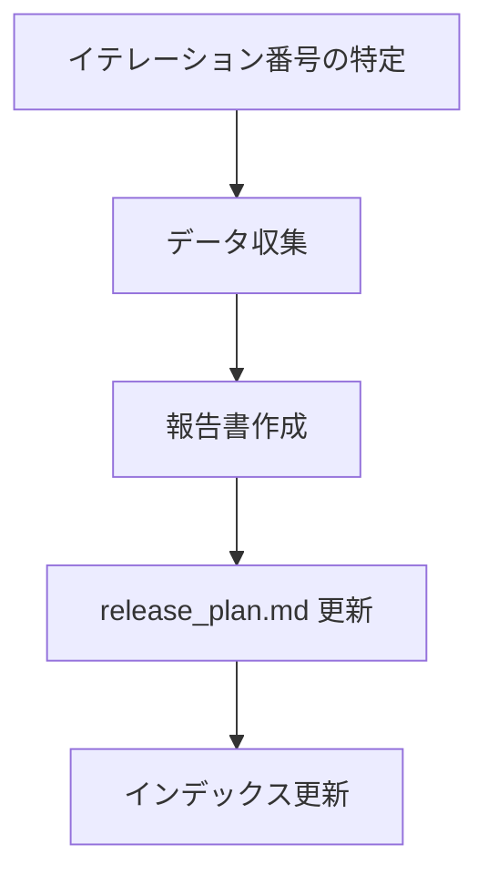

# イテレーション完了報告書の作成

イテレーション計画・リリース計画・git log・テスト結果からデータを収集し、公式な完了報告書を作成する。

報告書の価値は「何をどれだけ達成したか」を定量的に記録すること。ベロシティ実績の蓄積はリリース計画の精度を高め、品質メトリクスの推移はプロジェクトの健全性を可視化する。

## テンプレート

@docs/template/イテレーション完了報告書.md

## オプション

| オプション | 説明 |
|-----------|------|
| なし | 最新のイテレーション番号を推定して報告書を作成 |
| `<番号>` | 指定番号のイテレーション完了報告書を作成 |

## 前提条件

- `docs/development/iteration_plan-{N}.md` が存在し、タスクの完了状況が更新済みであること
- `docs/development/release_plan.md` が存在すること
- 対象イテレーションの開発が完了していること（テスト全パス）

## 作成フロー



### Step 1: イテレーション番号の特定

既存の `iteration_report-*.md` から最新の番号を推定する。指定がある場合はそれを使用する。

### Step 2: データ収集

4 つのデータソースから報告書に必要な情報を収集する。

#### 2.1 イテレーション計画（`docs/development/iteration_plan-{N}.md`）

- イテレーション番号、ゴール
- 計画期間（計画日付）
- ストーリー一覧と予定 SP
- タスクの完了状況
- 受入条件の達成状況

#### 2.2 リリース計画（`docs/development/release_plan.md`）

- 全体の SP（バーンダウン用）
- イテレーション別の計画 SP・実績 SP（前イテレーションまで）
- フェーズ別の進捗状況
- 計画スケジュール

#### 2.3 テスト結果

テストを実行して最新の結果を取得する。

```bash
# Backend テスト
cd apps/backend && npm test 2>&1 | tail -20

# Frontend テスト
cd apps/frontend && npm test 2>&1 | tail -20

# E2E テスト
npx playwright test 2>&1 | tail -20
```

取得する情報:

- テストファイル数、テスト数（Backend / Frontend）
- E2E シナリオ数
- カバレッジ（利用可能な場合）

#### 2.4 前イテレーションの報告書（`docs/development/iteration_report-{N-1}.md`）

- 前イテレーションのテスト数（増分計算用）
- テスト累計推移（累計テーブル用）

### Step 3: 報告書の作成

以下のセクション構成で報告書を作成する。

**出力ファイル**: `docs/development/iteration_report-{N}.md`

#### セクション構成

##### 1. プロジェクト概要

| 項目 | データソース |
|------|------------|
| イテレーション番号 | iteration_plan |
| 計画期間 | release_plan のガントチャート |
| 実績期間 | git log の実際のコミット日付 |
| ゴール | iteration_plan |
| 要員 | 計画日数 5 日、実績日数は実際の作業日数 |

##### 2. 指標

**ベロシティテーブル**:

| 項目 | 値 |
|------|-----|
| 計画 SP | iteration_plan から |
| 実績 SP | 完了ストーリーの SP 合計 |
| 達成率 | 実績 / 計画 × 100 |

**バーンダウンチャート** (Mermaid `xychart-beta`):

- x 軸: "開始" + 全イテレーション名
- 計画線: release_plan の計画残 SP
- 実績線: 当該イテレーションまでの実績残 SP

**ベロシティチャート** (Mermaid `xychart-beta`):

- x 軸: 当該イテレーションまでの IT 名
- 棒グラフ: 各イテレーションの実績 SP
- 平均線: 実績 SP の平均値

##### 3. テスト結果

| メトリクス | Backend | Frontend |
|-----------|---------|----------|
| テストファイル | X/X 通過 | X/X 通過 |
| テスト数 | X/X 通過 | X/X 通過 |
| カバレッジ | X% | X% |
| E2E テスト | - | X シナリオ全通過 |

**テスト増分テーブル**: 前イテレーションとの比較

**テスト累計推移テーブル**: IT1 からの累計

##### 4. SonarQube Quality Gate（利用可能な場合）

| プロジェクト | カバレッジ | 重複率 | Violations | 結果 |
|------------|----------|--------|-----------|------|

##### 5. 実施内容と評価

- ストーリー別の完了状況テーブル
- 各ストーリーの受入条件達成状況（チェックリスト）
- 実装内容の要約（レイヤー別: ドメイン→アプリケーション→インフラ→プレゼンテーション→フロントエンド）

##### 6. 追加タスク（SP 外）

技術的負債解消、XP レビュー対応、デモ環境同期など。

##### 7. E2E テスト結果

- 新規追加分のシナリオ一覧と結果
- リグレッションテスト結果

##### 8. フェーズ・累計進捗

- 現在のフェーズの進捗テーブル
- 全フェーズの累計進捗テーブル

##### 9. ふりかえりへのリンク

```markdown
詳細は [イテレーション N ふりかえり](./retrospective-N.md) を参照。
```

##### 10. 更新履歴

### Step 4: release_plan.md の更新

報告書作成後、release_plan.md の進捗状況テーブルを更新する。

- 該当イテレーションの実績 SP・達成率・状態を更新
- バーンダウンチャートの実績線を更新

### Step 5: インデックス更新

1. `docs/development/index.md` — イテレーション計画テーブルの状態を更新
2. `docs/index.md` — 開発セクションにエントリ追加（未登録の場合）
3. `mkdocs.yml` — nav にエントリ追加（未登録の場合）

## 途中から再開

**Example:**

```
ユーザー: 「IT4 の完了報告書を作って」
回答: docs/development/iteration_plan-4.md の完了状況を確認し、
      テストを実行して結果を取得し、
      前イテレーション（iteration_report-3.md）からテスト推移データを収集して作成する。
```

## 注意事項

- テスト数・カバレッジは実測値を使用し、推測値を使わない
- Mermaid チャートの数値は release_plan.md と整合させる
- 受入条件の達成状況は iteration_plan のチェックリストと一致させる
- 前イテレーションの報告書がない場合（IT1）は、テスト増分の基準を 0 とする

## 関連スキル

- `planning-releases` — リリース計画・イテレーション計画・ふりかえり
- `creating-release-report` — リリース完了報告書（複数イテレーションを集約）
- `tracking-progress` — 進捗分析・レポート生成
- `operating-docs` — ドキュメントインデックス更新
