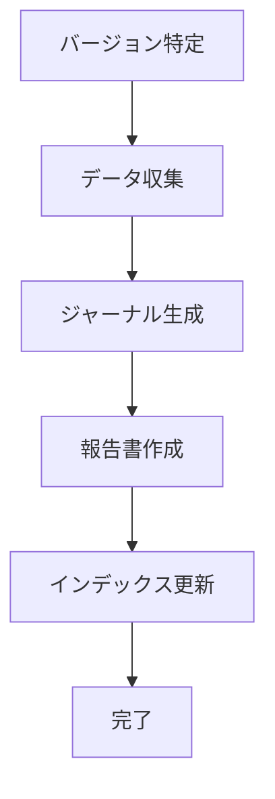

# リリース完了報告書の作成

リリース計画と開発ドキュメント群からデータを収集し、テンプレートに基づいてリリース完了報告書を作成する。

報告書の価値は「何を達成したか」を定量的に示すこと。計画と実績の差異分析、品質メトリクス、コミットログ分析を通じて、プロジェクトの透明性を確保し、次のリリースへの知見を蓄積する。

## テンプレート

@docs/template/リリース完了報告書.md

## オプション

| オプション | 説明 |
|-----------|------|
| なし | 対話的にリリースバージョンを確認して報告書を作成 |
| `--version <バージョン>` | 指定バージョンのリリース完了報告書を作成 |
| `--all` | 未作成の全リリースの報告書を一括作成 |

## 前提条件

以下のファイルが存在すること:

- `docs/development/release_plan.md` — リリース計画（Single Source of Truth）
- `docs/development/iteration_report-{N}.md` — 対象イテレーションの完了報告書
- `CHANGELOG.md` — 対象バージョンのエントリ
- git タグ（`v{バージョン}`）が打たれていること

## 作成フロー



### Step 1: バージョン特定

release_plan.md のリリース履歴と git タグから対象バージョンを特定する。

- リリースに含まれるイテレーション範囲を確認
- 対象ストーリーとフェーズを確認

### Step 2: データ収集

5 つのデータソースから報告書に必要な情報を収集する。

#### 2.1 リリース計画（`docs/development/release_plan.md`）

- プロジェクト情報（名称・目的・チーム規模）
- フェーズ別ストーリー一覧と SP
- イテレーション別の計画 SP・実績 SP・達成率
- 計画スケジュール（ガントチャート用の日付）
- リリース条件の達成状況

#### 2.2 イテレーション完了報告書（`docs/development/iteration_report-{N}.md`）

- 各イテレーションの日程（計画期間・実績期間・実績日数）
- テスト結果（Backend / Frontend / E2E のテスト数）
- テストカバレッジ
- SonarQube Quality Gate 結果
- ストーリー別の完了状況

#### 2.3 コミットログ（git）

```bash
# 対象リリースまでのコミット数
git log --oneline --no-merges <TAG> | wc -l

# プリフィックス別内訳
git log --oneline --no-merges <TAG> --format="%s" | sed 's/(.*//' | sed 's/:.*//' | sort | uniq -c | sort -rn

# 開発期間
git log --oneline --no-merges <TAG> --format="%ai" | tail -1  # 最初のコミット
git log --oneline --no-merges <TAG> --format="%ai" | head -1  # 最後のコミット
```

#### 2.4 CHANGELOG（`CHANGELOG.md`）

- 対象バージョンの Features / Bug Fixes / Documentation / Tests の内訳

#### 2.5 ジャーナル（`docs/journal/YYYYMMDD.md`）

- 日付ごとの詳細な作業内容

ジャーナルが未生成の場合は `npm run journal` を実行して生成する。

### Step 3: 報告書作成

テンプレート（`docs/template/リリース完了報告書.md`）を基に、収集データでプレースホルダーを埋める。

**出力ファイル命名規則**:

```
docs/development/release_report-{バージョン（ドットをアンダースコアに置換）}.md
```

例: `release_report-0_1_0.md`、`release_report-0_2_0.md`

**各セクションの作成ポイント**:

| セクション | データソース | ポイント |
|-----------|------------|---------|
| プロジェクトサマリー | release_plan.md + git log | 総コミット数・テスト数は実測値を使用 |
| イテレーション別達成状況 | release_plan.md 進捗状況テーブル | 計画 SP と実績 SP をそのまま転記 |
| 計画日程 vs 実績日数 | iteration_report-*.md | 計画期間と実績期間から短縮率を算出 |
| コミットログ分析 | git log | プリフィックス別の件数と割合を算出 |
| 品質メトリクス | iteration_report-*.md | リリース時点（最終 IT）のカバレッジを使用 |
| ベロシティ | release_plan.md | 平均・最大・最小を算出 |
| 主要な成果物 | CHANGELOG.md + user_story.md | ストーリー単位で実装内容をまとめる |
| 作業履歴 | docs/journal/ | 日付ごとの主要な作業を要約 |

**Mermaid チャート**:

- バーンダウンチャート: `xychart-beta` で計画 vs 実績の折れ線
- ガントチャート: `gantt` で計画 vs 実績のスケジュール比較
- ベロシティ: `xychart-beta` で棒グラフ + 平均線
- コミット内訳: `pie showData` でパイチャート
- テスト推移: `xychart-beta` で棒グラフ

### Step 4: インデックス更新

作成した報告書を以下の 3 ファイルに登録する:

1. `docs/development/index.md` — リリース完了報告書セクションにエントリ追加
2. `docs/index.md` — 開発セクションにエントリ追加
3. `mkdocs.yml` — nav の開発セクションにエントリ追加

## 途中から再開

報告書作成の途中から再開する場合は、既存の報告書ファイルを確認する。

**Example:**

```
ユーザー: 「v0.2.0 のリリース完了報告書を作って」
回答: docs/development/release_report-0_2_0.md の存在を確認し、
      なければ release_plan.md から IT4-5 のデータを収集して作成する。
```

## 注意事項

- release_plan.md を Single Source of Truth として扱い、データの不整合がある場合は release_plan.md を優先する
- コミット数・テスト数は git log や iteration_report の実測値を使用し、推測値を使わない
- Mermaid チャートの数値は必ずデータソースと照合する
- 工期短縮率の算出は「(計画日数 - 実績日数) / 計画日数 × 100」で統一する

## 関連スキル

- `planning-releases` — リリース計画の作成と管理
- `tracking-progress` — 進捗分析・レポート生成
- `developing-release` — リリースワークフロー（品質ゲート→バージョンバンプ→タグ）
- `operating-docs` — ドキュメントインデックス更新
- `orchestrating-project` — 計画・進捗管理フェーズ全体のオーケストレーション
