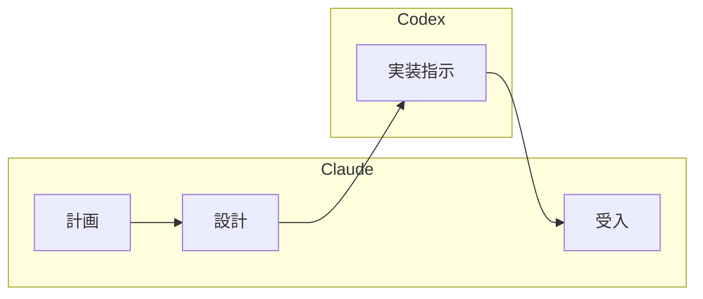

# 開発フェーズオーケストレーション

開発フェーズ全体のワークフローを案内する。TDD サイクルに従い、バックエンド→フロントエンドの順序で品質を担保しながら開発を進める。

## オプション

| オプション | 説明 |
|-----------|------|
| なし | 開発フェーズ全体のワークフローを表示 |
| `--codex` | Claude（計画・設計・受入）と Codex（実装）の分業体制で開発 |

## 開発フェーズの全体像

1. **バックエンド開発** (Skill: `developing-backend`) — インサイドアウトアプローチ推奨
2. **フロントエンド開発** (Skill: `developing-frontend`) — アウトサイドインアプローチ推奨

各開発で Red-Green-Refactor サイクルを厳密に実行する。テストなしでプロダクションコードを書かない。

### レビューポイント

コーディングとテストガイドのイテレーション開発フローに準拠し、以下のタイミングでレビュースキルを発動する。

| タイミング | スキル | 説明 |
|-----------|--------|------|
| TODO 完了時（コードレビュー） | `developing-review` | TDD サイクルで TODO を完了するたびにコード品質・テスト品質・設計整合性をレビュー |
| 受け入れ前（品質チェック） | `operating-qt` | SonarQube によるコード品質分析・Quality Gate 確認を実施し、品質基準を満たしていることを検証 |
| イテレーション完了時（ユーザーレビュー） | `analyzing-review` | 受け入れフェーズでユーザー視点・プロダクト視点からの成果物レビュー |

## TDD サイクル

TDD は「テストを書いてからコードを書く」手順ではなく、「設計を小さなフィードバックループで検証する」手法。10-15 分で 1 サイクルを完了させる。

1. **Red**: 失敗するテストを最初に書く
2. **Green**: テストを通す最小限のコードを実装する
3. **Refactor**: 重複を除去し設計を改善する
4. @docs/reference/コーディングとテストガイド.md のワークフローに従う

## 参照ドキュメント

- @docs/reference/コーディングとテストガイド.md — TDD ワークフロー詳細
- @docs/reference/CodexCLIMCPアプリケーション開発フロー.md — Codex 連携フロー
- @docs/design/architecture.md, @docs/design/architecture_backend.md, @docs/design/architecture_frontend.md
- @docs/design/data-model.md, @docs/design/domain-model.md, @docs/design/tech_stack.md
- @docs/design/ui-design.md, @docs/design/test_strategy.md
- 作業開始前に対象の @docs/development/iteration_plan-N.md の内容を確認する
- 作業完了後に対象の @docs/development/iteration_plan-N.md の進捗を更新する

## Codex 分業モード（--codex）

Claude と Codex の役割を分離し、計画・設計・受入を Claude が担い、実装を Codex に委譲する。

**前提条件**: Codex MCP サーバーが設定済みであること（@docs/reference/CodexCLIMCPサーバー設定手順.md 参照）

### 役割分担

| フェーズ | 担当 | 責務 |
|---------|------|------|
| 計画 | Claude | 要件分析、タスク分解、優先度決定 |
| 設計 | Claude | API 設計、UI 設計、データモデル設計 |
| 実装 | Codex | コード実装、ユニットテスト作成 |
| 受入 | Claude | 設計レビュー、E2E テスト作成・実行、品質確認 |

### 開発フロー



### 指示サイズ

| 粒度 | 推奨度 | 説明 |
|------|--------|------|
| 1 ファイル単位 | 推奨 | コード全文を含めた具体的な指示。最も確実 |
| タスク単位（2-3 ファイル） | 注意 | タイムアウトリスクあり。順次実行を推奨 |
| 機能・ストーリー単位 | 非推奨 | タイムアウトする。必ず分割して実行する |

### Codex への指示原則

1. **1 ファイル 1 指示**: 複数ファイルの同時指示はタイムアウトする（IT1 実績: 6 ファイル同時→タイムアウト、1 ファイルずつ→各 15-35 秒で成功）
2. **コード全文を渡す**: 自然言語の説明より、作成すべきファイルの完全なコードを指示に含める
3. **「既存コードは変更しないでください」を明記**: 追記指示時に Codex が他の箇所を無断で書き換えるのを防ぐ
4. **`--write` フラグを含める**: 書き込みが必要な場合は prompt 冒頭に `--write` を付ける

### Codex への指示例

```
codex:codex-rescue に以下を委譲:

--write apps/sms/backend/src/main/java/.../HomeSummaryResponse.java に以下の record を作成してください。

（ファイルの完全なコードをここに記載）
```

### 受入基準

- [ ] `git diff` で意図しない変更がないことを確認（Codex は指示外のコードを書き換えることがある）
- [ ] すべての受入条件が満たされている
- [ ] 既存テストが壊れていない（Codex の変更で `localStorage` → `sessionStorage` 等の無断変更がないか）
- [ ] E2E テストがすべてパス
- [ ] ESLint / Prettier / 品質チェックがパス

### Codex の既知の問題と対策

| 問題 | 事例 | 対策 |
|------|------|------|
| タイムアウト | 6 ファイル同時指示で応答なし | 1 ファイルずつ順次指示 |
| 既存コードの無断変更 | `localStorage` → `sessionStorage` に書き換え | 「既存コードは変更しない」を明記 + `git diff` で検証 |
| API パターンの変更 | headers マージ方式をスプレッドから `Object.assign` に変更 | コード全文を渡して曖昧さを排除 |
| Spring Boot 4.0 パッケージ名の誤り | `@WebMvcTest` の import パスが旧バージョン | 既存テストの import パターンをコード全文に含める |

### Codex が書き込みできない場合

1. Claude が勝手に直接編集を進めてはいけない
2. ユーザーに状況を報告し、確認を待つ
3. ユーザーの許可を得てから代替手段を実行する

## 途中から再開

開発セッションの途中から再開する場合は、まず現在の実装状況を確認する。

**Example:**

```
ユーザー: 「バックエンドの認証機能は実装済み。次の機能に進みたい」
回答: イテレーション計画を確認し、次のユーザーストーリーを特定する。
      既存コードのテスト結果を確認し、Green 状態であることを検証してから
      次のタスクの Red フェーズに進む。
```

## コンテキスト管理

タスクの区切りごとに `/compact` を実施して Context limit reached エラーを回避する。

- ユーザーストーリー 1 件の実装完了時、TDD サイクルを数回繰り返した後、コミット完了後に実施する
- `/compact` 前に現在の作業状態と次のタスクをメモとして出力する

## 注意事項

- プロジェクトのテスト環境が設定済みであること（前提条件）
- TDD の三原則を厳密に守る。テストなしでプロダクションコードを書かない
- コミット前に必ず品質チェックリストを実行する
- TODO 駆動開発でタスクを細かく分割してから実装を開始する
- Rule of Three: 同じコードが 3 回現れたらリファクタリングする

## 関連スキル

- `developing-backend` — バックエンド TDD 開発
- `developing-frontend` — フロントエンド TDD 開発
- `developing-review` — 開発成果物のマルチパースペクティブレビュー（TODO 完了時のコードレビュー）
- `analyzing-review` — 分析成果物のマルチパースペクティブレビュー（イテレーション完了時のユーザーレビュー）
- `operating-qt` — コード品質管理（受け入れ前の SonarQube 品質チェック）
- `developing-release` — リリースワークフロー（品質ゲート・バージョン管理・CHANGELOG）
