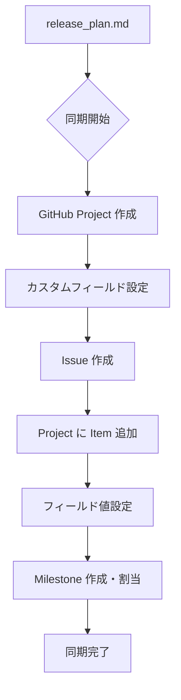

# GitHub Project 同期

リリース計画を GitHub Project・Issue・Milestone に反映し、プロジェクト管理を GitHub 上で一元化する。

`docs/development/release_plan.md` を正とし、GitHub は同期先として扱う。手動で GitHub を直接更新するのではなく、計画ドキュメントを更新してから `--sync` で反映する。

## オプション

| オプション | 説明 |
|-----------|------|
| なし | 全体の同期を実行（Project・Issue・フィールド・Milestone） |
| `--project` | GitHub Project のみを作成 |
| `--issues` | Issue のみを作成（Project 存在が前提） |
| `--fields` | 各 Issue に対して Project フィールド値を設定 |
| `--milestones` | Milestone のみを作成し Issue に割り当て |
| `--sync` | release_plan.md と GitHub の差異を確認し同期 |
| `--status` | 現在の GitHub Project 状態を表示 |

## GitHub Project の作成

release_plan.md に基づいて Project を作成し、カスタムフィールドを設定する。

**標準フィールド構成**:

| フィールド | タイプ | 説明 |
|-----------|--------|------|
| Status | Single Select | Todo / In Progress / Done |
| リリース | Single Select | release_plan.md のリリースフェーズに対応 |
| 優先度 | Single Select | ストーリーの優先度 |
| SP | Number | ストーリーポイント |
| イテレーション | Iteration | スプリント期間（開始日・期間付き） |

```bash
# Single Select フィールドの作成
gh project field-create <PROJECT_NUMBER> --owner <OWNER> \
  --name "<フィールド名>" --data-type "SINGLE_SELECT" \
  --single-select-options "<選択肢1>,<選択肢2>"

# Number フィールドの作成
gh project field-create <PROJECT_NUMBER> --owner <OWNER> \
  --name "SP" --data-type "NUMBER"
```

## Issue の作成

ユーザーストーリーを GitHub Issue として作成し、Project に追加する。

- **タイトル**: `[ストーリーID] ストーリー名`
- **本文**: ユーザーストーリー、サブタスク、受入条件、見積もり情報
- **Milestone**: リリースフェーズに対応する Milestone に割り当て

```bash
gh issue create --repo <OWNER>/<REPO> \
  --title "<ストーリーID>: <ストーリー名>" \
  --milestone "<Milestone 名>" --body "..."

gh project item-add <PROJECT_NUMBER> --owner <OWNER> \
  --url "https://github.com/<OWNER>/<REPO>/issues/<NUMBER>"
```

## Iteration フィールドの作成と設定

Iteration フィールドは Single Select ではなく **Iteration 型** で作成する。GraphQL API で `iterationConfiguration` を含めることで、フィールド作成と同時にイテレーション期間を設定できる。

```bash
# Iteration フィールドの作成
gh api graphql -f query='
mutation {
  createProjectV2Field(input: {
    projectId: "<PROJECT_ID>"
    dataType: ITERATION
    name: "イテレーション"
    iterationConfiguration: {
      startDate: "<開始日 YYYY-MM-DD>"
      duration: <デフォルト期間（日数）>
      iterations: [
        { title: "<IT名>", startDate: "<開始日>", duration: <日数> }
      ]
    }
  }) { projectV2Field { ... on ProjectV2IterationField { id } } }
}'

# 各 Issue への Iteration 値の設定
gh api graphql -f query='
mutation {
  updateProjectV2ItemFieldValue(input: {
    projectId: "<PROJECT_ID>"
    itemId: "<ITEM_ID>"
    fieldId: "<ITERATION_FIELD_ID>"
    value: { iterationId: "<ITERATION_ID>" }
  }) { projectV2Item { id } }
}'
```

## 差異確認と同期（--sync）

release_plan.md と GitHub の整合性を確認し、差異があれば同期を実行する。

**確認項目**: ストーリー数、SP、リリース/Milestone 割り当て、優先度、イテレーション割り当て、Status

**同期動作**:

- **新規ストーリー**: Issue を作成し Project に追加する
- **変更されたストーリー**: Issue のフィールド値を更新する
- **削除されたストーリー**: Issue をクローズする（削除はしない）

## 同期フロー



## 途中から再開

同期作業の途中から再開する場合は、まず現在の GitHub 状態を確認する。

**Example:**

```
ユーザー: 「Project と Issue は作成済み。フィールド値を設定したい」
回答: --status で現在の GitHub 状態を確認する。
      --fields でフィールド値を一括設定する。
      設定後に --sync で release_plan.md との整合性を検証する。
```

## 注意事項

- `docs/development/release_plan.md` が存在すること、`gh` CLI がインストールされ認証済みであること、Project API スコープが有効であること（前提条件）
- 既存の Project/Issue がある場合は重複作成に注意する
- Iteration フィールドの期間変更は GraphQL API または Web UI で実施する
- 初回は `--sync` で差異確認してから同期する。大規模変更前にはバックアップを推奨する

## 関連スキル

- `planning-releases` — リリース計画とイテレーション計画の作成
- `tracking-progress` — 進捗状況の確認と更新
- `orchestrating-project` — 計画・進捗管理フェーズ全体のオーケストレーション
- `git-commit` — 変更のコミット
