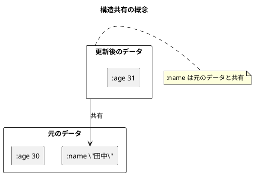
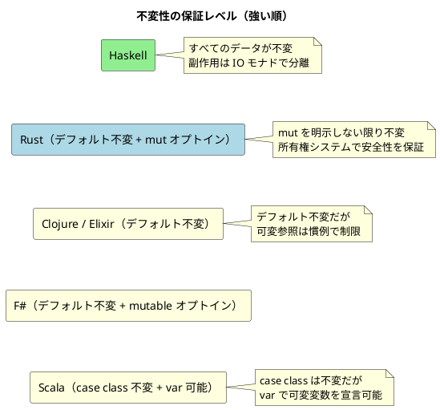

# 第1章: 不変性とデータ変換 — 6言語統合ガイド

## 1. はじめに

関数型プログラミングの最も重要な概念が**不変性（Immutability）**です。不変データ構造を使用することで、プログラムの予測可能性が向上し、並行処理でのバグを防ぎ、コードの理解と保守が容易になります。

本章では、6 つの関数型言語がそれぞれどのように不変性を実現し、データ変換パイプラインを構築するかを横断的に比較します。

### 不変性の利点（全言語共通）

1. **予測可能性**: データが変更されないため、関数の動作を予測しやすい
2. **スレッドセーフ**: 複数のスレッドから安全にアクセスできる
3. **履歴の保持**: 変更前のデータを保持できる（Undo/Redo の実装が容易）
4. **デバッグの容易さ**: データの変更履歴を追跡しやすい

## 2. 共通の本質

すべての言語に共通する不変性の核心は以下です：

- データを「変更」するのではなく、**新しいデータを作成**する
- 元のデータは**そのまま残る**（参照透過性）
- 効率のために**構造共有**が用いられる

従来の命令型プログラミングではオブジェクトの状態を直接変更します：

```java
// Java（可変）
person.setAge(31);  // 元のオブジェクトが変更される
```

関数型言語では、更新は常に新しいデータを返します。6 言語すべてがこの原則に従いますが、その表現方法は言語ごとに異なります。

## 3. 言語別実装比較

### 3.1 不変データの定義と更新

各言語が「人物データの年齢を更新する」操作をどう表現するかを比較します。

<details>
<summary>Clojure</summary>

```clojure
(def original-person {:name "田中" :age 30})

(defn update-age [person new-age]
  (assoc person :age new-age))

(def updated-person (update-age original-person 31))

original-person   ;; => {:name "田中" :age 30}  ← 元のデータは変わらない
updated-person    ;; => {:name "田中" :age 31}  ← 新しいデータ
```

マップリテラルがそのまま不変データ構造です。`assoc` で特定のキーを差し替えた新しいマップを返します。

</details>

<details>
<summary>Scala</summary>

```scala
case class Person(name: String, age: Int)

def updateAge(person: Person, newAge: Int): Person =
  person.copy(age = newAge)

val originalPerson = Person("田中", 30)
val updatedPerson = updateAge(originalPerson, 31)

originalPerson   // => Person("田中", 30)
updatedPerson    // => Person("田中", 31)
```

`case class` はデフォルトで不変です。`copy` メソッドが自動生成され、フィールドを指定して差し替えた新しいインスタンスを返します。

</details>

<details>
<summary>Elixir</summary>

```elixir
defmodule Person do
  @enforce_keys [:name, :age]
  defstruct [:name, :age]
end

def update_age(%Person{} = person, new_age) do
  %{person | age: new_age}
end

original_person = %Person{name: "田中", age: 30}
updated_person = update_age(original_person, 31)
```

構造体の更新構文 `%{struct | field: value}` で、指定フィールドだけ差し替えた新しい構造体を返します。

</details>

<details>
<summary>F#</summary>

```fsharp
type Person = { Name: string; Age: int }

let updateAge person newAge = { person with Age = newAge }

let originalPerson = { Name = "田中"; Age = 30 }
let updatedPerson = updateAge originalPerson 31
```

レコード型と `with` 式で、指定フィールドを差し替えた新しいレコードを返します。

</details>

<details>
<summary>Haskell</summary>

```haskell
data Person = Person
    { personName :: String
    , personAge  :: Int
    } deriving (Show, Eq)

updateAge :: Person -> Int -> Person
updateAge person newAge = person { personAge = newAge }

originalPerson = Person { personName = "田中", personAge = 30 }
updatedPerson = updateAge originalPerson 31
```

Haskell ではすべてのデータがデフォルトで不変です。レコード更新構文で新しい値を返します。

</details>

<details>
<summary>Rust</summary>

```rust
pub struct Person {
    pub name: String,
    pub age: u32,
}

impl Person {
    pub fn with_age(&self, new_age: u32) -> Self {
        Person {
            name: self.name.clone(),
            age: new_age,
        }
    }
}

let person = Person::new("田中", 30);       // 不変（デフォルト）
let mut mutable = Person::new("田中", 30);  // 可変（明示的に mut）
```

Rust では変数はデフォルトで不変です。可変にするには `mut` キーワードが必要です。新しいデータを作るには `clone()` で所有権を複製します。

</details>

### 不変データ更新の構文比較

| 言語 | データ定義 | 更新構文 |
|------|----------|---------|
| Clojure | マップリテラル `{}` | `(assoc person :age 31)` |
| Scala | `case class` | `person.copy(age = 31)` |
| Elixir | `defstruct` | `%{person \| age: 31}` |
| F# | レコード型 | `{ person with Age = 31 }` |
| Haskell | `data` + レコード構文 | `person { personAge = 31 }` |
| Rust | `struct` | `Person { name: self.name.clone(), age: 31 }` |

### 3.2 構造共有（Structural Sharing）

「毎回新しいデータを作成すると非効率では？」という疑問に対し、関数型言語は**構造共有**で応えます。変更されていない部分はコピーせず、元のデータへの参照を共有します。



| 言語 | 構造共有の仕組み | 特記事項 |
|------|---------------|---------|
| Clojure | 永続的ハッシュアレイマップドトライ（HAMT） | 標準データ構造がすべて永続的 |
| Scala | 永続的データ構造（標準ライブラリ） | `case class` の `copy` は浅いコピー |
| Elixir | BEAM VM による最適化 | プロセス間でもデータを安全に共有 |
| F# | .NET の不変コレクション | `Map`、`List` が永続的 |
| Haskell | 遅延評価 + GC による自動最適化 | 構造共有は言語レベルで透過的 |
| Rust | `Clone` トレイトによる明示的コピー | 所有権システムにより共有が制限される |

### 3.3 データ変換パイプライン

同じビジネスロジック「注文の合計金額を計算する」を各言語で実装します。

<details>
<summary>Clojure: スレッディングマクロ</summary>

```clojure
;; thread-last マクロ（コレクション操作向き）
(->> (:items order)
     (map calculate-subtotal)
     (reduce +))

;; thread-first マクロ（オブジェクト操作向き）
(-> order
    :customer
    :membership
    membership-discount)
```

Clojure は `->` と `->>` の 2 種類のスレッディングマクロを使い分けます。

</details>

<details>
<summary>Scala: メソッドチェーン</summary>

```scala
order.items
  .map(calculateSubtotal)
  .sum
```

Scala はコレクションのメソッドチェーンでパイプラインを表現します。

</details>

<details>
<summary>Elixir: パイプ演算子</summary>

```elixir
items
|> Enum.map(&calculate_subtotal/1)
|> Enum.sum()
```

Elixir の `|>` は言語組み込みのパイプ演算子で、前の式の結果を次の関数の第 1 引数に渡します。

</details>

<details>
<summary>F#: パイプライン演算子</summary>

```fsharp
order.Items
|> List.map calculateSubtotal
|> List.sum
```

F# の `|>` は Elixir と同様に左から右へデータを流します。

</details>

<details>
<summary>Haskell: 関数適用と合成</summary>

```haskell
sum $ map calculateSubtotal (orderItems order)

-- & 演算子を使ったパイプライン風
order
  & calculateTotal
  & applyDiscount order
```

Haskell は `$`（関数適用）と `&`（逆適用）を使い分けます。

</details>

<details>
<summary>Rust: イテレータチェーン</summary>

```rust
self.items.iter()
    .filter(|item| item.quantity > 0)
    .map(|item| item.subtotal())
    .sum::<i32>()
```

Rust のイテレータはゼロコスト抽象化で、コンパイル時に最適化されます。

</details>

### パイプライン演算子・記法の比較

| 言語 | 主要な記法 | 方向 | 特徴 |
|------|----------|------|------|
| Clojure | `->` / `->>` | 左→右 | 2 種類のマクロを用途で使い分け |
| Scala | メソッドチェーン | 左→右 | OOP スタイルのドット記法 |
| Elixir | `\|>` | 左→右 | 言語組み込み、最も直感的 |
| F# | `\|>` | 左→右 | Elixir と同じ発想、型推論と相性が良い |
| Haskell | `$` / `&` / `.` | 右→左 / 左→右 | 数学的記法、ポイントフリースタイル |
| Rust | メソッドチェーン | 左→右 | イテレータのゼロコスト抽象化 |

### 3.4 副作用の分離

純粋関数（入力から出力への変換のみ）と副作用（I/O、状態変更）を分離するアプローチは、各言語で異なります。

| 言語 | 分離方法 | 強制度 | 特徴 |
|------|--------|--------|------|
| Clojure | `!` サフィックスの命名規約 | 規約 | `swap!`、`reset!` など慣例で区別 |
| Scala | 型システム（Cats Effect / ZIO） | 任意 | エフェクトシステムを後付けで導入可能 |
| Elixir | `!` サフィックスの命名規約 | 規約 | 例外を投げるバージョンに `!` を付ける |
| F# | 型シグネチャ | 型安全 | `unit -> 'a` で副作用を示唆 |
| Haskell | IO モナド | **強制** | 型システムで副作用を完全に追跡 |
| Rust | `Result<T, E>` / 型シグネチャ | 型安全 | エラーハンドリングが型で保証される |

Haskell の IO モナドは最も厳格なアプローチです：

```haskell
-- 純粋関数（IO なし）
calculateInvoice :: [Item] -> Double -> Invoice

-- 副作用あり（IO 付き）
saveInvoice :: Invoice -> IO ()
```

型シグネチャを見るだけで、その関数が副作用を持つかどうかが分かります。

### 3.5 効率的な変換メカニズム

各言語は大量データの変換を効率的に行うための仕組みを持っています。

| 言語 | メカニズム | 仕組み |
|------|----------|--------|
| Clojure | **トランスデューサー** | 複合変換で中間コレクションを排除 |
| Scala | **Iterator / LazyList** | 遅延評価によるオンデマンド処理 |
| Elixir | **Stream** | 遅延列挙、無限ストリーム対応 |
| F# | **Seq** | 遅延シーケンス（.NET の IEnumerable） |
| Haskell | **デフォルト遅延評価** | 言語レベルで全式が遅延評価 |
| Rust | **Iterator** | ゼロコスト抽象化、コンパイル時最適化 |

<details>
<summary>Clojure: トランスデューサー（言語固有）</summary>

```clojure
(def xf-process-items
  (comp
   (filter #(> (:quantity %) 0))
   (map #(assoc % :subtotal (calculate-subtotal %)))
   (filter #(> (:subtotal %) 100))))

(defn process-items-efficiently [items]
  (into [] xf-process-items items))
```

トランスデューサーは Clojure 固有の概念で、変換ロジックをコレクション型から分離し、中間コレクションなしに複合変換を実行します。

</details>

<details>
<summary>Elixir: Stream による無限ストリーム</summary>

```elixir
def take_even_numbers(count) do
  Stream.iterate(1, &(&1 + 1))
  |> Stream.filter(&(rem(&1, 2) == 0))
  |> Enum.take(count)
end
```

</details>

<details>
<summary>Rust: ゼロコスト抽象化</summary>

```rust
let numbers: Vec<i32> = (1..)
    .filter(|n| n % 2 == 0)
    .take(10)
    .collect();
```

Rust のイテレータチェーンはコンパイル時にループに展開され、手書きのループと同等のパフォーマンスを実現します。

</details>

## 4. 比較分析

### 4.1 不変性の保証レベル



### 4.2 型システムが不変性に与える影響

| 分類 | 言語 | 影響 |
|------|------|------|
| 動的型付け | Clojure, Elixir | 実行時に柔軟だが、型ミスはテストで検出 |
| 静的型付け | Scala, F#, Rust | コンパイル時に型チェック、IDE 支援が充実 |
| 純粋型付け | Haskell | 副作用が型に表れる、最も厳密 |

### 4.3 パフォーマンス特性

| 言語 | コピーコスト | 最適化手法 |
|------|-----------|-----------|
| Clojure | 低（HAMT による構造共有） | トランスデューサーで中間オブジェクト排除 |
| Scala | 低〜中（永続的コレクション） | Iterator/LazyList で遅延評価 |
| Elixir | 低（BEAM VM 最適化） | Stream で遅延評価 |
| F# | 低〜中（.NET 不変コレクション） | Seq で遅延評価 |
| Haskell | 低（遅延評価 + GC） | デフォルトで遅延、必要時に正格評価 |
| Rust | 中（Clone による明示的コピー） | ゼロコスト抽象化、コンパイル時最適化 |

## 5. 実践的な選択指針

### 不変性の実装アプローチを選ぶ基準

| 要件 | 推奨言語 | 理由 |
|------|---------|------|
| 最も厳密な不変性保証が必要 | Haskell | IO モナドで副作用を型レベルで分離 |
| メモリ安全性が最重要 | Rust | 所有権システムでデータ競合を防止 |
| 直感的なパイプライン記述 | Elixir, F# | `\|>` 演算子で自然なデータフロー |
| 柔軟なデータ操作 | Clojure | マップベースの動的データ構造 |
| JVM エコシステムとの統合 | Scala, Clojure | 既存 Java ライブラリを活用可能 |
| .NET エコシステムとの統合 | F# | C# ライブラリとの相互運用 |

## 6. まとめ

### 言語を超えて成り立つ原則

1. **データは変更しない、新しく作る** — 全言語に共通する基本原則
2. **構造共有で効率を確保** — コピーコストを最小化
3. **パイプラインでデータを流す** — 変換を合成可能にする
4. **副作用を分離する** — 純粋な計算と I/O を切り分ける

### 各言語の個性

| 言語 | 得意領域 |
|------|---------|
| Clojure | スレッディングマクロとトランスデューサーによる柔軟なデータ変換 |
| Scala | case class と for 式による型安全なデータ操作 |
| Elixir | パイプ演算子と Stream による直感的なデータフロー |
| F# | レコード型とパイプライン演算子による簡潔な表現 |
| Haskell | IO モナドによる副作用の完全分離と遅延評価 |
| Rust | 所有権システムとゼロコスト抽象化による安全で高速なデータ処理 |

## 言語別個別記事

- [Clojure](../clojure/01-immutability-and-data-transformation.md)
- [Scala](../scala/01-immutability-and-data-transformation.md)
- [Elixir](../elixir/01-immutability-and-data-transformation.md)
- [F#](../fsharp/01-immutability-and-data-transformation.md)
- [Haskell](../haskell/01-immutability-and-data-transformation.md)
- [Rust](../rust/01-immutability-and-data-transformation.md)
