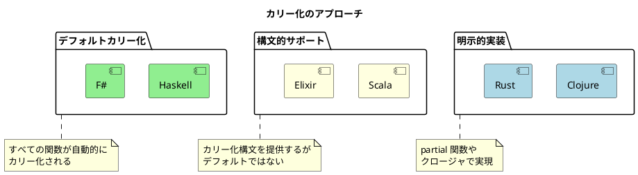

# 第2章: 関数合成と高階関数 — 6言語統合ガイド

## 1. はじめに

関数型プログラミングの力の源泉は、**小さな関数を組み合わせて大きな処理を構築する**ことにあります。関数合成と高階関数は、この組み合わせの基本的な道具です。

本章では、6 つの言語がそれぞれどのように関数を合成し、カリー化・部分適用を実現し、パイプライン処理を構築するかを横断的に比較します。

## 2. 共通の本質

すべての言語に共通する核心は以下です：

- **関数合成**: 2 つ以上の関数を組み合わせて新しい関数を作る
- **カリー化・部分適用**: 関数の引数を段階的に適用して特化した関数を作る
- **高階関数**: 関数を引数として受け取る、または関数を返す関数
- **パイプライン**: 複数の変換を連鎖させてデータを流す

## 3. 言語別実装比較

### 3.1 関数合成

2 つの関数 `f` と `g` を合成して `f(g(x))` を実現する方法を比較します。

#### 合成演算子・関数の一覧

| 言語 | 右→左（数学的） | 左→右（パイプライン） |
|------|---------------|-------------------|
| Clojure | `comp` | `->>` / `pipeline` 関数 |
| Scala | `compose` | `andThen` |
| Elixir | `Enum.reduce` ベース | `\|>` |
| F# | `<<` | `>>` |
| Haskell | `.`（ドット） | `>>>` (Control.Arrow) |
| Rust | クロージャのネスト | メソッドチェーン |

#### 価格計算パイプラインの実装比較

「割引を適用 → 税金を加算 → 端数を丸める」の 3 段階の処理を合成します。

<details>
<summary>Clojure</summary>

```clojure
;; 右→左（comp）
(def calculate-final-price
  (comp round-to-yen
        (partial add-tax 0.1)
        (partial apply-discount-rate 0.2)))

;; 左→右（->>）
(defn calculate-final-price [amount]
  (->> amount
       (apply-discount-rate 0.2)
       (add-tax 0.1)
       round-to-yen))
```

</details>

<details>
<summary>Scala</summary>

```scala
// 左→右（andThen）
val calculateFinalPrice: Double => Double =
  applyDiscountRate(0.2) andThen addTax(0.1) andThen roundToYen

// 右→左（compose）
val calculateFinalPrice2: Double => Double =
  roundToYen compose addTax(0.1) compose applyDiscountRate(0.2)
```

</details>

<details>
<summary>Elixir</summary>

```elixir
def calculate_final_price(amount) do
  amount
  |> apply_discount_rate(0.2)
  |> add_tax(0.1)
  |> round_to_yen()
end
```

Elixir の `|>` は言語に組み込まれたパイプ演算子で、最も直感的な左→右の記法を提供します。

</details>

<details>
<summary>F#</summary>

```fsharp
// 左→右（>>）
let calculateFinalPrice =
    applyDiscountRate 0.2 >> addTax 0.1 >> roundToYen

// 右→左（<<）
let calculateFinalPrice2 =
    roundToYen << addTax 0.1 << applyDiscountRate 0.2
```

F# は `>>` と `<<` の 2 つの合成演算子を持ち、用途に応じて使い分けられます。

</details>

<details>
<summary>Haskell</summary>

```haskell
-- 右→左（ドット）= 数学的関数合成
calculateFinalPrice :: Double -> Double
calculateFinalPrice = roundToYen . addTax 0.1 . applyDiscountRate 0.2

-- ポイントフリースタイル
-- sumOfSquares xs = sum (map (^2) xs)
sumOfSquares = sum . map (^2)
```

Haskell の `.` は数学の関数合成 `(f ∘ g)(x) = f(g(x))` に対応します。**ポイントフリースタイル**（引数を明示しない記法）は Haskell の特徴的なイディオムです。

</details>

<details>
<summary>Rust</summary>

```rust
// クロージャのネスト（合成演算子なし）
let calculate_final_price = |amount: f64| {
    round_to_yen(add_tax(0.1, apply_discount_rate(0.2, amount)))
};

// compose 関数を自作
pub fn compose<A, B, C>(f: impl Fn(B) -> C, g: impl Fn(A) -> B) -> impl Fn(A) -> C {
    move |x| f(g(x))
}
```

Rust には組み込みの合成演算子がなく、クロージャのネストか自作の compose 関数で対応します。

</details>

### 3.2 カリー化と部分適用

関数の引数を段階的に適用する方法は、言語によって根本的に異なります。

#### デフォルトカリー化の有無

| 言語 | デフォルトカリー化 | 部分適用の方法 |
|------|-----------------|-------------|
| Clojure | なし | `partial` 関数 |
| Scala | 部分的 | カリー化構文 `def f(a)(b)` |
| Elixir | 部分的 | 無名関数のネスト |
| F# | **あり** | 自動（引数を左から順に適用） |
| Haskell | **あり** | 自動（すべての関数が 1 引数関数の連鎖） |
| Rust | なし | クロージャを返す関数 |

#### メール送信関数の部分適用

<details>
<summary>Clojure: partial 関数</summary>

```clojure
(defn send-email [from to subject body]
  {:from from :to to :subject subject :body body})

(def send-from-system (partial send-email "system@example.com"))
(def send-notification (partial send-from-system "user@example.com" "通知"))
(send-notification "メッセージ本文")
```

</details>

<details>
<summary>F#: 自動カリー化</summary>

```fsharp
let sendEmail from to' subject body =
    { From = from; To = to'; Subject = subject; Body = body }

// 引数を左から順に適用するだけで部分適用になる
let sendFromSystem = sendEmail "system@example.com"
let sendNotification = sendFromSystem "user@example.com" "通知"
sendNotification "メッセージ本文"
```

F# ではすべての関数が自動カリー化されるため、`partial` のような特別な関数は不要です。

</details>

<details>
<summary>Haskell: 自動カリー化</summary>

```haskell
sendEmail :: String -> String -> String -> String -> Email
-- 内部的には: String -> (String -> (String -> (String -> Email)))

sendFromSystem = sendEmail "system@example.com"
sendNotification = sendFromSystem "user@example.com" "通知"
sendNotification "メッセージ本文"
```

Haskell ではすべての関数が 1 引数関数の連鎖です。`sendEmail "a" "b"` は残り 2 引数を受け取る関数を返します。

</details>

<details>
<summary>Rust: クロージャを返す</summary>

```rust
pub fn greet_curried(greeting: &str) -> impl Fn(&str) -> String + '_ {
    move |name| format!("{}, {}!", greeting, name)
}

let hello = greet_curried("Hello");
hello("World")  // => "Hello, World!"
```

Rust ではライフタイム注釈（`'_`）が必要になる場合があります。

</details>

### 3.3 並列適用（juxt パターン）

1 つの入力に対して複数の関数を同時に適用し、結果をまとめるパターンです。

| 言語 | 標準機能 | 実装方法 |
|------|---------|---------|
| Clojure | `juxt`（標準関数） | `((juxt first last count) numbers)` |
| Scala | なし | タプル / case class で個別に適用 |
| Elixir | なし | `juxt` を自作（`Enum.map` ベース） |
| F# | なし | タプルで個別に適用 |
| Haskell | なし | `juxt2`、`juxt3` を自作 |
| Rust | なし | タプル / 構造体で個別に適用 |

`juxt` が標準で用意されているのは Clojure のみです：

```clojure
;; 1 回のデータ走査で複数の統計を取得
(defn get-stats [numbers]
  ((juxt first last count #(apply min %) #(apply max %)) numbers))

(get-stats [3 1 4 1 5 9 2 6])
;; => [3 6 8 1 9]
```

### 3.4 高階関数のパターン

全言語で共通する 3 つの高階関数パターンを比較します。

#### パターン 1: ログ出力ラッパー

関数の実行前後にログを出力する関数を返す高階関数です。

<details>
<summary>Clojure</summary>

```clojure
(defn with-logging [f label]
  (fn [& args]
    (println (str "[LOG] " label " 開始: " args))
    (let [result (apply f args)]
      (println (str "[LOG] " label " 完了: " result))
      result)))
```

</details>

<details>
<summary>Scala</summary>

```scala
def withLogging[A, B](f: A => B, label: String): A => B =
  (input: A) =>
    println(s"[LOG] $label 開始: $input")
    val result = f(input)
    println(s"[LOG] $label 完了: $result")
    result
```

</details>

<details>
<summary>Haskell</summary>

```haskell
withLogging :: (Show a, Show b) => String -> (a -> b) -> a -> (b, [String])
withLogging label f x =
    let result = f x
        logs = [ "[LOG] " ++ label ++ " 開始: " ++ show x
               , "[LOG] " ++ label ++ " 完了: " ++ show result ]
    in (result, logs)
```

Haskell は純粋関数のため、ログを文字列リストとして返します（副作用なし）。

</details>

#### パターン 2: メモ化

計算結果をキャッシュする高階関数です。キャッシュの実装方法が言語ごとに大きく異なります。

| 言語 | キャッシュ機構 | 可変状態の管理方法 |
|------|-------------|----------------|
| Clojure | `atom`（共有可変参照） | STM ベース |
| Scala | `var` + `Map` | 可変変数 |
| Elixir | `Agent`（プロセス状態） | アクターモデル |
| F# | `Dictionary` | .NET の可変辞書 |
| Haskell | 遅延評価 / ライブラリ | 純粋（言語機能で自動メモ化） |
| Rust | `RefCell<HashMap>` | 内部可変性パターン |

<details>
<summary>Clojure: atom による共有状態</summary>

```clojure
(defn memoize-fn [f]
  (let [cache (atom {})]
    (fn [& args]
      (if-let [cached (get @cache args)]
        cached
        (let [result (apply f args)]
          (swap! cache assoc args result)
          result)))))
```

</details>

<details>
<summary>Rust: RefCell による内部可変性</summary>

```rust
use std::cell::RefCell;
use std::collections::HashMap;

pub fn memoize<A: Clone + Hash + Eq, B: Clone>(
    f: impl Fn(A) -> B
) -> impl Fn(A) -> B {
    let cache = RefCell::new(HashMap::new());
    move |input: A| {
        if let Some(result) = cache.borrow().get(&input) {
            return result.clone();
        }
        let result = f(input.clone());
        cache.borrow_mut().insert(input, result.clone());
        result
    }
}
```

</details>

### 3.5 バリデーション合成

小さなバリデータを組み合わせて複雑な検証ロジックを構築するパターンです。全言語で同じ構造を持ちます：

```
バリデータ = 述語関数 + エラーメッセージ
複合バリデータ = 複数バリデータの合成（最初の失敗で停止）
```

<details>
<summary>Clojure</summary>

```clojure
(def validate-quantity
  (combine-validators validate-integer validate-positive validate-under-100))
```

</details>

<details>
<summary>Scala</summary>

```scala
def validateQuantity(value: Int): ValidationResult[Int] =
  combineValidators(validatePositive, validateUnder100)(value)
```

</details>

<details>
<summary>F#</summary>

```fsharp
let validateQuantity = combineValidators [validatePositive; validateUnder100]
```

</details>

### 3.6 述語合成

複数の条件を AND / OR で組み合わせるパターンです。

| 言語 | AND 合成 | OR 合成 |
|------|---------|---------|
| Clojure | `every-pred` | `some-fn` |
| Scala | `forall` | `exists` |
| Elixir | `Enum.all?` | `Enum.any?` |
| F# | `List.forall` | `List.exists` |
| Haskell | `all` + `map` | `any` + `map` |
| Rust | `iter().all()` | `iter().any()` |

```clojure
;; Clojure: 標準の述語合成関数
(def valid-age?
  (every-pred integer? pos? #(<= % 150)))

(def premium-customer?
  (some-fn #(= (:membership %) :gold)
           #(>= (:purchase-count %) 100)))
```

Clojure のみが述語合成専用の標準関数（`every-pred`、`some-fn`）を持っています。

### 3.7 関数変換ユーティリティ

#### 引数反転（flip）

```clojure
(defn flip [f] (fn [a b] (f b a)))       ;; Clojure
```
```scala
def flip[A, B, C](f: (A, B) => C): (B, A) => C = (b, a) => f(a, b)  // Scala
```
```fsharp
let flip f a b = f b a                    // F#
```
```rust
pub fn flip<A, B, C>(f: impl Fn(A, B) -> C) -> impl Fn(B, A) -> C   // Rust
```

## 4. 比較分析

### 4.1 カリー化哲学の違い

言語の設計哲学により、カリー化のアプローチが大きく 3 つに分かれます。



### 4.2 パイプラインの表現力

| 評価軸 | 最も優れた言語 | 理由 |
|--------|-------------|------|
| 直感性 | Elixir | `\|>` が言語組み込みで最もシンプル |
| 型安全性 | F#, Haskell | 合成演算子が型推論と連動 |
| 数学的厳密さ | Haskell | `.` が数学的関数合成に対応 |
| ゼロコスト | Rust | コンパイル時にインライン化 |
| 柔軟性 | Clojure | `->` と `->>` の使い分け |

### 4.3 高階関数と副作用管理

メモ化パターンに顕著に現れる、各言語の可変状態管理の違い：

- **Clojure**: `atom` — STM ベースの安全な共有状態
- **Elixir**: `Agent` — プロセスとして状態を分離
- **Haskell**: 遅延評価で自動メモ化、または `IORef`
- **Rust**: `RefCell` — コンパイル時に不可能な借用を実行時にチェック

## 5. 実践的な選択指針

| 要件 | 推奨アプローチ | 推奨言語 |
|------|-------------|---------|
| 部分適用を多用する | デフォルトカリー化 | F#, Haskell |
| 読みやすいパイプライン | パイプ演算子 | Elixir, F# |
| 既存関数の動的な拡張 | 高階関数ラッパー | Clojure |
| 型安全な関数合成 | 合成演算子 + 型推論 | Haskell, F# |
| パフォーマンス重視 | ゼロコスト抽象化 | Rust |
| OOP との統合 | メソッドチェーン | Scala |

## 6. まとめ

### 言語横断的な学び

1. **関数合成は普遍的** — 演算子の有無に関わらず、すべての言語で関数を合成できる
2. **カリー化は連続体** — デフォルトカリー化（Haskell/F#）から明示的実装（Clojure/Rust）まで段階がある
3. **パイプラインは可読性の鍵** — データの流れを左→右に表現することで理解しやすくなる
4. **高階関数で横断的関心事を分離** — ログ、リトライ、メモ化は言語を問わず同じパターン

### 各言語の個性

| 言語 | 関数合成の特徴 |
|------|-------------|
| Clojure | `comp` + `partial` + `juxt` — Lisp の伝統を受け継ぐ豊富な関数操作 |
| Scala | `andThen`/`compose` + カリー化構文 — OOP と FP のブリッジ |
| Elixir | `\|>` — 最もシンプルで直感的なパイプライン |
| F# | `>>` + 自動カリー化 — ML 系の洗練された関数合成 |
| Haskell | `.` + ポイントフリー — 数学的に最も厳密な関数合成 |
| Rust | クロージャ + メソッドチェーン — 所有権を意識した安全な合成 |

## 言語別個別記事

- [Clojure](../clojure/02-function-composition.md)
- [Scala](../scala/02-function-composition.md)
- [Elixir](../elixir/02-function-composition.md)
- [F#](../fsharp/02-function-composition.md)
- [Haskell](../haskell/02-function-composition.md)
- [Rust](../rust/02-function-composition.md)
