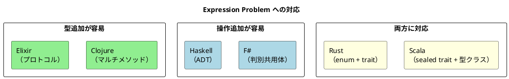

# 第3章: 多態性の実現方法 — 6言語統合ガイド

## 1. はじめに

多態性（ポリモーフィズム）は、**同じインターフェースで異なる型の振る舞いを切り替える**仕組みです。オブジェクト指向では継承とオーバーライドで実現しますが、関数型プログラミングでは言語ごとに多様なメカニズムが用意されています。

本章では、6 言語の多態性メカニズムを横断比較し、それぞれの強みと Expression Problem への対応を明らかにします。

## 2. 共通の本質

関数型言語における多態性の核心は以下です：

- **型に基づくディスパッチ**: データの型に応じて異なる関数を呼び出す
- **パターンマッチング**: データの構造を分解して処理を分岐する
- **オープンな拡張性**: 既存コードを変更せずに新しい型や操作を追加する

### Expression Problem

多態性の設計において常に直面するトレードオフが **Expression Problem** です：

- **新しい型を追加しやすい** vs **新しい操作を追加しやすい**

言語ごとにこのトレードオフへの対処が異なり、それが各言語の多態性メカニズムの選択に反映されています。

## 3. 言語別実装比較

### 3.1 多態性メカニズムの全体像

| 言語 | 主要メカニズム | 新型追加 | 新操作追加 |
|------|-------------|---------|-----------|
| Clojure | マルチメソッド / プロトコル | 容易 | 容易 |
| Scala | sealed trait / 型クラス | 型クラスで可能 | パターンマッチで容易 |
| Elixir | プロトコル / ビヘイビア / パターンマッチ | プロトコルで可能 | パターンマッチで容易 |
| F# | 判別共用体 / インターフェース / アクティブパターン | 要変更 | 容易 |
| Haskell | 型クラス / 代数的データ型 | 型クラスで可能 | 関数追加で容易 |
| Rust | enum / trait | trait で可能 | マッチで容易 |

### 3.2 基本的な多態性 — 図形の面積計算

全言語で共通する「図形の面積を計算する」例で比較します。

<details>
<summary>Clojure: マルチメソッド</summary>

```clojure
(defmulti calculate-area :shape)

(defmethod calculate-area :rectangle [{:keys [width height]}]
  (* width height))

(defmethod calculate-area :circle [{:keys [radius]}]
  (* Math/PI radius radius))

(defmethod calculate-area :triangle [{:keys [base height]}]
  (/ (* base height) 2))

;; 使用例
(calculate-area {:shape :rectangle :width 10 :height 5})  ;; => 50
(calculate-area {:shape :circle :radius 5})                ;; => 78.54
```

マルチメソッドは `:shape` キーの値でディスパッチします。**任意のディスパッチ関数**を指定できるため、最も柔軟です。

</details>

<details>
<summary>Scala: sealed trait + パターンマッチング</summary>

```scala
sealed trait Shape
case class Rectangle(width: Double, height: Double) extends Shape
case class Circle(radius: Double) extends Shape
case class Triangle(base: Double, height: Double) extends Shape

def calculateArea(shape: Shape): Double = shape match
  case Rectangle(w, h) => w * h
  case Circle(r) => Math.PI * r * r
  case Triangle(b, h) => b * h / 2
```

`sealed trait` により、パターンマッチの**網羅性チェック**がコンパイル時に行われます。

</details>

<details>
<summary>Elixir: パターンマッチング</summary>

```elixir
def area({:rectangle, width, height}), do: width * height
def area({:circle, radius}), do: :math.pi() * radius * radius
def area({:triangle, base, height}), do: base * height / 2
```

タグ付きタプルと関数のマルチヘッドで、シンプルに分岐します。

</details>

<details>
<summary>F#: 判別共用体</summary>

```fsharp
type Shape =
    | Rectangle of width: float * height: float
    | Circle of radius: float
    | Triangle of baseLength: float * height: float

let calculateArea shape =
    match shape with
    | Rectangle(w, h) -> w * h
    | Circle r -> System.Math.PI * r * r
    | Triangle(b, h) -> b * h / 2.0
```

判別共用体（Discriminated Union）は F# の型安全な代数的データ型です。コンパイラが網羅性をチェックします。

</details>

<details>
<summary>Haskell: 代数的データ型</summary>

```haskell
data Shape
    = Rectangle' { rectWidth :: Double, rectHeight :: Double }
    | Circle' { circleRadius :: Double }
    | Triangle' { triBase :: Double, triHeight :: Double }

calculateArea :: Shape -> Double
calculateArea shape = case shape of
    Rectangle' w h -> w * h
    Circle' r      -> pi * r * r
    Triangle' b h  -> b * h / 2
```

Haskell の代数的データ型は最も厳密なパターンマッチングを提供します。

</details>

<details>
<summary>Rust: enum</summary>

```rust
pub enum Shape {
    Rectangle { width: f64, height: f64 },
    Circle { radius: f64 },
    Triangle { base: f64, height: f64 },
}

impl Shape {
    pub fn area(&self) -> f64 {
        match self {
            Shape::Rectangle { width, height } => width * height,
            Shape::Circle { radius } => std::f64::consts::PI * radius * radius,
            Shape::Triangle { base, height } => base * height / 2.0,
        }
    }
}
```

Rust の `enum` はパターンマッチの網羅性チェック付きの代数的データ型です。

</details>

### 代数的データ型 vs マルチメソッド

| アプローチ | 採用言語 | 新型追加 | 新操作追加 | 網羅性チェック |
|----------|---------|---------|-----------|-------------|
| マルチメソッド | Clojure | 容易（defmethod 追加） | 容易（新 defmulti） | なし |
| パターンマッチ | Elixir | 要変更 | 容易（関数追加） | なし |
| sealed trait / ADT | Scala, F#, Haskell, Rust | 要変更 | 容易（関数追加） | **あり** |

### 3.3 複合ディスパッチ

複数の値に基づいて分岐するパターンです。全言語がタプルベースの実装をサポートしています。

<details>
<summary>Clojure: ベクターキー</summary>

```clojure
(defmulti process-payment
  (fn [payment] [(:method payment) (:currency payment)]))

(defmethod process-payment [:credit-card :jpy] [payment]
  (str "クレジットカード(JPY): " (:amount payment) "円"))

(defmethod process-payment [:bank-transfer :usd] [payment]
  (str "Bank transfer(USD): $" (:amount payment)))
```

マルチメソッドのディスパッチ関数がベクターを返すことで、複数の値に基づく分岐を実現します。

</details>

<details>
<summary>Scala / F# / Haskell / Rust: タプルマッチ</summary>

```scala
// Scala
(payment.method, payment.currency) match
  case ("credit-card", "jpy") => s"クレジットカード(JPY): ${payment.amount}円"
  case ("bank-transfer", "usd") => s"Bank transfer(USD): $$${payment.amount}"
```

```fsharp
// F#
match payment.Method, payment.Currency with
| "credit-card", "jpy" -> sprintf "クレジットカード(JPY): %d円" payment.Amount
| "bank-transfer", "usd" -> sprintf "Bank transfer(USD): $%d" payment.Amount
```

```rust
// Rust
match (&self.method, &self.currency) {
    (Method::CreditCard, Currency::Jpy) => format!("クレジットカード(JPY): {}円", self.amount),
    (Method::BankTransfer, Currency::Usd) => format!("Bank transfer(USD): ${}", self.amount),
}
```

</details>

### 3.4 インターフェース抽象 — 共通振る舞いの定義

「描画可能」という共通の振る舞いを定義する方法の比較です。

<details>
<summary>Clojure: プロトコル</summary>

```clojure
(defprotocol Drawable
  (draw [this])
  (bounding-box [this]))
```

</details>

<details>
<summary>Scala: トレイト</summary>

```scala
trait Drawable:
  def draw: String
  def boundingBox: (Point, Point)
```

</details>

<details>
<summary>Elixir: プロトコル</summary>

```elixir
defprotocol Describable do
  def describe(value)
end

defimpl Describable, for: Product do
  def describe(%Product{name: name, price: price}) do
    "商品: #{name} (#{price}円)"
  end
end
```

</details>

<details>
<summary>F#: インターフェース</summary>

```fsharp
type IDrawable =
    abstract member Draw: unit -> string
    abstract member BoundingBox: unit -> Point * Point
```

</details>

<details>
<summary>Haskell: 型クラス</summary>

```haskell
class Drawable a where
    draw :: a -> String
    boundingBox :: a -> (Point, Point)

instance Drawable Rectangle where
    draw r = "Rectangle at ..."
    boundingBox r = ...
```

</details>

<details>
<summary>Rust: trait</summary>

```rust
pub trait Drawable {
    fn draw(&self) -> String;
    fn bounding_box(&self) -> BoundingBox;
}

impl Drawable for DrawableRectangle {
    fn draw(&self) -> String { ... }
    fn bounding_box(&self) -> BoundingBox { ... }
}
```

</details>

### インターフェース抽象の比較

| 言語 | 機構 | 既存型への後付け | 静的 / 動的 |
|------|------|---------------|-----------|
| Clojure | プロトコル | **可能**（`extend-type`） | 動的 |
| Scala | トレイト / 型クラス | 型クラスで可能 | 静的 |
| Elixir | プロトコル | **可能**（`defimpl`） | 動的 |
| F# | インターフェース | 不可 | 静的 |
| Haskell | 型クラス | **可能**（インスタンス宣言） | 静的 |
| Rust | trait | **可能**（Extension Trait） | 静的 / 動的（`dyn`） |

### 3.5 既存型への振る舞い追加

自分が定義していない型に新しい振る舞いを追加する方法は、言語設計の大きな差異点です。

<details>
<summary>Clojure: extend-type</summary>

```clojure
(extend-type String
  Stringable
  (stringify [s] (str "\"" s "\"")))
```

Clojure ではどんな型にも後からプロトコルの実装を追加できます。

</details>

<details>
<summary>Scala: given + 型クラス</summary>

```scala
trait Stringable[A]:
  def stringify(a: A): String

given Stringable[Map[String, Any]] with
  def stringify(m: Map[String, Any]): String =
    m.map { case (k, v) => s"$k: $v" }.mkString("{", ", ", "}")
```

</details>

<details>
<summary>Haskell: instance 宣言</summary>

```haskell
class Stringable a where
    stringify :: a -> String

instance Stringable String where
    stringify s = "\"" ++ s ++ "\""
```

</details>

<details>
<summary>Rust: Extension Trait</summary>

```rust
trait Stringable {
    fn stringify(&self) -> String;
}

impl Stringable for String {
    fn stringify(&self) -> String {
        format!("\"{}\"", self)
    }
}
```

Rust では「オーファンルール」により、trait か型のどちらかが自分のクレートで定義されている必要があります。

</details>

<details>
<summary>F#: アクティブパターン</summary>

```fsharp
let (|MapToString|) (m: Map<string, obj>) =
    let pairs = m |> Map.toSeq |> Seq.map (fun (k, v) -> sprintf "%s: %O" k v)
    "{" + System.String.Join(", ", pairs) + "}"
```

F# ではアクティブパターンによりパターンマッチングを拡張できますが、インターフェースの後付けはできません。

</details>

### 3.6 Elixir 固有: ビヘイビア

Elixir にはプロトコルに加えて**ビヘイビア**があります。これはモジュールレベルのインターフェース定義で、Java のインターフェースに近い概念です。

```elixir
defmodule Serializer do
  @callback serialize(data :: any()) :: String.t()
  @callback deserialize(string :: String.t()) :: any()
end

defmodule JsonSerializer do
  @behaviour Serializer

  @impl true
  def serialize(data), do: Jason.encode!(data)

  @impl true
  def deserialize(string), do: Jason.decode!(string)
end
```

| 機構 | プロトコル | ビヘイビア |
|------|----------|----------|
| ディスパッチ対象 | データの型 | モジュール |
| 用途 | 異なるデータ型への統一操作 | モジュールの契約定義 |
| 相当する概念 | Clojure プロトコル / Haskell 型クラス | Java インターフェース |

## 4. 比較分析

### 4.1 Expression Problem への対応度



#### 型追加の容易さ（高い順）

1. **Clojure** — `defmethod` で新しい型のディスパッチを追加するだけ
2. **Elixir** — `defimpl` で新しい型にプロトコル実装を追加
3. **Scala** — 型クラスのインスタンスを追加
4. **Haskell** — 型クラスのインスタンスを宣言
5. **Rust** — trait の `impl` を追加
6. **F#** — 判別共用体の変更が必要

#### 操作追加の容易さ（高い順）

1. **F#** — パターンマッチの新関数を追加するだけ
2. **Haskell** — 新しい関数を定義するだけ
3. **Scala** — match 式の新関数を追加
4. **Rust** — match アームの新関数を追加
5. **Elixir** — パターンマッチのクローズを追加
6. **Clojure** — 新しい `defmulti` を定義

### 4.2 網羅性チェック

コンパイラがすべてのケースを網羅しているかチェックする機能は、バグの早期発見に重要です。

| 言語 | 網羅性チェック | 機構 |
|------|-------------|------|
| Clojure | なし | 動的言語のため |
| Scala | **あり** | `sealed trait` + `match` |
| Elixir | なし | 動的言語のため |
| F# | **あり** | 判別共用体 + `match` |
| Haskell | **あり** | ADT + `case` |
| Rust | **あり** | `enum` + `match` |

静的型付け言語（Scala, F#, Haskell, Rust）はいずれも網羅性チェックを提供し、新しいバリアントを追加した際に処理漏れをコンパイルエラーとして検出します。

### 4.3 多態性メカニズムの機能比較

| 機能 | Clojure | Scala | Elixir | F# | Haskell | Rust |
|------|---------|-------|--------|-----|---------|------|
| 任意ディスパッチ | **マルチメソッド** | — | — | — | — | — |
| ADT | — | sealed trait | タグ付きタプル | 判別共用体 | ADT | enum |
| 型クラス相当 | プロトコル | 型クラス | プロトコル | — | 型クラス | trait |
| 後付け拡張 | extend-type | given | defimpl | アクティブパターン | instance | impl |
| 動的ディスパッチ | 標準 | — | 標準 | — | — | `dyn Trait` |
| 網羅性チェック | — | あり | — | あり | あり | あり |

## 5. 実践的な選択指針

| 要件 | 推奨アプローチ | 推奨言語 |
|------|-------------|---------|
| 最も柔軟なディスパッチ | マルチメソッド | Clojure |
| コンパイル時の安全性 | sealed trait / ADT | Scala, F#, Haskell, Rust |
| 既存型への後付け拡張 | 型クラス / プロトコル | Haskell, Scala, Clojure, Elixir |
| 並行処理との統合 | ビヘイビア + OTP | Elixir |
| パフォーマンス + 安全性 | enum + trait | Rust |
| 数学的な厳密性 | 型クラス + ADT | Haskell |

### パターンマッチ vs インターフェースの使い分け

| 基準 | パターンマッチ（ADT/enum） | インターフェース（trait/型クラス） |
|------|------------------------|-------------------------------|
| 型の種類 | 閉じたセット（事前に全列挙） | 開いたセット（後から追加可能） |
| 操作の追加 | 新関数を追加するだけ | 全実装に新メソッドを追加 |
| 型の追加 | 全関数のパターンを修正 | 新しい実装を追加するだけ |
| 適する場面 | ドメインの型が安定している | サードパーティが型を追加する |

## 6. まとめ

### 言語横断的な学び

1. **多態性は 1 つではない** — マルチメソッド、型クラス、ADT、プロトコルなど多様なメカニズムが存在する
2. **Expression Problem は普遍的** — 型追加と操作追加のトレードオフはすべての言語に存在する
3. **網羅性チェックは強力な武器** — 静的型付け言語の ADT + パターンマッチは設計の安全網となる
4. **後付け拡張の能力が設計を左右する** — 既存型への振る舞い追加が容易な言語ほどライブラリ設計の自由度が高い

### 各言語の個性

| 言語 | 多態性の特徴 |
|------|------------|
| Clojure | マルチメソッドによる最大の柔軟性。任意の値でディスパッチ可能 |
| Scala | sealed trait + 型クラスの併用で Expression Problem の両面に対応 |
| Elixir | パターンマッチ + プロトコル + ビヘイビアの 3 層構造 |
| F# | 判別共用体とアクティブパターンによる型安全な多態性 |
| Haskell | 型クラスによる数学的に洗練されたアドホック多相性 |
| Rust | enum + trait の組み合わせでメモリ安全性と多態性を両立 |

## 言語別個別記事

- [Clojure](../clojure/03-polymorphism.md)
- [Scala](../scala/03-polymorphism.md)
- [Elixir](../elixir/03-polymorphism.md)
- [F#](../fsharp/03-polymorphism.md)
- [Haskell](../haskell/03-polymorphism.md)
- [Rust](../rust/03-polymorphism.md)
