# 関数型デザイン - 原則、パターン、実践：多言語統合解説

本記事シリーズは、6 つの関数型言語（Clojure, Scala, Elixir, F#, Haskell, Rust）での実装を横断的に比較し、関数型デザインパターンの**本質**と**言語固有の表現**を統合的に解説します。

## 本シリーズの目的

各言語の個別記事は「その言語でどう実装するか」に焦点を当てています。本統合記事は、それらを横断して以下を明らかにします：

- **共通の本質**: 言語を超えて成り立つ関数型デザインの原則
- **言語間の差異**: 型システム、実行モデル、イディオムの違いが設計にどう影響するか
- **選択の指針**: どの言語特性がどのパターンに適しているか

## 言語特性マトリクス

| 特性 | Clojure | Scala | Elixir | F# | Haskell | Rust |
|------|---------|-------|--------|-----|---------|------|
| 型システム | 動的 | 静的（強い） | 動的 | 静的（推論） | 静的（純粋） | 静的（所有権） |
| 多態性 | マルチメソッド / プロトコル | trait / パターンマッチ | プロトコル / ビヘイビア | 判別共用体 / インターフェース | 型クラス | trait / enum |
| 不変性 | デフォルト不変 | case class | デフォルト不変 | デフォルト不変 | 完全不変 | デフォルト不変 |
| 並行処理 | STM / Agent | Future / Akka | OTP / GenServer | Async / MailboxProcessor | STM / MVar | async / Mutex / Channel |
| 実行環境 | JVM | JVM | BEAM | .NET | GHC | ネイティブ |

## 記事構成

### 第 1 部: 関数型プログラミングの基礎原則

| 章 | 統合記事 | テーマ | 比較のポイント |
|----|---------|--------|---------------|
| 1 | [不変性とデータ変換](./01-immutability-and-data-transformation.md) | 不変データ構造と変換パイプライン | 構造共有の実装差異、コピーコスト、永続データ構造 |
| 2 | [関数合成と高階関数](./02-function-composition.md) | 関数の組み合わせによる抽象化 | カリー化のデフォルト有無、パイプ演算子、合成演算子 |
| 3 | [多態性の実現方法](./03-polymorphism.md) | 型に基づく振る舞いの切り替え | アドホック多態性 vs サブタイプ多態性、式問題への対応 |

#### 主な言語間比較テーマ

- **不変性の保証レベル**: Haskell の完全不変 vs Rust の `mut` オプトイン vs Clojure のデフォルト不変
- **データ変換スタイル**: Clojure のスレッディングマクロ vs Elixir のパイプ演算子 vs Haskell の関数合成
- **多態性メカニズム**: Clojure マルチメソッド vs Haskell 型クラス vs Rust trait vs Scala パターンマッチ

### 第 2 部: 仕様とテスト

| 章 | 統合記事 | テーマ | 比較のポイント |
|----|---------|--------|---------------|
| 4 | [データ検証](./04-data-validation.md) | データの正しさを保証する手法 | 型レベル検証 vs ランタイム検証、Clojure Spec の独自性 |
| 5 | [プロパティベーステスト](./05-property-based-testing.md) | 性質に基づく自動テスト生成 | 各言語の PBT ライブラリとジェネレータ設計 |
| 6 | [TDD と関数型プログラミング](./06-tdd-and-functional.md) | テスト駆動開発の関数型アプローチ | 純粋関数のテスト容易性、副作用の分離戦略 |

#### 主な言語間比較テーマ

- **検証アプローチ**: Clojure Spec（ランタイム仕様） vs Haskell/F# の型レベル保証 vs Rust の型 + バリデーション
- **PBT ライブラリ**: test.check vs ScalaCheck vs StreamData vs FsCheck vs QuickCheck vs proptest
- **テスト設計**: 動的型付け言語のテスト戦略 vs 静的型付け言語のテスト戦略

### 第 3 部: デザインパターン - 構造パターン

| 章 | 統合記事 | テーマ | 比較のポイント |
|----|---------|--------|---------------|
| 7 | [Composite パターン](./07-composite-pattern.md) | 個と集合の統一的な扱い | 代数的データ型 vs プロトコル、再帰的データ構造の表現 |
| 8 | [Decorator パターン](./08-decorator-pattern.md) | 機能の動的な追加 | 関数合成 vs ラッパー型、ミドルウェアパターン |
| 9 | [Adapter パターン](./09-adapter-pattern.md) | インターフェースの変換 | プロトコル拡張 vs ニュータイプ vs trait 実装 |

> **Elixir の章 7-10 について**: Elixir では OTP の特性を活かし、章 7-10 を Elixir 固有のテーマ（Effects、Error Handling、I/O、Concurrency Patterns）で構成しています。統合記事では GoF パターンの比較を主軸としつつ、Elixir の代替アプローチをコラムとして扱います。

#### 主な言語間比較テーマ

- **Composite**: Haskell/F# の代数的データ型 vs Scala の sealed trait vs Rust の enum
- **Decorator**: Clojure の関数ラッピング vs Haskell のモナドトランスフォーマー vs Rust のトレイトオブジェクト
- **Adapter**: 構造的型付け vs 名前的型付け、既存型への振る舞い追加手法

### 第 4 部: デザインパターン - 振る舞いパターン

| 章 | 統合記事 | テーマ | 比較のポイント |
|----|---------|--------|---------------|
| 10 | [Strategy パターン](./10-strategy-pattern.md) | アルゴリズムの交換可能性 | 高階関数 vs 型クラス vs trait オブジェクト |
| 11 | [Command パターン](./11-command-pattern.md) | 操作のデータ化と Undo/Redo | データとしてのコマンド表現、イベントソーシングとの関連 |
| 12 | [Visitor パターン](./12-visitor-pattern.md) | データ構造と操作の分離 | パターンマッチ vs ダブルディスパッチ、式問題 |

#### 主な言語間比較テーマ

- **Strategy**: 関数型では「高階関数に戦略を渡す」が自然 — 言語間で表現がどう異なるか
- **Command**: 不変データとしてのコマンド、永続データ構造による自然な Undo
- **Visitor**: Haskell/F#/Rust のパターンマッチで Visitor が不要になるケース

### 第 5 部: デザインパターン - 生成パターン

| 章 | 統合記事 | テーマ | 比較のポイント |
|----|---------|--------|---------------|
| 13 | [Abstract Factory パターン](./13-abstract-factory-pattern.md) | オブジェクトファミリーの一貫生成 | モジュール / 名前空間による分離 vs 型パラメータ |
| 14 | [Abstract Server パターン](./14-abstract-server-pattern.md) | 依存関係逆転の原則 | プロトコル vs 型クラス vs trait、DI の関数型アプローチ |

#### 主な言語間比較テーマ

- **Factory**: 関数型での「生成」の意味 — コンストラクタ関数 vs ファクトリモジュール
- **Abstract Server**: DIP を実現する各言語のメカニズム比較

### 第 6 部: 実践的なケーススタディ

| 章 | 統合記事                                                   | テーマ | 比較のポイント |
|----|--------------------------------------------------------|--------|---------------|
| 15 | [Gossiping Bus Drivers](./15-gossiping-bus-drivers.md) | シミュレーションの関数型設計 | 状態遷移の表現、無限シーケンス、集合演算 |
| 16 | [給与計算システム](./16-payroll-system.md)                     | ドメインモデリング | ドメイン型の設計、ビジネスルールの表現 |
| 17 | [レンタルビデオシステム](./17-video-rental-system.md)             | ポリシーパターンの適用 | 料金計算ロジック、フォーマッター設計 |
| 18 | [並行処理システム](./18-concurrency-system.md)                 | 並行処理の設計 | 各言語の並行処理モデルの根本的な違い |
| 19 | [Wa-Tor シミュレーション](./19-wa-tor-simulation.md)           | セルオートマトンの実装 | 2D グリッドの不変表現、並行更新戦略 |

#### 主な言語間比較テーマ

- **並行処理モデル**: Clojure STM vs Elixir OTP vs Haskell STM vs Rust 所有権ベース vs Scala Akka
- **ドメインモデリング**: 動的型付け（マップベース） vs 静的型付け（代数的データ型）
- **シミュレーション**: 状態更新の純粋性、パフォーマンスと安全性のトレードオフ

### 第 7 部: まとめと応用

| 章 | 統合記事 | テーマ | 比較のポイント |
|----|---------|--------|---------------|
| 20 | [パターン間の相互作用](./20-pattern-interactions.md) | パターンの組み合わせ | 各言語での合成可能性、DSL 構築アプローチ |
| 21 | [ベストプラクティス](./21-best-practices.md) | 関数型設計の指針 | 言語横断的なプラクティス vs 言語固有のイディオム |
| 22 | [OO から FP への移行](./22-oo-to-fp-migration.md) | パラダイムの橋渡し | 各言語のマルチパラダイム度合い、移行の容易さ |

#### 主な言語間比較テーマ

- **合成可能性**: モナド合成（Haskell） vs パイプライン合成（Elixir） vs メソッドチェーン（Scala）
- **移行戦略**: Scala/F# のマルチパラダイム vs Haskell/Clojure の純粋関数型

## 各章の統合記事構成テンプレート

各統合記事は以下の構成で執筆します：

```
1. はじめに
   - テーマの概要と関数型での意義

2. 共通の本質
   - 言語を超えて成り立つ原則・パターンの核心

3. 言語別実装比較
   - 6 言語の代表的なコードを並べて比較
   - 各言語のイディオムを活かした実装の違い

4. 比較分析
   - 型システムの影響
   - パフォーマンス特性
   - 表現力と簡潔さのトレードオフ

5. 実践的な選択指針
   - どの言語特性がこのパターンに最も適しているか
   - プロジェクト要件に応じた選択基準

6. まとめ
   - 言語横断的な学び
   - 各言語の個別記事へのリンク
```

## 執筆ルール

### 1. 執筆フォーマット

````markdown
# 第N章：章タイトル

## N.1 セクションタイトル

本文...

### ダイアグラム

```plantuml
@startuml
...
@enduml
```



### ER 図


### 実装

<details>
<summary>SQL 実装</summary>

```sql
CREATE TABLE ...
```

</details>
````

### 2. リスト記述ルール

タスク項目やリスト項目は、ラベル行の後に **1 行空けて** から記述します。

**NG**:

```markdown
**受入条件**:
- [ ] ログアウトボタンをクリックするとログアウトできる
- [ ] ログアウト後、ログイン画面に遷移する
- [ ] JWT トークンが無効化される
```

**OK**:

```markdown
**受入条件**:

- [ ] ログアウトボタンをクリックするとログアウトできる
- [ ] ログアウト後、ログイン画面に遷移する
- [ ] JWT トークンが無効化される
```

## 執筆計画

### 概要

全 22 章の統合記事を、章ごとの統合難易度に基づき 4 つのイテレーションで執筆します。

- **総ソース量**: 約 52,000 行（6 言語 × 22 章）
- **統合記事数**: 22 本
- **各記事の想定規模**: 400〜800 行

### 難易度分類

各章を言語間の構造一貫性・ボリューム差・内容の乖離度で分類しました。

| 難易度 | 章数 | 特徴 |
|--------|------|------|
| Low | 6 章 | 全言語で構造が一貫、そのまま統合可能 |
| Medium | 7 章 | 共通フレームワーク + 言語固有セクションが必要 |
| High | 9 章 | Elixir の独立カリキュラムや大幅なボリューム差への対応が必要 |

### イテレーション 1: 基礎原則（Low 難易度）

**対象**: 第 1 部 全 3 章

全言語でセクション構造が一貫しており、統合が最も容易です。

| 章 | タイトル | 平均行数 | 統合方針 |
|----|---------|---------|---------|
| 01 | 不変性とデータ変換 | 351 | 共通概念を軸に、言語別の不変性保証レベルを比較 |
| 02 | 関数合成と高階関数 | 387 | 理論を共通化、パイプ演算子・合成演算子の差異を対比 |
| 03 | 多態性の実現方法 | 399 | マルチメソッド / 型クラス / trait / 判別共用体を横断比較 |

**執筆順序**: 01 → 02 → 03

**完了条件**:

- [ ] 各章が統合記事構成テンプレートに準拠
- [ ] 6 言語すべてのコード例を含む
- [ ] 言語間の差異を比較分析セクションで解説

### イテレーション 2: 仕様・テスト + ケーススタディ前半（Low〜Medium 難易度）

**対象**: 第 2 部 全 3 章 + 第 6 部 前半 3 章

| 章 | タイトル | 平均行数 | 難易度 | 統合方針 |
|----|---------|---------|--------|---------|
| 04 | データ検証 | 309 | Medium | Clojure Spec の独自性を別セクションで扱い、他 5 言語の型ベース検証と対比 |
| 05 | プロパティベーステスト | 336 | Medium | PBT の共通原理を軸に、各言語のライブラリ（test.check / ScalaCheck / StreamData / FsCheck / QuickCheck / proptest）を比較 |
| 06 | TDD と関数型 | 420 | Medium | TDD サイクルは共通、F# の詳細実装（687 行）は拡張セクションで対応 |
| 15 | Gossiping Bus Drivers | 305 | Low | 全言語の実装を並列提示、状態遷移の表現方法を比較 |
| 16 | 給与計算システム | 338 | Low | ドメインモデリングを共通化、型表現の違いを比較 |
| 17 | レンタルビデオシステム | 342 | Low | 料金計算ロジックとフォーマッター設計の多様な実装を比較 |

**執筆順序**: 15 → 16 → 17 → 04 → 05 → 06

**完了条件**:

- [ ] Low 難易度の 3 章が完成
- [ ] Medium 難易度の 3 章で Clojure Spec・F# 拡張セクションを適切に分離
- [ ] 各 PBT ライブラリの比較表を含む

### イテレーション 3: デザインパターン（Medium〜High 難易度）

**対象**: 第 3 部〜第 5 部 全 8 章

Elixir の章 7-10 が独立カリキュラム（Effects / Error Handling / I/O / Concurrency）のため、統合設計に工夫が必要です。

#### Elixir 分離戦略

章 7-10 では以下の構成を採用します：

1. **メイン**: 5 言語（Clojure, Scala, F#, Haskell, Rust）の GoF パターン比較
2. **コラム**: Elixir の代替アプローチ（副作用・エラーハンドリング・I/O・並行処理）

| 章 | タイトル | 平均行数 | 難易度 | 統合方針 |
|----|---------|---------|--------|---------|
| 07 | Composite パターン | 380 | High | 5 言語の Composite 比較 + Elixir コラム「副作用と純粋関数」 |
| 08 | Decorator パターン | 345 | High | 5 言語の Decorator 比較 + Elixir コラム「エラーハンドリング戦略」 |
| 09 | Adapter パターン | 395 | High | 5 言語の Adapter 比較 + Elixir コラム「I/O と外部システム」 |
| 10 | Strategy パターン | 373 | High | 5 言語の Strategy 比較 + Elixir コラム「並行パターン」 |
| 11 | Command パターン | 368 | Medium | 全 6 言語で統合、Elixir の簡潔な実装（148 行）を補足解説 |
| 12 | Visitor パターン | 361 | Medium | 全 6 言語で統合、パターンマッチで Visitor が不要になるケースを解説 |
| 13 | Abstract Factory パターン | 413 | High | Elixir が長い（604 行）ため、言語別ファクトリ表現の違いを詳述 |
| 14 | Abstract Server パターン | 506 | High | Elixir が長い（729 行）ため、DIP の言語別実現方法を詳述 |

**執筆順序**: 11 → 12 → 10 → 07 → 08 → 09 → 13 → 14

**完了条件**:

- [ ] 章 7-10 で Elixir コラムが独立セクションとして成立
- [ ] 章 11-12 で Elixir の簡潔な実装に対する補足解説を含む
- [ ] 章 13-14 で各言語の生成パターン表現を比較表にまとめる

### イテレーション 4: ケーススタディ後半 + まとめ（Medium〜High 難易度）

**対象**: 第 6 部 後半 2 章 + 第 7 部 全 3 章

各言語の並行処理モデルが根本的に異なるため、章 18-19 が最難関です。

| 章 | タイトル | 平均行数 | 難易度 | 統合方針 |
|----|---------|---------|--------|---------|
| 18 | 並行処理システム | 453 | High | 並行処理モデル（STM / OTP / Future / Async / Mutex）を言語別に深掘り |
| 19 | Wa-Tor シミュレーション | 506 | High | 2D グリッドの不変表現と並行更新戦略を言語別に比較 |
| 20 | パターン間の相互作用 | 380 | Medium | Composite+Decorator / Command+Observer の組み合わせを言語横断で比較 |
| 21 | ベストプラクティス | 388 | Medium | 共通原則を抽出し、言語固有のイディオムを別セクションで整理 |
| 22 | OO から FP への移行 | 457 | High | 言語のマルチパラダイム度合いに応じた移行戦略を言語別に詳述 |

**執筆順序**: 20 → 21 → 18 → 19 → 22

**完了条件**:

- [ ] 章 18 で 6 言語の並行処理モデル比較表を含む
- [ ] 章 19 で状態管理アプローチの違いを図解
- [ ] 章 22 で言語別の移行難易度を評価

### 全体スケジュール

| イテレーション | 章数 | 難易度構成 | 主な課題 |
|---------------|------|-----------|---------|
| 1 | 3 章（01-03） | Low × 3 | なし（ウォームアップ） |
| 2 | 6 章（04-06, 15-17） | Low × 3 + Medium × 3 | Clojure Spec・F# 拡張の分離 |
| 3 | 8 章（07-14） | Medium × 2 + High × 6 | Elixir 独立カリキュラムの統合 |
| 4 | 5 章（18-22） | Medium × 2 + High × 3 | 並行処理モデルの根本的差異 |

### 進捗管理

| 章 | タイトル | イテレーション | 難易度 | 状態 |
|----|---------|---------------|--------|------|
| 01 | 不変性とデータ変換 | 1 | Low | 完了 |
| 02 | 関数合成と高階関数 | 1 | Low | 完了 |
| 03 | 多態性の実現方法 | 1 | Low | 完了 |
| 04 | データ検証 | 2 | Medium | 完了 |
| 05 | プロパティベーステスト | 2 | Medium | 完了 |
| 06 | TDD と関数型 | 2 | Medium | 完了 |
| 07 | Composite パターン | 3 | High | 完了 |
| 08 | Decorator パターン | 3 | High | 完了 |
| 09 | Adapter パターン | 3 | High | 完了 |
| 10 | Strategy パターン | 3 | High | 完了 |
| 11 | Command パターン | 3 | Medium | 完了 |
| 12 | Visitor パターン | 3 | Medium | 完了 |
| 13 | Abstract Factory パターン | 3 | High | 完了 |
| 14 | Abstract Server パターン | 3 | High | 完了 |
| 15 | Gossiping Bus Drivers | 2 | Low | 完了 |
| 16 | 給与計算システム | 2 | Low | 完了 |
| 17 | レンタルビデオシステム | 2 | Low | 完了 |
| 18 | 並行処理システム | 4 | High | 完了 |
| 19 | Wa-Tor シミュレーション | 4 | High | 完了 |
| 20 | パターン間の相互作用 | 4 | Medium | 完了 |
| 21 | ベストプラクティス | 4 | Medium | 完了 |
| 22 | OO から FP への移行 | 4 | High | 完了 |

## 言語別個別記事へのリンク

| 言語 | 個別記事一覧 |
|------|-------------|
| Clojure | [全 22 章](../clojure/index.md) |
| Scala | [全 22 章](../scala/index.md) |
| Elixir | [全 22 章](../elixir/index.md) |
| F# | [全 22 章](../fsharp/index.md) |
| Haskell | [全 22 章](../haskell/index.md) |
| Rust | [全 22 章](../rust/index.md) |

## 参照

- 「Functional Design: Principles, Patterns, and Practices」Robert C. Martin
- 「Clean Code」Robert C. Martin
- [Clojure 公式ドキュメント](https://clojure.org/)
- [Scala 公式ドキュメント](https://www.scala-lang.org/)
- [Elixir 公式ドキュメント](https://elixir-lang.org/)
- [F# 公式ドキュメント](https://fsharp.org/)
- [Haskell 公式ドキュメント](https://www.haskell.org/)
- [Rust 公式ドキュメント](https://www.rust-lang.org/)
