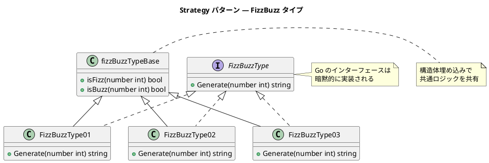
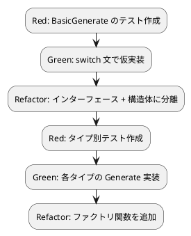

# 第 7 章: カプセル化とポリモーフィズム

## 7.1 追加仕様と TODO リスト

第 1 部で作成した FizzBuzz プログラムに、新しい仕様を追加します。

**追加仕様**:

- **タイプ 1**（通常）: 3 の倍数→Fizz、5 の倍数→Buzz、両方の倍数→FizzBuzz、それ以外→数値
- **タイプ 2**（数値のみ）: 常に数値を返す
- **タイプ 3**（FizzBuzz のみ）: 3 と 5 両方の倍数→FizzBuzz、それ以外→数値

**TODO リスト**:

- [ ] タイプ 1: 通常の FizzBuzz（既存動作）
- [ ] タイプ 2: 数値のみを返す
- [ ] タイプ 3: FizzBuzz のみを返す
- [ ] カプセル化: 非公開フィールドで内部状態を隠蔽
- [ ] ポリモーフィズム: インターフェースでタイプを抽象化

## 7.2 手続き型アプローチ

まず、手続き型で 3 つのタイプを実装します。

### テスト

```go
func TestBasicGenerate_タイプ1_数を文字列に変換する(t *testing.T) {
    got := BasicGenerate(1, 1)
    if got != "1" {
        t.Fatalf("BasicGenerate(1, 1) = %q, want %q", got, "1")
    }
}

func TestBasicGenerate_タイプ1_3の倍数でFizzを返す(t *testing.T) {
    got := BasicGenerate(3, 1)
    if got != "Fizz" {
        t.Fatalf("BasicGenerate(3, 1) = %q, want %q", got, "Fizz")
    }
}

func TestBasicGenerate_タイプ2_数を文字列に変換する(t *testing.T) {
    got := BasicGenerate(3, 2)
    if got != "3" {
        t.Fatalf("BasicGenerate(3, 2) = %q, want %q", got, "3")
    }
}

func TestBasicGenerate_タイプ3_FizzBuzzのみ返す(t *testing.T) {
    got := BasicGenerate(15, 3)
    if got != "FizzBuzz" {
        t.Fatalf("BasicGenerate(15, 3) = %q, want %q", got, "FizzBuzz")
    }
}

func TestBasicGenerate_タイプ3_FizzBuzz以外は数値を返す(t *testing.T) {
    got := BasicGenerate(3, 3)
    if got != "3" {
        t.Fatalf("BasicGenerate(3, 3) = %q, want %q", got, "3")
    }
}
```

### 実装

<details>
<summary>手続き型の実装</summary>

```go
// BasicGenerate は手続き型で FizzBuzz を生成します。
func BasicGenerate(number, fizzBuzzType int) string {
    isFizz := number%3 == 0
    isBuzz := number%5 == 0

    switch fizzBuzzType {
    case 1:
        if isFizz && isBuzz {
            return "FizzBuzz"
        }
        if isFizz {
            return "Fizz"
        }
        if isBuzz {
            return "Buzz"
        }
        return strconv.Itoa(number)
    case 2:
        return strconv.Itoa(number)
    case 3:
        if isFizz && isBuzz {
            return "FizzBuzz"
        }
        return strconv.Itoa(number)
    default:
        panic("該当するタイプは存在しません")
    }
}
```

</details>

この実装には問題があります:

- **switch 文の肥大化**: タイプが増えるたびに分岐が増える
- **変更の影響範囲が広い**: 1 つのタイプを変更すると関数全体に影響
- **テストが複雑化**: すべてのタイプが 1 つの関数に集約されている

## 7.3 カプセル化: 非公開フィールド

Go では**大文字/小文字の命名規約**でカプセル化を実現します。

| 命名 | アクセス範囲 |
|------|------------|
| `FizzBuzzType`（大文字始まり） | パッケージ外から参照可能（公開） |
| `fizzBuzzType`（小文字始まり） | パッケージ内のみ参照可能（非公開） |

```go
type fizzBuzzTypeBase struct{}

func (b fizzBuzzTypeBase) isFizz(number int) bool {
    return number%3 == 0
}

func (b fizzBuzzTypeBase) isBuzz(number int) bool {
    return number%5 == 0
}
```

`fizzBuzzTypeBase` は小文字始まりのためパッケージ外からは直接利用できません。公開したいメソッドだけを大文字で定義することで、内部の実装詳細を隠蔽します。

### 他言語との比較

| 言語 | カプセル化の手段 |
|------|----------------|
| Go | 大文字/小文字の命名規約 |
| Java | `private` / `protected` / `public` |
| Ruby | `private` / `protected` / `public` メソッド |
| TypeScript | `private` / `protected` / `public` 修飾子 |
| Python | `_` プレフィックス（慣例） |

## 7.4 ポリモーフィズム: インターフェース

Go のインターフェースは**暗黙的実装**（ダックタイピング）です。`implements` キーワードは不要で、メソッドセットが一致すればインターフェースを満たします。

### インターフェース定義

```go
// FizzBuzzType はタイプごとの FizzBuzz 生成を抽象化するインターフェースです。
type FizzBuzzType interface {
    Generate(number int) string
}
```

### 構造体埋め込みによるコード共有

Go にはクラス継承がありません。代わりに**構造体埋め込み（Embedding）**で共通ロジックを共有します。

```go
// fizzBuzzTypeBase は FizzBuzz 判定の共通ロジックを提供します。
type fizzBuzzTypeBase struct{}

func (b fizzBuzzTypeBase) isFizz(number int) bool {
    return number%3 == 0
}

func (b fizzBuzzTypeBase) isBuzz(number int) bool {
    return number%5 == 0
}
```

### タイプ別の実装

```go
// FizzBuzzType01 は通常の FizzBuzz を生成します。
type FizzBuzzType01 struct {
    fizzBuzzTypeBase
}

func (f FizzBuzzType01) Generate(number int) string {
    if f.isFizz(number) && f.isBuzz(number) {
        return "FizzBuzz"
    }
    if f.isFizz(number) {
        return "Fizz"
    }
    if f.isBuzz(number) {
        return "Buzz"
    }
    return strconv.Itoa(number)
}

// FizzBuzzType02 は数値のみを返します。
type FizzBuzzType02 struct {
    fizzBuzzTypeBase
}

func (f FizzBuzzType02) Generate(number int) string {
    return strconv.Itoa(number)
}

// FizzBuzzType03 は FizzBuzz のみ返し、それ以外は数値を返します。
type FizzBuzzType03 struct {
    fizzBuzzTypeBase
}

func (f FizzBuzzType03) Generate(number int) string {
    if f.isFizz(number) && f.isBuzz(number) {
        return "FizzBuzz"
    }
    return strconv.Itoa(number)
}
```

### テスト

```go
func TestFizzBuzzType01_Generate_数を文字列に変換する(t *testing.T) {
    fizzbuzzType := FizzBuzzType01{}
    got := fizzbuzzType.Generate(1)
    if got != "1" {
        t.Fatalf("FizzBuzzType01.Generate(1) = %q, want %q", got, "1")
    }
}

func TestFizzBuzzType01_Generate_3の倍数でFizzを返す(t *testing.T) {
    fizzbuzzType := FizzBuzzType01{}
    got := fizzbuzzType.Generate(3)
    if got != "Fizz" {
        t.Fatalf("FizzBuzzType01.Generate(3) = %q, want %q", got, "Fizz")
    }
}

func TestFizzBuzzType02_Generate_常に数値を返す(t *testing.T) {
    fizzbuzzType := FizzBuzzType02{}
    got := fizzbuzzType.Generate(3)
    if got != "3" {
        t.Fatalf("FizzBuzzType02.Generate(3) = %q, want %q", got, "3")
    }
}

func TestFizzBuzzType03_Generate_FizzBuzzのみ返す(t *testing.T) {
    fizzbuzzType := FizzBuzzType03{}
    got := fizzbuzzType.Generate(15)
    if got != "FizzBuzz" {
        t.Fatalf("FizzBuzzType03.Generate(15) = %q, want %q", got, "FizzBuzz")
    }
}

func TestFizzBuzzType03_Generate_FizzBuzz以外は数値を返す(t *testing.T) {
    fizzbuzzType := FizzBuzzType03{}
    got := fizzbuzzType.Generate(3)
    if got != "3" {
        t.Fatalf("FizzBuzzType03.Generate(3) = %q, want %q", got, "3")
    }
}
```

## 7.5 Strategy パターン

ここまでの設計は **Strategy パターン** の適用です。



### Go の継承代替パターン

| Ruby（継承） | Go（コンポジション） |
|-------------|---------------------|
| `class FizzBuzzType01 < FizzBuzzType` | `type FizzBuzzType01 struct { fizzBuzzTypeBase }` |
| メソッドオーバーライド | インターフェースのメソッド実装 |
| `super` で親メソッド呼び出し | 埋め込みフィールド経由で呼び出し |
| `self.class` で動的型取得 | 型アサーション / 型スイッチ |

## 7.6 ファクトリ関数

Go にはクラスメソッドがないため、**パッケージレベルのファクトリ関数**でインスタンスを生成します。

```go
// NewFizzBuzzType は指定されたタイプの FizzBuzzType を生成します。
func NewFizzBuzzType(fizzBuzzType int) FizzBuzzType {
    switch fizzBuzzType {
    case 1:
        return FizzBuzzType01{}
    case 2:
        return FizzBuzzType02{}
    case 3:
        return FizzBuzzType03{}
    default:
        panic("該当するタイプは存在しません")
    }
}
```

### テスト

```go
func TestNewFizzBuzzType_タイプ1を生成する(t *testing.T) {
    fbt := NewFizzBuzzType(1)
    got := fbt.Generate(3)
    if got != "Fizz" {
        t.Fatalf("NewFizzBuzzType(1).Generate(3) = %q, want %q", got, "Fizz")
    }
}

func TestNewFizzBuzzType_不正なタイプでパニックする(t *testing.T) {
    defer func() {
        if r := recover(); r == nil {
            t.Fatal("NewFizzBuzzType(99) should panic")
        }
    }()
    NewFizzBuzzType(99)
}
```

## 7.7 既存コードとの統合

ポリモーフィズムを導入した後、既存の `Generate` / `GenerateList` / `Print` 関数はタイプ 1 のラッパーとして維持します。

```go
// Generate は FizzBuzz の文字列を返します（タイプ 1 互換）。
func Generate(number int) string {
    return FizzBuzzType01{}.Generate(number)
}
```

これにより、既存のテストはすべてそのまま通ります。

## 7.8 まとめ

第 7 章で達成したこと:

- [x] タイプ 1, 2, 3 の仕様を追加
- [x] 手続き型（switch 文）の問題点を確認
- [x] 非公開フィールドによるカプセル化
- [x] インターフェースによるポリモーフィズム
- [x] 構造体埋め込みによるコード共有
- [x] Strategy パターンの適用
- [x] ファクトリ関数でインスタンス生成
- [x] 既存コードとの後方互換性を維持

### TDD サイクルの実践


