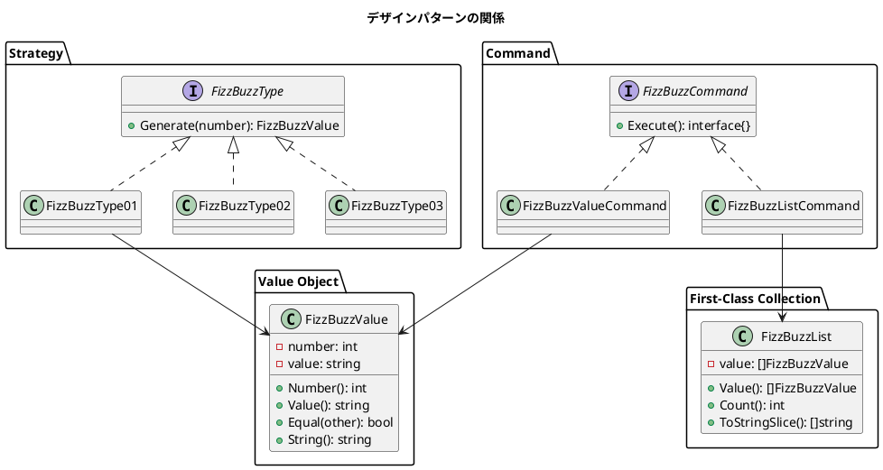
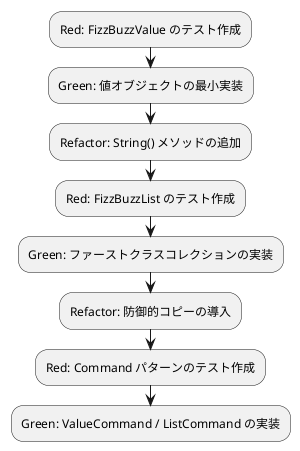

# 第 8 章: デザインパターンの適用

## 8.1 値オブジェクト（Value Object）

これまでの `Generate` メソッドは文字列を返していました。しかし、FizzBuzz の結果には「元の数値」と「変換後の文字列」の 2 つの情報が含まれます。この 2 つを 1 つのオブジェクトとして表現するのが**値オブジェクト**です。

### 値オブジェクトの特徴

| 特徴 | 説明 |
|------|------|
| 不変性 | 一度生成したら変更できない |
| 等価性 | 同じ値を持つオブジェクトは等しい |
| 自己記述性 | 文字列表現を持つ |

### テスト

```go
func TestNewFizzBuzzValue_正の値で生成できる(t *testing.T) {
    v := NewFizzBuzzValue(1, "1")
    if v.Number() != 1 {
        t.Fatalf("Number() = %d, want %d", v.Number(), 1)
    }
    if v.Value() != "1" {
        t.Fatalf("Value() = %q, want %q", v.Value(), "1")
    }
}

func TestNewFizzBuzzValue_負の値でパニックする(t *testing.T) {
    defer func() {
        if r := recover(); r == nil {
            t.Fatal("NewFizzBuzzValue(-1, \"-1\") should panic")
        }
    }()
    NewFizzBuzzValue(-1, "-1")
}

func TestFizzBuzzValue_Equal_同じ値は等しい(t *testing.T) {
    v1 := NewFizzBuzzValue(1, "1")
    v2 := NewFizzBuzzValue(1, "1")
    if !v1.Equal(v2) {
        t.Fatal("v1.Equal(v2) should be true")
    }
}

func TestFizzBuzzValue_Equal_異なる値は等しくない(t *testing.T) {
    v1 := NewFizzBuzzValue(1, "1")
    v2 := NewFizzBuzzValue(2, "2")
    if v1.Equal(v2) {
        t.Fatal("v1.Equal(v2) should be false")
    }
}

func TestFizzBuzzValue_String_文字列表現を返す(t *testing.T) {
    v := NewFizzBuzzValue(3, "Fizz")
    if v.String() != "Fizz" {
        t.Fatalf("String() = %q, want %q", v.String(), "Fizz")
    }
}
```

### 実装

<details>
<summary>FizzBuzzValue の実装</summary>

```go
// FizzBuzzValue は FizzBuzz の結果を表す値オブジェクトです。
type FizzBuzzValue struct {
    number int
    value  string
}

// NewFizzBuzzValue は FizzBuzzValue を生成します。
func NewFizzBuzzValue(number int, value string) FizzBuzzValue {
    if number < 0 {
        panic("値は正の値のみ許可します")
    }
    return FizzBuzzValue{
        number: number,
        value:  value,
    }
}

// Number は元の数値を返します。
func (v FizzBuzzValue) Number() int {
    return v.number
}

// Value は変換後の文字列を返します。
func (v FizzBuzzValue) Value() string {
    return v.value
}

// Equal は値の等価性を比較します。
func (v FizzBuzzValue) Equal(other FizzBuzzValue) bool {
    return v.number == other.number && v.value == other.value
}

// String は文字列表現を返します（fmt.Stringer インターフェース）。
func (v FizzBuzzValue) String() string {
    return v.value
}
```

</details>

Go の値オブジェクト設計のポイント:

- **値レシーバ**を使用（`func (v FizzBuzzValue)` — ポインタではなく値）
- **非公開フィールド**（`number`, `value` は小文字）で不変性を保証
- **`fmt.Stringer`** インターフェースを実装（`String()` メソッド）

## 8.2 FizzBuzzType の更新

タイプの `Generate` メソッドが `FizzBuzzValue` を返すように更新します。

```go
// FizzBuzzType はタイプごとの FizzBuzz 生成を抽象化するインターフェースです。
type FizzBuzzType interface {
    Generate(number int) FizzBuzzValue
}

func (f FizzBuzzType01) Generate(number int) FizzBuzzValue {
    if f.isFizz(number) && f.isBuzz(number) {
        return NewFizzBuzzValue(number, "FizzBuzz")
    }
    if f.isFizz(number) {
        return NewFizzBuzzValue(number, "Fizz")
    }
    if f.isBuzz(number) {
        return NewFizzBuzzValue(number, "Buzz")
    }
    return NewFizzBuzzValue(number, strconv.Itoa(number))
}
```

## 8.3 ファーストクラスコレクション

FizzBuzz のリスト（`[]FizzBuzzValue`）を直接操作する代わりに、**専用のコレクション型**で包みます。

### テスト

```go
func TestNewFizzBuzzList_スライスからリストを生成する(t *testing.T) {
    values := []FizzBuzzValue{
        NewFizzBuzzValue(1, "1"),
        NewFizzBuzzValue(2, "2"),
    }
    list := NewFizzBuzzList(values)
    if list.Count() != 2 {
        t.Fatalf("Count() = %d, want %d", list.Count(), 2)
    }
}

func TestNewFizzBuzzList_上限を超えるとパニックする(t *testing.T) {
    defer func() {
        if r := recover(); r == nil {
            t.Fatal("should panic when exceeding MAX_COUNT")
        }
    }()
    values := make([]FizzBuzzValue, 101)
    for i := range values {
        values[i] = NewFizzBuzzValue(i, strconv.Itoa(i))
    }
    NewFizzBuzzList(values)
}

func TestFizzBuzzList_Value_防御的コピーを返す(t *testing.T) {
    values := []FizzBuzzValue{NewFizzBuzzValue(1, "1")}
    list := NewFizzBuzzList(values)
    got := list.Value()
    got[0] = NewFizzBuzzValue(99, "99") // 外部から変更しても
    if list.Value()[0].Number() != 1 {  // 内部には影響しない
        t.Fatal("internal state should not be modified")
    }
}

func TestFizzBuzzList_ToStringSlice_文字列スライスを返す(t *testing.T) {
    values := []FizzBuzzValue{
        NewFizzBuzzValue(1, "1"),
        NewFizzBuzzValue(3, "Fizz"),
    }
    list := NewFizzBuzzList(values)
    got := list.ToStringSlice()
    if got[0] != "1" || got[1] != "Fizz" {
        t.Fatalf("ToStringSlice() = %v", got)
    }
}
```

### 実装

<details>
<summary>FizzBuzzList の実装</summary>

```go
const MaxCount = 100

// FizzBuzzList は FizzBuzzValue のコレクションです。
type FizzBuzzList struct {
    value []FizzBuzzValue
}

// NewFizzBuzzList は FizzBuzzList を生成します。
func NewFizzBuzzList(values []FizzBuzzValue) *FizzBuzzList {
    if len(values) > MaxCount {
        panic(fmt.Sprintf("上限は%d件までです", MaxCount))
    }
    newValues := make([]FizzBuzzValue, len(values))
    copy(newValues, values)
    return &FizzBuzzList{value: newValues}
}

// Value は防御的コピーを返します。
func (l *FizzBuzzList) Value() []FizzBuzzValue {
    result := make([]FizzBuzzValue, len(l.value))
    copy(result, l.value)
    return result
}

// Count は要素数を返します。
func (l *FizzBuzzList) Count() int {
    return len(l.value)
}

// ToStringSlice は文字列のスライスを返します。
func (l *FizzBuzzList) ToStringSlice() []string {
    result := make([]string, len(l.value))
    for i, v := range l.value {
        result[i] = v.String()
    }
    return result
}
```

</details>

### ファーストクラスコレクションの特徴

| 特徴 | 実装方法 |
|------|---------|
| 不変性 | `copy` で防御的コピー、フィールドは非公開 |
| カプセル化 | コレクション操作をメソッドに集約 |
| 上限管理 | `MaxCount` で件数を制限 |
| 変換 | `ToStringSlice()` で文字列スライスに変換 |

## 8.4 Command パターン

FizzBuzz の操作を**コマンドオブジェクト**としてカプセル化します。

### テスト

```go
func TestFizzBuzzValueCommand_Execute_値を生成する(t *testing.T) {
    fbt := FizzBuzzType01{}
    cmd := NewFizzBuzzValueCommand(3, fbt)
    result := cmd.Execute()
    v, ok := result.(FizzBuzzValue)
    if !ok {
        t.Fatal("Execute() should return FizzBuzzValue")
    }
    if v.Value() != "Fizz" {
        t.Fatalf("Value() = %q, want %q", v.Value(), "Fizz")
    }
}

func TestFizzBuzzListCommand_Execute_リストを生成する(t *testing.T) {
    fbt := FizzBuzzType01{}
    cmd := NewFizzBuzzListCommand(fbt, 100)
    result := cmd.Execute()
    list, ok := result.(*FizzBuzzList)
    if !ok {
        t.Fatal("Execute() should return *FizzBuzzList")
    }
    if list.Count() != 100 {
        t.Fatalf("Count() = %d, want %d", list.Count(), 100)
    }
}
```

### 実装

<details>
<summary>Command パターンの実装</summary>

```go
// FizzBuzzCommand は FizzBuzz 操作を抽象化するインターフェースです。
type FizzBuzzCommand interface {
    Execute() interface{}
}

// FizzBuzzValueCommand は単一の FizzBuzzValue を生成するコマンドです。
type FizzBuzzValueCommand struct {
    number       int
    fizzBuzzType FizzBuzzType
}

// NewFizzBuzzValueCommand は FizzBuzzValueCommand を生成します。
func NewFizzBuzzValueCommand(number int, fizzBuzzType FizzBuzzType) *FizzBuzzValueCommand {
    return &FizzBuzzValueCommand{
        number:       number,
        fizzBuzzType: fizzBuzzType,
    }
}

// Execute は FizzBuzzValue を生成して返します。
func (c *FizzBuzzValueCommand) Execute() interface{} {
    return c.fizzBuzzType.Generate(c.number)
}

// FizzBuzzListCommand は FizzBuzzList を生成するコマンドです。
type FizzBuzzListCommand struct {
    count        int
    fizzBuzzType FizzBuzzType
}

// NewFizzBuzzListCommand は FizzBuzzListCommand を生成します。
func NewFizzBuzzListCommand(fizzBuzzType FizzBuzzType, count int) *FizzBuzzListCommand {
    return &FizzBuzzListCommand{
        count:        count,
        fizzBuzzType: fizzBuzzType,
    }
}

// Execute は FizzBuzzList を生成して返します。
func (c *FizzBuzzListCommand) Execute() interface{} {
    values := make([]FizzBuzzValue, c.count)
    for i := 0; i < c.count; i++ {
        values[i] = c.fizzBuzzType.Generate(i + 1)
    }
    return NewFizzBuzzList(values)
}
```

</details>

## 8.5 適用したデザインパターン



| パターン | 構成要素 | 役割 |
|---------|---------|------|
| Value Object | `FizzBuzzValue` | 不変の値を表現 |
| First-Class Collection | `FizzBuzzList` | コレクション操作のカプセル化 |
| Strategy | `FizzBuzzType` + 実装構造体 | アルゴリズムの交換 |
| Factory Method | `NewFizzBuzzType()` | インスタンス生成の集約 |
| Command | `FizzBuzzCommand` + 実装構造体 | 操作のオブジェクト化 |

## 8.6 まとめ

第 8 章で達成したこと:

- [x] 値オブジェクト（FizzBuzzValue）: 不変性 + 等価性 + 自己記述性
- [x] ファーストクラスコレクション（FizzBuzzList）: 防御的コピー + 上限管理
- [x] Command パターン: 操作のオブジェクト化
- [x] `FizzBuzzType` の戻り値を `FizzBuzzValue` に更新

### TDD サイクルの実践


