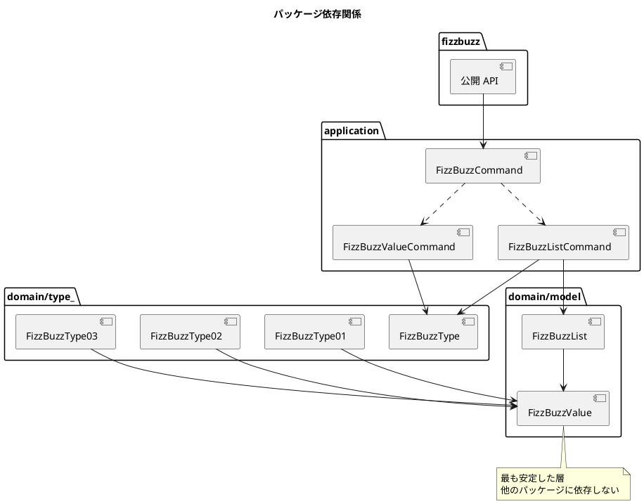
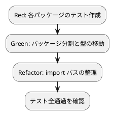

# 第 9 章: SOLID 原則とモジュール設計

## 9.1 SOLID 原則の検証

第 7-8 章で構築した設計が SOLID 原則に沿っているか検証します。

### 単一責任原則（SRP）

> クラスが変更される理由は 1 つだけであるべきだ

| 構造体 / インターフェース | 責務 |
|--------------------------|------|
| `FizzBuzzValue` | FizzBuzz の結果値を保持 |
| `FizzBuzzList` | FizzBuzzValue のコレクション管理 |
| `FizzBuzzType01` | タイプ 1 のルールで生成 |
| `FizzBuzzType02` | タイプ 2 のルールで生成 |
| `FizzBuzzType03` | タイプ 3 のルールで生成 |
| `FizzBuzzValueCommand` | 単一値の生成操作 |
| `FizzBuzzListCommand` | リストの生成操作 |

各構造体が 1 つの責務のみを担っており、SRP を満たしています。

### 開放閉鎖原則（OCP）

> ソフトウェアの実体は拡張に対して開いていて、修正に対して閉じているべきだ

新しいタイプ（例: タイプ 4）を追加する場合:

```go
// 既存コードを変更せず、新しい構造体を追加するだけ
type FizzBuzzType04 struct {
    fizzBuzzTypeBase
}

func (f FizzBuzzType04) Generate(number int) FizzBuzzValue {
    // 新しいルールを実装
    return NewFizzBuzzValue(number, strconv.Itoa(number))
}
```

`FizzBuzzType` インターフェースを満たす構造体を追加するだけで、既存のコードを変更する必要がありません（ファクトリ関数 `NewFizzBuzzType` の修正は必要）。

### リスコフの置換原則（LSP）

> サブタイプはそのベースタイプと置換可能でなければならない

```go
// どのタイプでも FizzBuzzType として使用可能
func processType(fbt FizzBuzzType, number int) FizzBuzzValue {
    return fbt.Generate(number)
}

// Type01, 02, 03 のいずれを渡しても正しく動作する
processType(FizzBuzzType01{}, 15) // "FizzBuzz"
processType(FizzBuzzType02{}, 15) // "15"
processType(FizzBuzzType03{}, 15) // "FizzBuzz"
```

Go のインターフェースは暗黙的実装のため、メソッドシグネチャが一致すれば自動的に LSP を満たします。

### インターフェース分離原則（ISP）

> クライアントが使用しないメソッドに依存させてはならない

```go
// FizzBuzzType は Generate のみを要求する最小限のインターフェース
type FizzBuzzType interface {
    Generate(number int) FizzBuzzValue
}

// FizzBuzzCommand は Execute のみを要求する最小限のインターフェース
type FizzBuzzCommand interface {
    Execute() interface{}
}
```

各インターフェースは 1 つのメソッドのみを定義しており、ISP を満たしています。Go では 1-2 メソッドのインターフェースが推奨されます。

### 依存関係逆転原則（DIP）

> 上位モジュールは下位モジュールに依存してはならない。両方とも抽象に依存すべきだ

```go
// FizzBuzzValueCommand は具体型ではなくインターフェースに依存
type FizzBuzzValueCommand struct {
    number       int
    fizzBuzzType FizzBuzzType  // インターフェースに依存
}
```

コマンドは `FizzBuzzType` インターフェースに依存しており、具体的な `FizzBuzzType01` 等には直接依存していません。

## 9.2 モジュール設計

単一ファイルに集約されたコードを、責務に基づいてパッケージ分割します。

### Before: 単一パッケージ

```
apps/go/
├── fizzbuzz/
│   ├── fizzbuzz.go          (全ての型・関数が 1 ファイル)
│   ├── fizzbuzz_test.go
│   └── learning_test.go
└── main.go
```

### After: 3 層パッケージ構成

```
apps/go/
├── main.go
├── fizzbuzz/
│   ├── fizzbuzz.go            (公開 API: Generate, GenerateList, Print)
│   ├── fizzbuzz_test.go       (統合テスト)
│   └── learning_test.go
├── domain/
│   ├── model/
│   │   ├── fizz_buzz_value.go       (値オブジェクト)
│   │   ├── fizz_buzz_value_test.go
│   │   ├── fizz_buzz_list.go        (ファーストクラスコレクション)
│   │   └── fizz_buzz_list_test.go
│   └── type_/
│       ├── fizz_buzz_type.go        (インターフェース + ファクトリ)
│       ├── fizz_buzz_type_01.go     (タイプ 1)
│       ├── fizz_buzz_type_02.go     (タイプ 2)
│       ├── fizz_buzz_type_03.go     (タイプ 3)
│       └── fizz_buzz_type_test.go
└── application/
    ├── fizz_buzz_command.go          (コマンドインターフェース)
    ├── fizz_buzz_value_command.go    (単一値コマンド)
    ├── fizz_buzz_list_command.go     (リストコマンド)
    └── fizz_buzz_command_test.go
```

**注**: Go の予約語 `type` との衝突を避けるため、パッケージ名は `type_` とします。

### パッケージ依存関係



**依存方向のルール**:

- `domain/model` → 他のパッケージに依存しない（最も安定）
- `domain/type_` → `domain/model` のみに依存
- `application` → `domain/type_` と `domain/model` に依存
- `fizzbuzz` → `application` に依存（公開 API として統合）

### Go パッケージの循環インポート禁止

Go ではパッケージ間の循環インポートがコンパイルエラーになります。依存方向を一方向に保つことが重要です。

```
❌ application → domain/type_ → application（循環）
✅ application → domain/type_ → domain/model（一方向）
```

## 9.3 パッケージ分割の実装

### domain/model パッケージ

```go
// domain/model/fizz_buzz_value.go
package model

// FizzBuzzValue は FizzBuzz の結果を表す値オブジェクトです。
type FizzBuzzValue struct {
    number int
    value  string
}

func NewFizzBuzzValue(number int, value string) FizzBuzzValue {
    if number < 0 {
        panic("値は正の値のみ許可します")
    }
    return FizzBuzzValue{number: number, value: value}
}

func (v FizzBuzzValue) Number() int    { return v.number }
func (v FizzBuzzValue) Value() string  { return v.value }
func (v FizzBuzzValue) String() string { return v.value }

func (v FizzBuzzValue) Equal(other FizzBuzzValue) bool {
    return v.number == other.number && v.value == other.value
}
```

### domain/type_ パッケージ

```go
// domain/type_/fizz_buzz_type.go
package type_

import (
    "github.com/k2works/getting-started-tdd/apps/go/domain/model"
)

// FizzBuzzType は FizzBuzz 生成のインターフェースです。
type FizzBuzzType interface {
    Generate(number int) model.FizzBuzzValue
}

// NewFizzBuzzType は指定されたタイプの FizzBuzzType を生成します。
func NewFizzBuzzType(fizzBuzzType int) FizzBuzzType {
    switch fizzBuzzType {
    case 1:
        return FizzBuzzType01{}
    case 2:
        return FizzBuzzType02{}
    case 3:
        return FizzBuzzType03{}
    default:
        panic("該当するタイプは存在しません")
    }
}
```

### application パッケージ

```go
// application/fizz_buzz_command.go
package application

// FizzBuzzCommand は FizzBuzz 操作のインターフェースです。
type FizzBuzzCommand interface {
    Execute() interface{}
}
```

```go
// application/fizz_buzz_list_command.go
package application

import (
    "github.com/k2works/getting-started-tdd/apps/go/domain/model"
    type_ "github.com/k2works/getting-started-tdd/apps/go/domain/type_"
)

// FizzBuzzListCommand は FizzBuzzList を生成するコマンドです。
type FizzBuzzListCommand struct {
    count        int
    fizzBuzzType type_.FizzBuzzType
}

func NewFizzBuzzListCommand(fizzBuzzType type_.FizzBuzzType, count int) *FizzBuzzListCommand {
    return &FizzBuzzListCommand{count: count, fizzBuzzType: fizzBuzzType}
}

func (c *FizzBuzzListCommand) Execute() interface{} {
    values := make([]model.FizzBuzzValue, c.count)
    for i := 0; i < c.count; i++ {
        values[i] = c.fizzBuzzType.Generate(i + 1)
    }
    return model.NewFizzBuzzList(values)
}
```

## 9.4 テスト構成

テストもパッケージに対応させます。

### domain/model のテスト

```go
// domain/model/fizz_buzz_value_test.go
package model

import "testing"

func TestNewFizzBuzzValue_正の値で生成できる(t *testing.T) {
    v := NewFizzBuzzValue(1, "1")
    if v.Number() != 1 {
        t.Fatalf("Number() = %d, want %d", v.Number(), 1)
    }
}

func TestNewFizzBuzzValue_負の値でパニックする(t *testing.T) {
    defer func() {
        if r := recover(); r == nil {
            t.Fatal("should panic for negative number")
        }
    }()
    NewFizzBuzzValue(-1, "-1")
}
```

### domain/type_ のテスト

```go
// domain/type_/fizz_buzz_type_test.go
package type_

import "testing"

func TestFizzBuzzType01_Generate_3の倍数でFizzを返す(t *testing.T) {
    fbt := FizzBuzzType01{}
    got := fbt.Generate(3)
    if got.Value() != "Fizz" {
        t.Fatalf("Generate(3).Value() = %q, want %q", got.Value(), "Fizz")
    }
}

func TestNewFizzBuzzType_不正なタイプでパニックする(t *testing.T) {
    defer func() {
        if r := recover(); r == nil {
            t.Fatal("should panic for invalid type")
        }
    }()
    NewFizzBuzzType(99)
}
```

## 9.5 言語間比較

| 概念 | Go | Ruby | Java | TypeScript |
|------|-----|------|------|-----------|
| モジュール単位 | パッケージ | モジュール / クラス | パッケージ / クラス | モジュール（ES Modules） |
| 公開制御 | 大文字/小文字 | `public` / `private` | アクセス修飾子 | `export` |
| バレルファイル | 同一パッケージ | `require_relative` 集約 | なし（パッケージ） | `index.ts` で `export` |
| 名前空間 | パッケージパス | `Module::Class` | `package.Class` | ファイル + `import` |
| 循環依存 | コンパイルエラー | 警告 | コンパイルエラー | 実行時エラー |

## 9.6 まとめ

第 9 章で達成したこと:

- [x] SOLID 原則の検証（5 原則すべて確認）
- [x] パッケージ分割（domain/model, domain/type_, application）
- [x] 依存方向の一方向化（循環インポート回避）
- [x] テストのパッケージ対応

### Before / After

| 項目 | Before（第 2 部終了時） | After（第 3 部終了時） |
|------|------------------------|----------------------|
| ファイル数 | 4 ファイル | 15+ ファイル |
| パッケージ数 | 1（fizzbuzz） | 4（fizzbuzz, domain/model, domain/type_, application） |
| デザインパターン | なし | Strategy, Value Object, First-Class Collection, Command, Factory Method |
| テスト数 | 11 テスト | 30+ テスト |

### TDD サイクルの実践



### 第 3 部で学んだ Go の設計原則

1. **インターフェースは小さく**: 1-2 メソッドが理想
2. **コンポジション > 継承**: 構造体埋め込みで共通ロジックを共有
3. **依存は一方向に**: パッケージ循環インポートの禁止を活用
4. **大文字/小文字でアクセス制御**: シンプルだが強力なカプセル化
