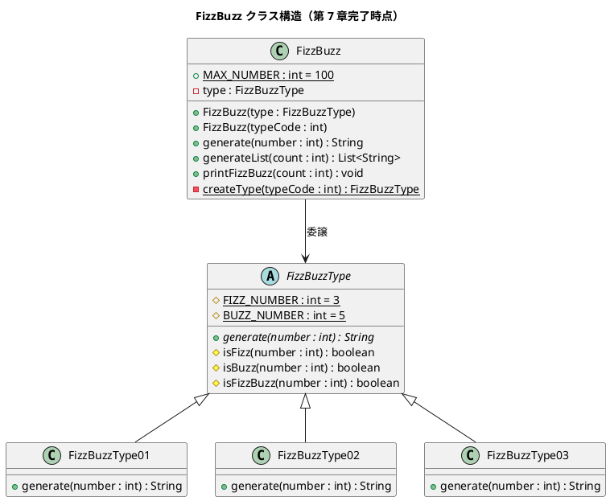

# 第 7 章: カプセル化とポリモーフィズム

## 7.1 はじめに

第 1 部〜第 2 部で FizzBuzz を題材に TDD の基本サイクルと開発環境を整えました。ここからは FizzBuzz に **追加仕様** を導入し、手続き的なコードからオブジェクト指向設計へとリファクタリングしていきます。

この章では、オブジェクト指向の 2 つの柱である **カプセル化** と **ポリモーフィズム** を学びます。

## 7.2 追加仕様

これまでの FizzBuzz には 1 つの変換ルールしかありませんでした。ここで新しい要件が追加されます。

> FizzBuzz のルールに **タイプ** の概念を追加する。
>
> - **タイプ 1**（従来の FizzBuzz）: 3 の倍数→Fizz、5 の倍数→Buzz、15 の倍数→FizzBuzz
> - **タイプ 2**（数値のみ）: すべての数値をそのまま返す（Fizz/Buzz 変換なし）
> - **タイプ 3**（FizzBuzz のみ）: 15 の倍数→FizzBuzz、それ以外は数値をそのまま返す
> - それ以外のタイプは例外をスローする

### TODO リスト

- [x] ~~1 を渡したら文字列 "1" を返す~~
- [x] ~~3 の倍数のときは "Fizz" を返す~~
- [x] ~~5 の倍数のときは "Buzz" を返す~~
- [x] ~~15 の倍数のときは "FizzBuzz" を返す~~
- [x] ~~1 から 100 まで出力する~~
- [ ] タイプ 1: 従来の FizzBuzz ルール
- [ ] タイプ 2: 数値のみ返す
- [ ] タイプ 3: 15 の倍数のみ FizzBuzz を返す
- [ ] 不正なタイプで例外をスローする

## 7.3 手続き的アプローチ

### テストの再構成

まず、既存のテストをタイプ別に構造化します。JUnit 5 の `@Nested` を使ってテストを階層化します。

```java
import org.junit.jupiter.api.Nested;

class FizzBuzzTest {

    @Nested
    class タイプ1の場合 {
        private FizzBuzz fizzbuzz;

        @BeforeEach
        void setUp() {
            fizzbuzz = new FizzBuzz(1);
        }

        @Nested
        class 三と五の倍数の場合 {
            @Test
            void test_15を渡したら文字列FizzBuzzを返す() {
                assertEquals("FizzBuzz", fizzbuzz.generate(15));
            }
        }

        @Nested
        class 三の倍数の場合 {
            @Test
            void test_3を渡したら文字列Fizzを返す() {
                assertEquals("Fizz", fizzbuzz.generate(3));
            }
        }

        @Nested
        class 五の倍数の場合 {
            @Test
            void test_5を渡したら文字列Buzzを返す() {
                assertEquals("Buzz", fizzbuzz.generate(5));
            }
        }

        @Nested
        class その他の場合 {
            @Test
            void test_1を渡したら文字列1を返す() {
                assertEquals("1", fizzbuzz.generate(1));
            }

            @Test
            void test_2を渡したら文字列2を返す() {
                assertEquals("2", fizzbuzz.generate(2));
            }
        }
    }
}
```

### タイプ 2 のテスト追加（Red）

タイプ 2（数値のみ返す）のテストを追加します。

```java
@Nested
class タイプ2の場合 {
    private FizzBuzz fizzbuzz;

    @BeforeEach
    void setUp() {
        fizzbuzz = new FizzBuzz(2);
    }

    @Test
    void test_3を渡したら文字列3を返す() {
        assertEquals("3", fizzbuzz.generate(3));
    }

    @Test
    void test_5を渡したら文字列5を返す() {
        assertEquals("5", fizzbuzz.generate(5));
    }

    @Test
    void test_15を渡したら文字列15を返す() {
        assertEquals("15", fizzbuzz.generate(15));
    }

    @Test
    void test_1を渡したら文字列1を返す() {
        assertEquals("1", fizzbuzz.generate(1));
    }
}
```

### タイプ 3 のテスト追加（Red）

タイプ 3（15 の倍数のみ FizzBuzz）のテストを追加します。

```java
@Nested
class タイプ3の場合 {
    private FizzBuzz fizzbuzz;

    @BeforeEach
    void setUp() {
        fizzbuzz = new FizzBuzz(3);
    }

    @Test
    void test_3を渡したら文字列3を返す() {
        assertEquals("3", fizzbuzz.generate(3));
    }

    @Test
    void test_5を渡したら文字列5を返す() {
        assertEquals("5", fizzbuzz.generate(5));
    }

    @Test
    void test_15を渡したら文字列FizzBuzzを返す() {
        assertEquals("FizzBuzz", fizzbuzz.generate(15));
    }

    @Test
    void test_1を渡したら文字列1を返す() {
        assertEquals("1", fizzbuzz.generate(1));
    }
}
```

### 不正なタイプのテスト追加（Red）

存在しないタイプを指定した場合のテストも追加します。

```java
@Nested
class それ以外のタイプの場合 {
    @Test
    void test_存在しないタイプを指定したら例外が発生する() {
        assertThrows(IllegalArgumentException.class, () -> {
            new FizzBuzz(4);
        });
    }
}
```

### 手続き的な実装（Green）

テストを通すために、`FizzBuzz` クラスにタイプを追加します。

```java
public class FizzBuzz {

    private static final int FIZZ_NUMBER = 3;
    private static final int BUZZ_NUMBER = 5;
    private int type;

    public FizzBuzz(int type) {
        if (type < 1 || type > 3) {
            throw new IllegalArgumentException("該当するタイプは存在しません");
        }
        this.type = type;
    }

    public String generate(int number) {
        switch (type) {
            case 1:
                if (number % FIZZ_NUMBER == 0 && number % BUZZ_NUMBER == 0) {
                    return "FizzBuzz";
                } else if (number % FIZZ_NUMBER == 0) {
                    return "Fizz";
                } else if (number % BUZZ_NUMBER == 0) {
                    return "Buzz";
                }
                return String.valueOf(number);
            case 2:
                return String.valueOf(number);
            case 3:
                if (number % FIZZ_NUMBER == 0 && number % BUZZ_NUMBER == 0) {
                    return "FizzBuzz";
                }
                return String.valueOf(number);
            default:
                throw new IllegalArgumentException("該当するタイプは存在しません");
        }
    }
}
```

これでテストは通りますが、問題が見えてきます。

### 手続き的アプローチの問題点

1. **`switch` 文の肥大化**: タイプが増えるたびに `switch` のケースが増える
2. **変更の影響範囲**: 1 つのタイプを変更すると、他のタイプに影響する可能性がある
3. **テストの困難さ**: タイプごとのロジックが 1 つのメソッドに混在している
4. **開放閉鎖原則違反**: 新しいタイプを追加するには既存コードを変更する必要がある

## 7.4 カプセル化

リファクタリングの第一歩として、**カプセル化** を強化します。

### フィールドの不変化

`type` フィールドに `final` を付けて、一度設定したら変更できないようにします。

```java
public class FizzBuzz {
    private static final int FIZZ_NUMBER = 3;
    private static final int BUZZ_NUMBER = 5;
    private final int type;  // final を追加

    public FizzBuzz(int type) {
        if (type < 1 || type > 3) {
            throw new IllegalArgumentException("該当するタイプは存在しません");
        }
        this.type = type;
    }
    // ...
}
```

### カプセル化のポイント

| 手法 | 目的 |
|------|------|
| `private` フィールド | 外部から直接アクセスを防ぐ |
| `final` フィールド | 一度設定した値の変更を防ぐ |
| setter の排除 | オブジェクトの状態変更を防ぐ |
| コンストラクタでのバリデーション | 不正な状態のオブジェクト生成を防ぐ |

カプセル化により、オブジェクトは **不正な状態になることがない** ことが保証されます。

## 7.5 ポリモーフィズム

次に、`switch` 文を **ポリモーフィズム** で置き換えます。

### FizzBuzzType 抽象クラスの抽出

各タイプの FizzBuzz ロジックを個別のクラスに分離します。まず、共通の親クラスを作成します。

```java
public abstract class FizzBuzzType {

    protected static final int FIZZ_NUMBER = 3;
    protected static final int BUZZ_NUMBER = 5;

    public abstract String generate(int number);

    protected boolean isFizz(int number) {
        return number % FIZZ_NUMBER == 0;
    }

    protected boolean isBuzz(int number) {
        return number % BUZZ_NUMBER == 0;
    }

    protected boolean isFizzBuzz(int number) {
        return isFizz(number) && isBuzz(number);
    }
}
```

### ポイント

- `abstract` クラスにすることで、直接インスタンス化を防ぐ
- `protected` メソッド（`isFizz`、`isBuzz`、`isFizzBuzz`）で共通ロジックを提供
- 各サブクラスは `generate` メソッドだけをオーバーライドすれば良い

### タイプ別クラスの作成

#### タイプ 1: 標準 FizzBuzz

```java
public class FizzBuzzType01 extends FizzBuzzType {
    @Override
    public String generate(int number) {
        if (isFizzBuzz(number)) {
            return "FizzBuzz";
        }
        if (isFizz(number)) {
            return "Fizz";
        }
        if (isBuzz(number)) {
            return "Buzz";
        }
        return String.valueOf(number);
    }
}
```

#### タイプ 2: 数値のみ

```java
public class FizzBuzzType02 extends FizzBuzzType {
    @Override
    public String generate(int number) {
        return String.valueOf(number);
    }
}
```

#### タイプ 3: FizzBuzz のみ

```java
public class FizzBuzzType03 extends FizzBuzzType {
    @Override
    public String generate(int number) {
        if (isFizzBuzz(number)) {
            return "FizzBuzz";
        }
        return String.valueOf(number);
    }
}
```

### FizzBuzz クラスの修正

`FizzBuzz` クラスは `FizzBuzzType` に **委譲** するようにリファクタリングします。`final` クラスにすることで継承を防ぎ、タイプコードの定数化でマジックナンバーを排除します。

```java
public final class FizzBuzz {
    public static final int MAX_NUMBER = 100;
    private static final int TYPE_CODE_01 = 1;
    private static final int TYPE_CODE_02 = 2;
    private static final int TYPE_CODE_03 = 3;
    private final FizzBuzzType type;

    public FizzBuzz(FizzBuzzType type) {
        this.type = type;
    }

    public FizzBuzz(int typeCode) {
        this.type = createType(typeCode);
    }

    private static FizzBuzzType createType(int typeCode) {
        switch (typeCode) {
            case TYPE_CODE_01:
                return new FizzBuzzType01();
            case TYPE_CODE_02:
                return new FizzBuzzType02();
            case TYPE_CODE_03:
                return new FizzBuzzType03();
            default:
                throw new IllegalArgumentException(
                    "該当するタイプは存在しません");
        }
    }

    public String generate(int number) {
        return type.generate(number);
    }

    public List<String> generateList(int count) {
        List<String> result = new ArrayList<>();
        for (int i = 1; i <= count; i++) {
            result.add(generate(i));
        }
        return result;
    }

    public void printFizzBuzz(int count) {
        List<String> result = generateList(count);
        for (String value : result) {
            System.out.println(value);
        }
    }
}
```

### ポリモーフィズムによる改善

| 問題（Before） | 解決（After） |
|---------------|-------------|
| `switch` 文が肥大化する | 各タイプが独立したクラス |
| タイプ追加で既存コードを変更 | 新クラスを追加するだけ |
| テストが複雑になる | タイプ別に独立したテスト |
| ロジックが 1 箇所に集中 | 責務が適切に分散 |

## 7.6 テストの更新

テストもポリモーフィズムに合わせて更新します。`FizzBuzz` のコンストラクタにタイプコード（整数）を渡すインターフェースは維持しつつ、内部的には `FizzBuzzType` が使われます。

```java
class FizzBuzzTest {

    @Nested
    class タイプ1の場合 {
        private FizzBuzz fizzbuzz;

        @BeforeEach
        void setUp() {
            fizzbuzz = new FizzBuzz(1);
        }

        @Nested
        class 三と五の倍数の場合 {
            @Test
            void test_15を渡したら文字列FizzBuzzを返す() {
                assertEquals("FizzBuzz", fizzbuzz.generate(15));
            }
        }

        @Nested
        class 三の倍数の場合 {
            @Test
            void test_3を渡したら文字列Fizzを返す() {
                assertEquals("Fizz", fizzbuzz.generate(3));
            }
        }

        @Nested
        class 五の倍数の場合 {
            @Test
            void test_5を渡したら文字列Buzzを返す() {
                assertEquals("Buzz", fizzbuzz.generate(5));
            }
        }

        @Nested
        class その他の場合 {
            @Test
            void test_1を渡したら文字列1を返す() {
                assertEquals("1", fizzbuzz.generate(1));
            }

            @Test
            void test_2を渡したら文字列2を返す() {
                assertEquals("2", fizzbuzz.generate(2));
            }
        }

        @Test
        void test_1から100までのFizzBuzzを生成する() {
            List<String> result = fizzbuzz.generateList(100);
            assertEquals(100, result.size());
            assertEquals("1", result.get(0));
            assertEquals("Fizz", result.get(2));
            assertEquals("Buzz", result.get(4));
            assertEquals("FizzBuzz", result.get(14));
        }
    }

    @Nested
    class タイプ2の場合 {
        private FizzBuzz fizzbuzz;

        @BeforeEach
        void setUp() {
            fizzbuzz = new FizzBuzz(2);
        }

        @Test
        void test_3を渡したら文字列3を返す() {
            assertEquals("3", fizzbuzz.generate(3));
        }

        @Test
        void test_5を渡したら文字列5を返す() {
            assertEquals("5", fizzbuzz.generate(5));
        }

        @Test
        void test_15を渡したら文字列15を返す() {
            assertEquals("15", fizzbuzz.generate(15));
        }

        @Test
        void test_1を渡したら文字列1を返す() {
            assertEquals("1", fizzbuzz.generate(1));
        }
    }

    @Nested
    class タイプ3の場合 {
        private FizzBuzz fizzbuzz;

        @BeforeEach
        void setUp() {
            fizzbuzz = new FizzBuzz(3);
        }

        @Test
        void test_3を渡したら文字列3を返す() {
            assertEquals("3", fizzbuzz.generate(3));
        }

        @Test
        void test_5を渡したら文字列5を返す() {
            assertEquals("5", fizzbuzz.generate(5));
        }

        @Test
        void test_15を渡したら文字列FizzBuzzを返す() {
            assertEquals("FizzBuzz", fizzbuzz.generate(15));
        }

        @Test
        void test_1を渡したら文字列1を返す() {
            assertEquals("1", fizzbuzz.generate(1));
        }
    }

    @Nested
    class それ以外のタイプの場合 {
        @Test
        void test_存在しないタイプを指定したら例外が発生する() {
            assertThrows(IllegalArgumentException.class, () -> {
                new FizzBuzz(4);
            });
        }
    }
}
```

## 7.7 クラス図

リファクタリング後のクラス構造を確認しましょう。



## 7.8 まとめ

この章では、追加仕様の導入をきっかけに以下を学びました。

| 概念 | 内容 |
|------|------|
| カプセル化 | `private` + `final` でオブジェクトの不変性を確保 |
| ポリモーフィズム | `switch` 文を継承 + オーバーライドで置換 |
| Strategy パターン | `FizzBuzzType` 階層で振る舞いを切り替え |
| 抽象クラス | 共通ロジック（`isFizz`、`isBuzz`、`isFizzBuzz`）を親に集約 |
| 委譲 | `FizzBuzz` が `FizzBuzzType` に処理を委譲 |

### Before → After

```
Before: 1 つの FizzBuzz クラスに switch 文で全ロジック
After:  FizzBuzzType 階層で各タイプが独立したクラス
```

### 更新後の TODO リスト

- [x] ~~1 を渡したら文字列 "1" を返す~~
- [x] ~~3 の倍数のときは "Fizz" を返す~~
- [x] ~~5 の倍数のときは "Buzz" を返す~~
- [x] ~~15 の倍数のときは "FizzBuzz" を返す~~
- [x] ~~1 から 100 まで出力する~~
- [x] ~~タイプ 1: 従来の FizzBuzz ルール~~
- [x] ~~タイプ 2: 数値のみ返す~~
- [x] ~~タイプ 3: 15 の倍数のみ FizzBuzz を返す~~
- [x] ~~不正なタイプで例外をスローする~~

次の第 8 章では、**デザインパターン** を適用してさらにコードの品質を高めていきます。
