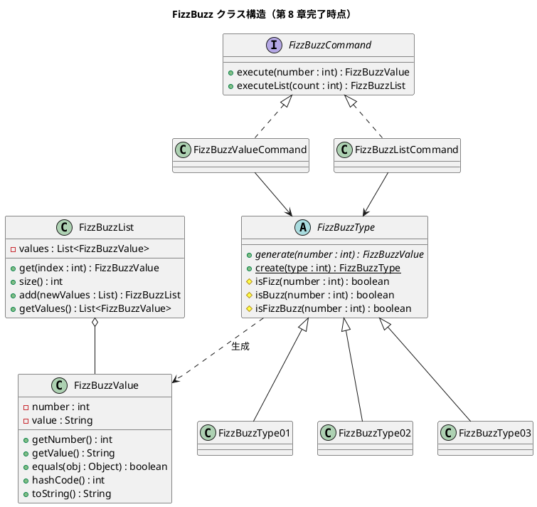

# 第 8 章: デザインパターンの適用

## 8.1 はじめに

前章ではカプセル化とポリモーフィズムを使って `switch` 文を排除し、タイプ別のクラス階層を構築しました。この章では、さらに **デザインパターン** を適用してコードの品質を高めていきます。

扱うパターンは以下の 5 つです。

| パターン | 目的 |
|---------|------|
| Value Object（値オブジェクト） | プリミティブ型を意味のあるオブジェクトに置換 |
| First-Class Collection（ファーストクラスコレクション） | コレクションをドメインオブジェクトでラップ |
| Factory Method（ファクトリメソッド） | オブジェクト生成ロジックを一箇所に集約 |
| Command（コマンド） | 操作をオブジェクトとしてカプセル化 |
| Null Object（ヌルオブジェクト） | null の代わりにデフォルト動作を提供 |

## 8.2 Value Object（値オブジェクト）

### 問題: プリミティブ型への執着

現在、`generate` メソッドは `String` を返しています。しかし FizzBuzz の結果には「元の数値」と「変換後の文字列」の 2 つの情報があります。`String` だけでは元の数値が失われてしまいます。

### 解決: FizzBuzzValue

数値と変換結果をペアにした **値オブジェクト** を作成します。

```java
import java.util.Objects;

public class FizzBuzzValue {
    private final int number;
    private final String value;

    public FizzBuzzValue(int number, String value) {
        this.number = number;
        this.value = value;
    }

    public int getNumber() {
        return number;
    }

    public String getValue() {
        return value;
    }

    @Override
    public String toString() {
        return number + ":" + value;
    }

    @Override
    public boolean equals(Object obj) {
        if (this == obj) {
            return true;
        }
        if (obj == null || getClass() != obj.getClass()) {
            return false;
        }
        FizzBuzzValue that = (FizzBuzzValue) obj;
        return number == that.number
            && Objects.equals(value, that.value);
    }

    @Override
    public int hashCode() {
        return Objects.hash(number, value);
    }
}
```

### Value Object の特徴

| 特徴 | 実装 |
|------|------|
| 不変（Immutable） | `final` フィールド、setter なし |
| 等価性（Equality） | `equals` / `hashCode` をオーバーライド |
| 自己記述的 | `toString` で意味のある表現 |

### FizzBuzzType の戻り値を変更

各タイプクラスの `generate` メソッドが `FizzBuzzValue` を返すように変更します。

```java
public abstract class FizzBuzzType {
    // ...
    public abstract FizzBuzzValue generate(int number);
}

public class FizzBuzzType01 extends FizzBuzzType {
    @Override
    public FizzBuzzValue generate(int number) {
        if (isFizzBuzz(number)) {
            return new FizzBuzzValue(number, "FizzBuzz");
        }
        if (isFizz(number)) {
            return new FizzBuzzValue(number, "Fizz");
        }
        if (isBuzz(number)) {
            return new FizzBuzzValue(number, "Buzz");
        }
        return new FizzBuzzValue(number, String.valueOf(number));
    }
}
```

## 8.3 First-Class Collection（ファーストクラスコレクション）

### 問題: 生の List

`generateList` は `List<String>` を返していますが、これではリストに対する操作（追加、検索など）がどこでも自由にできてしまいます。

### 解決: FizzBuzzList

コレクションを専用クラスでラップし、ドメインに必要な操作だけを公開します。

```java
import java.util.ArrayList;
import java.util.List;
import java.util.Objects;

public class FizzBuzzList {
    private final List<FizzBuzzValue> values;

    public FizzBuzzList(List<FizzBuzzValue> values) {
        this.values = new ArrayList<>(values);
    }

    public List<FizzBuzzValue> getValues() {
        return new ArrayList<>(values);
    }

    public FizzBuzzValue get(int index) {
        return values.get(index);
    }

    public int size() {
        return values.size();
    }

    public FizzBuzzList add(List<FizzBuzzValue> newValues) {
        List<FizzBuzzValue> combined = new ArrayList<>(values);
        combined.addAll(newValues);
        return new FizzBuzzList(combined);
    }

    @Override
    public String toString() {
        return values.toString();
    }

    @Override
    public boolean equals(Object obj) {
        if (this == obj) {
            return true;
        }
        if (obj == null || getClass() != obj.getClass()) {
            return false;
        }
        FizzBuzzList that = (FizzBuzzList) obj;
        return Objects.equals(values, that.values);
    }

    @Override
    public int hashCode() {
        return Objects.hash(values);
    }
}
```

### First-Class Collection の利点

- **防御的コピー**: コンストラクタと getter で `new ArrayList<>()` を使い、外部からの変更を防ぐ
- **不変操作**: `add` メソッドは新しい `FizzBuzzList` を返す（元のリストは変更しない）
- **ドメインロジックの集約**: リストに関する操作がこのクラスに集まる

## 8.4 Factory Method（ファクトリメソッド）

### 問題: 生成ロジックの分散

現在、`FizzBuzz` クラスの `createType` メソッドでタイプコードから `FizzBuzzType` を生成しています。しかし、タイプ生成のロジックは `FizzBuzzType` 自身が知るべき責務です。

### 解決: 静的ファクトリメソッド

`FizzBuzzType` に `create` メソッドを追加します。

```java
public abstract class FizzBuzzType {
    // ...

    public static FizzBuzzType create(int type) {
        switch (type) {
            case 1:
                return new FizzBuzzType01();
            case 2:
                return new FizzBuzzType02();
            case 3:
                return new FizzBuzzType03();
            default:
                throw new IllegalArgumentException(
                    "該当するタイプは存在しません");
        }
    }
}
```

`FizzBuzz` クラスは `FizzBuzzType.create()` を呼ぶだけになります。

```java
public FizzBuzz(int typeCode) {
    this.type = FizzBuzzType.create(typeCode);
}
```

## 8.5 Command パターン

### 問題: 操作の種類

FizzBuzz には「1 つの数値を変換する」操作と「リストを生成する」操作があります。これらの操作を **オブジェクト** として扱うことで、柔軟に切り替えられるようにします。

### 解決: FizzBuzzCommand

```java
import java.util.List;

public interface FizzBuzzCommand {
    FizzBuzzValue execute(int number);
    FizzBuzzList executeList(int count);
}
```

#### 単一値コマンド

```java
public class FizzBuzzValueCommand implements FizzBuzzCommand {
    private final FizzBuzzType type;

    public FizzBuzzValueCommand(FizzBuzzType type) {
        this.type = type;
    }

    @Override
    public FizzBuzzValue execute(int number) {
        return type.generate(number);
    }

    @Override
    public FizzBuzzList executeList(int count) {
        throw new UnsupportedOperationException();
    }
}
```

#### リスト生成コマンド

```java
import java.util.ArrayList;
import java.util.List;

public class FizzBuzzListCommand implements FizzBuzzCommand {
    private final FizzBuzzType type;

    public FizzBuzzListCommand(FizzBuzzType type) {
        this.type = type;
    }

    @Override
    public FizzBuzzValue execute(int number) {
        throw new UnsupportedOperationException();
    }

    @Override
    public FizzBuzzList executeList(int count) {
        List<FizzBuzzValue> values = new ArrayList<>();
        for (int i = 1; i <= count; i++) {
            values.add(type.generate(i));
        }
        return new FizzBuzzList(values);
    }
}
```

### Command パターンの利点

- **操作のカプセル化**: 実行する操作をオブジェクトとして渡せる
- **柔軟な組み合わせ**: タイプとコマンドを自由に組み合わせ可能
- **責務の分離**: 「何を変換するか」（Type）と「どう実行するか」（Command）が分離

## 8.6 Null Object パターン

### 問題: 不正なタイプの処理

現在、不正なタイプコードを指定すると `IllegalArgumentException` がスローされます。例外を投げる代わりに、**安全なデフォルト動作** を提供するアプローチもあります。

### 解決: FizzBuzzTypeNotDefined

```java
public class FizzBuzzTypeNotDefined extends FizzBuzzType {
    @Override
    public FizzBuzzValue generate(int number) {
        return new FizzBuzzValue(number, String.valueOf(number));
    }
}
```

`create` メソッドで例外の代わりに `FizzBuzzTypeNotDefined` を返すこともできます。

```java
public static FizzBuzzType create(int type) {
    switch (type) {
        case 1:
            return new FizzBuzzType01();
        case 2:
            return new FizzBuzzType02();
        case 3:
            return new FizzBuzzType03();
        default:
            return new FizzBuzzTypeNotDefined();
    }
}
```

> **注**: 本プロジェクトでは不正なタイプを早期に検出するため、例外スローを維持します。Null Object パターンは「例外よりも安全なデフォルト動作が適切な場合」に使用します。

## 8.7 リファクタリング後のクラス構造



## 8.8 まとめ

この章では 5 つのデザインパターンを適用しました。

| パターン | クラス | 効果 |
|---------|--------|------|
| Value Object | `FizzBuzzValue` | プリミティブ型への執着を排除 |
| First-Class Collection | `FizzBuzzList` | コレクション操作をドメインに集約 |
| Factory Method | `FizzBuzzType.create()` | 生成ロジックを一箇所に集約 |
| Command | `FizzBuzzCommand` 階層 | 操作をオブジェクトとしてカプセル化 |
| Null Object | `FizzBuzzTypeNotDefined` | null/例外の代わりに安全なデフォルト |

### リファクタリングの原則

> **プリミティブ型への執着**（Primitive Obsession）を避け、ドメインの概念をオブジェクトで表現する。

次の第 9 章では、SOLID 原則に基づいてモジュール設計を行い、パッケージ構造を整理します。
