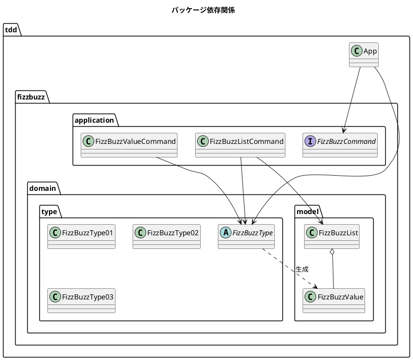

# 第 9 章: SOLID 原則とモジュール設計

## 9.1 はじめに

前章までで、FizzBuzz のコードはデザインパターンを適用して大きく改善されました。しかし、すべてのクラスが `tdd.fizzbuzz` という 1 つのパッケージに詰め込まれています。

この章では、**SOLID 原則** を確認しながら、クラスを適切なパッケージに分割する **モジュール設計** を行います。

## 9.2 SOLID 原則の確認

FizzBuzz のコードが SOLID 原則にどの程度準拠しているか確認しましょう。

### 単一責任原則（SRP: Single Responsibility Principle）

> クラスを変更する理由は 1 つだけであるべき。

| クラス | 責務 | 変更理由 | SRP 準拠 |
|--------|------|---------|---------|
| `FizzBuzzType01` | タイプ 1 の変換ルール | タイプ 1 のルール変更時 | OK |
| `FizzBuzzType02` | タイプ 2 の変換ルール | タイプ 2 のルール変更時 | OK |
| `FizzBuzzType03` | タイプ 3 の変換ルール | タイプ 3 のルール変更時 | OK |
| `FizzBuzzValue` | 値の保持と等価性 | 値の表現が変わるとき | OK |
| `FizzBuzzList` | コレクション操作 | コレクション操作が変わるとき | OK |
| `FizzBuzzValueCommand` | 単一値変換の実行 | 実行方法が変わるとき | OK |
| `FizzBuzzListCommand` | リスト生成の実行 | 実行方法が変わるとき | OK |

ポリモーフィズムとデザインパターンの適用により、各クラスが単一の責務を持つようになっています。

### 開放閉鎖原則（OCP: Open-Closed Principle）

> 拡張に対して開いていて、修正に対して閉じているべき。

新しいタイプ（例: タイプ 4）を追加する場合を考えてみましょう。

```java
// タイプ 4 を追加するのに必要な変更
// 1. 新しいクラスを追加（既存コードの修正なし）
public class FizzBuzzType04 extends FizzBuzzType {
    @Override
    public FizzBuzzValue generate(int number) {
        // タイプ 4 のルール
        return new FizzBuzzValue(number, String.valueOf(number));
    }
}

// 2. ファクトリメソッドに 1 行追加（最小限の修正）
case 4: return new FizzBuzzType04();
```

`FizzBuzzType` 階層は拡張に対して開いています。新しいタイプを追加しても、既存のタイプクラスや `FizzBuzzCommand` を修正する必要はありません。

### 依存性逆転原則（DIP: Dependency Inversion Principle）

> 上位モジュールは下位モジュールに依存すべきではない。どちらも抽象に依存すべき。

```
FizzBuzz → FizzBuzzType（抽象）← FizzBuzzType01, 02, 03
FizzBuzzCommand（抽象）← FizzBuzzValueCommand, FizzBuzzListCommand
```

`FizzBuzz` クラスは具体的な `FizzBuzzType01` ではなく、抽象的な `FizzBuzzType` に依存しています。

## 9.3 パッケージ設計

### 現在の問題

すべてのクラスが `tdd.fizzbuzz` に入っています。

```
tdd.fizzbuzz/
├── FizzBuzz.java
├── FizzBuzzType.java
├── FizzBuzzType01.java
├── FizzBuzzType02.java
├── FizzBuzzType03.java
├── FizzBuzzValue.java
├── FizzBuzzList.java
├── FizzBuzzCommand.java
├── FizzBuzzValueCommand.java
├── FizzBuzzListCommand.java
└── Main.java
```

クラスが増えるにつれて、どのクラスがどの責務を持つかが分かりにくくなります。

### パッケージ分割

責務に基づいてパッケージを分割します。

```
tdd/
├── App.java                         # エントリポイント
└── fizzbuzz/
    ├── domain/
    │   ├── type/
    │   │   ├── FizzBuzzType.java     # 抽象タイプ + Factory
    │   │   ├── FizzBuzzType01.java   # タイプ 1
    │   │   ├── FizzBuzzType02.java   # タイプ 2
    │   │   └── FizzBuzzType03.java   # タイプ 3
    │   └── model/
    │       ├── FizzBuzzValue.java    # 値オブジェクト
    │       └── FizzBuzzList.java     # コレクション
    └── application/
        ├── FizzBuzzCommand.java      # コマンドインターフェース
        ├── FizzBuzzValueCommand.java # 単一値コマンド
        └── FizzBuzzListCommand.java  # リストコマンド
```

### パッケージの責務

| パッケージ | 責務 | 含まれるクラス |
|-----------|------|--------------|
| `tdd.fizzbuzz.domain.type` | 変換ルール（ビジネスロジック） | `FizzBuzzType` 階層 |
| `tdd.fizzbuzz.domain.model` | ドメインモデル（値・コレクション） | `FizzBuzzValue`, `FizzBuzzList` |
| `tdd.fizzbuzz.application` | アプリケーション層（操作の実行） | `FizzBuzzCommand` 階層 |

### 依存関係



`application` パッケージは `domain` に依存しますが、`domain` は `application` に依存しません。これにより、ビジネスロジックがアプリケーション層から独立して変更・テストできます。

## 9.4 エントリポイントの更新

パッケージ分割後の `App.java` です。

```java
package tdd;

import tdd.fizzbuzz.application.FizzBuzzListCommand;
import tdd.fizzbuzz.application.FizzBuzzValueCommand;
import tdd.fizzbuzz.domain.model.FizzBuzzList;
import tdd.fizzbuzz.domain.model.FizzBuzzValue;
import tdd.fizzbuzz.domain.type.FizzBuzzType;

public class App {
    private static final int MAX_NUMBER = 100;

    public static void main(String[] args) {
        FizzBuzzType type = FizzBuzzType.create(1);

        // 単一値の取得
        FizzBuzzValueCommand valueCommand
            = new FizzBuzzValueCommand(type);
        FizzBuzzValue value = valueCommand.execute(15);
        System.out.println(value);

        // リストの生成
        FizzBuzzListCommand listCommand
            = new FizzBuzzListCommand(type);
        FizzBuzzList list = listCommand.executeList(MAX_NUMBER);
        for (FizzBuzzValue item : list.getValues()) {
            System.out.println(item.getValue());
        }
    }
}
```

## 9.5 テストの更新

テストもパッケージ構造に合わせて再配置します。

```
src/test/java/tdd/fizzbuzz/
├── domain/
│   ├── type/
│   │   └── FizzBuzzTypeTest.java    # タイプ別テスト
│   └── model/
│       ├── FizzBuzzValueTest.java   # 値オブジェクトテスト
│       └── FizzBuzzListTest.java    # コレクションテスト
└── application/
    └── FizzBuzzCommandTest.java     # コマンドテスト
```

### FizzBuzzTypeTest（タイプ別テスト）

```java
package tdd.fizzbuzz.domain.type;

import org.junit.jupiter.api.Nested;
import org.junit.jupiter.api.Test;

import static org.junit.jupiter.api.Assertions.*;

class FizzBuzzTypeTest {

    @Nested
    class タイプ1の場合 {
        private final FizzBuzzType type = FizzBuzzType.create(1);

        @Test
        void 三と五の倍数でFizzBuzzを返す() {
            assertEquals("FizzBuzz", type.generate(15).getValue());
        }

        @Test
        void 三の倍数でFizzを返す() {
            assertEquals("Fizz", type.generate(3).getValue());
        }

        @Test
        void 五の倍数でBuzzを返す() {
            assertEquals("Buzz", type.generate(5).getValue());
        }

        @Test
        void その他は数値を返す() {
            assertEquals("1", type.generate(1).getValue());
        }
    }

    @Nested
    class タイプ2の場合 {
        private final FizzBuzzType type = FizzBuzzType.create(2);

        @Test
        void 常に数値を返す() {
            assertEquals("3", type.generate(3).getValue());
            assertEquals("5", type.generate(5).getValue());
            assertEquals("15", type.generate(15).getValue());
        }
    }

    @Nested
    class タイプ3の場合 {
        private final FizzBuzzType type = FizzBuzzType.create(3);

        @Test
        void 十五の倍数のみFizzBuzzを返す() {
            assertEquals("FizzBuzz", type.generate(15).getValue());
            assertEquals("3", type.generate(3).getValue());
            assertEquals("5", type.generate(5).getValue());
        }
    }

    @Nested
    class 不正なタイプの場合 {
        @Test
        void 例外をスローする() {
            assertThrows(IllegalArgumentException.class,
                () -> FizzBuzzType.create(4));
        }
    }
}
```

## 9.6 まとめ

この章では SOLID 原則を確認しながらモジュール設計を行いました。

| 概念 | 適用 |
|------|------|
| 単一責任原則（SRP） | 各クラスが 1 つの責務を持つ |
| 開放閉鎖原則（OCP） | 新タイプ追加で既存コード変更不要 |
| 依存性逆転原則（DIP） | 抽象への依存で結合度を低減 |
| パッケージ分割 | `domain`（ビジネスロジック）と `application`（操作）の分離 |

### 第 3 部の振り返り

第 3 部（第 7〜9 章）を通じて、手続き的な FizzBuzz をオブジェクト指向設計に変換しました。

| 章 | テーマ | 学んだこと |
|----|--------|-----------
| 7 | カプセル化とポリモーフィズム | `private` / `final`、Strategy パターン、抽象クラス |
| 8 | デザインパターンの適用 | Value Object、First-Class Collection、Command、Factory Method |
| 9 | SOLID 原則とモジュール設計 | SRP / OCP / DIP、パッケージ分割、ドメインモデル |

```
Before: 1 つのクラスに全ロジック（手続き型）
After:  責務ごとにパッケージ分割された OOP 設計
```

次の第 4 部では、Java の関数型プログラミング機能（Stream API、Optional、Lambda）を使って、さらにコードを発展させます。
