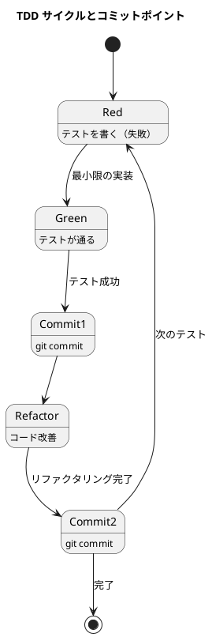

# 第 4 章: バージョン管理と Conventional Commits

## 4.1 はじめに

前章までで、TDD の基本サイクルを通じて FizzBuzz プログラムを完成させました。この章からは「動作するきれいなコード」を書き続けるために必要な **ソフトウェア開発の三種の神器** を整備していきます。

> 今日のソフトウェア開発の世界において絶対になければならない 3 つの技術的な柱があります。三本柱と言ったり、三種の神器と言ったりしていますが、それらは
>
> - バージョン管理
> - テスティング
> - 自動化
>
> の 3 つです。
>
> — 和田卓人

**バージョン管理** と **テスティング** に関しては第 1 部で触れました。本章ではバージョン管理をさらに深掘りし、**コミットメッセージの規約** について解説します。

## 4.2 コミットメッセージの重要性

これまでの作業では、区切りごとにリポジトリにコミットしてきました。しかし、コミットメッセージの書き方に一貫性がないと、後からプロジェクトの履歴を追うのが難しくなります。

チーム開発では特に、誰がいつ何のためにコードを変更したのかを明確にすることが重要です。そこで役立つのが **Conventional Commits** です。

## 4.3 Conventional Commits

本プロジェクトでは [Angular ルール](https://github.com/angular/angular.js/blob/master/DEVELOPERS.md#type) に基づいた **Conventional Commits** の書式を採用します。

### コミットメッセージのフォーマット

```
<タイプ>(<スコープ>): <タイトル>
<空行>
<ボディ>
<空行>
<フッタ>
```

- **ヘッダ** は必須です
- **スコープ** は任意です
- タイトルは **50 文字以内** にしてください（GitHub 上で読みやすくなります）

### コミットのタイプ

| タイプ | 説明 | 使用場面 |
|--------|------|---------|
| `feat` | A new feature（新しい機能） | 新機能の追加 |
| `fix` | A bug fix（バグ修正） | バグの修正 |
| `docs` | Documentation only changes（ドキュメント変更のみ） | README やコメントの更新 |
| `style` | Changes that do not affect the meaning of the code（コードに影響を与えない変更） | フォーマット、セミコロンの追加など |
| `refactor` | A code change that neither fixes a bug nor adds a feature（リファクタリング） | コード構造の改善 |
| `perf` | A code change that improves performance（パフォーマンス改善） | 処理速度の向上 |
| `test` | Adding missing or correcting existing tests（テストの追加・修正） | テストコードの変更 |
| `chore` | Changes to the build process or auxiliary tools（ビルドプロセスや補助ツールの変更） | 設定ファイルの更新 |

### コミットメッセージの例

```bash
# 新機能の追加
$ git commit -m 'feat: FizzBuzz のリスト生成機能を追加'

# バグ修正
$ git commit -m 'fix: 15 の倍数の判定ロジックを修正'

# リファクタリング
$ git commit -m 'refactor: generate メソッドの条件分岐を整理'

# テストの追加
$ git commit -m 'test: FizzBuzz の境界値テストを追加'

# ビルド設定の変更
$ git commit -m 'chore: PHP_CodeSniffer の設定ファイルを追加'
```

## 4.4 TDD とコミットのタイミング

TDD の Red-Green-Refactor サイクルにおいて、コミットする適切なタイミングは以下の通りです。

```
Red（テスト作成）→ Green（テスト成功）→ コミット → Refactor（リファクタリング）→ コミット
```



### コミット単位のベストプラクティス

- **1 コミット = 1 論理的変更** — 複数の変更を 1 つのコミットに混ぜない
- **ビルドが通る状態でコミット** — テストが失敗する状態ではコミットしない
- **Red-Green-Refactor サイクル完了時にコミット** — TDD のサイクルに合わせる
- **TODO リストの項目単位でコミット** — 作業の区切りを明確にする

## 4.5 これまでのコミットを振り返る

第 1 部で行ったコミットを Conventional Commits の観点で振り返ってみましょう。

```bash
# 第 1 章のコミット例
$ git log --oneline
abc1234 test: 最初の FizzBuzz テストを追加
def5678 feat: FizzBuzz の generate メソッドを仮実装
ghi9012 feat: Fizz 判定を追加
jkl3456 feat: Buzz 判定を追加
mno7890 feat: FizzBuzz 判定を追加
pqr1234 refactor: generate メソッドを modulo 演算でリファクタリング
stu5678 feat: generateList メソッドを追加
vwx9012 feat: printFizzBuzz メソッドを追加
```

各コミットが 1 つの論理的変更に対応し、コミットメッセージから変更内容が明確に読み取れます。

## 4.6 まとめ

この章では以下を学びました。

- **Conventional Commits** のフォーマットとタイプ
- **TDD サイクルとコミットのタイミング** の関係
- **コミット単位** のベストプラクティス

次章では、Composer によるパッケージ管理と、静的解析ツール（PHP_CodeSniffer、PHPStan）の導入を行います。
