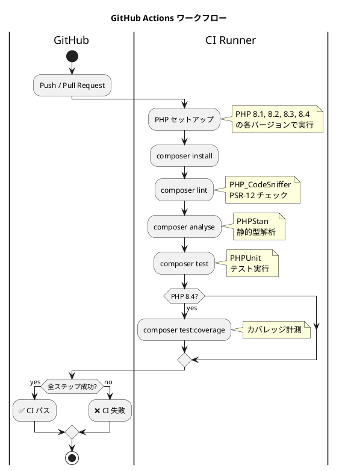
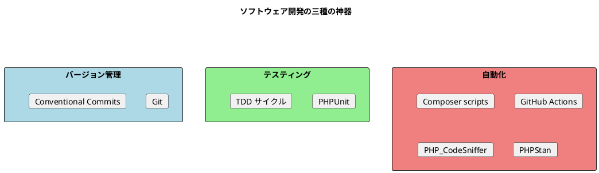

# 第 6 章: タスクランナーと CI/CD

## 6.1 はじめに

前章では静的コード解析ツールとコードカバレッジを導入しました。テストの実行、静的解析、フォーマットチェック、カバレッジ計測と、様々なコマンドを使えるようになりましたが、毎回それぞれのコマンドを覚えて実行するのは面倒です。

この章では **タスクランナー** を使ってこれらのタスクをまとめて実行できるようにし、さらに **CI/CD** パイプラインを構築します。

## 6.2 Composer scripts によるタスク管理

### Composer scripts とは

> Composer scripts は composer.json に定義するタスクランナー機能です。定型的なコマンドをスクリプトとして登録し、`composer <スクリプト名>` で実行できます。

Ruby の Rake、Java の Gradle タスク、Node の npm scripts、Python の tox、Go の Makefile に相当します。

### スクリプトの定義

`composer.json` に scripts セクションを追加します。

```json
{
    "scripts": {
        "test": "vendor/bin/phpunit",
        "test:coverage": "vendor/bin/phpunit --coverage-text",
        "lint": "vendor/bin/phpcs",
        "lint:fix": "vendor/bin/phpcbf",
        "analyse": "vendor/bin/phpstan analyse",
        "check": [
            "@lint",
            "@analyse",
            "@test"
        ]
    }
}
```

### 主要スクリプトの解説

| スクリプト | 説明 | 実行コマンド |
|-----------|------|-------------|
| `composer test` | PHPUnit テストを実行 | `vendor/bin/phpunit` |
| `composer test:coverage` | テスト + カバレッジ | `vendor/bin/phpunit --coverage-text` |
| `composer lint` | コーディング規約チェック | `vendor/bin/phpcs` |
| `composer lint:fix` | コーディング規約の自動修正 | `vendor/bin/phpcbf` |
| `composer analyse` | PHPStan 静的解析 | `vendor/bin/phpstan analyse` |
| `composer check` | 全品質チェックを一括実行 | lint + analyse + test |

### タスクの実行

```bash
# テスト実行
$ composer test
> vendor/bin/phpunit
PHPUnit 10.5.x by Sebastian Bergmann and contributors.

Runtime:       PHP 8.4.x

..........                                                        10 / 10 (100%)

Time: 00:00.xxx, Memory: x.xx MB

OK (10 tests, 18 assertions)

# 全品質チェック
$ composer check
> vendor/bin/phpcs
> vendor/bin/phpstan analyse

 [OK] No errors

> vendor/bin/phpunit

OK (10 tests, 18 assertions)
```

`check` スクリプトは `@lint`、`@analyse`、`@test` を順に実行します。`@` プレフィックスは他のスクリプトを参照する Composer の構文です。いずれかが失敗した時点で実行は中断されます。

## 6.3 Makefile による補助

Composer scripts をさらにラップして、開発チーム全体で統一的なインターフェースを提供するために Makefile を使うこともできます。

```makefile
.PHONY: test lint analyse check coverage setup

test: ## テストを実行
	composer test

lint: ## コーディング規約チェック
	composer lint

lint-fix: ## コーディング規約を自動修正
	composer lint:fix

analyse: ## PHPStan 静的解析
	composer analyse

check: ## 全品質チェック（lint + analyse + test）
	composer check

coverage: ## テスト + カバレッジ
	composer test:coverage

setup: ## 初期セットアップ
	composer install
```

```bash
# ヘルプ表示
$ make help

# 全品質チェック
$ make check
```

## 6.4 CI/CD パイプライン

### GitHub Actions とは

> GitHub Actions は GitHub に組み込まれた CI/CD プラットフォームです。リポジトリへのプッシュやプルリクエスト作成をトリガーに、テストやデプロイを自動実行できます。

### ワークフロー定義

`.github/workflows/php.yml` を作成します。

```yaml
name: PHP CI

on:
  push:
    branches: [ main, develop ]
    paths:
      - 'apps/php/**'
  pull_request:
    branches: [ main ]
    paths:
      - 'apps/php/**'

jobs:
  test:
    runs-on: ubuntu-latest
    defaults:
      run:
        working-directory: apps/php

    strategy:
      matrix:
        php-version: ['8.1', '8.2', '8.3', '8.4']

    steps:
      - uses: actions/checkout@v4

      - name: Setup PHP ${{ matrix.php-version }}
        uses: shivammathur/setup-php@v2
        with:
          php-version: ${{ matrix.php-version }}
          extensions: mbstring, xml
          coverage: xdebug

      - name: Install dependencies
        run: composer install --no-interaction --prefer-dist

      - name: Run coding standard check
        run: composer lint

      - name: Run static analysis
        run: composer analyse

      - name: Run tests
        run: composer test

      - name: Run tests with coverage
        if: matrix.php-version == '8.4'
        run: composer test:coverage
```

### ワークフローの解説



### マトリクスビルド

`strategy.matrix` により、PHP 8.1〜8.4 の各バージョンで並列にテストが実行されます。これにより、PHP のバージョン互換性を自動的に検証できます。

| PHP バージョン | 主な特徴 |
|--------------|---------|
| 8.1 | readonly プロパティ、enum、Fibers |
| 8.2 | readonly クラス、DNF 型 |
| 8.3 | 型付きクラス定数、`json_validate()` |
| 8.4 | プロパティフック、非対称可視性 |

### CI パイプラインのステップ

| ステップ | 対応するローカルコマンド | 目的 |
|---------|------------------------|------|
| Install dependencies | `composer install` | 依存パッケージの導入 |
| Coding standard check | `composer lint` | PSR-12 準拠の確認 |
| Static analysis | `composer analyse` | 型エラーの検出 |
| Run tests | `composer test` | 機能の正しさを検証 |
| Coverage | `composer test:coverage` | テストカバレッジの計測 |

## 6.5 開発ワークフローのまとめ

三種の神器が揃ったことで、以下の開発ワークフローが確立されました。



### 日常の開発フロー

```bash
# 1. 開発開始
$ nix develop .#php
$ cd apps/php

# 2. TDD サイクル
#    Red → Green → Refactor

# 3. 品質チェック
$ composer check

# 4. コミット
$ git commit -m 'feat: 新機能を追加'

# 5. プッシュ → CI が自動実行
$ git push
```

## 6.6 まとめ

この章では以下を構築しました。

| 項目 | ツール | 設定ファイル |
|------|--------|-------------|
| タスクランナー | Composer scripts | `composer.json`（scripts セクション） |
| 補助タスクランナー | Makefile | `Makefile` |
| CI/CD | GitHub Actions | `.github/workflows/php.yml` |

これでソフトウェア開発の三種の神器が揃いました。

| 神器 | ツール |
|------|--------|
| バージョン管理 | Git + Conventional Commits |
| テスティング | PHPUnit + TDD |
| 自動化 | Composer scripts + PHP_CodeSniffer + PHPStan + GitHub Actions |

次章からは第 3 部「オブジェクト指向設計」に入り、FizzBuzz を題材にオブジェクト指向プログラミングの原則を段階的に学んでいきます。
