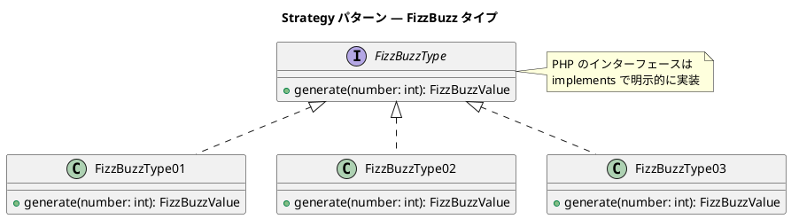
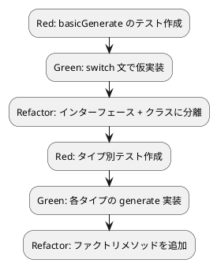

# 第 7 章: カプセル化とポリモーフィズム

## 7.1 追加仕様と TODO リスト

第 1 部で作成した FizzBuzz プログラムに、新しい仕様を追加します。

**追加仕様**:

- **タイプ 1**（通常）: 3 の倍数→Fizz、5 の倍数→Buzz、両方の倍数→FizzBuzz、それ以外→数値
- **タイプ 2**（数値のみ）: 常に数値を返す
- **タイプ 3**（FizzBuzz のみ）: 3 と 5 両方の倍数→FizzBuzz、それ以外→数値

**TODO リスト**:

- [ ] タイプ 1: 通常の FizzBuzz（既存動作）
- [ ] タイプ 2: 数値のみを返す
- [ ] タイプ 3: FizzBuzz のみを返す
- [ ] カプセル化: private / readonly プロパティで内部状態を隠蔽
- [ ] ポリモーフィズム: インターフェースでタイプを抽象化

## 7.2 手続き型アプローチ

まず、手続き型で 3 つのタイプを実装します。

### テスト

```php
public function test_タイプ1_数を文字列に変換する(): void
{
    $result = basicGenerate(1, 1);
    $this->assertSame('1', $result);
}

public function test_タイプ1_3の倍数でFizzを返す(): void
{
    $result = basicGenerate(3, 1);
    $this->assertSame('Fizz', $result);
}

public function test_タイプ2_数を文字列に変換する(): void
{
    $result = basicGenerate(3, 2);
    $this->assertSame('3', $result);
}

public function test_タイプ3_FizzBuzzのみ返す(): void
{
    $result = basicGenerate(15, 3);
    $this->assertSame('FizzBuzz', $result);
}

public function test_タイプ3_FizzBuzz以外は数値を返す(): void
{
    $result = basicGenerate(3, 3);
    $this->assertSame('3', $result);
}
```

### 実装

<details>
<summary>手続き型の実装</summary>

```php
function basicGenerate(int $number, int $type): string
{
    $isFizz = $number % 3 === 0;
    $isBuzz = $number % 5 === 0;

    switch ($type) {
        case 1:
            if ($isFizz && $isBuzz) {
                return 'FizzBuzz';
            }
            if ($isFizz) {
                return 'Fizz';
            }
            if ($isBuzz) {
                return 'Buzz';
            }
            return (string) $number;
        case 2:
            return (string) $number;
        case 3:
            if ($isFizz && $isBuzz) {
                return 'FizzBuzz';
            }
            return (string) $number;
        default:
            throw new \InvalidArgumentException("該当するタイプは存在しません");
    }
}
```

</details>

この実装には問題があります:

- **switch 文の肥大化**: タイプが増えるたびに分岐が増える
- **変更の影響範囲が広い**: 1 つのタイプを変更すると関数全体に影響
- **テストが複雑化**: すべてのタイプが 1 つの関数に集約されている

## 7.3 カプセル化: private と readonly

PHP では **アクセス修飾子**（`private` / `protected` / `public`）と **readonly プロパティ**（PHP 8.1+）でカプセル化を実現します。

### アクセス修飾子

| 修飾子 | アクセス範囲 |
|--------|------------|
| `public` | どこからでもアクセス可能 |
| `protected` | 自クラスとサブクラスからのみ |
| `private` | 自クラス内のみ |

### readonly プロパティ（PHP 8.1+）

```php
class FizzBuzzValue
{
    public function __construct(
        private readonly int $number,
        private readonly string $value,
    ) {
    }

    public function getNumber(): int
    {
        return $this->number;
    }

    public function getValue(): string
    {
        return $this->value;
    }
}
```

**コンストラクタプロモーション**（PHP 8.0+）と **readonly**（PHP 8.1+）を組み合わせることで:

1. **プロパティ宣言とコンストラクタ代入を 1 行で記述**
2. **一度設定した値を変更不可に**（イミュータブル）

### 他言語との比較

| 言語 | カプセル化の手段 |
|------|----------------|
| PHP | `private` / `protected` / `public` + `readonly`（8.1+） |
| Java | `private` / `protected` / `public` + `final` |
| Go | 大文字/小文字の命名規約 |
| Ruby | `private` / `protected` / `public` メソッド |
| TypeScript | `private` / `protected` / `public` 修飾子 |
| Python | `_` プレフィックス（慣例） |

## 7.4 ポリモーフィズム: インターフェース

PHP のインターフェースは **明示的実装** です。`implements` キーワードでインターフェースの実装を宣言します。

### インターフェース定義

```php
interface FizzBuzzType
{
    public function generate(int $number): FizzBuzzValue;
}
```

### タイプ別の実装

```php
class FizzBuzzType01 implements FizzBuzzType
{
    public function generate(int $number): FizzBuzzValue
    {
        if ($number % 3 === 0 && $number % 5 === 0) {
            return new FizzBuzzValue($number, 'FizzBuzz');
        }
        if ($number % 3 === 0) {
            return new FizzBuzzValue($number, 'Fizz');
        }
        if ($number % 5 === 0) {
            return new FizzBuzzValue($number, 'Buzz');
        }

        return new FizzBuzzValue($number, (string) $number);
    }
}

class FizzBuzzType02 implements FizzBuzzType
{
    public function generate(int $number): FizzBuzzValue
    {
        return new FizzBuzzValue($number, (string) $number);
    }
}

class FizzBuzzType03 implements FizzBuzzType
{
    public function generate(int $number): FizzBuzzValue
    {
        if ($number % 3 === 0 && $number % 5 === 0) {
            return new FizzBuzzValue($number, 'FizzBuzz');
        }

        return new FizzBuzzValue($number, (string) $number);
    }
}
```

### テスト

```php
public function test_タイプ1_数を文字列に変換する(): void
{
    $type = new FizzBuzzType01();
    $result = $type->generate(1);
    $this->assertSame('1', $result->getValue());
}

public function test_タイプ1_3の倍数でFizzを返す(): void
{
    $type = new FizzBuzzType01();
    $result = $type->generate(3);
    $this->assertSame('Fizz', $result->getValue());
}

public function test_タイプ2_常に数値を返す(): void
{
    $type = new FizzBuzzType02();
    $result = $type->generate(3);
    $this->assertSame('3', $result->getValue());
}

public function test_タイプ3_FizzBuzzのみ返す(): void
{
    $type = new FizzBuzzType03();
    $result = $type->generate(15);
    $this->assertSame('FizzBuzz', $result->getValue());
}

public function test_タイプ3_FizzBuzz以外は数値を返す(): void
{
    $type = new FizzBuzzType03();
    $result = $type->generate(3);
    $this->assertSame('3', $result->getValue());
}
```

## 7.5 Strategy パターン

ここまでの設計は **Strategy パターン** の適用です。



### Go との比較

| Go（暗黙的実装） | PHP（明示的実装） |
|-----------------|-----------------|
| メソッドセット一致で自動実装 | `implements` キーワードが必須 |
| `type FizzBuzzType01 struct{}` | `class FizzBuzzType01 implements FizzBuzzType` |
| 構造体埋め込みでコード共有 | trait / abstract class でコード共有 |
| コンパイル時に型チェック | PHPStan + 実行時にチェック |

## 7.6 ファクトリメソッド

タイプ番号から適切な `FizzBuzzType` を生成するファクトリ関数を用意します。

```php
class FizzBuzz
{
    public static function create(int $type): FizzBuzzType
    {
        return match ($type) {
            1 => new FizzBuzzType01(),
            2 => new FizzBuzzType02(),
            3 => new FizzBuzzType03(),
            default => throw new \InvalidArgumentException(
                "タイプ{$type}は見つかりません"
            ),
        };
    }
}
```

### テスト

```php
public function test_ファクトリメソッドでタイプ1を生成する(): void
{
    $type = FizzBuzz::create(1);
    $result = $type->generate(3);
    $this->assertSame('Fizz', $result->getValue());
}

public function test_不正なタイプで例外を発生する(): void
{
    $this->expectException(\InvalidArgumentException::class);
    FizzBuzz::create(99);
}
```

## 7.7 既存コードとの統合

ポリモーフィズムを導入した後、既存の `generate` / `generateList` / `printFizzBuzz` メソッドはタイプ 1 のラッパーとして維持します。

```php
class FizzBuzz
{
    public function generate(int $number): string
    {
        $type = new FizzBuzzType01();
        return $type->generate($number)->getValue();
    }
}
```

これにより、既存のテストはすべてそのまま通ります。

## 7.8 まとめ

第 7 章で達成したこと:

- [x] タイプ 1, 2, 3 の仕様を追加
- [x] 手続き型（switch 文）の問題点を確認
- [x] private / readonly プロパティによるカプセル化
- [x] コンストラクタプロモーション（PHP 8.0+）の活用
- [x] インターフェースによるポリモーフィズム
- [x] Strategy パターンの適用
- [x] ファクトリメソッド（match 式）でインスタンス生成
- [x] 既存コードとの後方互換性を維持

### TDD サイクルの実践


