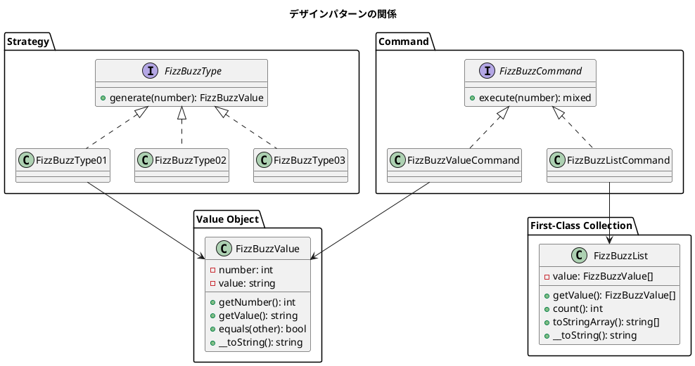
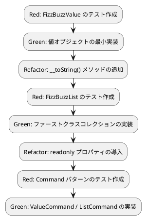

# 第 8 章: デザインパターンの適用

## 8.1 値オブジェクト（Value Object）

これまでの `generate` メソッドは文字列を返していました。しかし、FizzBuzz の結果には「元の数値」と「変換後の文字列」の 2 つの情報が含まれます。この 2 つを 1 つのオブジェクトとして表現するのが**値オブジェクト**です。

### 値オブジェクトの特徴

| 特徴 | 説明 |
|------|------|
| 不変性 | 一度生成したら変更できない（readonly） |
| 等価性 | 同じ値を持つオブジェクトは等しい |
| 自己記述性 | 文字列表現を持つ（`__toString()`） |

### テスト

```php
public function test_正の値で生成できる(): void
{
    $value = new FizzBuzzValue(1, '1');
    $this->assertSame(1, $value->getNumber());
    $this->assertSame('1', $value->getValue());
}

public function test_負の値で例外を発生する(): void
{
    $this->expectException(\InvalidArgumentException::class);
    new FizzBuzzValue(-1, '-1');
}

public function test_同じ値は等しい(): void
{
    $v1 = new FizzBuzzValue(1, '1');
    $v2 = new FizzBuzzValue(1, '1');
    $this->assertTrue($v1->equals($v2));
}

public function test_異なる値は等しくない(): void
{
    $v1 = new FizzBuzzValue(1, '1');
    $v2 = new FizzBuzzValue(2, '2');
    $this->assertFalse($v1->equals($v2));
}

public function test_文字列表現を返す(): void
{
    $value = new FizzBuzzValue(3, 'Fizz');
    $this->assertSame('Fizz', (string) $value);
}
```

### 実装

<details>
<summary>FizzBuzzValue の実装</summary>

```php
<?php

declare(strict_types=1);

namespace App\Domain\Model;

final class FizzBuzzValue
{
    public function __construct(
        private readonly int $number,
        private readonly string $value,
    ) {
        if ($number < 0) {
            throw new \InvalidArgumentException('値は正の値のみ許可します');
        }
    }

    public function getNumber(): int
    {
        return $this->number;
    }

    public function getValue(): string
    {
        return $this->value;
    }

    public function equals(self $other): bool
    {
        return $this->number === $other->number
            && $this->value === $other->value;
    }

    public function __toString(): string
    {
        return $this->value;
    }
}
```

</details>

PHP の値オブジェクト設計のポイント:

- **コンストラクタプロモーション** + **readonly** で不変性を保証
- **`final` クラス**で継承を禁止（値オブジェクトは拡張しない）
- **`__toString()`** マジックメソッドで文字列表現を提供
- **`equals()`** メソッドで値の等価性を比較（PHP にはオブジェクト比較演算子のオーバーロードがないため）

## 8.2 FizzBuzzType の更新

タイプの `generate` メソッドが `FizzBuzzValue` を返すように更新します。

```php
interface FizzBuzzType
{
    public function generate(int $number): FizzBuzzValue;
}

class FizzBuzzType01 implements FizzBuzzType
{
    public function generate(int $number): FizzBuzzValue
    {
        if ($number % 3 === 0 && $number % 5 === 0) {
            return new FizzBuzzValue($number, 'FizzBuzz');
        }
        if ($number % 3 === 0) {
            return new FizzBuzzValue($number, 'Fizz');
        }
        if ($number % 5 === 0) {
            return new FizzBuzzValue($number, 'Buzz');
        }

        return new FizzBuzzValue($number, (string) $number);
    }
}
```

## 8.3 ファーストクラスコレクション

FizzBuzz のリスト（`FizzBuzzValue[]`）を直接操作する代わりに、**専用のコレクション型**で包みます。

### テスト

```php
public function test_配列からリストを生成する(): void
{
    $values = [
        new FizzBuzzValue(1, '1'),
        new FizzBuzzValue(2, '2'),
    ];
    $list = new FizzBuzzList($values);
    $this->assertSame(2, $list->count());
}

public function test_上限を超えると例外を発生する(): void
{
    $this->expectException(\InvalidArgumentException::class);
    $values = [];
    for ($i = 0; $i <= 100; $i++) {
        $values[] = new FizzBuzzValue($i, (string) $i);
    }
    new FizzBuzzList($values);
}

public function test_文字列配列を返す(): void
{
    $values = [
        new FizzBuzzValue(1, '1'),
        new FizzBuzzValue(3, 'Fizz'),
    ];
    $list = new FizzBuzzList($values);
    $strings = $list->toStringArray();
    $this->assertSame(['1', 'Fizz'], $strings);
}

public function test_文字列表現を返す(): void
{
    $values = [
        new FizzBuzzValue(1, '1'),
        new FizzBuzzValue(3, 'Fizz'),
    ];
    $list = new FizzBuzzList($values);
    $this->assertSame('1,Fizz', (string) $list);
}
```

### 実装

<details>
<summary>FizzBuzzList の実装</summary>

```php
<?php

declare(strict_types=1);

namespace App\Domain\Model;

final class FizzBuzzList
{
    private const MAX_COUNT = 100;

    /** @var FizzBuzzValue[] */
    private readonly array $value;

    /**
     * @param FizzBuzzValue[] $value
     */
    public function __construct(array $value)
    {
        if (count($value) > self::MAX_COUNT) {
            throw new \InvalidArgumentException(
                sprintf('上限は%d件までです', self::MAX_COUNT)
            );
        }
        $this->value = $value;
    }

    /**
     * @return FizzBuzzValue[]
     */
    public function getValue(): array
    {
        return $this->value;
    }

    public function count(): int
    {
        return count($this->value);
    }

    /**
     * @return string[]
     */
    public function toStringArray(): array
    {
        return array_map(
            fn(FizzBuzzValue $v): string => $v->getValue(),
            $this->value
        );
    }

    public function __toString(): string
    {
        return implode(',', $this->toStringArray());
    }
}
```

</details>

### ファーストクラスコレクションの特徴

| 特徴 | 実装方法 |
|------|---------|
| 不変性 | `readonly` プロパティ |
| カプセル化 | コレクション操作をメソッドに集約 |
| 上限管理 | `MAX_COUNT` で件数を制限 |
| 変換 | `toStringArray()` で文字列配列に変換 |

## 8.4 Command パターン

FizzBuzz の操作を**コマンドオブジェクト**としてカプセル化します。

### テスト

```php
public function test_FizzBuzzValueCommandで値を生成する(): void
{
    $type = new FizzBuzzType01();
    $command = new FizzBuzzValueCommand($type);
    $result = $command->execute(3);
    $this->assertInstanceOf(FizzBuzzValue::class, $result);
    $this->assertSame('Fizz', $result->getValue());
}

public function test_FizzBuzzListCommandでリストを生成する(): void
{
    $type = new FizzBuzzType01();
    $command = new FizzBuzzListCommand($type);
    $result = $command->execute();
    $this->assertInstanceOf(FizzBuzzList::class, $result);
    $this->assertSame(100, $result->count());
}
```

### 実装

<details>
<summary>Command パターンの実装</summary>

```php
<?php

declare(strict_types=1);

namespace App\Application;

interface FizzBuzzCommand
{
    public function execute(int $number = 0): mixed;
}
```

```php
<?php

declare(strict_types=1);

namespace App\Application;

use App\Domain\Model\FizzBuzzValue;
use App\Domain\Type\FizzBuzzType;

final class FizzBuzzValueCommand implements FizzBuzzCommand
{
    public function __construct(
        private readonly FizzBuzzType $type,
    ) {
    }

    public function execute(int $number = 0): FizzBuzzValue
    {
        return $this->type->generate($number);
    }
}
```

```php
<?php

declare(strict_types=1);

namespace App\Application;

use App\Domain\Model\FizzBuzzList;
use App\Domain\Model\FizzBuzzValue;
use App\Domain\Type\FizzBuzzType;

final class FizzBuzzListCommand implements FizzBuzzCommand
{
    private const MAX_NUMBER = 100;

    public function __construct(
        private readonly FizzBuzzType $type,
        private readonly int $maxNumber = self::MAX_NUMBER,
    ) {
        if ($maxNumber > self::MAX_NUMBER) {
            throw new \InvalidArgumentException(
                sprintf('最大値は%d以下である必要があります', self::MAX_NUMBER)
            );
        }
    }

    public function execute(int $number = 0): FizzBuzzList
    {
        $values = [];
        for ($i = 1; $i <= $this->maxNumber; $i++) {
            $values[] = $this->type->generate($i);
        }

        return new FizzBuzzList($values);
    }
}
```

</details>

## 8.5 適用したデザインパターン



| パターン | 構成要素 | 役割 |
|---------|---------|------|
| Value Object | `FizzBuzzValue` | 不変の値を表現 |
| First-Class Collection | `FizzBuzzList` | コレクション操作のカプセル化 |
| Strategy | `FizzBuzzType` + 実装クラス | アルゴリズムの交換 |
| Factory Method | `FizzBuzz::create()` | インスタンス生成の集約 |
| Command | `FizzBuzzCommand` + 実装クラス | 操作のオブジェクト化 |

## 8.6 まとめ

第 8 章で達成したこと:

- [x] 値オブジェクト（FizzBuzzValue）: readonly + 等価性 + `__toString()`
- [x] ファーストクラスコレクション（FizzBuzzList）: readonly + 上限管理
- [x] Command パターン: 操作のオブジェクト化
- [x] `FizzBuzzType` の戻り値を `FizzBuzzValue` に更新

### TDD サイクルの実践


