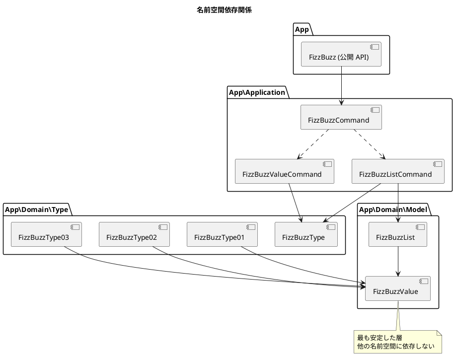
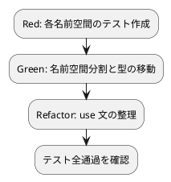

# 第 9 章: SOLID 原則とモジュール設計

## 9.1 SOLID 原則の検証

第 7-8 章で構築した設計が SOLID 原則に沿っているか検証します。

### 単一責任原則（SRP）

> クラスが変更される理由は 1 つだけであるべきだ

| クラス / インターフェース | 責務 |
|--------------------------|------|
| `FizzBuzzValue` | FizzBuzz の結果値を保持 |
| `FizzBuzzList` | FizzBuzzValue のコレクション管理 |
| `FizzBuzzType01` | タイプ 1 のルールで生成 |
| `FizzBuzzType02` | タイプ 2 のルールで生成 |
| `FizzBuzzType03` | タイプ 3 のルールで生成 |
| `FizzBuzzValueCommand` | 単一値の生成操作 |
| `FizzBuzzListCommand` | リストの生成操作 |

各クラスが 1 つの責務のみを担っており、SRP を満たしています。

### 開放閉鎖原則（OCP）

> ソフトウェアの実体は拡張に対して開いていて、修正に対して閉じているべきだ

新しいタイプ（例: タイプ 4）を追加する場合:

```php
// 既存コードを変更せず、新しいクラスを追加するだけ
class FizzBuzzType04 implements FizzBuzzType
{
    public function generate(int $number): FizzBuzzValue
    {
        // 新しいルールを実装
        return new FizzBuzzValue($number, (string) $number);
    }
}
```

`FizzBuzzType` インターフェースを実装するクラスを追加するだけで、既存のコードを変更する必要がありません（ファクトリメソッド `FizzBuzz::create()` の修正は必要）。

### リスコフの置換原則（LSP）

> サブタイプはそのベースタイプと置換可能でなければならない

```php
// どのタイプでも FizzBuzzType として使用可能
function processType(FizzBuzzType $type, int $number): FizzBuzzValue
{
    return $type->generate($number);
}

// Type01, 02, 03 のいずれを渡しても正しく動作する
processType(new FizzBuzzType01(), 15); // FizzBuzz
processType(new FizzBuzzType02(), 15); // 15
processType(new FizzBuzzType03(), 15); // FizzBuzz
```

PHP のインターフェースは型安全に LSP を保証します。`FizzBuzzType` を型宣言に使えば、実装クラスをいつでも差し替え可能です。

### インターフェース分離原則（ISP）

> クライアントが使用しないメソッドに依存させてはならない

```php
// FizzBuzzType は generate のみを要求する最小限のインターフェース
interface FizzBuzzType
{
    public function generate(int $number): FizzBuzzValue;
}

// FizzBuzzCommand は execute のみを要求する最小限のインターフェース
interface FizzBuzzCommand
{
    public function execute(int $number = 0): mixed;
}
```

各インターフェースは必要最小限のメソッドのみを定義しており、ISP を満たしています。

### 依存関係逆転原則（DIP）

> 上位モジュールは下位モジュールに依存してはならない。両方とも抽象に依存すべきだ

```php
// FizzBuzzValueCommand は具体クラスではなくインターフェースに依存
final class FizzBuzzValueCommand implements FizzBuzzCommand
{
    public function __construct(
        private readonly FizzBuzzType $type,  // インターフェースに依存
    ) {
    }
}
```

コマンドは `FizzBuzzType` インターフェースに依存しており、具体的な `FizzBuzzType01` 等には直接依存していません。

## 9.2 モジュール設計

単一ファイルに集約されたコードを、責務に基づいて名前空間で分割します。

### Before: 単一名前空間

```
apps/php/
├── src/
│   └── FizzBuzz.php          (すべてのロジックが 1 ファイル)
└── tests/
    ├── FizzBuzzTest.php
    └── LearningTest.php
```

### After: 3 層名前空間構成

```
apps/php/
├── src/
│   ├── FizzBuzz.php                         (公開 API)
│   ├── Domain/
│   │   ├── Model/
│   │   │   ├── FizzBuzzValue.php            (値オブジェクト)
│   │   │   └── FizzBuzzList.php             (ファーストクラスコレクション)
│   │   └── Type/
│   │       ├── FizzBuzzType.php             (インターフェース)
│   │       ├── FizzBuzzType01.php           (タイプ 1: 通常)
│   │       ├── FizzBuzzType02.php           (タイプ 2: 数値のみ)
│   │       └── FizzBuzzType03.php           (タイプ 3: FizzBuzz のみ)
│   └── Application/
│       ├── FizzBuzzCommand.php              (コマンドインターフェース)
│       ├── FizzBuzzValueCommand.php         (単一値コマンド)
│       └── FizzBuzzListCommand.php          (リストコマンド)
└── tests/
    ├── FizzBuzzTest.php                     (統合テスト)
    ├── Domain/
    │   ├── Model/
    │   │   ├── FizzBuzzValueTest.php
    │   │   └── FizzBuzzListTest.php
    │   └── Type/
    │       └── FizzBuzzTypeTest.php
    ├── Application/
    │   └── FizzBuzzCommandTest.php
    └── LearningTest.php
```

### 名前空間と PSR-4 オートロード

`composer.json` の PSR-4 設定により、名前空間がディレクトリ構造と自動的に対応します:

```json
{
    "autoload": {
        "psr-4": {
            "App\\": "src/"
        }
    }
}
```

| 名前空間 | ディレクトリ |
|---------|------------|
| `App\Domain\Model` | `src/Domain/Model/` |
| `App\Domain\Type` | `src/Domain/Type/` |
| `App\Application` | `src/Application/` |

### 名前空間依存関係



**依存方向のルール**:

- `App\Domain\Model` → 他の名前空間に依存しない（最も安定）
- `App\Domain\Type` → `App\Domain\Model` のみに依存
- `App\Application` → `App\Domain\Type` と `App\Domain\Model` に依存
- `App` → `App\Application` に依存（公開 API として統合）

## 9.3 名前空間分割の実装

### App\Domain\Model

```php
// src/Domain/Model/FizzBuzzValue.php
namespace App\Domain\Model;

final class FizzBuzzValue
{
    public function __construct(
        private readonly int $number,
        private readonly string $value,
    ) {
        if ($number < 0) {
            throw new \InvalidArgumentException('値は正の値のみ許可します');
        }
    }

    public function getNumber(): int { return $this->number; }
    public function getValue(): string { return $this->value; }
    public function __toString(): string { return $this->value; }

    public function equals(self $other): bool
    {
        return $this->number === $other->number
            && $this->value === $other->value;
    }
}
```

### App\Domain\Type

```php
// src/Domain/Type/FizzBuzzType.php
namespace App\Domain\Type;

use App\Domain\Model\FizzBuzzValue;

interface FizzBuzzType
{
    public function generate(int $number): FizzBuzzValue;
}
```

```php
// src/Domain/Type/FizzBuzzType01.php
namespace App\Domain\Type;

use App\Domain\Model\FizzBuzzValue;

final class FizzBuzzType01 implements FizzBuzzType
{
    public function generate(int $number): FizzBuzzValue
    {
        if ($number % 3 === 0 && $number % 5 === 0) {
            return new FizzBuzzValue($number, 'FizzBuzz');
        }
        if ($number % 3 === 0) {
            return new FizzBuzzValue($number, 'Fizz');
        }
        if ($number % 5 === 0) {
            return new FizzBuzzValue($number, 'Buzz');
        }

        return new FizzBuzzValue($number, (string) $number);
    }
}
```

### App\Application

```php
// src/Application/FizzBuzzCommand.php
namespace App\Application;

interface FizzBuzzCommand
{
    public function execute(int $number = 0): mixed;
}
```

```php
// src/Application/FizzBuzzListCommand.php
namespace App\Application;

use App\Domain\Model\FizzBuzzList;
use App\Domain\Type\FizzBuzzType;

final class FizzBuzzListCommand implements FizzBuzzCommand
{
    private const MAX_NUMBER = 100;

    public function __construct(
        private readonly FizzBuzzType $type,
        private readonly int $maxNumber = self::MAX_NUMBER,
    ) {
        if ($maxNumber > self::MAX_NUMBER) {
            throw new \InvalidArgumentException(
                sprintf('最大値は%d以下である必要があります', self::MAX_NUMBER)
            );
        }
    }

    public function execute(int $number = 0): FizzBuzzList
    {
        $values = [];
        for ($i = 1; $i <= $this->maxNumber; $i++) {
            $values[] = $this->type->generate($i);
        }

        return new FizzBuzzList($values);
    }
}
```

## 9.4 テスト構成

テストも名前空間に対応させます。

### Domain\Model のテスト

```php
// tests/Domain/Model/FizzBuzzValueTest.php
namespace App\Tests\Domain\Model;

use App\Domain\Model\FizzBuzzValue;
use PHPUnit\Framework\TestCase;

final class FizzBuzzValueTest extends TestCase
{
    public function test_正の値で生成できる(): void
    {
        $value = new FizzBuzzValue(1, '1');
        $this->assertSame(1, $value->getNumber());
        $this->assertSame('1', $value->getValue());
    }

    public function test_負の値で例外を発生する(): void
    {
        $this->expectException(\InvalidArgumentException::class);
        new FizzBuzzValue(-1, '-1');
    }

    public function test_同じ値は等しい(): void
    {
        $v1 = new FizzBuzzValue(1, '1');
        $v2 = new FizzBuzzValue(1, '1');
        $this->assertTrue($v1->equals($v2));
    }

    public function test_異なる値は等しくない(): void
    {
        $v1 = new FizzBuzzValue(1, '1');
        $v2 = new FizzBuzzValue(2, '2');
        $this->assertFalse($v1->equals($v2));
    }
}
```

### Domain\Type のテスト

```php
// tests/Domain/Type/FizzBuzzTypeTest.php
namespace App\Tests\Domain\Type;

use App\Domain\Type\FizzBuzzType01;
use App\Domain\Type\FizzBuzzType02;
use App\Domain\Type\FizzBuzzType03;
use PHPUnit\Framework\TestCase;

final class FizzBuzzTypeTest extends TestCase
{
    public function test_タイプ1_3の倍数でFizzを返す(): void
    {
        $type = new FizzBuzzType01();
        $result = $type->generate(3);
        $this->assertSame('Fizz', $result->getValue());
    }

    public function test_タイプ2_常に数値を返す(): void
    {
        $type = new FizzBuzzType02();
        $result = $type->generate(3);
        $this->assertSame('3', $result->getValue());
    }

    public function test_タイプ3_FizzBuzzのみ返す(): void
    {
        $type = new FizzBuzzType03();
        $result = $type->generate(15);
        $this->assertSame('FizzBuzz', $result->getValue());
    }
}
```

## 9.5 言語間比較

| 概念 | PHP | Go | Java | TypeScript |
|------|-----|-----|------|-----------|
| モジュール単位 | 名前空間（namespace） | パッケージ | パッケージ / クラス | モジュール（ES Modules） |
| 公開制御 | `public` / `private` | 大文字/小文字 | アクセス修飾子 | `export` |
| オートロード | PSR-4（Composer） | Go Modules | クラスパス | バンドラー（Vite 等） |
| 名前空間の区切り | `\`（バックスラッシュ） | `/`（スラッシュ） | `.`（ドット） | ファイルパス |
| 循環依存 | 実行時エラー（注意） | コンパイルエラー | コンパイルエラー | 実行時エラー |

## 9.6 まとめ

第 9 章で達成したこと:

- [x] SOLID 原則の検証（5 原則すべて確認）
- [x] 名前空間分割（Domain/Model, Domain/Type, Application）
- [x] 依存方向の一方向化
- [x] テストの名前空間対応

### Before / After

| 項目 | Before（第 2 部終了時） | After（第 3 部終了時） |
|------|------------------------|----------------------|
| ファイル数 | 2 ファイル | 12+ ファイル |
| 名前空間数 | 1（App） | 4（App, Domain\Model, Domain\Type, Application） |
| デザインパターン | なし | Strategy, Value Object, First-Class Collection, Command, Factory Method |
| テスト数 | 12 テスト | 30+ テスト |

### TDD サイクルの実践



### 第 3 部で学んだ PHP の設計原則

1. **インターフェースで契約を明示**: `implements` による明示的な実装宣言
2. **readonly で不変性を保証**: コンストラクタプロモーション + readonly で値オブジェクトを簡潔に定義
3. **名前空間で責務を分離**: PSR-4 オートロードと連携した自然なモジュール分割
4. **final で継承を制御**: 値オブジェクトやコマンドなど、拡張すべきでないクラスを `final` で保護
