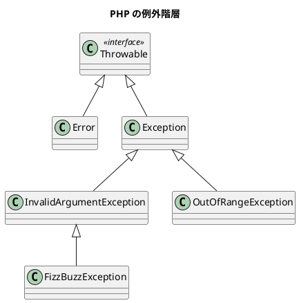

# 第 12 章: エラーハンドリングと型安全性

## 12.1 例外処理

PHP の標準的なエラーハンドリングは **例外**（`Exception` / `Error`）です。第 7-9 章で `\InvalidArgumentException` を使用していましたが、カスタム例外クラスを導入してより型安全なエラーハンドリングを実現します。

### カスタム例外クラス

```php
<?php

declare(strict_types=1);

namespace App\Domain;

final class FizzBuzzException extends \InvalidArgumentException
{
}
```

### テスト: カスタム例外を使用する

```php
public function test_不正なタイプでカスタム例外を発生する(): void
{
    $this->expectException(FizzBuzzException::class);
    $this->expectExceptionMessage('タイプ99は見つかりません');
    FizzBuzz::create(99);
}

public function test_負の値でカスタム例外を発生する(): void
{
    $this->expectException(FizzBuzzException::class);
    new FizzBuzzValue(-1, '-1');
}
```

### PHP の例外階層



## 12.2 列挙型（PHP 8.1+）

PHP 8.1 で導入された **enum** により、タイプコードをマジックナンバーから型安全な列挙型に置き換えられます。

### テスト: 列挙型で型安全にタイプを指定する

```php
public function test_列挙型でタイプを生成する(): void
{
    $type = FizzBuzzTypeName::Standard->createType();
    $result = $type->generate(3);
    $this->assertSame('Fizz', $result->getValue());
}

public function test_全ての列挙型でタイプを生成できる(): void
{
    foreach (FizzBuzzTypeName::cases() as $name) {
        $type = $name->createType();
        $this->assertInstanceOf(FizzBuzzType::class, $type);
    }
}
```

### 実装

<details>
<summary>FizzBuzzTypeName 列挙型</summary>

```php
<?php

declare(strict_types=1);

namespace App\Domain\Type;

enum FizzBuzzTypeName: int
{
    case Standard = 1;
    case NumberOnly = 2;
    case FizzBuzzOnly = 3;

    public function createType(): FizzBuzzType
    {
        return match ($this) {
            self::Standard => new FizzBuzzType01(),
            self::NumberOnly => new FizzBuzzType02(),
            self::FizzBuzzOnly => new FizzBuzzType03(),
        };
    }

    public function label(): string
    {
        return match ($this) {
            self::Standard => '通常',
            self::NumberOnly => '数値のみ',
            self::FizzBuzzOnly => 'FizzBuzzのみ',
        };
    }
}
```

</details>

### enum の特徴

| 特徴 | 説明 |
|------|------|
| Backed enum | `int` や `string` の値を持てる（`enum Foo: int`） |
| メソッド定義 | enum にメソッドを追加可能 |
| `cases()` | 全ケースの配列を返す |
| `from()` | 値から enum を生成（無効値で `ValueError`） |
| `tryFrom()` | 値から enum を生成（無効値で `null`） |

## 12.3 match 式（PHP 8.0+）

**match 式** は `switch` の型安全な代替です。`===`（厳密比較）を使い、値を返します。

### switch と match の比較

```php
// switch: 型の曖昧さがある（==）
switch ($type) {
    case 1:
        $result = new FizzBuzzType01();
        break;
    case 2:
        $result = new FizzBuzzType02();
        break;
    default:
        throw new \InvalidArgumentException();
}

// match: 型安全（===）、値を返す
$result = match ($type) {
    1 => new FizzBuzzType01(),
    2 => new FizzBuzzType02(),
    default => throw new \InvalidArgumentException(),
};
```

### テスト: match 式で型安全に分岐する

```php
public function test_match式でタイプ名を取得する(): void
{
    $describe = fn(FizzBuzzType $type): string => match (true) {
        $type instanceof FizzBuzzType01 => 'Standard',
        $type instanceof FizzBuzzType02 => 'NumberOnly',
        $type instanceof FizzBuzzType03 => 'FizzBuzzOnly',
        default => 'Unknown',
    };

    $this->assertSame('Standard', $describe(new FizzBuzzType01()));
    $this->assertSame('NumberOnly', $describe(new FizzBuzzType02()));
    $this->assertSame('FizzBuzzOnly', $describe(new FizzBuzzType03()));
}
```

## 12.4 FizzBuzzList の検索メソッド

### テスト: findFirst -- 条件に合致する最初の要素を返す

```php
public function test_findFirstで最初のFizzBuzzを見つける(): void
{
    $type = new FizzBuzzType01();
    $command = new FizzBuzzListCommand($type);
    $list = $command->execute();

    $isFizzBuzz = fn(FizzBuzzValue $v): bool => $v->getValue() === 'FizzBuzz';
    $result = $list->findFirst($isFizzBuzz);

    $this->assertNotNull($result);
    $this->assertSame(15, $result->getNumber());
}

public function test_findFirstで見つからない場合nullを返す(): void
{
    $values = [new FizzBuzzValue(1, '1')];
    $list = new FizzBuzzList($values);

    $isFizzBuzz = fn(FizzBuzzValue $v): bool => $v->getValue() === 'FizzBuzz';
    $result = $list->findFirst($isFizzBuzz);

    $this->assertNull($result);
}
```

<details>
<summary>実装コード: findFirst</summary>

```php
/**
 * @param callable(FizzBuzzValue): bool $predicate
 */
public function findFirst(callable $predicate): ?FizzBuzzValue
{
    foreach ($this->value as $v) {
        if ($predicate($v)) {
            return $v;
        }
    }
    return null;
}
```

</details>

### テスト: anyMatch / allMatch -- 存在チェック

```php
public function test_anyMatchでFizzが存在する(): void
{
    $type = new FizzBuzzType01();
    $command = new FizzBuzzListCommand($type, 15);
    $list = $command->execute();

    $isFizz = fn(FizzBuzzValue $v): bool => $v->getValue() === 'Fizz';
    $this->assertTrue($list->anyMatch($isFizz));
}

public function test_allMatchで全て数値ではない(): void
{
    $type = new FizzBuzzType01();
    $command = new FizzBuzzListCommand($type, 15);
    $list = $command->execute();

    $isNumber = fn(FizzBuzzValue $v): bool =>
        $v->getValue() !== 'Fizz'
        && $v->getValue() !== 'Buzz'
        && $v->getValue() !== 'FizzBuzz';
    $this->assertFalse($list->allMatch($isNumber));
}
```

<details>
<summary>実装コード: anyMatch / allMatch</summary>

```php
/**
 * @param callable(FizzBuzzValue): bool $predicate
 */
public function anyMatch(callable $predicate): bool
{
    foreach ($this->value as $v) {
        if ($predicate($v)) {
            return true;
        }
    }
    return false;
}

/**
 * @param callable(FizzBuzzValue): bool $predicate
 */
public function allMatch(callable $predicate): bool
{
    foreach ($this->value as $v) {
        if (!$predicate($v)) {
            return false;
        }
    }
    return true;
}
```

</details>

## 12.5 各言語のエラーハンドリング比較

| 機能 | PHP | Go | Java | Ruby | TypeScript |
|------|-----|-----|------|------|------------|
| エラー型 | 例外（`Exception`） | `error` インターフェース | 例外（`Exception`） | 例外（`StandardError`） | 例外（`Error`） |
| null 安全 | `?Type`（Nullable 型） | 多値返却 `(T, error)` | `Optional<T>` | `nil` | `T \| undefined` |
| パターンマッチング | `match` 式 + `instanceof` | 型スイッチ | `instanceof` / `switch` | `case/in` | `typeof` / `switch` |
| 列挙型 | `enum`（PHP 8.1+） | `iota` + 型定義 | `enum` | 定数モジュール | `enum` / Union 型 |
| 型安全な分岐 | `match`（`===`） | 型スイッチ | `switch` | `case/when` | `switch` |

## 12.6 まとめ

本章では以下を学びました:

- **例外処理**: カスタム例外クラスによる型安全なエラーハンドリング
- **列挙型**（PHP 8.1+）: マジックナンバーの排除と型安全なファクトリ
- **match 式**（PHP 8.0+）: 型安全な条件分岐（`===` 厳密比較）
- **検索メソッド**: `findFirst`（`?FizzBuzzValue`）、`anyMatch`、`allMatch`
- **Nullable 型**: `?Type` による null 安全な戻り値

PHP のエラーハンドリングと型システムは、PHP 8.x の進化により Java や TypeScript に近い型安全性を実現しています。`enum` + `match` の組み合わせは特に強力で、従来の `switch` + マジックナンバーに比べて大幅に安全性が向上しています。
