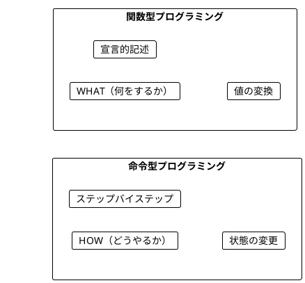
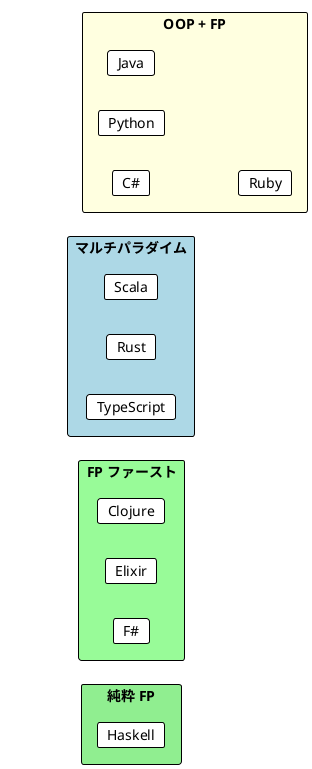

# Part I - 第 1 章：関数型プログラミング入門

## 1.1 はじめに：なぜ関数型プログラミングか

関数型プログラミング（FP）は「何をするか（WHAT）」を宣言的に記述するパラダイムです。命令型プログラミングが「どうやるか（HOW）」をステップバイステップで指示するのに対し、FP はデータの変換を値と関数の組み合わせで表現します。

本章では、11 言語での実装を横断的に比較し、以下を明らかにします：

- 命令型と関数型の本質的な違い
- 各言語が FP をどのレベルでサポートしているか
- 関数定義の構文と設計思想の差異



---

## 1.2 共通の本質：HOW vs WHAT

11 言語すべてで共通しているのは、「命令型は手順を記述し、関数型は結果を記述する」という対比です。

ワードスコア計算（文字列の長さを返す）を例にとります。

**命令型**では、ループで 1 文字ずつカウントする「手順」を書きます：

```java
// 命令型: HOW（どうやるか）を記述
public static int calculateScore(String word) {
    int score = 0;
    for (char c : word.toCharArray()) {
        score++;
    }
    return score;
}
```

**関数型**では、「文字列の長さを返す」という「結果」だけを宣言します。3 つの言語グループから代表例を見てみましょう：

```haskell
-- Haskell（関数型ファースト）: 型シグネチャと定義の 2 行
wordScore :: String -> Int
wordScore word = length word
```

```scala
// Scala（マルチパラダイム）: def + 式ベースの定義
def wordScore(word: String): Int = word.length()
```

```java
// Java（OOP + FP）: return 文が必要
public static int wordScore(String word) {
    return word.length();
}
```

**共通点**: どの言語でも、命令型の「ループ + 可変変数」が関数型では「組み込み関数 1 つ」に置き換わります。
**差異**: 関数型スタイルの「自然さ」は言語のパラダイムポジションによって大きく異なります。

---

## 1.3 言語別実装比較：ワードスコア計算

11 言語で同じ問題（ワードスコア＝文字列の長さ）を命令型と関数型の両方で実装した比較です。

### 関数型ファースト言語

これらの言語では、関数型スタイルがデフォルトであり、命令型を書くこと自体が不自然です。

<details>
<summary>Haskell</summary>

```haskell
-- 関数型（自然なスタイル）
wordScore :: String -> Int
wordScore word = length word
```

Haskell には命令型のループ構文がそもそもデフォルトで存在しません。命令型の例は Java コードで示されます。これは「Haskell では命令型は本来的でない」というメッセージを暗黙に伝えています。

</details>

<details>
<summary>Clojure</summary>

```clojure
;; 命令型（atom で可変状態を模倣）
(defn imperative-sum [numbers]
  (let [result (atom 0)]
    (doseq [n numbers]
      (swap! result + n))
    @result))

;; 関数型（自然なスタイル）
(defn functional-sum [numbers]
  (reduce + 0 numbers))
```

Clojure では命令型を書くために `atom`（可変参照）を明示的に使う必要があり、「可変状態は特別なもの」という設計思想が表れています。なお、例題はワードスコアではなく合計計算を使用しており、S 式という独自の構文体系を反映しています。

</details>

<details>
<summary>Elixir</summary>

```elixir
# 関数型（自然なスタイル）
def word_score(word), do: String.length(word)
```

Elixir も Haskell と同様、命令型の例は Java コードで示されます。1 行で完結する `do:` 構文は Elixir の簡潔さを象徴しています。

</details>

<details>
<summary>F#</summary>

```fsharp
// 命令型（mutable を明示）
let wordScoreImperative (word: string) : int =
    let mutable score = 0
    for _ in word do
        score <- score + 1
    score

// 関数型（自然なスタイル）
let wordScore (word: string) : int =
    word.Length
```

F# では可変変数に `mutable` キーワードと `<-` 代入演算子が必要です。命令型を「書けるが、明示的に選択しなければならない」という設計です。

</details>

### マルチパラダイム言語

これらの言語は OOP と FP を高度に統合しており、両方のスタイルを自然に書けます。

<details>
<summary>Scala</summary>

```scala
// 関数型
def wordScore(word: String): Int = word.length()
```

Scala は命令型の例として Java コードを流用し、自身は関数型スタイルで示します。`def` + `=` による式ベースの定義が基本です。

</details>

<details>
<summary>Rust</summary>

```rust
// 命令型
fn calculate_score_imperative(word: &str) -> usize {
    let mut score = 0;
    for _ in word.chars() {
        score += 1;
    }
    score
}

// 関数型
fn word_score(word: &str) -> usize {
    word.len()
}
```

Rust は命令型・関数型の両方を自言語で示す数少ない言語です。`let mut`（可変）vs `let`（不変）の対比が Rust の所有権システムの入口になっています。

</details>

<details>
<summary>TypeScript</summary>

```typescript
// 命令型
const calculateScoreImperative = (word: string): number => {
  let score = 0
  for (const _ of word) {
    score += 1
  }
  return score
}

// 関数型
const wordScore = (word: string): number => word.length
```

TypeScript はアロー関数で両スタイルを統一して示します。「`const` で書いても命令型になりうる」ことを明示しています。

</details>

### OOP + FP ライブラリ言語

これらの言語は OOP が主パラダイムですが、ライブラリや言語機能の進化で FP をサポートしています。

<details>
<summary>Java</summary>

```java
// 命令型
public static int calculateScoreImperative(String word) {
    int score = 0;
    for (char c : word.toCharArray()) {
        score++;
    }
    return score;
}

// 関数型
public static int wordScore(String word) {
    return word.length();
}
```

Java は命令型・関数型の両方を自言語で示す唯一の OOP 言語です。`return` 文が必須であり、式ベースではないことが関数型スタイルの冗長さにつながっています。

</details>

<details>
<summary>C#</summary>

```csharp
// 命令型
public static int WordScoreImperative(string word)
{
    var score = 0;
    foreach (var _ in word)
    {
        score = score + 1;
    }
    return score;
}

// 関数型（式形式メンバー）
public static int WordScore(string word) => word.Length;
```

C# の `=>` 式形式メンバーは Java にない機能であり、関数型スタイルの簡潔さを実現しています。

</details>

<details>
<summary>Python</summary>

```python
# 命令型
def calculate_score_imperative(word: str) -> int:
    score = 0
    for _ in word:
        score += 1
    return score

# 関数型
def word_score(word: str) -> int:
    return len(word)
```

Python は型ヒントで意図を明示しますが、構文上は命令型と関数型の区別が小さいのが特徴です。

</details>

<details>
<summary>Ruby</summary>

```ruby
# 命令型
def calculate_score_imperative(word)
  score = 0
  word.each_char do |_c|
    score += 1
  end
  score
end

# 関数型
def word_score(word)
  word.length
end
```

Ruby は型注釈がなく最もシンプルな構文です。最後の式が暗黙的に戻り値となる式ベースの設計です。

</details>

---

## 1.4 比較分析

### 命令型コードの示し方に表れる設計思想

11 言語を横断すると、命令型コードの示し方に 2 つのパターンが見えてきます：

| パターン | 言語 | 意味 |
|---------|------|------|
| **自言語で命令型を書く** | Java, Rust, Python, TypeScript, Ruby, F#, C#, Clojure | 「この言語では命令型も書ける」 |
| **Java コードで命令型を示す** | Scala, Haskell, Elixir | 「この言語では命令型は本来的でない」 |

Haskell・Scala・Elixir が命令型の例に Java を使うのは、これらの言語が FP を「追加機能」ではなく「デフォルトのスタイル」として位置づけていることの表れです。

### 関数定義の構文比較

同じ `increment` 関数を 11 言語で定義した比較です：

| 言語 | 構文 | 式ベース |
|------|------|---------|
| Haskell | `increment x = x + 1` | Yes |
| Clojure | `(defn increment [x] (+ x 1))` | Yes（S 式） |
| Elixir | `def increment(x), do: x + 1` | Yes |
| F# | `let increment x = x + 1` | Yes |
| Scala | `def increment(x: Int): Int = x + 1` | Yes |
| Rust | `fn increment(x: i32) -> i32 { x + 1 }` | Yes（ブロック式） |
| TypeScript | `const increment = (x: number): number => x + 1` | Yes（アロー関数） |
| Java | `public static int increment(int x) { return x + 1; }` | No |
| C# | `public static int Increment(int x) => x + 1;` | Yes（式形式） |
| Python | `def increment(x: int) -> int: return x + 1` | No |
| Ruby | `def increment(x) = x + 1` | Yes（Ruby 3.0+） |

**発見**: 11 言語中 9 言語が式ベースの関数定義をサポートしています。`return` 文が必須なのは Java と Python のみです。式ベースの設計は関数型スタイルとの親和性が高く、言語進化の方向性を示しています。

### 不変バインディングの比較

| 言語 | 不変 | 可変 | デフォルト |
|------|------|------|----------|
| Haskell | `let x = ...` | なし | 不変のみ |
| Clojure | `def` / `let` | `atom` | 不変 |
| Elixir | `x = ...` | なし（再束縛は別概念） | 不変 |
| F# | `let x = ...` | `let mutable x = ...` | 不変 |
| Scala | `val x = ...` | `var x = ...` | 不変（慣習） |
| Rust | `let x = ...` | `let mut x = ...` | 不変 |
| TypeScript | `const x = ...` | `let x = ...` | 選択 |
| Java | `final var x = ...` | `var x = ...` | 可変 |
| C# | `readonly` | `var x = ...` | 可変 |
| Python | `Final[int]` | `x = ...` | 可変 |
| Ruby | `x.freeze` | `x = ...` | 可変 |

**発見**: FP ファースト言語（Haskell, Clojure, Elixir, F#）とマルチパラダイム言語の一部（Rust）は不変がデフォルトです。OOP ファースト言語（Java, C#, Python, Ruby）は可変がデフォルトであり、不変にするには追加のキーワードや呼び出しが必要です。

---

## 1.5 言語固有の特徴

各言語が第 1 章で導入する「その言語ならではの概念」は、言語の設計思想を強く反映しています。

### Haskell：遅延評価と型シグネチャ

Haskell は第 1 章から遅延評価を紹介する唯一の言語です。無限リストが自然に扱えることは、Haskell の「必要になるまで評価しない」という根本原則を示しています。

```haskell
-- 無限の 1 のリスト（遅延評価で可能）
infiniteOnes :: [Int]
infiniteOnes = repeat 1

takeFive :: [Int]
takeFive = take 5 infiniteOnes  -- [1,1,1,1,1]
```

また、型シグネチャが定義と分離した 2 行スタイルは Haskell 固有の特徴です：

```haskell
wordScore :: String -> Int    -- 型シグネチャ（省略可能だが推奨）
wordScore word = length word  -- 定義
```

### Clojure：S 式とホモイコニシティ

Clojure は Lisp 方言であり、前置記法の S 式でコードを表現します。他の 10 言語とは構文が根本的に異なります。

```clojure
;; S 式: (関数 引数1 引数2 ...)
(+ 1 2 3)           ; => 6
(* 2 (+ 3 4))       ; => 14

;; スレッディングマクロ（パイプライン相当）
(->> [1 2 3 4 5]
     (filter odd?)
     (map inc))      ; => (2 4 6)
```

「コードがデータ」というホモイコニシティの原則により、マクロによるメタプログラミングが自然に行えます。

### Elixir：パターンマッチングとガード節

Elixir は第 1 章からパターンマッチングを導入する唯一の言語です。複数節による関数定義は、条件分岐を `if/else` ではなくパターンで表現する Elixir の基本スタイルです。

```elixir
# 複数節（パターンマッチング）
def head([]), do: {:error, :empty_list}
def head([h | _t]), do: {:ok, h}

# ガード節
def describe_number(n) when n > 0, do: "positive"
def describe_number(n) when n < 0, do: "negative"
def describe_number(0), do: "zero"
```

### Rust：所有権とデフォルトイミュータブル

Rust は `let`（不変）と `let mut`（可変）の対比を FP の文脈で強調します。所有権システムにより、借用 `&T` が読み取り専用（＝副作用なし）を型レベルで保証します。

```rust
let x = 5;        // イミュータブル（デフォルト）
// x = 6;         // コンパイルエラー!

let mut y = 5;    // ミュータブル（明示的に指定）
y = 6;            // OK
```

### F#・TypeScript・C#：第 1 章からの高度な機能

F# はカリー化とパイプライン演算子を、TypeScript は fp-ts の `pipe` を、C# は LanguageExt のカリー化と関数合成を、それぞれ第 1 章から導入しています。これらの言語では「FP の基本ツール」がすでに第 1 章で揃います。

```fsharp
// F#: デフォルトでカリー化
let addTwo x y = x + y
let addFive = addTwo 5  // 部分適用
```

```typescript
// TypeScript: fp-ts の pipe
import { pipe } from 'fp-ts/function'
const result = pipe(5, double, increment)
```

```csharp
// C#: LanguageExt のカリー化
public static Func<int, Func<int, int>> AddCurried =>
    curry<int, int, int>((a, b) => a + b);
```

---

## 1.6 実践的な選択指針

### 言語のパラダイムポジション



### どの言語を選ぶべきか

| 目的 | 推奨言語 | 理由 |
|------|---------|------|
| FP の本質を深く理解したい | Haskell | 純粋性が型で強制され、FP の概念が最も明確 |
| 実務で FP を導入したい（JVM） | Scala, Clojure | 既存 Java 資産と共存可能 |
| 実務で FP を導入したい（.NET） | F# | .NET エコシステムとの高い親和性 |
| 並行処理を重視したい | Elixir | OTP による堅牢な並行処理モデル |
| 安全性とパフォーマンスの両立 | Rust | 所有権システムによるゼロコスト抽象化 |
| 既存の OOP コードに FP を追加 | TypeScript, C#, Java | ライブラリ（fp-ts, LanguageExt, Vavr）で段階的に導入可能 |
| 学習コストを最小化したい | Python, Ruby | 既存の知識を活かしつつ FP の考え方を学べる |

---

## 1.7 まとめ

### 言語横断的な学び

1. **HOW vs WHAT**: 命令型は手順を、関数型は結果を記述する。この対比は 11 言語すべてで共通
2. **式ベース**: 11 言語中 9 言語が式ベースの関数定義をサポート。`return` が必須なのは Java と Python のみ
3. **不変性のデフォルト**: FP ファースト言語は不変がデフォルト、OOP 言語は可変がデフォルト
4. **ライブラリ依存度**: Java/C#/TypeScript は FP ライブラリなしでは表現力が限定的
5. **言語固有の強み**: Haskell の遅延評価、Clojure の S 式、Elixir のパターンマッチ、Rust の所有権は各言語の FP アプローチに独自の色を与えている

### 各言語の個別記事

| グループ | 言語 | 個別記事 |
|---------|------|---------|
| 関数型ファースト | Haskell | [Part I](../haskell/part-1.md) |
| | Clojure | [Part I](../clojure/part-1.md) |
| | Elixir | [Part I](../elixir/part-1.md) |
| | F# | [Part I](../fsharp/part-1.md) |
| マルチパラダイム | Scala | [Part I](../scala/part-1.md) |
| | Rust | [Part I](../rust/part-1.md) |
| | TypeScript | [Part I](../typescript/part-1.md) |
| OOP + FP | Java | [Part I](../java/part-1.md) |
| | C# | [Part I](../csharp/part-1.md) |
| | Python | [Part I](../python/part-1.md) |
| | Ruby | [Part I](../ruby/part-1.md) |
