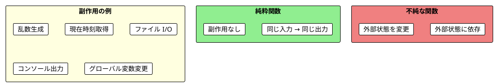
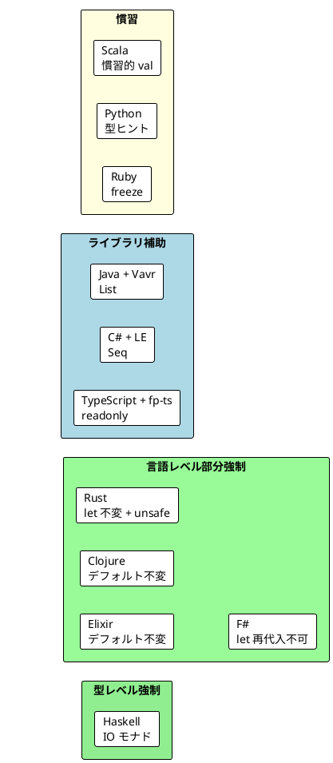

# Part I - 第 2 章：純粋関数と副作用

## 2.1 はじめに：純粋関数の価値

純粋関数は関数型プログラミングの最も基本的な構成要素です。本章では、11 言語で純粋関数がどのように定義・保証・テストされるかを横断的に比較し、以下を明らかにします：

- 純粋関数の共通定義と、言語ごとの保証メカニズムの違い
- 副作用の扱い方に表れる言語設計思想
- 参照透過性がもたらすテスト容易性

---

## 2.2 共通の本質：純粋関数の 2 条件

11 言語すべてで共通する純粋関数の定義は、以下の 2 条件です：

1. **決定性**: 同じ入力には常に同じ出力を返す
2. **副作用なし**: 外部状態を読み取らず、変更もしない



3 つの言語グループから代表例を見てみましょう：

**純粋関数**:

```haskell
-- Haskell: 型シグネチャだけで純粋と分かる
pureIncrement :: Int -> Int
pureIncrement x = x + 1
```

```scala
// Scala: 同じ入力には常に同じ出力
def increment(x: Int): Int = x + 1
```

```java
// Java: return 文ベースだが、ロジックは純粋
public static int increment(int x) {
    return x + 1;
}
```

**不純な関数**:

```haskell
-- Haskell: IO モナドにより、型シグネチャが不純であることを示す
impureRandomPart :: Double -> IO Double
impureRandomPart x = do
    r <- randomIO
    return (x * r)
```

```scala
// Scala / Java: 型からは不純かどうか判断できない
static double randomPart(double x) {
    return x * Math.random();
}
```

**ここに最大の差異があります**: Haskell では不純な関数の戻り値型が `IO Double` になり、型シグネチャを見るだけで副作用の有無が判明します。他の 10 言語では、型情報だけからは純粋性を判断できません。

---

## 2.3 言語別実装比較：副作用の例

各言語が「不純な関数」をどのように示し、何を副作用として強調しているかを比較します。

### 関数型ファースト言語

<details>
<summary>Haskell</summary>

```haskell
-- 不純な関数 - IO モナドで副作用を明示
impureRandomPart :: Double -> IO Double
impureRandomPart x = do
    r <- randomIO
    return (x * r)
```

Haskell は **型レベルで純粋性を強制** する唯一の言語です。副作用のある関数は `IO` モナドでラップされ、純粋関数と混ぜることができません。

</details>

<details>
<summary>Clojure</summary>

```clojure
;; 不純：グローバル状態（動的変数）に依存
(def ^:dynamic *tax-rate* 0.1)

(defn impure-calculate-tax [amount]
  (* amount *tax-rate*))

;; 結果が外部状態に依存する
(impure-calculate-tax 1000)  ; => 100.0

(binding [*tax-rate* 0.2]
  (impure-calculate-tax 1000))  ; => 200.0
```

Clojure は `^:dynamic` 変数（動的束縛）への依存という、Lisp 方言ならではの副作用を示します。また、「純粋なコア / 不純なシェル」という **アーキテクチャパターン** を第 2 章で明示的に教育する唯一の言語です。

</details>

<details>
<summary>Elixir</summary>

```elixir
# 不純な関数 - 毎回異なる値を返す
def random_part(x), do: x * :rand.uniform()

# 不純な関数 - 外部状態に依存
def get_current_time(), do: DateTime.utc_now()
```

Elixir ではすべてのデータがデフォルトでイミュータブルですが、`:rand.uniform()` のような外部呼び出しは言語レベルでは制限されません。

</details>

<details>
<summary>F#</summary>

```fsharp
/// 不純な関数 - 毎回異なる値を返す
let randomPart (x: float) : float =
    x * System.Random().NextDouble()

/// 不純な関数 - 現在時刻を返す
let currentTime () : int64 =
    System.DateTimeOffset.UtcNow.ToUnixTimeMilliseconds()
```

F# の `let` 束縛は再代入不可ですが、副作用を持つ関数の定義自体は制限されません。

</details>

### マルチパラダイム言語

<details>
<summary>Scala</summary>

```java
// Scala の第 2 章では Java コードで不純な関数を示す
static double randomPart(double x) {
    return x * Math.random();
}
```

Scala は不純な関数の例を Java コードで示し、「Scala では副作用を避けるのが自然」というメッセージを暗黙に伝えています。

</details>

<details>
<summary>Rust</summary>

```rust
// 不純な関数 - 呼び出すたびに異なる値を返す
fn current_timestamp() -> u64 {
    use std::time::{SystemTime, UNIX_EPOCH};
    SystemTime::now()
        .duration_since(UNIX_EPOCH)
        .unwrap()
        .as_secs()
}
```

Rust ではグローバル可変状態の変更に `unsafe` ブロックが必要です。`static mut` への書き込みが `unsafe` でなければコンパイルエラーになるため、副作用の一部が言語レベルで可視化されます。

</details>

<details>
<summary>TypeScript</summary>

```typescript
// 不純な関数 - Math.random() は毎回異なる値を返す
const randomPart = (x: number): number => x * Math.random()

// 不純な関数 - 外部状態を変更する
let counter = 0
const incrementCounter = (): number => {
  counter += 1
  return counter
}
```

TypeScript は `readonly` 修飾子でイミュータビリティを型レベルで部分的に保証できますが、副作用の有無は型には表れません。

</details>

### OOP + FP ライブラリ言語

<details>
<summary>Java</summary>

```java
// 不純な関数 - Math.random() は毎回異なる値を返す
public static double randomPart(double x) {
    return x * Math.random();
}

// 不純な関数 - 現在時刻は毎回異なる
public static long currentTime() {
    return System.currentTimeMillis();
}
```

</details>

<details>
<summary>C#</summary>

```csharp
/// 不純な関数 - 毎回異なる値を返す
public static double RandomPart(double x) =>
    x * Random.Shared.NextDouble();

/// 不純な関数 - 現在時刻を返す
public static long CurrentTime() =>
    DateTimeOffset.UtcNow.ToUnixTimeMilliseconds();
```

</details>

<details>
<summary>Python</summary>

```python
import random

# 不純な関数 - random.random() は毎回異なる値を返す
def random_part(x: float) -> float:
    return x * random.random()

# 不純な関数 - 外部状態を変更する
counter = 0
def increment_counter() -> int:
    global counter
    counter += 1
    return counter
```

Python は `global` キーワードによるグローバル変数変更を副作用として明示しています。

</details>

<details>
<summary>Ruby</summary>

```ruby
# 不純: 毎回異なる値を返す
def self.random_number_impure
  rand
end

# 不純: 外部に出力（副作用）
def self.print_impure(message)
  puts message
end

# 不純: 現在時刻に依存
def self.current_time_impure
  Time.now
end
```

Ruby は `puts`（コンソール出力）を副作用として明示する唯一の言語です。「出力も副作用である」という教育的な視点が特徴的です。

</details>

---

## 2.4 ショッピングカート割引：純粋関数による設計

11 言語すべてで、ショッピングカートの割引計算を「不純な設計」と「純粋な設計」の対比で示しています。

### 問題：不純な設計

不純な設計では、`bookAdded` フラグと `items` リストの整合性が保証されず、バグの温床になります。

### 解決：純粋関数による設計

カートのアイテムリストだけを入力として割引率を計算する純粋関数に書き換えます。

**Haskell** — ガード構文:

```haskell
getDiscountPercentage :: [String] -> Int
getDiscountPercentage items
    | "Book" `elem` items = 5
    | otherwise           = 0
```

**Scala** — if 式:

```scala
def getDiscountPercentage(items: List[String]): Int =
  if (items.contains("Book")) 5 else 0
```

**Java** — Vavr のイミュータブルリスト:

```java
import io.vavr.collection.List;

public static int getDiscountPercentage(List<String> items) {
    if (items.contains("Book")) {
        return 5;
    } else {
        return 0;
    }
}
```

**共通パターン**: 全言語で「リストを入力として受け取り、整数を返す」純粋関数です。差異は引数の型にあります。

| 言語 | 引数の型 | イミュータブル保証 |
|------|---------|-----------------|
| Haskell | `[String]` | 言語レベルで完全保証 |
| Clojure | ベクター | 言語デフォルトで保証 |
| Elixir | リスト | 言語デフォルトで保証 |
| F# | `string list` | 言語デフォルトで保証 |
| Scala | `List[String]` | 標準ライブラリで保証 |
| Rust | `&[&str]` | 借用で保証（コピーなし） |
| TypeScript | `readonly string[]` | コンパイル時に保証 |
| Java | `List<String>` (Vavr) | ライブラリで保証 |
| C# | `Seq<string>` (LE) | ライブラリで保証 |
| Python | `list[str]` | 保証なし（慣習に依存） |
| Ruby | `Array` | 保証なし（`freeze` で部分保証） |

### 11 言語の全実装

<details>
<summary>Haskell</summary>

```haskell
getDiscountPercentage :: [String] -> Int
getDiscountPercentage items
    | "Book" `elem` items = 5
    | otherwise           = 0

calculateDiscount :: Double -> [String] -> Double
calculateDiscount price items =
    price * fromIntegral (getDiscountPercentage items) / 100
```

</details>

<details>
<summary>Clojure</summary>

Clojure は他の 10 言語と異なり、第 1 章（1.8）でショッピングカートを扱っています。関数型スタイルの対比はありますが、"Book" 割引パターンは使用していません。

</details>

<details>
<summary>Elixir</summary>

```elixir
defmodule Ch02.ShoppingCart do
  def get_discount_percentage(items) do
    if "Book" in items, do: 5, else: 0
  end

  def add_item(items, item), do: items ++ [item]
  def remove_item(items, item), do: List.delete(items, item)
end
```

</details>

<details>
<summary>F#</summary>

```fsharp
let getDiscountPercentage (items: string list) : int =
    if List.contains "Book" items then 5
    else 0

let addItem (items: string list) (item: string) : string list =
    item :: items

let removeItem (items: string list) (item: string) : string list =
    items |> List.filter (fun i -> i <> item)
```

</details>

<details>
<summary>Scala</summary>

```scala
object ShoppingCart {
  def getDiscountPercentage(items: List[String]): Int =
    if (items.contains("Book")) 5 else 0
}
```

</details>

<details>
<summary>Rust</summary>

```rust
fn get_discount_percentage(items: &[&str]) -> i32 {
    if items.contains(&"Book") { 5 } else { 0 }
}

fn calculate_discount(total: i32, percentage: i32) -> i32 {
    total * percentage / 100
}

fn calculate_final_price(total: i32, items: &[&str]) -> i32 {
    let discount = calculate_discount(total, get_discount_percentage(items));
    total - discount
}
```

</details>

<details>
<summary>TypeScript</summary>

```typescript
const getDiscountPercentage = (items: readonly string[]): number =>
  items.includes('Book') ? 5 : 0

const calculateFinalPrice = (price: number, items: readonly string[]): number => {
  const discountPercent = getDiscountPercentage(items)
  return price - (price * discountPercent) / 100
}
```

</details>

<details>
<summary>Java</summary>

```java
import io.vavr.collection.List;

public static int getDiscountPercentage(List<String> items) {
    if (items.contains("Book")) {
        return 5;
    } else {
        return 0;
    }
}
```

</details>

<details>
<summary>C#</summary>

```csharp
public static int GetDiscountPercentage(Seq<string> items) =>
    items.Exists(x => x == "Book") ? 5 : 0;

public static Seq<string> AddItem(Seq<string> items, string item) =>
    items.Add(item);

public static Seq<string> RemoveItem(Seq<string> items, string item) =>
    items.Filter(i => i != item);
```

</details>

<details>
<summary>Python</summary>

```python
def get_discount_percentage(items: list[str]) -> int:
    """アイテムリストから割引率を計算する純粋関数。"""
    return 5 if "Book" in items else 0
```

</details>

<details>
<summary>Ruby</summary>

```ruby
module ShoppingCart
  def self.get_discount_percentage(items)
    items.include?('Book') ? 5 : 0
  end

  def self.calculate_final_price(total, items)
    discount_percentage = get_discount_percentage(items)
    total - total * discount_percentage / 100.0
  end
end
```

</details>

---

## 2.5 チップ計算：条件分岐の言語間差異

チップ計算は「グループの人数に応じて異なるチップ率を返す」例題で、条件分岐の言語間差異が明確に表れます。

**ルール**: 0 人 → 0%、1〜5 人 → 10%、6 人以上 → 20%

### 条件分岐スタイルの比較

3 つの代表的な分岐スタイルが見られます：

**1. ガード構文**（Haskell）:

```haskell
getTipPercentage :: [String] -> Int
getTipPercentage names
    | length names > 5  = 20
    | length names > 0  = 10
    | otherwise         = 0
```

**2. パターンマッチ / match 式**（Rust, F#, C#）:

```rust
fn get_tip_percentage(names: &[&str]) -> i32 {
    match names.len() {
        0 => 0,
        1..=5 => 10,
        _ => 20,
    }
}
```

```fsharp
let getTipPercentageMatch (names: string list) : int =
    match List.length names with
    | n when n > 5 -> 20
    | n when n > 0 -> 10
    | _ -> 0
```

```csharp
public static int GetTipPercentageMatch(Seq<string> names) =>
    names.Count switch
    {
        > 5 => 20,
        > 0 => 10,
        _ => 0
    };
```

**3. if-else チェーン**（Scala, Java, Elixir, Python, TypeScript, Ruby）:

```scala
def getTipPercentage(names: List[String]): Int =
  if (names.size > 5) 20
  else if (names.size > 0) 10
  else 0
```

**発見**: Rust の範囲パターン `1..=5` は、if-else の連鎖を排除して意図を最も明確に伝えます。F# と C# もパターンマッチ版を併記しており、「パターンマッチは条件分岐の関数型的表現である」ことを示唆しています。

> **Clojure の例外**: Clojure は第 2 章にチップ計算を含みません。代わりに給与計算システムやデータバリデーションなど、より実践的な例題を扱います。

<details>
<summary>11 言語の全実装</summary>

| 言語 | 分岐スタイル | 特徴 |
|------|------------|------|
| Haskell | ガード `\|` | 最も宣言的 |
| Rust | `match` + 範囲パターン | `1..=5` で範囲を明示 |
| F# | `match` + `when` ガード | パターンマッチ版を併記 |
| C# | `switch` 式 | `> 5 =>` で関係パターン |
| Scala | if-else（式） | 式として値を返す |
| Elixir | `cond` | 複数条件の Elixir イディオム |
| Java | if-else（文） | `return` が各行に必要 |
| Python | if-elif-else | 最もシンプルな構文 |
| TypeScript | if + early return | アロー関数内 |
| Ruby | if-elsif-else | 最後の式が戻り値 |

</details>

---

## 2.6 テスト容易性：純粋関数が変えるもの

純粋関数の最大の実践的利点は **テストの容易さ** です。

### 純粋関数のテスト vs 状態を持つコードのテスト

| 観点 | 純粋関数 | 状態を持つコード |
|------|---------|----------------|
| セットアップ | 不要 | 必要（初期状態の構築） |
| 実行順序 | 依存しない | 依存する |
| 決定性 | 常に決定論的 | 非決定論的になりやすい |
| モック | 不要 | 必要 |
| 速度 | 高速 | 低速（I/O 等） |

### テストフレームワークの言語間比較

各言語の `increment` 関数のテストコードを比較します：

<details>
<summary>Haskell（HSpec + QuickCheck）</summary>

```haskell
describe "pureIncrement" $ do
    it "increments 5 to 6" $ do
        pureIncrement 5 `shouldBe` 6

    it "same input always gives same output" $ do
        pureIncrement 10 `shouldBe` pureIncrement 10

    -- プロパティベーステスト
    it "property: pureIncrement x == x + 1" $ property $
        \x -> pureIncrement x == x + 1
```

Haskell は **QuickCheck によるプロパティベーステスト** を示す唯一の言語です。「すべての `x` に対して `pureIncrement x == x + 1`」という性質を自動検証します。

</details>

<details>
<summary>Elixir（ExUnit）</summary>

```elixir
test "同じ入力に対して常に同じ出力（参照透過性）" do
  for _ <- 1..100 do
    assert Ch02.PureFunctions.increment(5) == 6
  end
end
```

Elixir は 100 回ループで参照透過性を実演的に証明するアプローチが特徴的です。

</details>

<details>
<summary>Java（JUnit 5 + AssertJ）</summary>

```java
@Test
@DisplayName("increment は入力に1を加える")
void incrementAddOne() {
    assertThat(IntroJava.increment(0)).isEqualTo(1);
    assertThat(IntroJava.increment(6)).isEqualTo(7);
    assertThat(IntroJava.increment(-1)).isEqualTo(0);
}
```

</details>

<details>
<summary>F#（xUnit）</summary>

```fsharp
[<Fact>]
let ``increment は数値を1増やす`` () =
    Assert.Equal(7, increment 6)
    Assert.Equal(1, increment 0)
    Assert.Equal(-5, increment -6)
```

F# のバックティック記法（` `` `` `）で日本語テスト名を自然に書ける点が特徴です。

</details>

<details>
<summary>Rust（組み込みテスト）</summary>

```rust
#[cfg(test)]
mod tests {
    use super::*;

    #[test]
    fn test_increment() {
        assert_eq!(increment(5), 6);
        assert_eq!(increment(0), 1);
        assert_eq!(increment(-1), 0);
    }
}
```

Rust はテストが同ファイル内の `#[cfg(test)]` モジュールに内包される構造です。

</details>

<details>
<summary>Python（pytest）</summary>

```python
class TestIncrement:
    def test_positive_number(self) -> None:
        assert increment(5) == 6

    def test_zero(self) -> None:
        assert increment(0) == 1

    def test_negative_number(self) -> None:
        assert increment(-1) == 0
```

</details>

<details>
<summary>Ruby（RSpec）</summary>

```ruby
RSpec.describe Ch02PureFunctions do
  describe '.word_score' do
    it 'returns the length of the word' do
      expect(described_class.word_score('Ruby')).to eq(4)
    end

    it 'is deterministic (same input = same output)' do
      score1 = described_class.word_score('Scala')
      score2 = described_class.word_score('Scala')
      expect(score1).to eq(score2)
    end
  end
end
```

</details>

<details>
<summary>Scala / TypeScript / C#</summary>

Scala は `assert` 直接使用、TypeScript はコード内インライン検証、C# は xUnit を使用します。

</details>

---

## 2.7 参照透過性

**参照透過性** とは、「式をその評価結果で置き換えても、プログラムの意味が変わらない」性質です。純粋関数は参照透過性を持ち、これにより推論・最適化・テストが容易になります。

### 言語間での説明アプローチ

参照透過性の説明方法に言語ごとの特色が表れます：

**Haskell** — 命題を関数として表現し、`True` を返すことで「証明」する：

```haskell
referentialTransparencyExample :: Bool
referentialTransparencyExample =
    let x = wordScore "Scala"  -- 3
        y = wordScore "Scala"  -- 3
    in x == y                  -- True
```

**Clojure** — マップで「名前による参照」と「値による参照」の同値性を示す：

```clojure
(defn referential-transparency-demo []
  (let [x 3
        y 9
        z (+ x y)]
    {:using-names z :using-values (+ 3 9)}))
;; => {:using-names 12 :using-values 12}
```

**Elixir** — 100 回ループで決定性を実行的に証明する：

```elixir
test "同じ入力に対して常に同じ出力（参照透過性）" do
  for _ <- 1..100 do
    assert Ch02.PureFunctions.increment(5) == 6
  end
end
```

**他の言語** — 変数に代入して同値であることを示すシンプルな例：

```scala
val score1 = wordScore("Scala")  // 3
val score2 = wordScore("Scala")  // 3
assert(score1 == score2)         // true
```

---

## 2.8 比較分析：純粋性の保証スペクトラム

11 言語を「純粋性の保証レベル」で分類すると、明確なスペクトラムが見えます。



| レベル | 言語 | メカニズム | 強制度 |
|--------|------|----------|--------|
| **型レベル強制** | Haskell | `IO` モナドにより不純な関数の型が変わる | 最高 |
| **言語レベル部分強制** | Rust | `let` 不変 + `unsafe` で可変操作を隔離 | 高 |
| | Elixir, Clojure | すべてのデータがデフォルトでイミュータブル | 高 |
| | F# | `let` 束縛は再代入不可、`mutable` が必要 | 中〜高 |
| **ライブラリ補助** | Java + Vavr | `io.vavr.collection.List` でイミュータブルリスト | 中 |
| | C# + LanguageExt | `Seq<T>` でイミュータブルシーケンス | 中 |
| | TypeScript + fp-ts | `readonly` + `ReadonlyArray` で型レベル保証 | 中 |
| **慣習** | Scala | `val` の使用が慣習だが `var` も自由 | 低 |
| | Python | 型ヒントは実行時に無視される | 低 |
| | Ruby | `freeze` はオプションで不完全 | 低 |

---

## 2.9 言語固有の特徴

### Haskell：Maybe 型の先行導入

Haskell は第 2 章で `Maybe` 型を先行導入し、部分関数（`head` など）の安全な代替を示します。

```haskell
safeHead :: [a] -> Maybe a
safeHead []    = Nothing
safeHead (x:_) = Just x
```

### Clojure：副作用分離のアーキテクチャ

Clojure は「純粋なコア / 不純なシェル」パターンを第 2 章で明示的に教育する唯一の言語です。給与計算システムやデータバリデーションなど、他の 10 言語にはない実践的な例題で構成されています。

### Rust：所有権と純粋性の関係

Rust は借用（`&T`）= 読み取り専用 = 副作用なしという関係を所有権システムの文脈で説明し、第 2 章で独立したセクション（2.5）を設けています。

### Ruby：freeze と deep_freeze

Ruby は `freeze` によるイミュータビリティ強制を第 2 章で扱い、`deep_freeze` の実装を演習問題として出題しています。

---

## 2.10 実践的な選択指針

| 要件 | 推奨アプローチ |
|------|--------------|
| 純粋性を型で保証したい | Haskell（`IO` モナド） |
| イミュータビリティを言語レベルで保証したい | Elixir, Clojure, F#, Rust |
| 既存 OOP コードに純粋関数を段階的に導入したい | Java + Vavr, C# + LanguageExt, TypeScript + fp-ts |
| 副作用分離のアーキテクチャを学びたい | Clojure（純粋コア / 不純シェル） |
| テスト駆動で純粋関数を活用したい | どの言語でも可能（Haskell の PBT が最も強力） |

---

## 2.11 まとめ

### 言語横断的な学び

1. **純粋関数の 2 条件は普遍**: 決定性と副作用なし。この定義は 11 言語すべてで共通
2. **保証メカニズムは 4 段階**: 型レベル強制（Haskell）→ 言語レベル部分強制 → ライブラリ補助 → 慣習
3. **Haskell の IO モナドは唯一無二**: 型シグネチャだけで純粋性を判断できるのは 11 言語中 Haskell のみ
4. **テスト容易性は言語非依存**: 純粋関数のテストの簡潔さはどの言語でも実感できる
5. **条件分岐に個性が出る**: ガード構文、パターンマッチ、if-else の選択が言語の FP 度合いを反映

### 各言語の個別記事

| グループ | 言語 | 個別記事 |
|---------|------|---------|
| 関数型ファースト | Haskell | [Part I](../haskell/part-1.md) |
| | Clojure | [Part I](../clojure/part-1.md) |
| | Elixir | [Part I](../elixir/part-1.md) |
| | F# | [Part I](../fsharp/part-1.md) |
| マルチパラダイム | Scala | [Part I](../scala/part-1.md) |
| | Rust | [Part I](../rust/part-1.md) |
| | TypeScript | [Part I](../typescript/part-1.md) |
| OOP + FP | Java | [Part I](../java/part-1.md) |
| | C# | [Part I](../csharp/part-1.md) |
| | Python | [Part I](../python/part-1.md) |
| | Ruby | [Part I](../ruby/part-1.md) |
