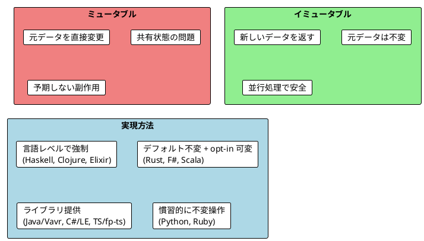
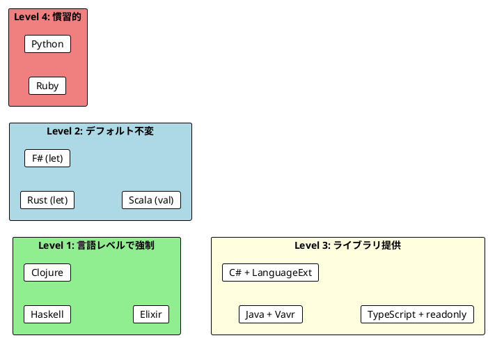

# Part II - 第 3 章：イミュータブルなデータ操作

## 3.1 はじめに：なぜイミュータブルか

関数型プログラミングでは、データは**一度作ったら変更しない**のが原則です。リストに要素を追加するとき、元のリストを変更するのではなく、新しいリストを返します。このアプローチは一見非効率に思えますが、並行処理での安全性、デバッグの容易さ、予測可能なプログラムの構築に大きな利点をもたらします。

本章では、11 言語でイミュータブルなデータ操作がどのように実現されるかを横断的に比較し、以下を明らかにします：

- リスト操作（追加・スライス・結合）の言語別イディオム
- 旅程再計画パターンで見る「コピーオンライト」の実践
- 不変性の保証レベルの違い（言語組み込み vs ライブラリ vs 慣習）



---

## 3.2 共通の本質：コピーオンライトの原則

11 言語すべてに共通するイミュータブル操作の原則は、**コピーオンライト**（Copy-on-Write）です：

1. **元データは変更しない**: 操作後も元のデータはそのまま残る
2. **新しいデータを返す**: 追加・削除・更新の結果は常に新しいデータ
3. **変更履歴が自然に残る**: 操作前後のデータを同時に参照可能

```plantuml
@startuml
!theme plain

rectangle "planA" #LightBlue {
  card "Paris" as a1
  card "Berlin" as a2
  card "Kraków" as a3
  a1 -right-> a2
  a2 -right-> a3
}

rectangle "planB = replan(planA, \"Vienna\", \"Kraków\")" #LightGreen {
  card "Paris " as b1
  card "Berlin " as b2
  card "Vienna" as b3
  card "Kraków " as b4
  b1 -right-> b2
  b2 -right-> b3
  b3 -right-> b4
}

note bottom of planA : 元の計画はそのまま残る

@enduml
```

3 つの言語グループから代表例を見てみましょう：

**イミュータブルなリスト追加**:

```haskell
-- Haskell: すべてがデフォルトでイミュータブル
appended :: [a] -> a -> [a]
appended xs x = xs ++ [x]

let appleBook = ["Apple", "Book"]
let appleBookMango = appended appleBook "Mango"
-- appleBook は変わらない
```

```scala
// Scala: List はデフォルトでイミュータブル
val appleBook = List("Apple", "Book")
val appleBookMango = appleBook.appended("Mango")
assert(appleBookMango == List("Apple", "Book", "Mango"))
assert(appleBook == List("Apple", "Book"))  // 元のリストは変わらない
```

```java
// Java (Vavr): ライブラリでイミュータブルリストを提供
List<String> appleBook = List.of("Apple", "Book");
List<String> appleBookMango = appleBook.append("Mango");
assert appleBookMango.equals(List.of("Apple", "Book", "Mango"));
assert appleBook.equals(List.of("Apple", "Book"));  // 元のリストは変わらない
```

**共通パターン**: どの言語でも `append` 操作は元のリストを変更せず、新しいリストを返します。

---

## 3.3 言語別リスト操作比較

### 3.3.1 要素追加

最も基本的なイミュータブル操作であるリストへの要素追加を 11 言語で比較します。

#### 関数型ファースト言語

<details>
<summary>Haskell 実装</summary>

```haskell
appended :: [a] -> a -> [a]
appended xs x = xs ++ [x]

let appleBook = ["Apple", "Book"]
let appleBookMango = appended appleBook "Mango"
-- appleBookMango == ["Apple", "Book", "Mango"]
```

Haskell ではすべてのデータがイミュータブルです。`++` 演算子はリストの結合を行い、常に新しいリストを返します。

</details>

<details>
<summary>Clojure 実装</summary>

```clojure
(conj [1 2 3] 4)          ; => [1 2 3 4]
(into [1 2] [3 4 5])      ; => [1 2 3 4 5]
```

Clojure は**永続データ構造**（Persistent Data Structures）を採用しており、`conj` はベクタの末尾に、リストの先頭に要素を追加します。`into` は複数要素の結合に使います。

</details>

<details>
<summary>Elixir 実装</summary>

```elixir
def append(list, element), do: list ++ [element]
def prepend(list, element), do: [element | list]

append(["Apple", "Book"], "Mango")
# => ["Apple", "Book", "Mango"]
```

Elixir ではすべてのデータがイミュータブルです。`++` でリスト結合、`|` で先頭追加（prepend）を行います。先頭追加は O(1) ですが、末尾追加は O(n) です。

</details>

<details>
<summary>F# 実装</summary>

```fsharp
let appleBook = ["Apple"; "Book"]
let appleBookMango = appleBook @ ["Mango"]
// appleBookMango = ["Apple"; "Book"; "Mango"]
```

F# の `@` 演算子はリスト結合を行います。F# のリストはデフォルトでイミュータブルです。

</details>

#### マルチパラダイム言語

<details>
<summary>Scala 実装</summary>

```scala
val appleBook      = List("Apple", "Book")
val appleBookMango = appleBook.appended("Mango")
assert(appleBookMango == List("Apple", "Book", "Mango"))
```

Scala の `List` はイミュータブルなコレクションです。`appended` は末尾追加、`prepended` は先頭追加を行います。

</details>

<details>
<summary>Rust 実装</summary>

```rust
let apple_book = vec!["Apple", "Book"];
let mut apple_book_mango = apple_book.clone();
apple_book_mango.push("Mango");
// apple_book はそのまま残る（clone したため）
```

Rust では `Vec` はミュータブルですが、所有権システムにより安全性が保証されます。イミュータブルに操作するには `clone()` で新しいベクタを作成します。

</details>

<details>
<summary>TypeScript 実装</summary>

```typescript
const appended = <T>(lst: readonly T[], element: T): readonly T[] =>
  [...lst, element]

const appleBook = ["Apple", "Book"] as const
const appleBookMango = appended(appleBook, "Mango")
// ["Apple", "Book", "Mango"]
```

TypeScript ではスプレッド演算子 `[...]` でイミュータブルな追加を実現します。`readonly` 修飾子で型レベルの不変保証を行います。

</details>

#### OOP + FP ライブラリ言語

<details>
<summary>Java (Vavr) 実装</summary>

```java
List<String> appleBook = List.of("Apple", "Book");
List<String> appleBookMango = appleBook.append("Mango");
assert appleBookMango.equals(List.of("Apple", "Book", "Mango"));
```

Java の標準 `java.util.List` はミュータブルですが、Vavr の `List` はイミュータブルな永続データ構造を提供します。

</details>

<details>
<summary>C# (LanguageExt) 実装</summary>

```csharp
var appleBook = Seq("Apple", "Book");
var appleBookMango = appleBook.Add("Mango");
// appleBookMango = Seq("Apple", "Book", "Mango")
```

C# の LanguageExt は `Seq<T>` でイミュータブルなシーケンスを提供します。

</details>

<details>
<summary>Python 実装</summary>

```python
def appended(lst: list[str], element: str) -> list[str]:
    return lst + [element]

apple_book = ["Apple", "Book"]
new_list = appended(apple_book, "Mango")
# new_list == ["Apple", "Book", "Mango"]
# apple_book == ["Apple", "Book"]  # 元のリストは変わらない
```

Python の `+` 演算子は新しいリストを返します。`append()` メソッドはミュータブル操作なので注意が必要です。

</details>

<details>
<summary>Ruby 実装</summary>

```ruby
apple_book = %w[Apple Book]
apple_book_mango = apple_book + ["Mango"]
# apple_book_mango  # => ["Apple", "Book", "Mango"]
# apple_book        # => ["Apple", "Book"]  # 元は変わらない
```

Ruby の `+` 演算子は新しい配列を返します。`push` や `<<` はミュータブル操作なので、イミュータブルに操作するには `+` を使います。

</details>

### 3.3.2 スライス操作

リストから一部の要素を取り出す操作を比較します。

#### 関数型ファースト言語

<details>
<summary>Haskell 実装</summary>

```haskell
firstTwo :: [a] -> [a]
firstTwo = take 2

lastTwo :: [a] -> [a]
lastTwo xs = drop (length xs - 2) xs

slice :: Int -> Int -> [a] -> [a]
slice start end xs = take (end - start) $ drop start xs
```

Haskell の `take` / `drop` は最も簡潔なスライス操作です。

</details>

<details>
<summary>Clojure 実装</summary>

```clojure
(take 2 ["a" "b" "c" "d"])        ; => ("a" "b")
(drop 2 ["a" "b" "c" "d"])        ; => ("c" "d")
(subvec ["a" "b" "c" "d"] 1 3)    ; => ["b" "c"]
```

Clojure はベクタに対して `subvec` でインデックス指定のスライスも可能です。

</details>

<details>
<summary>Elixir 実装</summary>

```elixir
Enum.take(["a", "b", "c", "d"], 2)   # => ["a", "b"]
Enum.drop(["a", "b", "c", "d"], 2)   # => ["c", "d"]
Enum.slice(["a", "b", "c", "d"], 1, 2)  # => ["b", "c"]
```

Elixir の `Enum` モジュールは豊富なリスト操作関数を提供します。

</details>

<details>
<summary>F# 実装</summary>

```fsharp
let firstN (n: int) (list: 'a list) : 'a list =
    list |> List.truncate n

let lastN (n: int) (list: 'a list) : 'a list =
    let skipCount = max 0 (List.length list - n)
    list |> List.skip skipCount

let slice start finish list =
    list |> List.skip start |> List.truncate (finish - start)
```

F# のパイプライン演算子 `|>` で、データの流れが左から右に読めます。

</details>

#### マルチパラダイム言語

<details>
<summary>Scala 実装</summary>

```scala
def slice(start: Int, end: Int, list: List[String]): List[String] =
  list.slice(start, end)

assert(slice(0, 2, List("a", "b", "c")) == List("a", "b"))
```

Scala は `slice` メソッドで直接インデックス範囲を指定できます。

</details>

<details>
<summary>TypeScript 実装</summary>

```typescript
const firstTwo = <T>(lst: readonly T[]): readonly T[] =>
  lst.slice(0, 2)

const lastTwo = <T>(lst: readonly T[]): readonly T[] =>
  lst.slice(Math.max(0, lst.length - 2))
```

TypeScript の `Array.slice()` は元の配列を変更せず、新しい配列を返します。

</details>

<details>
<summary>Ruby 実装</summary>

```ruby
def first_two(list)
  list.take(2)
end

def last_two(list)
  list.last(2)
end

def slice(list, start_idx, end_idx)
  list[start_idx...end_idx] || []
end
```

Ruby は `take`, `drop`, 範囲演算子 `[start...end]` の 3 通りのスライス方法を持ちます。

</details>

#### OOP + FP ライブラリ言語

<details>
<summary>Java (Vavr) 実装</summary>

```java
public static <T> List<T> slice(List<T> list, int start, int end) {
    return list.drop(start).take(end - start);
}

List<String> fruits = List.of("a", "b", "c", "d");
assert slice(fruits, 1, 3).equals(List.of("b", "c"));
```

Vavr の `take` / `drop` の組み合わせでスライスを実現します。

</details>

<details>
<summary>C# (LanguageExt) 実装</summary>

```csharp
public static Seq<T> FirstN<T>(Seq<T> seq, int n) =>
    seq.Take(n);

public static Seq<T> LastN<T>(Seq<T> seq, int n) {
    var skipCount = Math.Max(0, seq.Count - n);
    return seq.Skip(skipCount);
}
```

C# の LINQ スタイル（`Take`, `Skip`）で直感的にスライス操作を記述できます。

</details>

<details>
<summary>Python 実装</summary>

```python
def first_two(lst: list[str]) -> list[str]:
    return lst[:2]

def last_two(lst: list[str]) -> list[str]:
    return lst[-2:]
```

Python のスライス記法 `[start:end]` は全言語中で最も簡潔です。負のインデックス `[-2:]` で末尾からの取得も自然に書けます。

</details>

### 3.3.3 スライス操作の語彙比較

| 操作 | Haskell | Clojure | Elixir | F# | Scala | Rust | TypeScript | Java (Vavr) | C# (LE) | Python | Ruby |
|------|---------|---------|--------|----|-------|------|------------|-------------|---------|--------|------|
| 先頭 N 個 | `take n` | `(take n)` | `Enum.take(n)` | `List.truncate n` | `.take(n)` | `[..n]` | `.slice(0,n)` | `.take(n)` | `.Take(n)` | `[:n]` | `.take(n)` |
| 先頭 N 個除去 | `drop n` | `(drop n)` | `Enum.drop(n)` | `List.skip n` | `.drop(n)` | `[n..]` | `.slice(n)` | `.drop(n)` | `.Skip(n)` | `[n:]` | `.drop(n)` |
| 範囲指定 | `take . drop` | `(subvec)` | `Enum.slice` | `skip \|> truncate` | `.slice(s,e)` | `[s..e]` | `.slice(s,e)` | `drop.take` | `Skip.Take` | `[s:e]` | `[s...e]` |

**発見**: `take` / `drop` という語彙は Haskell から広まり、Clojure, Elixir, Scala, Java (Vavr), Ruby で共有されています。一方、Python のスライス記法 `[:]` と Rust のスライス記法 `[..]` は独自の進化を遂げた簡潔な表現です。

---

## 3.4 旅程再計画パターン：コピーオンライトの実践

旅行の旅程（都市リスト）を「変更せずに新しい旅程を作る」パターンは、イミュータブル操作の本質を最もよく表しています。指定した都市の前に新しい都市を挿入する `replan` 関数を 11 言語で比較します。

### ビジネスロジック

```
planA = ["Paris", "Berlin", "Kraków"]
planB = replan(planA, "Vienna", "Kraków")
-- planB == ["Paris", "Berlin", "Vienna", "Kraków"]
-- planA == ["Paris", "Berlin", "Kraków"]  ← 変わらない！
```

### 代表 3 言語の比較

**Haskell**: `take` / `drop` の組み合わせ

```haskell
replan :: [String] -> String -> String -> [String]
replan plan newCity beforeCity =
    let beforeCityIndex = findIndex beforeCity plan
        citiesBefore    = take beforeCityIndex plan
        citiesAfter     = drop beforeCityIndex plan
    in citiesBefore ++ [newCity] ++ citiesAfter
```

**Scala**: メソッドチェーンスタイル

```scala
def replan(plan: List[String], newCity: String, beforeCity: String): List[String] = {
  val beforeCityIndex = plan.indexOf(beforeCity)
  val citiesBefore    = plan.slice(0, beforeCityIndex)
  val citiesAfter     = plan.slice(beforeCityIndex, plan.size)
  citiesBefore.appended(newCity).appendedAll(citiesAfter)
}
```

**Python**: スライス記法の簡潔さ

```python
def replan(plan: list[str], new_city: str, before_city: str) -> list[str]:
    try:
        index = plan.index(before_city)
        return plan[:index] + [new_city] + plan[index:]
    except ValueError:
        return plan + [new_city]
```

### 全 11 言語の実装

#### 関数型ファースト言語

<details>
<summary>Haskell 実装</summary>

```haskell
replan :: [String] -> String -> String -> [String]
replan plan newCity beforeCity =
    let beforeCityIndex = findIndex beforeCity plan
        citiesBefore    = take beforeCityIndex plan
        citiesAfter     = drop beforeCityIndex plan
    in citiesBefore ++ [newCity] ++ citiesAfter

let planA = ["Paris", "Berlin", "Krakow"]
let planB = replan planA "Vienna" "Krakow"
-- planB == ["Paris", "Berlin", "Vienna", "Krakow"]
-- planA は変わらない
```

</details>

<details>
<summary>Clojure 実装</summary>

```clojure
(defn replan [plan new-city before-city]
  (let [index (.indexOf (vec plan) before-city)
        cities-before (take index plan)
        cities-after (drop index plan)]
    (into (conj (vec cities-before) new-city) cities-after)))

(def plan-a ["Paris" "Berlin" "Kraków"])
(def plan-b (replan plan-a "Vienna" "Kraków"))
;; plan-b => ["Paris" "Berlin" "Vienna" "Kraków"]
;; plan-a は変わらない（永続データ構造）
```

</details>

<details>
<summary>Elixir 実装</summary>

```elixir
def replan(plan, new_city, before_city) do
  before_city_index = Enum.find_index(plan, &(&1 == before_city))
  cities_before = Enum.take(plan, before_city_index)
  cities_after = Enum.drop(plan, before_city_index)
  cities_before ++ [new_city] ++ cities_after
end

plan_a = ["Paris", "Berlin", "Kraków"]
plan_b = replan(plan_a, "Vienna", "Kraków")
# plan_b == ["Paris", "Berlin", "Vienna", "Kraków"]
# plan_a は変わらない
```

</details>

<details>
<summary>F# 実装</summary>

```fsharp
let replan (plan: string list) (newCity: string) (beforeCity: string) : string list =
    let index =
        plan
        |> List.tryFindIndex (fun c -> c = beforeCity)
        |> Option.defaultValue (List.length plan)
    let citiesBefore = plan |> List.truncate index
    let citiesAfter = plan |> List.skip index
    citiesBefore @ [newCity] @ citiesAfter

let planA = ["Paris"; "Berlin"; "Kraków"]
let planB = replan planA "Vienna" "Kraków"
// planB = ["Paris"; "Berlin"; "Vienna"; "Kraków"]
// planA は変わらない
```

F# ではパイプライン演算子 `|>` と `List.tryFindIndex` の `Option` 返却で、安全なインデックス検索を実現しています。

</details>

#### マルチパラダイム言語

<details>
<summary>Scala 実装</summary>

```scala
def replan(plan: List[String], newCity: String, beforeCity: String): List[String] = {
  val beforeCityIndex = plan.indexOf(beforeCity)
  val citiesBefore    = plan.slice(0, beforeCityIndex)
  val citiesAfter     = plan.slice(beforeCityIndex, plan.size)
  citiesBefore.appended(newCity).appendedAll(citiesAfter)
}

val planA = List("Paris", "Berlin", "Kraków")
val planB = replan(planA, "Vienna", "Kraków")

assert(planB == List("Paris", "Berlin", "Vienna", "Kraków"))
assert(planA == List("Paris", "Berlin", "Kraków"))  // 元の計画は変わらない！
```

</details>

<details>
<summary>Rust 実装</summary>

```rust
pub fn replan<'a>(plan: &[&'a str], new_city: &'a str, before_city: &str) -> Vec<&'a str> {
    let before_city_index = plan.iter().position(|&c| c == before_city);

    match before_city_index {
        Some(index) => {
            let cities_before = &plan[..index];
            let cities_after = &plan[index..];
            let mut result = cities_before.to_vec();
            result.push(new_city);
            result.extend_from_slice(cities_after);
            result
        }
        None => {
            let mut result = plan.to_vec();
            result.push(new_city);
            result
        }
    }
}
```

Rust ではスライス `[..index]` と所有権システムにより、元のデータは借用（borrow）のまま安全に新しい `Vec` を構築します。ライフタイム注釈 `'a` が参照の有効期限を明示します。

</details>

<details>
<summary>TypeScript 実装</summary>

```typescript
const replan = (
  plan: readonly string[],
  newCity: string,
  beforeCity: string
): readonly string[] => {
  const index = plan.indexOf(beforeCity)
  if (index === -1) return [...plan, newCity]
  return [...plan.slice(0, index), newCity, ...plan.slice(index)]
}

const planA = ['Paris', 'Berlin', 'Kraków']
const planB = replan(planA, 'Vienna', 'Kraków')
// planB === ['Paris', 'Berlin', 'Vienna', 'Kraków']
// planA === ['Paris', 'Berlin', 'Kraków']  // 変わらない
```

TypeScript ではスプレッド演算子 `[...]` でイミュータブルな操作を実現します。`readonly` 型により、関数シグネチャで不変性を宣言します。

</details>

#### OOP + FP ライブラリ言語

<details>
<summary>Java (Vavr) 実装</summary>

```java
public static List<String> replan(List<String> plan, String newCity, String beforeCity) {
    int beforeCityIndex = plan.indexOf(beforeCity);
    List<String> citiesBefore = plan.take(beforeCityIndex);
    List<String> citiesAfter = plan.drop(beforeCityIndex);
    return citiesBefore.append(newCity).appendAll(citiesAfter);
}

List<String> planA = List.of("Paris", "Berlin", "Kraków");
List<String> planB = replan(planA, "Vienna", "Kraków");

assert planB.equals(List.of("Paris", "Berlin", "Vienna", "Kraków"));
assert planA.equals(List.of("Paris", "Berlin", "Kraków"));  // 変わらない！
```

</details>

<details>
<summary>C# (LanguageExt) 実装</summary>

```csharp
public static Seq<string> Replan(Seq<string> plan, string newCity, string beforeCity) {
    var index = plan.ToList().FindIndex(c => c == beforeCity);
    if (index < 0) index = plan.Count;

    var citiesBefore = plan.Take(index);
    var citiesAfter = plan.Skip(index);
    return citiesBefore.Add(newCity).Concat(citiesAfter);
}

var planA = Seq("Paris", "Berlin", "Kraków");
var planB = Replan(planA, "Vienna", "Kraków");
```

</details>

<details>
<summary>Python 実装</summary>

```python
def replan(plan: list[str], new_city: str, before_city: str) -> list[str]:
    """指定した都市の前に新しい都市を挿入した旅程を返す。"""
    try:
        index = plan.index(before_city)
        return plan[:index] + [new_city] + plan[index:]
    except ValueError:
        return plan + [new_city]

plan_a = ["Paris", "Berlin", "Kraków"]
plan_b = replan(plan_a, "Vienna", "Kraków")

assert plan_b == ["Paris", "Berlin", "Vienna", "Kraków"]
assert plan_a == ["Paris", "Berlin", "Kraków"]  # 変わらない！
```

</details>

<details>
<summary>Ruby 実装</summary>

```ruby
def self.replan(plan, new_city, before_city)
  index = plan.index(before_city)
  return plan if index.nil?

  before = plan.take(index)
  after = plan.drop(index)
  before + [new_city] + after
end

plan_a = %w[Paris Berlin Kraków]
plan_b = replan(plan_a, 'Vienna', 'Kraków')
# plan_b  # => ["Paris", "Berlin", "Vienna", "Kraków"]
# plan_a  # => ["Paris", "Berlin", "Kraków"]  # 変わらない！
```

</details>

---

## 3.5 応用パターン：リスト要素の移動

`replan` で学んだスライス＋結合のパターンを応用し、「最初の 2 要素を末尾に移動する」操作を見てみましょう。

代表 3 言語の比較:

```haskell
-- Haskell
movedFirstTwoToTheEnd :: [a] -> [a]
movedFirstTwoToTheEnd xs =
    let first = take 2 xs
        rest  = drop 2 xs
    in rest ++ first

movedFirstTwoToTheEnd ["a","b","c"]  -- ["c","a","b"]
```

```scala
// Scala
def movedFirstTwoToTheEnd(list: List[String]): List[String] = {
  val firstTwo        = list.slice(0, 2)
  val withoutFirstTwo = list.slice(2, list.size)
  withoutFirstTwo.appendedAll(firstTwo)
}

assert(movedFirstTwoToTheEnd(List("a", "b", "c")) == List("c", "a", "b"))
```

```python
# Python
def move_first_two_to_end(lst: list[str]) -> list[str]:
    return lst[2:] + lst[:2]

assert move_first_two_to_end(["a", "b", "c"]) == ["c", "a", "b"]
```

**発見**: Python のスライス記法では `lst[2:] + lst[:2]` と 1 行で表現でき、全言語中で最も簡潔です。一方、Haskell と Scala は `take` / `drop` の組み合わせで明示的にデータの流れを示します。

<details>
<summary>残り 8 言語の実装</summary>

**Clojure**:
```clojure
(defn move-first-two-to-end [coll]
  (let [first-two (take 2 coll)
        rest-items (drop 2 coll)]
    (into (vec rest-items) first-two)))
```

**Elixir**:
```elixir
def move_first_two_to_end(list) do
  first_two = Enum.take(list, 2)
  without_first_two = Enum.drop(list, 2)
  without_first_two ++ first_two
end
```

**F#**:
```fsharp
let moveFirstTwoToEnd (list: 'a list) : 'a list =
    let first = firstTwo list
    let rest = list |> List.skip 2
    rest @ first
```

**Java (Vavr)**:
```java
public static List<String> movedFirstTwoToTheEnd(List<String> list) {
    List<String> firstTwo = list.take(2);
    List<String> withoutFirstTwo = list.drop(2);
    return withoutFirstTwo.appendAll(firstTwo);
}
```

**TypeScript**:
```typescript
const moveFirstTwoToEnd = <T>(lst: readonly T[]): readonly T[] => {
  const firstTwo = lst.slice(0, 2)
  const withoutFirstTwo = lst.slice(2)
  return [...withoutFirstTwo, ...firstTwo]
}
```

**Ruby**:
```ruby
def self.moved_first_two_to_end(list)
  return list if list.size <= 2
  first_two = list.take(2)
  rest = list.drop(2)
  rest + first_two
end
```

**Rust**:
```rust
let first_two = &plan[..2];
let rest = &plan[2..];
let mut result = rest.to_vec();
result.extend_from_slice(first_two);
```

**C# (LanguageExt)**:
```csharp
var firstTwo = seq.Take(2);
var rest = seq.Skip(2);
return rest.Concat(firstTwo);
```

</details>

---

## 3.6 Map・Set のイミュータブル操作

リスト以外のデータ構造でもイミュータブル操作は重要です。特に Map（辞書）と Set の操作パターンを見てみましょう。

### Clojure: 豊かな Map 操作

Clojure は永続データ構造に基づく最も豊富な Map 操作を提供します：

```clojure
;; 値の更新（新しいマップを返す）
(def person {:name "Alice" :age 30})

(assoc person :age 31)
; => {:name "Alice", :age 31}

;; 関数で更新
(update person :age inc)
; => {:name "Alice", :age 31}

;; フィールドの削除
(dissoc person :age)
; => {:name "Alice"}

;; ネストした更新
(def data {:user {:profile {:name "Bob"}}})
(update-in data [:user :profile :name] clojure.string/upper-case)
; => {:user {:profile {:name "BOB"}}}
```

### Python: 辞書と frozenset のイミュータブル操作

```python
# 辞書のイミュータブル操作（スプレッド的パターン）
def update_dict(d: dict[str, int], key: str, value: int) -> dict[str, int]:
    return {**d, key: value}

d = {"a": 1, "b": 2}
d2 = update_dict(d, "c", 3)
assert d == {"a": 1, "b": 2}       # 元の辞書は変わらない
assert d2 == {"a": 1, "b": 2, "c": 3}

# frozenset - イミュータブルな集合
def add_to_set(s: frozenset[str], element: str) -> frozenset[str]:
    return s | {element}

s = frozenset({"a", "b"})
s2 = add_to_set(s, "c")
assert "c" not in s   # 元の集合は変わらない
assert "c" in s2
```

### TypeScript: readonly オブジェクト

```typescript
interface Point {
  readonly x: number
  readonly y: number
}

const createPoint = (x: number, y: number): Point => ({ x, y })

// スプレッド演算子でコピーしながら更新
const withX = (point: Point, newX: number): Point => ({ ...point, x: newX })

const p1 = createPoint(1, 2)
const p2 = withX(p1, 10)
// p1.x === 1   // 元の Point は変わらない
// p2.x === 10
```

---

## 3.7 比較分析：3 つの発見

### 発見 1: 不変性の保証レベルは 4 段階ある



| レベル | 言語 | 特徴 |
|--------|------|------|
| **強制** | Haskell, Clojure, Elixir | ミュータブルな操作自体が存在しない（または特殊な仕組みが必要） |
| **デフォルト不変** | Rust, F#, Scala | デフォルトは不変だが、`mut` / `mutable` で可変に切り替え可能 |
| **ライブラリ提供** | Java (Vavr), C# (LE), TypeScript | 標準ライブラリはミュータブル、FP ライブラリでイミュータブルを実現 |
| **慣習的** | Python, Ruby | 言語自体に不変保証はなく、開発者の規律に依存 |

### 発見 2: スライス操作のイディオムは 3 系統に分かれる

1. **take/drop 系**: Haskell, Clojure, Elixir, Scala, Java (Vavr), Ruby


   - 関数型言語の伝統的なスタイル。意図が明確
2. **インデックス記法系**: Python `[:]`, Rust `[..]`


   - 最も簡潔。Python のスライス記法は特に強力
3. **メソッドチェーン系**: TypeScript `.slice()`, C# `.Skip().Take()`


   - OOP スタイルとの親和性が高い

### 発見 3: replan パターンの共通構造

11 言語すべてで `replan` 関数は同じ 3 ステップ構造を共有しています：

```
1. インデックスを検索
2. 前半と後半に分割
3. 前半 + 新要素 + 後半 を結合
```

言語間の違いは「この 3 ステップをどう表現するか」だけです。これは関数型プログラミングの**アルゴリズムの言語独立性**を端的に示しています。

---

## 3.8 言語固有の特徴

### Clojure: 永続データ構造と構造共有

Clojure は**永続データ構造**（Persistent Data Structures）をコア言語レベルで提供する唯一の言語です。内部的に**構造共有**（Structural Sharing）を行い、大きなデータでもコピーのコストを最小限に抑えます。

```clojure
;; 100万要素のベクタでも、conj は O(log32 N) で効率的
(def large-vec (vec (range 1000000)))
(def new-vec (conj large-vec 1000000))
;; large-vec と new-vec は内部的にほとんどのデータを共有
```

### Rust: 所有権による安全なコピー

Rust は所有権システムにより、「意図しない共有」を型レベルで防ぎます。`clone()` は明示的なコピーを要求し、暗黙のコピーは発生しません。

```rust
let plan_a = vec!["Paris", "Berlin", "Kraków"];
let plan_b = plan_a.clone();  // 明示的コピー
// plan_a は引き続き使用可能（clone したため）
```

### Elixir: 先頭追加の効率性

Elixir のリストは連結リストであり、先頭追加（prepend）が O(1) で最も効率的です。

```elixir
# 効率的（O(1)）
list = [1, 2, 3]
new_list = [0 | list]  # => [0, 1, 2, 3]

# 非効率的（O(n)）
new_list = list ++ [4]  # => [1, 2, 3, 4]
```

### Python: NamedTuple によるイミュータブルなレコード

Python ではリストはミュータブルですが、`NamedTuple` でイミュータブルなデータ構造を作れます。

```python
from typing import NamedTuple

class City(NamedTuple):
    name: str
    population: int

paris = City("Paris", 2_161_000)
# paris.name = "Lyon"  # AttributeError: can't set attribute
```

---

## 3.9 実践的な選択指針

### プロジェクト要件別の推奨

| 要件 | 推奨言語 | 理由 |
|------|---------|------|
| 不変性を言語で保証したい | Haskell, Clojure, Elixir | ミュータブル操作自体が制限される |
| 大規模データの効率的な不変操作 | Clojure | 永続データ構造による構造共有 |
| メモリ安全性と性能の両立 | Rust | 所有権による安全な参照とコピー制御 |
| 既存の Java/C# 資産を活かしつつ FP | Java + Vavr, C# + LanguageExt | ライブラリ導入で段階的移行可能 |
| 学習コストを最小にしたい | Python, Ruby | スライス記法や `+` 演算子で直感的に操作可能 |
| Web フロントエンドでの状態管理 | TypeScript + readonly | React/Redux との親和性が高い |

### 移行戦略

**慣習的不変（Python/Ruby）から始める場合**:

1. `+` 演算子でリスト操作（ミュータブルメソッドを避ける）
2. `NamedTuple` / `freeze` でデータ構造を不変に
3. 関数は常に新しいデータを返すスタイルに統一

**ライブラリ不変（Java/C#/TypeScript）に移行する場合**:

1. 標準コレクションを FP ライブラリのコレクションに置き換え
2. `readonly` / `final` で変数の再代入を禁止
3. 既存のミュータブル API をラップするイミュータブル関数を作成

---

## 3.10 まとめ

本章では、11 言語でのイミュータブルなデータ操作を比較し、以下を確認しました：

**共通の原則**:

- コピーオンライト：元データを変更せず、新しいデータを返す
- replan パターン（検索→分割→結合）は 11 言語すべてで同じ構造
- `take` / `drop` の語彙は言語を超えて共有されている

**言語間の差異**:

- 不変性の保証は 4 段階（強制→デフォルト不変→ライブラリ→慣習）
- スライス操作のイディオムは 3 系統（take/drop、インデックス記法、メソッドチェーン）
- Clojure の永続データ構造と Rust の所有権システムは、異なるアプローチで同じ安全性を実現

**学び**:

- イミュータブル操作のアルゴリズムは言語に依存しない
- 言語の違いは「同じ操作をどう表現するか」にある
- プロジェクトの要件（保証レベル、性能、学習コスト）に応じて言語を選択すべき

---

### 各言語の詳細記事

| 言語 | 記事リンク |
|------|-----------|
| Scala | [Part II: 関数型スタイルのプログラミング](../scala/part-2.md) |
| Java | [Part II: 関数型スタイルのプログラミング](../java/part-2.md) |
| F# | [Part II: 関数型スタイルのプログラミング](../fsharp/part-2.md) |
| C# | [Part II: 関数型スタイルのプログラミング](../csharp/part-2.md) |
| Haskell | [Part II: 関数型スタイルのプログラミング](../haskell/part-2.md) |
| Clojure | [Part II: 関数型スタイルのプログラミング](../clojure/part-2.md) |
| Elixir | [Part II: 関数型スタイルのプログラミング](../elixir/part-2.md) |
| Rust | [Part II: 関数型スタイルのプログラミング](../rust/part-2.md) |
| Python | [Part II: 関数型スタイルのプログラミング](../python/part-2.md) |
| TypeScript | [Part II: 関数型スタイルのプログラミング](../typescript/part-2.md) |
| Ruby | [Part II: 関数型スタイルのプログラミング](../ruby/part-2.md) |
