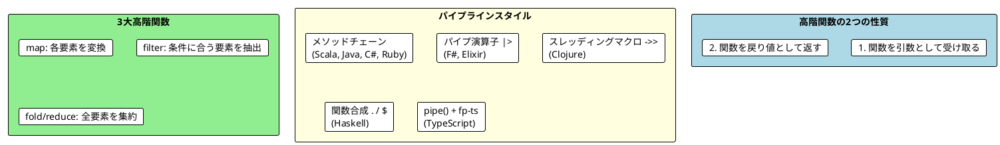
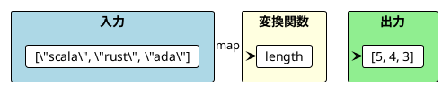

# Part II - 第 4 章：高階関数

## 4.1 はじめに：関数を値として扱う

高階関数（Higher-Order Functions）は、関数型プログラミングの最も強力な構成要素です。関数を「値」として扱い、引数として渡したり、戻り値として返したりすることで、柔軟で再利用可能なコードを実現します。

本章では、11 言語での高階関数の実装を横断的に比較し、以下を明らかにします：

- `map` / `filter` / `fold` の 3 大高階関数の言語別イディオム
- 関数を渡す・返すスタイルの言語間の違い
- パイプライン（データ変換の連鎖）の表現方法の多様性



---

## 4.2 共通の本質：map / filter / fold

11 言語すべてで共通する 3 大高階関数を確認します。

### map: 各要素を変換する

リストの各要素に関数を適用し、変換結果の新しいリストを返します。



3 つの言語グループから代表例を見てみましょう：

```haskell
-- Haskell: 関数適用スタイル
map length ["scala", "rust", "ada"]  -- [5, 4, 3]
```

```scala
// Scala: メソッドチェーンスタイル
List("scala", "rust", "ada").map(_.length)  // List(5, 4, 3)
```

```python
# Python: リスト内包表記（map の代替イディオム）
[len(w) for w in ["scala", "rust", "ada"]]  # [5, 4, 3]
```

### filter: 条件に合う要素を抽出する

述語関数（`Boolean` を返す関数）で要素を選別します。

```haskell
-- Haskell
filter odd [5, 1, 2, 4, 0]  -- [5, 1]
```

```scala
// Scala
List(5, 1, 2, 4, 0).filter(_ % 2 == 1)  // List(5, 1)
```

```python
# Python
[n for n in [5, 1, 2, 4, 0] if n % 2 == 1]  # [5, 1]
```

### fold / reduce: 全要素を集約する

初期値と二項演算を使い、リスト全体を 1 つの値に畳み込みます。

```haskell
-- Haskell
foldl (+) 0 [5, 1, 2, 4, 100]  -- 112
```

```scala
// Scala
List(5, 1, 2, 4, 100).foldLeft(0)(_ + _)  // 112
```

```python
# Python
from functools import reduce
reduce(lambda acc, n: acc + n, [5, 1, 2, 4, 100], 0)  # 112
```

---

## 4.3 言語別 map / filter / fold 比較

### 全 11 言語の実装

#### 関数型ファースト言語

<details>
<summary>Haskell 実装</summary>

```haskell
-- map
map length ["scala", "rust", "ada"]        -- [5, 4, 3]
map (* 2) [5, 1, 2, 4, 0]                 -- [10, 2, 4, 8, 0]

-- filter
filter odd [5, 1, 2, 4, 0]                -- [5, 1]

-- foldl（左畳み込み）
foldl (+) 0 [5, 1, 2, 4, 100]             -- 112
```

Haskell ではすべての関数がデフォルトでカリー化されており、`map length` のように部分適用で簡潔に書けます。

</details>

<details>
<summary>Clojure 実装</summary>

```clojure
;; map
(map count ["scala" "rust" "ada"])         ;; (5 4 3)

;; filter
(filter odd? [5 1 2 4 0])                 ;; (5 1)

;; reduce
(reduce + 0 [5 1 2 4 100])                ;; 112

;; スレッディングマクロで連鎖
(->> [1 2 3 4 5]
     (filter odd?)
     (map #(* % %))
     (reduce +))                           ;; 35
```

Clojure のスレッディングマクロ `->>` は、データを最後の引数に渡しながら関数を連鎖させます。

</details>

<details>
<summary>Elixir 実装</summary>

```elixir
# map（キャプチャ演算子 & で関数を渡す）
Enum.map(["elixir", "rust", "ada"], &String.length/1)  # [6, 4, 3]

# filter
Enum.filter([5, 1, 2, 4, 0], &(rem(&1, 2) == 1))      # [5, 1]

# reduce
Enum.reduce([5, 1, 2, 4, 100], 0, &(&1 + &2))          # 112

# パイプ演算子で連鎖
[1, 2, 3, 4, 5]
|> Enum.filter(&(rem(&1, 2) == 1))
|> Enum.map(&(&1 * &1))
|> Enum.reduce(0, &(&1 + &2))                           # 35
```

Elixir のキャプチャ演算子 `&` と `/1`（アリティ指定）で、名前付き関数を高階関数に渡します。

</details>

<details>
<summary>F# 実装</summary>

```fsharp
// map（パイプライン演算子 |>）
["scala"; "rust"; "ada"] |> List.map String.length  // [5; 4; 3]

// filter
[5; 1; 2; 4; 0] |> List.filter (fun n -> n % 2 = 1)  // [5; 1]

// fold
[5; 1; 2; 4; 100] |> List.fold (fun acc i -> acc + i) 0  // 112

// パイプラインで連鎖
[1; 2; 3; 4; 5]
|> List.filter (fun n -> n % 2 = 1)
|> List.map (fun n -> n * n)
|> List.fold (fun acc n -> acc + n) 0  // 35
```

F# のパイプライン演算子 `|>` は、左辺の値を右辺の関数の最後の引数に渡します。

</details>

#### マルチパラダイム言語

<details>
<summary>Scala 実装</summary>

```scala
// map
List("scala", "rust", "ada").map(_.length)     // List(5, 4, 3)
List(5, 1, 2, 4, 0).map(_ * 2)                // List(10, 2, 4, 8, 0)

// filter
List(5, 1, 2, 4, 0).filter(_ % 2 == 1)        // List(5, 1)

// foldLeft
List(5, 1, 2, 4, 100).foldLeft(0)(_ + _)      // 112

// メソッドチェーンで連鎖
List(1, 2, 3, 4, 5)
  .filter(_ % 2 == 1)
  .map(n => n * n)
  .foldLeft(0)(_ + _)                          // 35
```

Scala のプレースホルダ構文 `_` で、ラムダ式を簡潔に書けます。

</details>

<details>
<summary>Rust 実装</summary>

```rust
// map（イテレータアダプタ）
vec!["scala", "rust", "ada"].iter().map(|s| s.len()).collect::<Vec<_>>()
// [5, 4, 3]

// filter
vec![5, 1, 2, 4, 0].iter().filter(|&&n| n % 2 == 1).cloned().collect::<Vec<_>>()
// [5, 1]

// fold
vec![5, 1, 2, 4, 100].iter().fold(0, |acc, &n| acc + n)
// 112

// イテレータチェーンで連鎖
vec![1, 2, 3, 4, 5].iter()
    .filter(|&&n| n % 2 == 1)
    .map(|&n| n * n)
    .fold(0, |acc, n| acc + n)                 // 35
```

Rust のイテレータアダプタはゼロコスト抽象化であり、手書きのループと同等のパフォーマンスを発揮します。`.collect()` で遅延実行されたイテレータを具体的なコレクションに変換します。

</details>

<details>
<summary>TypeScript (fp-ts) 実装</summary>

```typescript
import { pipe } from 'fp-ts/function'
import * as RA from 'fp-ts/ReadonlyArray'

// map
pipe(["scala", "rust", "ada"], RA.map((w) => w.length))
// [5, 4, 3]

// filter
pipe([5, 1, 2, 4, 0], RA.filter((n) => n % 2 === 1))
// [5, 1]

// reduce
pipe([5, 1, 2, 4, 100], RA.reduce(0, (acc, n) => acc + n))
// 112

// pipe で連鎖
pipe(
  [1, 2, 3, 4, 5],
  RA.filter((n) => n % 2 === 1),
  RA.map((n) => n * n),
  RA.reduce(0, (acc, n) => acc + n)
)  // 35
```

TypeScript の fp-ts は `pipe()` 関数で関数合成を実現します。各操作は `ReadonlyArray`（`RA`）モジュールの関数として提供されます。

</details>

#### OOP + FP ライブラリ言語

<details>
<summary>Java (Vavr) 実装</summary>

```java
// map（メソッド参照）
List.of("scala", "rust", "ada").map(String::length)    // List(5, 4, 3)

// filter
List.of(5, 1, 2, 4, 0).filter(n -> n % 2 == 1)        // List(5, 1)

// foldLeft
List.of(5, 1, 2, 4, 100).foldLeft(0, (acc, i) -> acc + i)  // 112

// メソッドチェーンで連鎖
List.of(1, 2, 3, 4, 5)
    .filter(n -> n % 2 == 1)
    .map(n -> n * n)
    .foldLeft(0, Integer::sum)                          // 35
```

Java のメソッド参照 `String::length` で、ラムダ式なしに既存のメソッドを高階関数に渡せます。

</details>

<details>
<summary>C# (LanguageExt) 実装</summary>

```csharp
// Map
Seq("scala", "rust", "ada").Map(w => w.Length)          // Seq(5, 4, 3)

// Filter
Seq(5, 1, 2, 4, 0).Filter(n => n % 2 == 1)             // Seq(5, 1)

// Fold
Seq(5, 1, 2, 4, 100).Fold(0, (acc, i) => acc + i)      // 112

// メソッドチェーンで連鎖
Seq(1, 2, 3, 4, 5)
    .Filter(n => n % 2 == 1)
    .Map(n => n * n)
    .Fold(0, (acc, n) => acc + n)                       // 35
```

</details>

<details>
<summary>Python 実装</summary>

```python
# map（リスト内包表記が推奨）
[len(w) for w in ["scala", "rust", "ada"]]              # [5, 4, 3]

# filter（条件付きリスト内包表記が推奨）
[n for n in [5, 1, 2, 4, 0] if n % 2 == 1]             # [5, 1]

# reduce
from functools import reduce
reduce(lambda acc, n: acc + n, [5, 1, 2, 4, 100], 0)   # 112

# 組み込み関数版
list(map(len, ["scala", "rust", "ada"]))                # [5, 4, 3]
list(filter(lambda n: n % 2 == 1, [5, 1, 2, 4, 0]))    # [5, 1]
```

Python ではリスト内包表記が `map` / `filter` の推奨代替イディオムです。`reduce` のみ `functools` からのインポートが必要です。

</details>

<details>
<summary>Ruby 実装</summary>

```ruby
# map（ブロック構文）
["scala", "rust", "ada"].map { |w| w.length }           # [5, 4, 3]
["scala", "rust", "ada"].map(&:length)                  # シンボル to プロック変換

# select（filter 相当）
[5, 1, 2, 4, 0].select(&:odd?)                          # [5, 1]

# reduce
[5, 1, 2, 4, 100].reduce(0, :+)                         # 112

# メソッドチェーンで連鎖
[1, 2, 3, 4, 5]
  .select(&:odd?)
  .map { |n| n * n }
  .reduce(0, :+)                                         # 35
```

Ruby の `&:method_name` はシンボルを Proc に変換する構文糖衣です。`filter` の代わりに `select` を使うのが Ruby の慣習です。

</details>

### 語彙比較表

| 操作 | Haskell | Clojure | Elixir | F# | Scala | Rust | TypeScript | Java | C# | Python | Ruby |
|------|---------|---------|--------|----|-------|------|------------|------|----|--------|------|
| 変換 | `map` | `map` | `Enum.map` | `List.map` | `.map` | `.map` | `RA.map` | `.map` | `.Map` | 内包表記 | `.map` |
| 抽出 | `filter` | `filter` | `Enum.filter` | `List.filter` | `.filter` | `.filter` | `RA.filter` | `.filter` | `.Filter` | 内包表記 | `.select` |
| 集約 | `foldl` | `reduce` | `Enum.reduce` | `List.fold` | `.foldLeft` | `.fold` | `RA.reduce` | `.foldLeft` | `.Fold` | `reduce` | `.reduce` |

**発見**: `map` と `filter` はほぼ全言語で同名です。集約操作のみ `fold` 系（Haskell, F#, Scala, Rust, C#）と `reduce` 系（Clojure, Elixir, Python, Ruby, TypeScript）に分かれます。Ruby は `filter` の代わりに `select` を使う唯一の言語です。

---

## 4.4 ワードスコアリング：関数を渡すパターン

高階関数の真価は、**振る舞いをパラメータ化**できることです。同じランキングロジックに異なるスコアリング関数を渡すことで、柔軟なランキングを実現します。

### ビジネスロジック

```
score(word)   = 'a' を除いた文字数
bonus(word)   = 'c' を含めば +5
penalty(word) = 's' を含めば -7

rankedWords(scoreFunction, words) = scoreFunction でソートしたランキング
```

### 代表 3 言語の比較

**Haskell**: 関数合成スタイル

```haskell
score :: String -> Int
score word = length $ filter (/= 'a') word

rankedWords :: (String -> Int) -> [String] -> [String]
rankedWords wordScore words = reverse $ sortBy (comparing wordScore) words

-- 基本スコア
rankedWords score words
-- ボーナス付き
rankedWords (\w -> score w + bonus w) words
-- 複合スコア
rankedWords (\w -> score w + bonus w - penalty w) words
```

**Scala**: プレースホルダ構文

```scala
def score(word: String): Int = word.replaceAll("a", "").length

def rankedWords(wordScore: String => Int, words: List[String]): List[String] =
  words.sortBy(wordScore).reverse

// 基本スコア
rankedWords(score, words)
// ボーナス付き
rankedWords(w => score(w) + bonus(w), words)
// 複合スコア
rankedWords(w => score(w) + bonus(w) - penalty(w), words)
```

**Python**: Callable 型ヒント

```python
def score(word: str) -> int:
    return len(word.replace("a", ""))

def ranked_words(words: list[str], word_score: Callable[[str], int]) -> list[str]:
    return sorted(words, key=word_score, reverse=True)

# 基本スコア
ranked_words(words, score)
# ボーナス付き
ranked_words(words, lambda w: score(w) + bonus(w))
# 複合スコア
ranked_words(words, lambda w: score(w) + bonus(w) - penalty(w))
```

**共通パターン**: `rankedWords` 関数は「スコアリングのロジック」を知りません。どのスコア関数を使うかは呼び出し側が決めます。これが高階関数による**関心の分離**です。

### 全 11 言語の実装

#### 関数型ファースト言語

<details>
<summary>Haskell 実装</summary>

```haskell
score :: String -> Int
score word = length $ filter (/= 'a') word

bonus :: String -> Int
bonus word = if 'c' `elem` word then 5 else 0

penalty :: String -> Int
penalty word = if 's' `elem` word then 7 else 0

rankedWords :: (String -> Int) -> [String] -> [String]
rankedWords wordScore words = reverse $ sortBy (comparing wordScore) words

-- 使用例
rankedWords score words
rankedWords (\w -> score w + bonus w) words
rankedWords (\w -> score w + bonus w - penalty w) words
```

`comparing` は `Data.Ord` の関数で、値の変換関数から比較関数を生成します。

</details>

<details>
<summary>Clojure 実装</summary>

```clojure
(defn score [word]
  (count (clojure.string/replace word "a" "")))

(defn bonus [word]
  (if (clojure.string/includes? word "c") 5 0))

(defn penalty [word]
  (if (clojure.string/includes? word "s") 7 0))

(defn ranked-words [word-scorer words]
  (reverse (sort-by word-scorer words)))

;; 使用例
(ranked-words score words)
(ranked-words #(+ (score %) (bonus %)) words)
(ranked-words #(+ (score %) (bonus %) (- (penalty %))) words)
```

`#(...)` は無名関数リテラルで、`%` が引数を表します。

</details>

<details>
<summary>Elixir 実装</summary>

```elixir
def score(word), do: word |> String.replace("a", "") |> String.length()
def bonus(word), do: if String.contains?(word, "c"), do: 5, else: 0
def penalty(word), do: if String.contains?(word, "s"), do: 7, else: 0

def ranked_words(word_score, words) do
  words
  |> Enum.sort_by(word_score)
  |> Enum.reverse()
end

# 使用例
ranked_words(&score/1, words)
ranked_words(fn w -> score(w) + bonus(w) end, words)
ranked_words(fn w -> score(w) + bonus(w) - penalty(w) end, words)
```

`&score/1` はキャプチャ演算子で、`score` 関数（アリティ 1）を無名関数として渡します。

</details>

<details>
<summary>F# 実装</summary>

```fsharp
let wordScore (word: string) : int =
    word.Replace("a", "").Length

let bonus (word: string) : int =
    if word.Contains("c") then 5 else 0

let penalty (word: string) : int =
    if word.Contains("s") then 7 else 0

let rankedWords (scoreFn: string -> int) (words: string list) : string list =
    words |> List.sortByDescending scoreFn

// 使用例
rankedWords wordScore words
rankedWords (fun w -> wordScore w + bonus w) words
rankedWords (fun w -> wordScore w + bonus w - penalty w) words
```

F# の関数はデフォルトでカリー化されており、`rankedWords wordScore` で部分適用が可能です。

</details>

#### マルチパラダイム言語

<details>
<summary>Scala 実装</summary>

```scala
def score(word: String): Int = word.replaceAll("a", "").length
def bonus(word: String): Int = if (word.contains("c")) 5 else 0
def penalty(word: String): Int = if (word.contains("s")) 7 else 0

def rankedWords(wordScore: String => Int, words: List[String]): List[String] =
  words.sortBy(wordScore).reverse

// 使用例
rankedWords(score, words)
rankedWords(w => score(w) + bonus(w), words)
rankedWords(w => score(w) + bonus(w) - penalty(w), words)
```

</details>

<details>
<summary>Rust 実装</summary>

```rust
pub fn score(word: &str) -> usize {
    word.chars().filter(|&c| c != 'a').count()
}

pub fn ranked_words<'a, F>(words: &[&'a str], word_score: F) -> Vec<&'a str>
where
    F: Fn(&str) -> i32,
{
    let mut result: Vec<&'a str> = words.to_vec();
    result.sort_by(|a, b| word_score(b).cmp(&word_score(a)));
    result
}

// 使用例
let ranking1 = ranked_words(&words, |w| score(w) as i32);
let ranking2 = ranked_words(&words, |w| score(w) as i32 + bonus(w));
let ranking3 = ranked_words(&words, |w| score(w) as i32 + bonus(w) - penalty(w));
```

Rust のジェネリクスとトレイト境界 `F: Fn(&str) -> i32` で、クロージャの型を静的に制約します。

</details>

<details>
<summary>TypeScript (fp-ts) 実装</summary>

```typescript
const score = (word: string): number =>
  word.replace(/a/g, '').length

const rankedWords = (
  wordScoreFn: (word: string) => number,
  words: readonly string[]
): readonly string[] =>
  pipe(words, RA.sortBy([Ord.reverse(Ord.contramap(wordScoreFn)(N.Ord))]))

// 使用例
rankedWords(score, words)
rankedWords((w) => score(w) + bonus(w), words)
rankedWords((w) => score(w) + bonus(w) - penalty(w), words)
```

fp-ts の `Ord.contramap` は、比較対象を変換する関数を受け取り新しい `Ord` を生成します。

</details>

#### OOP + FP ライブラリ言語

<details>
<summary>Java (Vavr) 実装</summary>

```java
public static int score(String word) {
    return word.replaceAll("a", "").length();
}

public static List<String> rankedWords(Function<String, Integer> wordScore, List<String> words) {
    return words.sortBy(wordScore).reverse();
}

// 使用例
rankedWords(WordScoring::score, words);
rankedWords(w -> score(w) + bonus(w), words);
rankedWords(w -> score(w) + bonus(w) - penalty(w), words);
```

Java のメソッド参照 `WordScoring::score` で、既存のメソッドを `Function` として渡せます。

</details>

<details>
<summary>C# (LanguageExt) 実装</summary>

```csharp
public static int WordScore(string word) =>
    word.Replace("a", "").Length;

public static Seq<string> RankedWords(Seq<string> words, Func<string, int> scoreFn) =>
    toSeq(words.OrderByDescending(scoreFn));

// 使用例
RankedWords(words, WordScore);
RankedWords(words, w => WordScore(w) + Bonus(w));
RankedWords(words, w => WordScore(w) + Bonus(w) - Penalty(w));
```

</details>

<details>
<summary>Python 実装</summary>

```python
def score(word: str) -> int:
    return len(word.replace("a", ""))

def ranked_words(words: list[str], word_score: Callable[[str], int]) -> list[str]:
    return sorted(words, key=word_score, reverse=True)

# 使用例
ranked_words(words, score)
ranked_words(words, lambda w: score(w) + bonus(w))
ranked_words(words, lambda w: score(w) + bonus(w) - penalty(w))
```

Python の `sorted` は `key` パラメータで高階関数パターンを実現します。

</details>

<details>
<summary>Ruby 実装</summary>

```ruby
def score(word)
  word.gsub("a", "").length
end

def ranked_words(words, &score_fn)
  words.sort_by(&score_fn).reverse
end

# 使用例
ranking1 = ranked_words(words) { |w| score(w) }
ranking2 = ranked_words(words) { |w| score(w) + bonus(w) }
ranking3 = ranked_words(words) { |w| score(w) + bonus(w) - penalty(w) }
```

Ruby はブロック構文 `{ |w| ... }` で無名関数を渡します。`&score_fn` でブロックを Proc として受け取り、`&` で再度ブロックに変換して `sort_by` に渡します。

</details>

---

## 4.5 関数を返す関数：カリー化と部分適用

高階関数のもう一つの側面は、「関数を返す関数」です。特に「閾値より大きい要素をフィルタする」パターンで比較します。

### 代表 3 言語の比較

**Haskell**: すべての関数がデフォルトでカリー化

```haskell
largerThan :: Int -> (Int -> Bool)
largerThan n = \i -> i > n

-- 部分適用で新しい関数を生成
filter (largerThan 4) [5, 1, 2, 4, 0]  -- [5]
filter (largerThan 1) [5, 1, 2, 4, 0]  -- [5, 2, 4]
```

**Scala**: 明示的なカリー化

```scala
def largerThan(n: Int): Int => Boolean = i => i > n

List(5, 1, 2, 4, 0).filter(largerThan(4))  // List(5)
List(5, 1, 2, 4, 0).filter(largerThan(1))  // List(5, 2, 4)
```

**Python**: クロージャによる関数生成

```python
def larger_than(n: int) -> Callable[[int], bool]:
    return lambda i: i > n

list(filter(larger_than(4), [5, 1, 2, 4, 0]))  # [5]
list(filter(larger_than(1), [5, 1, 2, 4, 0]))  # [5, 2, 4]
```

### 全 11 言語の実装

<details>
<summary>全 11 言語の「関数を返す関数」</summary>

**Haskell**:
```haskell
largerThan :: Int -> (Int -> Bool)
largerThan n = \i -> i > n
```

**Clojure**:
```clojure
(defn larger-than [n]
  (fn [i] (> i n)))
```

**Elixir**:
```elixir
def larger_than(n), do: fn i -> i > n end
```

**F#**:
```fsharp
let largerThan (n: int) : int -> bool = fun i -> i > n
```

**Scala**:
```scala
def largerThan(n: Int): Int => Boolean = i => i > n
```

**Rust**:
```rust
pub fn larger_than(n: i32) -> impl Fn(i32) -> bool {
    move |i| i > n
}
```

**TypeScript**:
```typescript
const largerThan = (n: number): ((i: number) => boolean) => (i) => i > n
```

**Java**:
```java
public static Predicate<Integer> largerThan(int n) {
    return i -> i > n;
}
```

**C#**:
```csharp
public static Func<int, bool> LargerThan(int n) => i => i > n;
```

**Python**:
```python
def larger_than(n: int) -> Callable[[int], bool]:
    return lambda i: i > n
```

**Ruby**:
```ruby
def larger_than_fn(n)
  ->(i) { i > n }
end
```

</details>

### カリー化の比較

| レベル | 言語 | 特徴 |
|--------|------|------|
| **自動カリー化** | Haskell, F# | すべての多引数関数が自動的にカリー化される |
| **構文サポート** | Scala, Rust, TypeScript | 戻り値型に関数型を明示して実現 |
| **ラムダ式で実現** | Java, C#, Clojure, Elixir | クロージャ / ラムダ式で関数を返す |
| **慣習的** | Python, Ruby | `lambda` / `->` で手動構築 |

**発見**: Haskell と F# では `largerThan 4` が自然な部分適用ですが、他の言語では関数の返却を明示的に記述する必要があります。Rust の `move |i| i > n` は、キャプチャした値の所有権を明示する独自のパターンです。

---

## 4.6 パイプラインスタイルの比較

高階関数の連鎖（パイプライン）は、言語によって記法が大きく異なります。同じ処理を 5 つのスタイルで比較します。

### 処理内容

「奇数のみ抽出 → 二乗 → 合計」を `[1, 2, 3, 4, 5]` に適用（期待結果: 35）

### F# パイプ演算子 `|>`

```fsharp
[1; 2; 3; 4; 5]
|> List.filter (fun n -> n % 2 = 1)
|> List.map (fun n -> n * n)
|> List.fold (fun acc n -> acc + n) 0
```

データが左から右に流れ、変換の各ステップが明確です。

### Clojure スレッディングマクロ `->>`

```clojure
(->> [1 2 3 4 5]
     (filter odd?)
     (map #(* % %))
     (reduce +))
```

`->>` は値を各フォームの**最後の引数**に挿入します。LISP の S 式でありながら、上から下にデータが流れる読みやすさを実現しています。

### Scala メソッドチェーン

```scala
List(1, 2, 3, 4, 5)
  .filter(_ % 2 == 1)
  .map(n => n * n)
  .foldLeft(0)(_ + _)
```

OOP スタイルのメソッドチェーンは、多くの開発者にとって最も馴染みやすい形式です。

### Haskell 関数合成 `.` と `$`

```haskell
foldl (+) 0 . map (\n -> n * n) . filter odd $ [1, 2, 3, 4, 5]
```

Haskell は右から左に関数を合成し、`$` でデータを渡します。数学的な関数合成 `f . g` に最も近い表現です。

### TypeScript fp-ts `pipe()`

```typescript
pipe(
  [1, 2, 3, 4, 5],
  RA.filter((n) => n % 2 === 1),
  RA.map((n) => n * n),
  RA.reduce(0, (acc, n) => acc + n)
)
```

fp-ts の `pipe()` は Haskell の `|>` を関数として再現し、型推論が各ステップで効きます。

### Rust イテレータチェーン

```rust
vec![1, 2, 3, 4, 5].iter()
    .filter(|&&n| n % 2 == 1)
    .map(|&n| n * n)
    .fold(0, |acc, n| acc + n)
```

Rust のイテレータチェーンは遅延評価で、`.collect()` を呼ぶまで実行されません。

### パイプラインスタイル比較表

| スタイル | 言語 | データの流れ | 特徴 |
|---------|------|------------|------|
| パイプ演算子 `\|>` | F#, Elixir | 左 → 右 | 最も直感的なデータフロー |
| スレッディングマクロ | Clojure | 上 → 下 | S 式でありながら読みやすい |
| メソッドチェーン | Scala, Java, C#, Ruby | 左 → 右 | OOP 開発者に馴染みやすい |
| 関数合成 `.` / `$` | Haskell | 右 → 左 | 数学的な関数合成に忠実 |
| `pipe()` 関数 | TypeScript (fp-ts) | 上 → 下 | 型推論との両立 |
| イテレータチェーン | Rust | 左 → 右 | ゼロコスト抽象化 |

---

## 4.7 比較分析：3 つの発見

### 発見 1: map / filter は普遍的、fold の命名は分裂している

`map` と `filter`（Ruby の `select` を除く）はほぼ全言語で同名ですが、畳み込み操作の命名は 2 派に分かれます：

- **fold 派**: Haskell (`foldl`), F# (`List.fold`), Scala (`foldLeft`), Rust (`.fold`), C# (`.Fold`)
- **reduce 派**: Clojure (`reduce`), Elixir (`Enum.reduce`), Python (`reduce`), Ruby (`.reduce`), TypeScript (`RA.reduce`)
- **Java は両方**: Vavr は `foldLeft`、標準 Stream API は `reduce`

これは歴史的な系譜を反映しています。`fold` は ML / Haskell 系、`reduce` は Lisp / APL 系の伝統です。

### 発見 2: 関数の渡し方は 4 パターンに分類できる

| パターン | 言語 | 例 |
|---------|------|-----|
| **名前で渡す** | Haskell, Clojure, F# | `map length`, `(map count)` |
| **メソッド参照** | Java, Scala | `String::length`, `_.length` |
| **ブロック / キャプチャ** | Ruby, Elixir | `{ \|w\| w.length }`, `&String.length/1` |
| **ラムダ / アロー関数** | TypeScript, Python, Rust, C# | `(w) => w.length`, `lambda w: len(w)` |

関数型ファースト言語ほど、関数を「名前だけ」で渡せるシンプルな構文を持ちます。

### 発見 3: ワードスコアリングパターンは「戦略パターン」の関数型版

OOP のデザインパターンにおける**戦略パターン**（Strategy Pattern）は、振る舞いをインターフェースで抽象化し、実行時に切り替えます。関数型では、高階関数が同じ目的を**インターフェース定義なし**で実現します。

```
OOP:  interface ScoreStrategy { int score(String word); }
FP:   (String -> Int) ← 関数型そのものがインターフェース
```

11 言語すべてで `rankedWords(scoreFunction, words)` という同一のパターンが成立するのは、高階関数が戦略パターンの普遍的な簡易版であることを示しています。

---

## 4.8 言語固有の特徴

### Python: リスト内包表記という独自イディオム

Python では `map` / `filter` よりもリスト内包表記が推奨されています。これは Pythonic なスタイルとされ、ネストした変換も読みやすく書けます。

```python
# map + filter を 1 つの内包表記で
[n * n for n in [1, 2, 3, 4, 5] if n % 2 == 1]  # [1, 9, 25]
```

### Ruby: ブロックとシンボル変換

Ruby の `&:method_name` は、シンボルを Proc に変換する構文糖衣で、高階関数呼び出しを極めて簡潔にします。

```ruby
["hello", "world"].map(&:upcase)    # ["HELLO", "WORLD"]
[1, 2, 3, nil, 4].select(&:itself)  # [1, 2, 3, 4]
```

### Rust: ゼロコスト抽象化

Rust のイテレータアダプタは、コンパイル時にインライン化され、手書きのループと同等のパフォーマンスを発揮します。さらに、クロージャが値をキャプチャする際の所有権を `move` キーワードで明示します。

```rust
pub fn larger_than(n: i32) -> impl Fn(i32) -> bool {
    move |i| i > n  // n の所有権をクロージャに移動
}
```

### Elixir: キャプチャ演算子

Elixir の `&` / `/arity` は、名前付き関数を無名関数に変換するユニークな構文です。

```elixir
# 関数キャプチャ
Enum.map(words, &score/1)

# 短縮無名関数
Enum.map(words, &(&1 * 2))  # 各要素を2倍
```

---

## 4.9 実践的な選択指針

### パイプラインスタイルの選択

| 重視する点 | 推奨スタイル | 言語 |
|-----------|------------|------|
| データフローの可視性 | パイプ演算子 | F#, Elixir |
| OOP チームとの親和性 | メソッドチェーン | Scala, Java, C#, Ruby |
| 数学的な厳密性 | 関数合成 | Haskell |
| 型安全なパイプライン | pipe() + fp-ts | TypeScript |
| パフォーマンス | イテレータチェーン | Rust |

### 高階関数の導入戦略

**OOP から移行する場合**:

1. まず `map` / `filter` をコレクション操作に導入（最も直感的）
2. `fold` / `reduce` で集約パターンを学ぶ
3. 関数を引数に渡すパターンで戦略パターンを置き換え
4. 関数を返す関数（カリー化）で設定のパラメータ化

**すでに FP に慣れている場合**:

1. パイプラインスタイルの統一（チーム内で一貫性を持たせる）
2. 部分適用とカリー化で再利用性を向上
3. `fold` による汎用的なデータ変換パターンの活用

---

## 4.10 まとめ

本章では、11 言語での高階関数の実装を比較し、以下を確認しました：

**共通の原則**:

- `map` / `filter` / `fold`（`reduce`）は全言語に存在する普遍的な操作
- ワードスコアリングパターン（振る舞いのパラメータ化）は全言語で同じ構造
- 高階関数は OOP の戦略パターンの関数型版として機能する

**言語間の差異**:

- 畳み込みの命名は `fold` 系と `reduce` 系に分裂
- パイプラインスタイルは 6 種類（パイプ演算子、スレッディングマクロ、メソッドチェーン、関数合成、pipe 関数、イテレータチェーン）
- カリー化の自動度は Haskell/F# > Scala/Rust/TypeScript > Java/C#/Clojure/Elixir > Python/Ruby

**学び**:

- 高階関数の概念は言語に依存しない
- 言語の違いは「関数をどう渡すか」「パイプラインをどう表現するか」に表れる
- Python のリスト内包表記と Ruby のブロック構文は、高階関数の独自の進化形

---

### 各言語の詳細記事

| 言語 | 記事リンク |
|------|-----------|
| Scala | [Part II: 関数型スタイルのプログラミング](../scala/part-2.md) |
| Java | [Part II: 関数型スタイルのプログラミング](../java/part-2.md) |
| F# | [Part II: 関数型スタイルのプログラミング](../fsharp/part-2.md) |
| C# | [Part II: 関数型スタイルのプログラミング](../csharp/part-2.md) |
| Haskell | [Part II: 関数型スタイルのプログラミング](../haskell/part-2.md) |
| Clojure | [Part II: 関数型スタイルのプログラミング](../clojure/part-2.md) |
| Elixir | [Part II: 関数型スタイルのプログラミング](../elixir/part-2.md) |
| Rust | [Part II: 関数型スタイルのプログラミング](../rust/part-2.md) |
| Python | [Part II: 関数型スタイルのプログラミング](../python/part-2.md) |
| TypeScript | [Part II: 関数型スタイルのプログラミング](../typescript/part-2.md) |
| Ruby | [Part II: 関数型スタイルのプログラミング](../ruby/part-2.md) |
