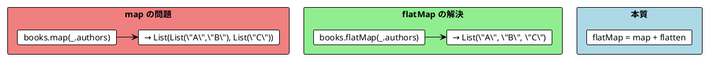
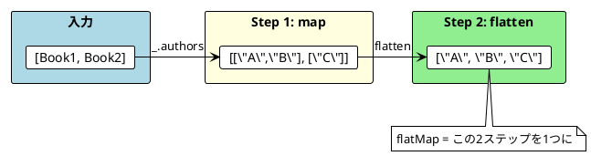

# Part II - 第 5 章：flatMap とモナド的合成

## 5.1 はじめに：ネストした変換の問題

前章で学んだ `map` は、各要素を 1 つの値に変換する操作でした。しかし、各要素から**リスト**が生まれる場合、`map` だけではリストがネストしてしまいます。`flatMap`（= `map` + `flatten`）はこの問題を解決し、ネストした変換を平坦に連鎖させる関数型プログラミングの中核パターンです。

本章では、11 言語での `flatMap` の実装を横断的に比較し、以下を明らかにします：

- `flatMap` の本質（`map` + `flatten`）と 3 つのサイズ変化パターン
- ネストした `flatMap` を読みやすくする糖衣構文の多様性
- 書籍→著者→映画の推薦パターンで見る実践的な連鎖



---

## 5.2 共通の本質：flatMap = map + flatten

11 言語すべてに共通する `flatMap` の定義は、以下の 2 ステップです：

1. **map**: 各要素に関数を適用し、リストのリストを生成
2. **flatten**: ネストしたリストを 1 段階平坦化



3 つの言語グループから代表例を見てみましょう：

```haskell
-- Haskell: concatMap（= map + concat）
data Book = Book { bookTitle :: String, bookAuthors :: [String] }

let books = [ Book "FP in Scala" ["Chiusano", "Bjarnason"]
            , Book "The Hobbit" ["Tolkien"]
            ]

-- 2ステップ
concat (map bookAuthors books)       -- ["Chiusano", "Bjarnason", "Tolkien"]

-- 1ステップ（concatMap）
concatMap bookAuthors books          -- ["Chiusano", "Bjarnason", "Tolkien"]
```

```scala
// Scala: flatMap
case class Book(title: String, authors: List[String])

val books = List(
  Book("FP in Scala", List("Chiusano", "Bjarnason")),
  Book("The Hobbit", List("Tolkien"))
)

// 2ステップ
books.map(_.authors).flatten         // List("Chiusano", "Bjarnason", "Tolkien")

// 1ステップ（flatMap）
books.flatMap(_.authors)             // List("Chiusano", "Bjarnason", "Tolkien")
```

```python
# Python: リスト内包表記で flatMap を表現
from dataclasses import dataclass

@dataclass(frozen=True)
class Book:
    title: str
    authors: list[str]

books = [
    Book("FP in Scala", ["Chiusano", "Bjarnason"]),
    Book("The Hobbit", ["Tolkien"])
]

# リスト内包表記（flatMap 相当）
[author for book in books for author in book.authors]
# ["Chiusano", "Bjarnason", "Tolkien"]
```

---

## 5.3 flatMap の 3 つのサイズ変化パターン

`flatMap` は `map` と異なり、結果のリストサイズが変わります。この性質が `flatMap` を `map` や `filter` よりも柔軟にしています。

### パターン 1: 要素が増える

```scala
// Scala
List(1, 2, 3).flatMap(i => List(i, i + 10))
// List(1, 11, 2, 12, 3, 13) — 3要素 → 6要素
```

### パターン 2: 要素数が同じ（map と同等）

```scala
// Scala
List(1, 2, 3).flatMap(i => List(i * 2))
// List(2, 4, 6) — 3要素 → 3要素
```

### パターン 3: 要素が減る（filter と同等）

```scala
// Scala
List(1, 2, 3).flatMap(i => if (i % 2 == 0) List(i) else List.empty)
// List(2) — 3要素 → 1要素
```

**発見**: `flatMap` は `map` と `filter` の両方を包含する、より一般的な操作です。空リストを返すことでフィルタリングが、単一要素リストを返すことで変換が実現できます。

<details>
<summary>全 11 言語のサイズ変化パターン</summary>

**Haskell**:
```haskell
concatMap (\i -> [i, i + 10]) [1, 2, 3]         -- [1,11,2,12,3,13]
concatMap (\i -> [i * 2]) [1, 2, 3]             -- [2,4,6]
concatMap (\i -> if even i then [i] else []) [1, 2, 3]  -- [2]
```

**Clojure**:
```clojure
(mapcat #(list % (+ % 10)) [1 2 3])             ;; (1 11 2 12 3 13)
(mapcat #(list (* % 2)) [1 2 3])                ;; (2 4 6)
(mapcat #(if (even? %) [%] []) [1 2 3])          ;; (2)
```

**Elixir**:
```elixir
Enum.flat_map([1, 2, 3], fn i -> [i, i + 10] end)     # [1, 11, 2, 12, 3, 13]
Enum.flat_map([1, 2, 3], fn i -> [i * 2] end)          # [2, 4, 6]
Enum.flat_map([1, 2, 3], fn i -> if rem(i, 2) == 0, do: [i], else: [] end)  # [2]
```

**F#**:
```fsharp
[1; 2; 3] |> List.collect (fun i -> [i; i + 10])              // [1;11;2;12;3;13]
[1; 2; 3] |> List.collect (fun i -> [i * 2])                  // [2;4;6]
[1; 2; 3] |> List.collect (fun i -> if i % 2 = 0 then [i] else [])  // [2]
```

**Rust**:
```rust
vec![1, 2, 3].iter().flat_map(|&i| vec![i, i + 10]).collect::<Vec<_>>()  // [1,11,2,12,3,13]
vec![1, 2, 3].iter().flat_map(|&i| vec![i * 2]).collect::<Vec<_>>()      // [2,4,6]
vec![1, 2, 3].iter().flat_map(|&i| if i % 2 == 0 { vec![i] } else { vec![] }).collect::<Vec<_>>()  // [2]
```

**TypeScript (fp-ts)**:
```typescript
pipe([1, 2, 3], RA.chain((i) => [i, i + 10]))           // [1,11,2,12,3,13]
pipe([1, 2, 3], RA.chain((i) => [i * 2]))               // [2,4,6]
pipe([1, 2, 3], RA.chain((i) => i % 2 === 0 ? [i] : []))  // [2]
```

**Java (Vavr)**:
```java
List.of(1, 2, 3).flatMap(i -> List.of(i, i + 10))       // List(1,11,2,12,3,13)
List.of(1, 2, 3).flatMap(i -> List.of(i * 2))           // List(2,4,6)
List.of(1, 2, 3).flatMap(i -> i % 2 == 0 ? List.of(i) : List.empty())  // List(2)
```

**C# (LanguageExt)**:
```csharp
Seq(1, 2, 3).Bind(i => Seq(i, i + 10))                  // Seq(1,11,2,12,3,13)
Seq(1, 2, 3).Bind(i => Seq(i * 2))                      // Seq(2,4,6)
Seq(1, 2, 3).Bind(i => i % 2 == 0 ? Seq(i) : Empty)    // Seq(2)
```

**Ruby**:
```ruby
[1, 2, 3].flat_map { |i| [i, i + 10] }                  # [1, 11, 2, 12, 3, 13]
[1, 2, 3].flat_map { |i| [i * 2] }                      # [2, 4, 6]
[1, 2, 3].flat_map { |i| i.even? ? [i] : [] }           # [2]
```

</details>

---

## 5.4 ネストした flatMap：書籍推薦パターン

`flatMap` の真価は、複数の段階をまたぐ変換の連鎖です。書籍→著者→映画化作品→推薦メッセージという 3 段階の変換を 11 言語で比較します。

### ビジネスロジック

```
books の各 book について:
  book.authors の各 author について:
    bookAdaptations(author) の各 movie について:
      → "You may like {movie}, because you liked {author}'s {book}"
```

### 代表 3 言語の比較

**Haskell**: concatMap のネスト

```haskell
data Movie = Movie { movieTitle :: String }

bookAdaptations :: String -> [Movie]
bookAdaptations "Tolkien" =
    [Movie "An Unexpected Journey", Movie "The Desolation of Smaug"]
bookAdaptations _ = []

recommendations :: [Book] -> [String]
recommendations books =
    concatMap (\book ->
        concatMap (\author ->
            map (\movie ->
                "You may like " ++ movieTitle movie ++
                ", because you liked " ++ author ++ "'s " ++ bookTitle book
            ) (bookAdaptations author)
        ) (bookAuthors book)
    ) books
```

**Scala**: flatMap のネスト

```scala
case class Movie(title: String)

def bookAdaptations(author: String): List[Movie] =
  if (author == "Tolkien")
    List(Movie("An Unexpected Journey"), Movie("The Desolation of Smaug"))
  else List.empty

val recommendations = books.flatMap(book =>
  book.authors.flatMap(author =>
    bookAdaptations(author).map(movie =>
      s"You may like ${movie.title}, because you liked $author's ${book.title}"
    )
  )
)
```

**Python**: ネストしたリスト内包表記

```python
@dataclass(frozen=True)
class Movie:
    title: str

def book_adaptations(author: str) -> list[Movie]:
    if author == "Tolkien":
        return [Movie("An Unexpected Journey"), Movie("The Desolation of Smaug")]
    return []

recommendations = [
    f"You may like {movie.title}, because you liked {author}'s {book.title}"
    for book in books
    for author in book.authors
    for movie in book_adaptations(author)
]
```

### 全 11 言語の実装

#### 関数型ファースト言語

<details>
<summary>Haskell 実装</summary>

```haskell
recommendations :: [Book] -> [String]
recommendations books =
    concatMap (\book ->
        concatMap (\author ->
            map (\movie ->
                "You may like " ++ movieTitle movie ++
                ", because you liked " ++ author ++ "'s " ++ bookTitle book
            ) (bookAdaptations author)
        ) (bookAuthors book)
    ) books
```

</details>

<details>
<summary>Clojure 実装</summary>

```clojure
(defn book-adaptations [author]
  (case author
    "Tolkien" [{:title "An Unexpected Journey"}
               {:title "The Desolation of Smaug"}]
    []))

(mapcat
  (fn [book]
    (mapcat
      (fn [author]
        (map
          (fn [movie]
            (str "You may like " (:title movie)
                 ", because you liked " author "'s " (:title book)))
          (book-adaptations author)))
      (:authors book)))
  books)
```

</details>

<details>
<summary>Elixir 実装</summary>

```elixir
def book_adaptations("Tolkien") do
  [%Movie{title: "An Unexpected Journey"}, %Movie{title: "The Desolation of Smaug"}]
end
def book_adaptations(_), do: []

Enum.flat_map(books, fn book ->
  Enum.flat_map(book.authors, fn author ->
    Enum.map(book_adaptations(author), fn movie ->
      "You may like #{movie.title}, because you liked #{author}'s #{book.title}"
    end)
  end)
end)
```

</details>

<details>
<summary>F# 実装</summary>

```fsharp
let bookAdaptations (author: string) : Movie list =
    if author = "Tolkien" then
        [{ Title = "An Unexpected Journey" }; { Title = "The Desolation of Smaug" }]
    else []

let recommendations =
    books
    |> List.collect (fun book ->
        book.Authors
        |> List.collect (fun author ->
            bookAdaptations author
            |> List.map (fun movie ->
                $"You may like {movie.Title}, because you liked {author}'s {book.Title}")))
```

F# では `flatMap` の代わりに `List.collect`（= `map` + `concat`）を使います。

</details>

#### マルチパラダイム言語

<details>
<summary>Scala 実装</summary>

```scala
val recommendations = books.flatMap(book =>
  book.authors.flatMap(author =>
    bookAdaptations(author).map(movie =>
      s"You may like ${movie.title}, because you liked $author's ${book.title}"
    )
  )
)
```

</details>

<details>
<summary>Rust 実装</summary>

```rust
let recommendations: Vec<String> = books
    .iter()
    .flat_map(|book| {
        let book_title = book.title.clone();
        book.authors.iter().flat_map(move |author| {
            let author_name = author.clone();
            let book_title_inner = book_title.clone();
            book_adaptations(&author_name).into_iter().map(move |movie| {
                format!(
                    "You may like {}, because you liked {}'s {}",
                    movie.title, author_name, book_title_inner
                )
            })
        })
    })
    .collect();
```

Rust ではクロージャが外部変数をキャプチャする際、所有権の `clone()` と `move` が必要です。これは他の言語にはない Rust 固有の複雑さです。

</details>

<details>
<summary>TypeScript (fp-ts) 実装</summary>

```typescript
const recommendations = pipe(
  books,
  RA.chain((book) =>
    pipe(
      book.authors,
      RA.chain((author) =>
        pipe(
          bookAdaptations(author),
          RA.map(
            (movie) =>
              `You may like ${movie.title}, because you liked ${author}'s ${book.title}`
          )
        )
      )
    )
  )
)
```

fp-ts では `flatMap` の代わりに `RA.chain` を使います。

</details>

#### OOP + FP ライブラリ言語

<details>
<summary>Java (Vavr) 実装</summary>

```java
List<String> recommendations = books.flatMap(book ->
    book.authors().flatMap(author ->
        bookAdaptations(author).map(movie ->
            String.format("You may like %s, because you liked %s's %s",
                movie.title(), author, book.title())
        )
    )
);
```

</details>

<details>
<summary>C# (LanguageExt) 実装</summary>

```csharp
var recommendations = books.Bind(book =>
    book.Authors.Bind(author =>
        BookAdaptations(author).Map(movie =>
            $"You may like {movie.Title}, because you liked {author}'s {book.Title}")));
```

C# の LanguageExt では `flatMap` の代わりに `Bind` を使います。これは Haskell のモナドにおける `>>=`（bind）に由来する命名です。

</details>

<details>
<summary>Python 実装</summary>

```python
recommendations = [
    f"You may like {movie.title}, because you liked {author}'s {book.title}"
    for book in books
    for author in book.authors
    for movie in book_adaptations(author)
]
```

Python のリスト内包表記は、ネストした `flatMap` を最も平坦に記述できる構文の一つです。

</details>

<details>
<summary>Ruby 実装</summary>

```ruby
recommendations = books.flat_map do |book|
  book.authors.flat_map do |author|
    book_adaptations(author).map do |movie|
      "You may like #{movie.title}, because you liked #{author}'s #{book.title}"
    end
  end
end
```

</details>

---

## 5.5 糖衣構文：ネストを平坦に書く

ネストした `flatMap` は読みにくくなります。多くの言語は、これを平坦に書くための糖衣構文（Syntactic Sugar）を提供しています。

### Scala: for 内包表記

```scala
// flatMap のネスト
val c1 = books.flatMap(book =>
  book.authors.flatMap(author =>
    bookAdaptations(author).map(movie =>
      s"You may like ${movie.title}, because you liked $author's ${book.title}"
    )
  )
)

// for 内包表記（等価）
val c2 = for {
  book   <- books
  author <- book.authors
  movie  <- bookAdaptations(author)
} yield s"You may like ${movie.title}, because you liked $author's ${book.title}"

assert(c1 == c2)
```

### Haskell: do 記法

```haskell
-- concatMap のネスト
getRecommendations :: [Book] -> [String]
getRecommendations books =
    concatMap (\book ->
        concatMap (\author ->
            map (\movie -> ...) (bookAdaptations author)
        ) (bookAuthors book)
    ) books

-- do 記法（等価）
getRecommendations' :: [Book] -> [String]
getRecommendations' books = do
    book   <- books
    author <- bookAuthors book
    movie  <- bookAdaptations author
    return $ "You may like " ++ movieTitle movie ++
             ", because you liked " ++ author ++ "'s " ++ bookTitle book
```

### F#: シーケンス式

```fsharp
// List.collect のネスト
let c1 =
    books
    |> List.collect (fun book ->
        book.Authors |> List.collect (fun author ->
            bookAdaptations author |> List.map (fun movie -> ...)))

// シーケンス式（等価）
let c2 =
    [ for book in books do
      for author in book.Authors do
      for movie in bookAdaptations author do
      yield $"You may like {movie.Title}, because you liked {author}'s {book.Title}" ]
```

### C#: LINQ クエリ式

```csharp
// Bind のネスト
var c1 = books.Bind(book =>
    book.Authors.Bind(author =>
        BookAdaptations(author).Map(movie => ...)));

// LINQ クエリ式（等価）
var c2 = (from book in books
          from author in book.Authors
          from movie in BookAdaptations(author)
          select $"You may like {movie.Title}, because you liked {author}'s {book.Title}").ToSeq();
```

### Clojure: for 内包表記

```clojure
;; mapcat のネスト
(mapcat (fn [book] (mapcat (fn [author] (map (fn [movie] ...) ...)) ...)) books)

;; for 内包表記（等価）
(for [book books
      author (:authors book)
      movie (book-adaptations author)]
  (str "You may like " (:title movie)
       ", because you liked " author "'s " (:title book)))
```

### Elixir: for 内包表記

```elixir
# flat_map のネスト
Enum.flat_map(books, fn book -> Enum.flat_map(book.authors, fn author -> ...) end)

# for 内包表記（等価）
for book <- books,
    author <- book.authors,
    movie <- book_adaptations(author) do
  "You may like #{movie.title}, because you liked #{author}'s #{book.title}"
end
```

### Python: リスト内包表記

```python
# flat_map のネスト相当
result = []
for book in books:
    for author in book.authors:
        for movie in book_adaptations(author):
            result.append(f"You may like {movie.title}, ...")

# リスト内包表記（等価）
[f"You may like {movie.title}, because you liked {author}'s {book.title}"
 for book in books
 for author in book.authors
 for movie in book_adaptations(author)]
```

### 糖衣構文の比較表

| 言語 | 糖衣構文 | flatMap の名前 | ガード式 |
|------|---------|---------------|---------|
| **Scala** | `for { x <- xs } yield ...` | `flatMap` | `if condition` |
| **Haskell** | `do { x <- xs; ... }` | `concatMap` / `>>=` | ガード関数 / リスト内包表記 |
| **F#** | `[ for x in xs do ... ]` | `List.collect` | `if condition then` |
| **C#** | `from x in xs select ...` | `Bind` | `where condition` |
| **Clojure** | `(for [x xs] ...)` | `mapcat` | `:when condition` |
| **Elixir** | `for x <- xs, do: ...` | `Enum.flat_map` | `, condition` |
| **Python** | `[... for x in xs]` | リスト内包表記 | `if condition` |
| **Ruby** | ブロックのネスト | `flat_map` | `.select` との組み合わせ |
| **Rust** | イテレータチェーン | `.flat_map()` | `.filter()` との組み合わせ |
| **TypeScript** | `pipe()` + `RA.chain` | `RA.chain` | `RA.filter` との組み合わせ |
| **Java** | ラムダのネスト | `flatMap` | `.filter()` との組み合わせ |

**発見**: 糖衣構文を持つ言語（Scala, Haskell, F#, C#, Clojure, Elixir, Python）とそうでない言語（Ruby, Rust, TypeScript, Java）で、ネストした `flatMap` の可読性に大きな差が生まれます。

---

## 5.6 円内の点の判定：flatMap によるデカルト積

`flatMap` は 2 つのリストのすべての組み合わせ（デカルト積）を生成するのにも使えます。円の半径と点のリストから、「どの点がどの円の中に入るか」を判定するパターンで比較します。

### 代表 3 言語の比較

**Scala**: for 内包表記 + ガード式

```scala
case class Point(x: Int, y: Int)

val points   = List(Point(5, 2), Point(1, 1))
val radiuses = List(2, 1)

def isInside(point: Point, radius: Int): Boolean =
  radius * radius >= point.x * point.x + point.y * point.y

// 全組み合わせ
val all = for {
  r     <- radiuses
  point <- points
} yield s"$point is within a radius of $r: ${isInside(point, r)}"

// ガード式でフィルタリング
val inside = for {
  r     <- radiuses
  point <- points
  if isInside(point, r)
} yield s"$point is within a radius of $r"
// List("Point(1,1) is within a radius of 2")
```

**Clojure**: for + :when

```clojure
(defn inside? [point radius]
  (<= (+ (* (:x point) (:x point))
         (* (:y point) (:y point)))
      (* radius radius)))

;; ガード式でフィルタリング
(for [r radiuses
      point points
      :when (inside? point r)]
  {:point point :radius r})
```

**Python**: リスト内包表記 + if

```python
@dataclass(frozen=True)
class Point:
    x: int
    y: int

def is_inside(point: Point, radius: int) -> bool:
    return radius * radius >= point.x * point.x + point.y * point.y

# ガード式でフィルタリング
inside = [
    f"Point({p.x},{p.y}) is within radius {r}"
    for r in radiuses
    for p in points
    if is_inside(p, r)
]
```

<details>
<summary>残り 8 言語の実装</summary>

**Haskell**（リスト内包表記）:
```haskell
let inside = [(point, r) | r <- radiuses, point <- points, isInside point r]
```

**F#**（シーケンス式）:
```fsharp
let inside =
    [ for r in radiuses do
      for point in points do
      if isInside point r then
          yield $"Point({point.X},{point.Y}) is within a radius of {r}" ]
```

**C#**（LINQ）:
```csharp
var inside = (from r in radiuses
              from point in points
              where IsInside(point, r)
              select $"Point({point.X},{point.Y}) is within a radius of {r}").ToSeq();
```

**Elixir**（for 内包表記）:
```elixir
for r <- radiuses,
    point <- points,
    inside?(point, r) do
  "Point(#{point.x}, #{point.y}) is within a radius of #{r}"
end
```

**Java (Vavr)**:
```java
List<String> inside = radiuses.flatMap(r ->
    points.filter(point -> isInside(point, r))
        .map(point -> String.format("Point(%d,%d) is inside radius %d", point.x(), point.y(), r)));
```

**TypeScript (fp-ts)**:
```typescript
const inside = pipe(
  radiuses,
  RA.chain((r) =>
    pipe(
      points,
      RA.filter((point) => isInside(point, r)),
      RA.map((point) => `Point(${point.x},${point.y}) is within radius ${r}`)
    )
  )
)
```

**Rust**:
```rust
let inside: Vec<String> = radiuses
    .iter()
    .flat_map(|&r| {
        points
            .iter()
            .filter(move |point| is_inside(point, r))
            .map(move |point| format!("Point({},{}) is within radius {}", point.x, point.y, r))
    })
    .collect();
```

**Ruby**:
```ruby
inside = radiuses.flat_map do |r|
  points.select { |point| inside?(point, r) }
        .map { |point| "Point(#{point.x},#{point.y}) is within radius #{r}" }
end
```

</details>

---

## 5.7 比較分析：3 つの発見

### 発見 1: flatMap の命名は 6 種類に分裂している

| 名前 | 言語 | 由来 |
|------|------|------|
| `flatMap` | Scala, Java (Vavr), Rust, Ruby | map + flatten の直訳 |
| `concatMap` | Haskell | map + concat（Haskell のリスト結合は `concat`） |
| `mapcat` | Clojure | map + concat（Clojure 独自の命名） |
| `Bind` | C# (LanguageExt) | モナドの `>>=`（bind 演算子）に由来 |
| `List.collect` | F# | .NET の命名規則に沿った関数名 |
| `chain` | TypeScript (fp-ts) | Fantasy Land 仕様のメソッド名 |

これは関数型プログラミングの歴史的経緯を反映しています。Haskell のモナド理論（`>>=` / `bind`）、ML 系の `collect`、そして実用主義的な `flatMap` という 3 つの流れが合流しています。

### 発見 2: 糖衣構文の有無が可読性を決定的に分ける

ネストした `flatMap` の可読性を 3 段階に分類できます：

| 可読性 | 言語 | 理由 |
|--------|------|------|
| **高い** | Scala (for), Haskell (do), F# (seq), C# (LINQ), Clojure (for), Elixir (for), Python (内包表記) | 専用の糖衣構文でネストが平坦化される |
| **中程度** | Ruby | ブロック構文が do...end で視覚的に区切られる |
| **低い** | Java, Rust, TypeScript | ラムダのネスト / 所有権の clone / pipe のネストが必要 |

特に Rust は、所有権システムに起因する `clone()` と `move` の記述がネストした `flatMap` の可読性を著しく下げます。

### 発見 3: flatMap はモナドの入口

`flatMap` は単なるリスト操作ではありません。`Option`、`Either`、`IO` など、あらゆる「コンテナ型」に対して適用できる普遍的なパターンです。

```
List.flatMap:     List[A]     → (A → List[B])     → List[B]
Option.flatMap:   Option[A]   → (A → Option[B])   → Option[B]
Either.flatMap:   Either[E,A] → (A → Either[E,B]) → Either[E,B]
IO.flatMap:       IO[A]       → (A → IO[B])       → IO[B]
```

Ruby の `safe_divide` / `safe_parse_int` の例がこれを先取りしています：

```ruby
def safe_divide(a, b)
  b.zero? ? [] : [a / b]
end

def safe_calculation(a, b, c)
  safe_divide(a, b).flat_map { |result1| safe_divide(result1, c) }
end

safe_calculation(100, 2, 5)   # => [10]
safe_calculation(100, 0, 5)   # => []  （失敗が伝播）
```

空リストが「失敗」を、単一要素リストが「成功」を表し、`flat_map` で連鎖させる — これは Part III で学ぶ `Option` / `Either` のモナド的合成と本質的に同じ構造です。

---

## 5.8 言語固有の特徴

### Elixir: for 内包表記の結果型制御

Elixir の `for` は `into:` オプションで結果の型を制御できます：

```elixir
# デフォルト: リスト
for i <- [1, 2, 3], do: i * 2
# [2, 4, 6]

# MapSet に変換
for item <- [1, 2, 2, 3], into: MapSet.new(), do: item
# MapSet.new([1, 2, 3])

# Map に変換
for s <- ["a", "bb", "ccc"], into: %{}, do: {s, String.length(s)}
# %{"a" => 1, "bb" => 2, "ccc" => 3}
```

### Scala: for 内包表記の型推論

Scala の `for` 内包表記は、最初のジェネレータの型に結果の型が従います：

```scala
// List から始まる → List を返す
for { a <- List(1, 2); b <- Set(2, 1) } yield a * b
// List(2, 1, 4, 2) — 重複あり

// Set から始まる → Set を返す
for { a <- Set(1, 2); b <- List(2, 1) } yield a * b
// Set(2, 1, 4) — 重複なし
```

### Haskell: リスト内包表記と do 記法の二重表現

Haskell は `flatMap`（`concatMap`）に対して、do 記法とリスト内包表記の 2 つの糖衣構文を持つ唯一の言語です：

```haskell
-- do 記法
pairs = do { x <- [1,2]; y <- [3,4]; return (x, y) }

-- リスト内包表記
pairs' = [(x, y) | x <- [1,2], y <- [3,4]]

-- 等価
pairs == pairs'  -- True
```

### Python: itertools によるジェネレータ拡張

Python は `itertools` モジュールで遅延評価のデカルト積やチェーンを提供します：

```python
from itertools import product, chain

# デカルト積（遅延評価）
list(product([1, 2], [3, 4]))     # [(1,3), (1,4), (2,3), (2,4)]

# リストの連結（遅延評価）
list(chain.from_iterable([[1,2], [3], [4,5,6]]))  # [1,2,3,4,5,6]
```

### TypeScript: traverse — flatMap の拡張

fp-ts は `traverse`（リストの各要素に対して `Option` を返す関数を適用し、全て `Some` なら `Some[List]` を返す）を提供します：

```typescript
const safeDivide = (n: number): O.Option<number> =>
  n === 0 ? O.none : O.some(10 / n)

// 全て成功 → Some
pipe([1, 2, 5], RA.traverse(O.Applicative)(safeDivide))
// some([10, 5, 2])

// 1つでも失敗 → None
pipe([1, 0, 5], RA.traverse(O.Applicative)(safeDivide))
// none
```

---

## 5.9 実践的な選択指針

### 糖衣構文の選択

| 重視する点 | 推奨構文 | 言語 |
|-----------|---------|------|
| ネストの平坦化と型推論 | for 内包表記 | Scala |
| 数学的な厳密性 | do 記法 | Haskell |
| SQL に馴染みのあるチーム | LINQ クエリ式 | C# |
| データフローの可視性 | パイプ + collect | F# |
| Lisp の伝統とマクロ | for 内包表記 | Clojure |
| パターンマッチとの統合 | for 内包表記 | Elixir |
| 学習コストの低さ | リスト内包表記 | Python |

### flatMap の導入戦略

**初学者向け**:

1. まず `map` を理解する（各要素を 1 つの値に変換）
2. `map` でリストのリストが生まれるケースを体験する
3. `flatten` で手動平坦化する
4. `flatMap` = `map` + `flatten` と理解する
5. 糖衣構文（for / do / LINQ）で読みやすく書く

**既存コードのリファクタリング**:

1. ネストした `for` ループを `flatMap` チェーンに置き換え
2. `if` 文の分岐を `flatMap` + 空リスト返却に変換
3. 糖衣構文で可読性を向上

---

## 5.10 まとめ

本章では、11 言語での `flatMap` の実装を比較し、以下を確認しました：

**共通の原則**:

- `flatMap` = `map` + `flatten` は全言語で同じ構造
- 3 つのサイズ変化パターン（増加・保持・減少）で `map` と `filter` を包含
- 書籍推薦パターン（books → authors → movies）は全言語で同一のネスト構造

**言語間の差異**:

- 命名は 6 種類に分裂（flatMap, concatMap, mapcat, Bind, List.collect, chain）
- 糖衣構文の有無が可読性を決定的に分ける（7 言語が専用構文を持つ）
- Rust の所有権システムはネストした `flatMap` の可読性に影響する

**学び**:

- `flatMap` はリストに限らず、`Option` / `Either` / `IO` に適用できる普遍的パターン（モナド）
- 糖衣構文は見た目が異なるが、すべて `flatMap` のネストに脱糖（desugar）される
- Part III 以降で学ぶ `Option` / `Either` のモナド的合成は、本章の `flatMap` の延長線上にある

---

### 各言語の詳細記事

| 言語 | 記事リンク |
|------|-----------|
| Scala | [Part II: 関数型スタイルのプログラミング](../scala/part-2.md) |
| Java | [Part II: 関数型スタイルのプログラミング](../java/part-2.md) |
| F# | [Part II: 関数型スタイルのプログラミング](../fsharp/part-2.md) |
| C# | [Part II: 関数型スタイルのプログラミング](../csharp/part-2.md) |
| Haskell | [Part II: 関数型スタイルのプログラミング](../haskell/part-2.md) |
| Clojure | [Part II: 関数型スタイルのプログラミング](../clojure/part-2.md) |
| Elixir | [Part II: 関数型スタイルのプログラミング](../elixir/part-2.md) |
| Rust | [Part II: 関数型スタイルのプログラミング](../rust/part-2.md) |
| Python | [Part II: 関数型スタイルのプログラミング](../python/part-2.md) |
| TypeScript | [Part II: 関数型スタイルのプログラミング](../typescript/part-2.md) |
| Ruby | [Part II: 関数型スタイルのプログラミング](../ruby/part-2.md) |
