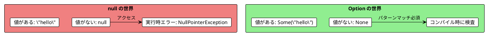
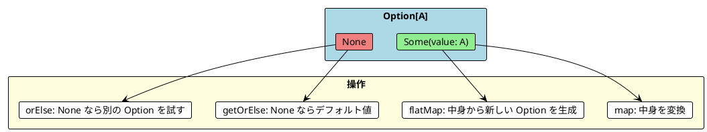
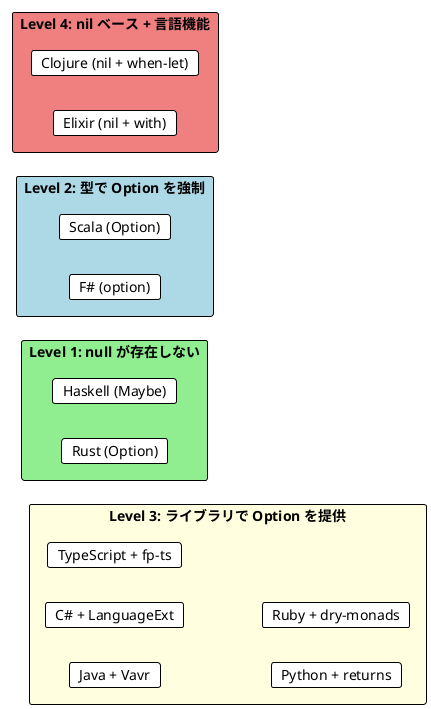

# Part III - 第 6 章：Option 型による安全なエラーハンドリング

## 6.1 はじめに：null の問題

`null` は「10 億ドルの過ち」と呼ばれるほど、ソフトウェア開発に多大なバグをもたらしてきました。値が「ない」ことを `null` で表現すると、コンパイラはその検査を強制できず、実行時に `NullPointerException` や `TypeError` が発生します。

関数型プログラミングでは、値の有無を**型**で表現します。`Option`（Haskell では `Maybe`）型は、「値があるかもしれないし、ないかもしれない」を型レベルで表し、コンパイラによる安全性検査を可能にします。

本章では、11 言語での Option/Maybe の実装を横断的に比較し、以下を明らかにします：

- Option 型の実装方式（言語組み込み vs ライブラリ vs nil ベース）の違い
- 複数の Option を合成する方法（for / do / LINQ / ? 演算子）の多様性
- フォールバック（orElse）と 2 つのエラーハンドリング戦略



---

## 6.2 共通の本質：Option = Some | None

11 言語すべてで共通する Option の構造は、**2 つのケース**の判別共用体です：

1. **Some(value)**: 値が存在する
2. **None**: 値が存在しない



3 つの言語グループから代表例を見てみましょう：

```haskell
-- Haskell: Maybe 型（言語組み込み）
data Maybe a = Nothing | Just a

-- 使用例
Just 42   :: Maybe Int   -- 値がある
Nothing   :: Maybe Int   -- 値がない
```

```rust
// Rust: Option 型（言語組み込み）
let some_value: Option<i32> = Some(42);
let no_value: Option<i32> = None;

// パターンマッチでの取り出し（コンパイラが網羅性を検査）
match some_value {
    Some(v) => println!("Value: {}", v),
    None    => println!("No value"),
}
```

```scala
// Scala: Option 型（標準ライブラリ）
val some: Option[Int] = Some(42)
val none: Option[Int] = None

// map で変換
some.map(_ * 2)    // Some(84)
none.map(_ * 2)    // None（安全に伝播）
```

---

## 6.3 Option の実装方式：3 つのアプローチ

### アプローチ 1: 言語組み込み

型システムで `null` の使用自体を排除し、Option/Maybe を唯一の「値の不在」表現とします。

| 言語 | 型名 | Some | None | 特徴 |
|------|------|------|------|------|
| **Haskell** | `Maybe a` | `Just a` | `Nothing` | 完全な型安全性、`null` が存在しない |
| **Rust** | `Option<T>` | `Some(T)` | `None` | `null` が存在しない、`?` 演算子 |
| **F#** | `'a option` | `Some a` | `None` | .NET 上だが Option がファーストクラス |

### アプローチ 2: ライブラリ提供

言語自体には `null` が存在するが、FP ライブラリで Option 型を提供します。

| 言語 | ライブラリ | 型名 | Some | None |
|------|-----------|------|------|------|
| **Scala** | 標準ライブラリ | `Option[A]` | `Some(a)` | `None` |
| **Java** | Vavr | `Option<T>` | `Option.some(t)` | `Option.none()` |
| **C#** | LanguageExt | `Option<T>` | `Some(t)` | `None` |
| **TypeScript** | fp-ts | `Option<A>` | `O.some(a)` | `O.none` |
| **Python** | returns | `Maybe[A]` | `Some(a)` | `Nothing` |
| **Ruby** | dry-monads | `Maybe` | `Some(a)` | `None()` |

### アプローチ 3: nil ベース + マクロ / パターンマッチ

専用の型を持たず、`nil` を「値がない」として扱い、言語機能でサポートします。

| 言語 | 不在の表現 | サポート機構 |
|------|-----------|------------|
| **Clojure** | `nil` | `some->` / `some->>` マクロ、`when-let` |
| **Elixir** | `nil` | `with` 式、パターンマッチ |

---

## 6.4 TV 番組パース：Option の合成パターン

Option の真価は、複数の「失敗するかもしれない」操作を安全に連鎖させることです。TV 番組文字列 `"Breaking Bad (2008-2013)"` から名前・開始年・終了年を抽出するパターンで比較します。

### ビジネスロジック

```
"Breaking Bad (2008-2013)" →
  extractName    → Some("Breaking Bad")
  extractYearStart → Some(2008)
  extractYearEnd   → Some(2013)
  → Some(TvShow("Breaking Bad", 2008, 2013))

"Invalid" →
  extractName    → None
  → None（以降の処理はスキップ）
```

### 代表 3 言語の比較

**Haskell**: do 記法

```haskell
parseShow :: String -> Maybe TvShow
parseShow rawShow = do
    name      <- extractName rawShow
    yearStart <- extractYearStart rawShow `orElse` extractSingleYear rawShow
    yearEnd   <- extractYearEnd rawShow `orElse` extractSingleYear rawShow
    return $ TvShow name yearStart yearEnd
```

**Scala**: for 内包表記

```scala
def parseShow(rawShow: String): Option[TvShow] =
  for {
    name      <- extractName(rawShow)
    yearStart <- extractYearStart(rawShow).orElse(extractSingleYear(rawShow))
    yearEnd   <- extractYearEnd(rawShow).orElse(extractSingleYear(rawShow))
  } yield TvShow(name, yearStart, yearEnd)
```

**Rust**: ? 演算子

```rust
pub fn parse_show(raw_show: &str) -> Option<TvShow> {
    let name = extract_name(raw_show)?;
    let year_start = extract_year_start(raw_show)
        .or_else(|| extract_single_year(raw_show))?;
    let year_end = extract_year_end(raw_show)
        .or_else(|| extract_single_year(raw_show))?;

    Some(TvShow::new(&name, year_start, year_end))
}
```

**共通パターン**: どの言語でも、1 つでも `None` / `Nothing` が返れば、以降の処理はスキップされ全体が `None` になります。これが**モナド的合成**（短絡評価）です。

### 全 11 言語の実装

#### 関数型ファースト言語

<details>
<summary>Haskell 実装</summary>

```haskell
data TvShow = TvShow
    { showTitle :: String
    , startYear :: Int
    , endYear   :: Int
    }

orElse :: Maybe a -> Maybe a -> Maybe a
orElse (Just x) _ = Just x
orElse Nothing  y = y

parseShow :: String -> Maybe TvShow
parseShow rawShow = do
    name      <- extractName rawShow
    yearStart <- extractYearStart rawShow `orElse` extractSingleYear rawShow
    yearEnd   <- extractYearEnd rawShow `orElse` extractSingleYear rawShow
    return $ TvShow name yearStart yearEnd
```

Haskell の do 記法は `Maybe` モナドに対して自動的に短絡評価を行います。`<|>` 演算子（`Alternative` 型クラス）でも `orElse` を表現できます。

</details>

<details>
<summary>Clojure 実装</summary>

```clojure
(defn parse-show [raw-show]
  (when-let [name (extract-name raw-show)]
    (when-let [year-start (or (extract-year-start raw-show)
                              (extract-single-year raw-show))]
      (when-let [year-end (or (extract-year-end raw-show)
                              (extract-single-year raw-show))]
        {:title name :start year-start :end year-end}))))

;; some-> マクロによる簡潔な nil チェーンも可能
(some-> {:user {:profile {:name "Alice"}}}
        :user
        :profile
        :name)
; => "Alice"
```

Clojure は型レベルの Option を持ちませんが、`when-let` と `or` の組み合わせで同等の安全性を実現します。`some->` マクロは nil で自動停止するパイプラインです。

</details>

<details>
<summary>Elixir 実装</summary>

```elixir
def parse_show(raw_show) do
  with name when not is_nil(name) <- extract_name(raw_show),
       year_start when not is_nil(year_start) <-
         or_else(extract_year_start(raw_show), fn -> extract_single_year(raw_show) end),
       year_end when not is_nil(year_end) <-
         or_else(extract_year_end(raw_show), fn -> extract_single_year(raw_show) end) do
    %TvShow{title: name, start_year: year_start, end_year: year_end}
  else
    _ -> nil
  end
end

def or_else(nil, fallback), do: fallback.()
def or_else(value, _fallback), do: value
```

Elixir の `with` 式は、各ステップでパターンマッチが失敗した場合に `else` 節に移行します。

</details>

<details>
<summary>F# 実装</summary>

```fsharp
type TvShow = { Title: string; Start: int; End: int }

let parseShow (rawShow: string) : TvShow option =
    match extractName rawShow with
    | None -> None
    | Some name ->
        let yearStart =
            extractYearStart rawShow
            |> Option.orElse (extractSingleYear rawShow)
        let yearEnd =
            extractYearEnd rawShow
            |> Option.orElse (extractSingleYear rawShow)
        match yearStart, yearEnd with
        | Some start, Some endYear ->
            Some { Title = name; Start = start; End = endYear }
        | _ -> None
```

F# ではパターンマッチとパイプ演算子 `|>` を組み合わせます。`Option.orElse` で代替値を指定できます。

</details>

#### マルチパラダイム言語

<details>
<summary>Scala 実装</summary>

```scala
case class TvShow(name: String, yearStart: Int, yearEnd: Int)

def parseShow(rawShow: String): Option[TvShow] =
  for {
    name      <- extractName(rawShow)
    yearStart <- extractYearStart(rawShow).orElse(extractSingleYear(rawShow))
    yearEnd   <- extractYearEnd(rawShow).orElse(extractSingleYear(rawShow))
  } yield TvShow(name, yearStart, yearEnd)
```

Scala の for 内包表記は `flatMap` / `map` に脱糖され、Option のモナド的合成を最も読みやすく表現します。

</details>

<details>
<summary>Rust 実装</summary>

```rust
pub struct TvShow {
    pub name: String,
    pub year_start: i32,
    pub year_end: i32,
}

pub fn parse_show(raw_show: &str) -> Option<TvShow> {
    let name = extract_name(raw_show)?;
    let year_start = extract_year_start(raw_show)
        .or_else(|| extract_single_year(raw_show))?;
    let year_end = extract_year_end(raw_show)
        .or_else(|| extract_single_year(raw_show))?;

    Some(TvShow::new(&name, year_start, year_end))
}
```

Rust の `?` 演算子は `None` に遭遇すると即座に `None` を返します。全言語中で最も簡潔な短絡評価構文です。

</details>

<details>
<summary>TypeScript (fp-ts) 実装</summary>

```typescript
interface TvShow {
  readonly title: string
  readonly start: number
  readonly end: number
}

const parseShow = (rawShow: string): O.Option<TvShow> =>
  pipe(
    O.Do,
    O.bind('title', () => extractName(rawShow)),
    O.bind('start', () =>
      pipe(
        extractYearStart(rawShow),
        O.orElse(() => extractSingleYear(rawShow))
      )
    ),
    O.bind('end', () =>
      pipe(
        extractYearEnd(rawShow),
        O.orElse(() => extractSingleYear(rawShow))
      )
    ),
    O.map(({ title, start, end }) => ({ title, start, end }))
  )
```

fp-ts の `O.Do` + `O.bind` は Haskell の do 記法を模倣した構文です。

</details>

#### OOP + FP ライブラリ言語

<details>
<summary>Java (Vavr) 実装</summary>

```java
record TvShow(String name, int yearStart, int yearEnd) {}

Option<TvShow> parseShow(String rawShow) {
    return extractName(rawShow).flatMap(name ->
        extractYearStart(rawShow).orElse(() -> extractSingleYear(rawShow))
            .flatMap(yearStart ->
                extractYearEnd(rawShow).orElse(() -> extractSingleYear(rawShow))
                    .map(yearEnd -> new TvShow(name, yearStart, yearEnd))
            )
    );
}
```

Java は for 内包表記を持たないため、`flatMap` のネストが深くなります。

</details>

<details>
<summary>C# (LanguageExt) 実装</summary>

```csharp
record TvShow(string Name, int YearStart, int YearEnd);

Option<TvShow> ParseShow(string rawShow) =>
    from name in ExtractName(rawShow)
    from yearStart in ExtractYearStart(rawShow) || ExtractSingleYear(rawShow)
    from yearEnd in ExtractYearEnd(rawShow) || ExtractSingleYear(rawShow)
    select new TvShow(name, yearStart, yearEnd);
```

C# の LINQ クエリ式と LanguageExt の `||` 演算子（orElse）の組み合わせで、Scala の for 内包表記に匹敵する簡潔さを実現しています。

</details>

<details>
<summary>Python (returns) 実装</summary>

```python
from returns.maybe import Maybe, Nothing, Some

def parse_show(raw_show: str) -> Maybe[TvShow]:
    name = extract_name(raw_show)
    year_start = extract_year_start(raw_show).lash(
        lambda _: extract_single_year(raw_show)
    )
    year_end = extract_year_end(raw_show).lash(
        lambda _: extract_single_year(raw_show)
    )

    return name.bind(
        lambda n: year_start.bind(
            lambda s: year_end.map(lambda e: TvShow(n, s, e))
        )
    )
```

Python の `returns` ライブラリでは `lash` が `orElse` に相当します。

</details>

<details>
<summary>Ruby (dry-monads) 実装</summary>

```ruby
require 'dry/monads'
include Dry::Monads[:maybe]

TvShow = Struct.new(:title, :start_year, :end_year, keyword_init: true)

def self.parse_show(raw_show)
  name = extract_name(raw_show)
  year_start = extract_year_start(raw_show).or(extract_single_year(raw_show))
  year_end = extract_year_end(raw_show).or(extract_single_year(raw_show))

  name.bind do |n|
    year_start.bind do |ys|
      year_end.fmap do |ye|
        TvShow.new(title: n, start_year: ys, end_year: ye)
      end
    end
  end
end
```

Ruby の `dry-monads` では `fmap`（map）と `bind`（flatMap）を使います。

</details>

---

## 6.5 合成構文の比較

Option のモナド的合成を表現する構文は言語ごとに大きく異なります。

| 言語 | 合成構文 | 可読性 |
|------|---------|--------|
| **Scala** | `for { x <- f1; y <- f2 } yield ...` | 高い |
| **Haskell** | `do { x <- f1; y <- f2; return ... }` | 高い |
| **Rust** | `let x = f1?; let y = f2?;` | 非常に高い |
| **C#** | `from x in f1 from y in f2 select ...` | 高い |
| **F#** | パターンマッチ + パイプ | 中程度 |
| **Clojure** | `(when-let [x f1] (when-let [y f2] ...))` | 中程度 |
| **Elixir** | `with x <- f1, y <- f2 do ... end` | 中程度 |
| **TypeScript** | `pipe(O.Do, O.bind('x', () => f1), ...)` | 中程度 |
| **Java** | `f1.flatMap(x -> f2.flatMap(y -> ...))` | 低い |
| **Python** | `f1.bind(lambda x: f2.bind(lambda y: ...))` | 低い |
| **Ruby** | `f1.bind { \|x\| f2.fmap { \|y\| ... } }` | 低い |

**発見**: Rust の `?` 演算子は全言語中で最も簡潔な短絡評価構文です。通常のコードに `?` を付けるだけで None 伝播を実現し、専用の糖衣構文や do 記法が不要です。

---

## 6.6 フォールバック（orElse）の比較

「最初の操作が失敗したら、別の操作を試す」パターンの言語別実装：

| 言語 | 構文 | 例 |
|------|------|-----|
| **Haskell** | `` `orElse` `` / `<\|>` | `extractYearStart raw \`orElse\` extractSingleYear raw` |
| **Scala** | `.orElse(...)` | `extractYearStart(raw).orElse(extractSingleYear(raw))` |
| **Rust** | `.or_else(\|\| ...)` | `extract_year_start(raw).or_else(\|\| extract_single_year(raw))` |
| **F#** | `\|> Option.orElse` | `extractYearStart raw \|> Option.orElse (extractSingleYear raw)` |
| **C#** | `\|\|` | `ExtractYearStart(raw) \|\| ExtractSingleYear(raw)` |
| **Clojure** | `(or ...)` | `(or (extract-year-start raw) (extract-single-year raw))` |
| **Elixir** | `or_else(val, fn)` | `or_else(extract_year_start(raw), fn -> extract_single_year(raw) end)` |
| **Java** | `.orElse(() -> ...)` | `extractYearStart(raw).orElse(() -> extractSingleYear(raw))` |
| **TypeScript** | `O.orElse(() -> ...)` | `pipe(extractYearStart(raw), O.orElse(() => extractSingleYear(raw)))` |
| **Python** | `.lash(lambda _: ...)` | `extract_year_start(raw).lash(lambda _: extract_single_year(raw))` |
| **Ruby** | `.or(...)` | `extract_year_start(raw).or(extract_single_year(raw))` |

C# の `||` 演算子は最も簡潔で、ブーリアンの `or` と同じ感覚で Option のフォールバックを記述できます。

---

## 6.7 エラーハンドリング戦略：2 つのアプローチ

複数の入力をパースする際、2 つの戦略があります。

### Best-effort（できるだけ多く成功）

パースに成功したものだけを返し、失敗したものは静かに無視します。

```scala
// Scala
val shows: List[TvShow] = rawShows.flatMap(parseShow)
```

```haskell
-- Haskell: catMaybes が Maybe のリストから Just の値だけを抽出
parseShowsBestEffort :: [String] -> [TvShow]
parseShowsBestEffort = catMaybes . map parseShow
```

```clojure
;; Clojure: keep は nil でない結果のみを返す
(keep parse-show raw-shows)
```

```python
# Python: Some の値だけを抽出
[show.unwrap() for show in map(parse_show, raw_shows) if isinstance(show, Some)]
```

### All-or-nothing（全て成功 or 全て失敗）

1 つでも失敗したら全体を失敗とします。

```scala
// Scala: traverse（リストの各要素に Option 関数を適用し、全て Some なら Some[List] を返す）
def parseShows(rawShows: List[String]): Option[List[TvShow]] =
  rawShows.traverse(parseShow)
```

```haskell
-- Haskell: mapM は traverse と同等
parseShowsAllOrNothing :: [String] -> Maybe [TvShow]
parseShowsAllOrNothing = mapM parseShow
```

```typescript
// TypeScript (fp-ts): traverse
const parseShows = (rawShows: readonly string[]): O.Option<readonly TvShow[]> =>
  pipe(rawShows, RA.traverse(O.Applicative)(parseShow))
```

### 戦略比較表

| 戦略 | Scala | Haskell | Clojure | Elixir | Rust | Python | TypeScript | Ruby |
|------|-------|---------|---------|--------|------|--------|------------|------|
| Best-effort | `flatMap` | `catMaybes` | `keep` | `Enum.reject(&is_nil/1)` | `filter_map` | `isinstance` | `RA.compact` | `select(&:some?)` |
| All-or-nothing | `traverse` | `mapM` | 手動実装 | 手動実装 | `collect()` | 手動実装 | `RA.traverse` | 手動実装 |

---

## 6.8 比較分析：3 つの発見

### 発見 1: Option の実装方式は安全性のレベルを決定する



| レベル | 言語 | 安全性 | 特徴 |
|--------|------|--------|------|
| **null なし** | Haskell, Rust | 最高 | コンパイラが Option の処理を強制 |
| **型で強制** | Scala, F# | 高い | null は存在するが Option 使用が慣習 |
| **ライブラリ** | Java, C#, TypeScript, Python, Ruby | 中程度 | null を使う旧コードとの共存が必要 |
| **nil ベース** | Clojure, Elixir | 慣習依存 | 言語機能で安全にサポートするが型保証はない |

### 発見 2: 合成構文は 4 系統に分類できる

1. **内包表記系**: Scala (for), Haskell (do), C# (LINQ), Clojure (when-let)


   - ネストが平坦化され、最も可読性が高い
2. **演算子系**: Rust (`?`)


   - 最も簡潔で、通常のコードに自然に溶け込む
3. **パイプ系**: F# (`|>`), Elixir (`with`), TypeScript (`pipe`)


   - データの流れが明確
4. **flatMap チェーン系**: Java, Python, Ruby


   - 糖衣構文がなく、ネストが深くなりやすい

### 発見 3: Option は Part II の flatMap の延長線上にある

Part II 第 5 章で学んだ `flatMap` のパターンがそのまま適用されています：

```
List.flatMap:   List[A]   → (A → List[B])   → List[B]
Option.flatMap: Option[A] → (A → Option[B]) → Option[B]
```

`List` の `flatMap` が「0 個以上の結果」を扱うのに対し、`Option` の `flatMap` は「0 個か 1 個の結果」を扱います。for 内包表記や do 記法が両方で使えるのは、同じモナドインターフェースを共有しているからです。

---

## 6.9 言語固有の特徴

### Rust: ? 演算子の簡潔さ

Rust の `?` 演算子は Option だけでなく `Result` 型にも使える汎用的な短絡評価構文です。

```rust
// ? なし（冗長）
fn parse_show(raw: &str) -> Option<TvShow> {
    match extract_name(raw) {
        None => None,
        Some(name) => match extract_year_start(raw) {
            None => None,
            Some(start) => match extract_year_end(raw) {
                None => None,
                Some(end) => Some(TvShow::new(&name, start, end)),
            }
        }
    }
}

// ? あり（簡潔）
fn parse_show(raw: &str) -> Option<TvShow> {
    let name = extract_name(raw)?;
    let start = extract_year_start(raw)?;
    let end = extract_year_end(raw)?;
    Some(TvShow::new(&name, start, end))
}
```

### Clojure: some-> マクロ

Clojure の `some->` は nil で自動停止するパイプラインマクロです。ネストした Map のアクセスに特に有効です。

```clojure
;; nil が出たら即座に nil を返す
(some-> {:user {:profile {:name "Alice"}}}
        :user
        :profile
        :name
        clojure.string/upper-case)
; => "ALICE"

(some-> {:user {:profile nil}}
        :user
        :profile
        :name)
; => nil（:profile が nil なので停止）
```

### C#: || 演算子による OrElse

LanguageExt の `||` 演算子は、ブーリアン論理和と同じ感覚で Option のフォールバックを記述できます。

```csharp
// ブーリアンと同じ構文
var result = ExtractYearStart(raw) || ExtractSingleYear(raw);
```

### Haskell: catMaybes と mapMaybe

Haskell は `Maybe` のリスト操作に特化した関数群を持ちます。

```haskell
catMaybes [Just 1, Nothing, Just 3, Nothing]  -- [1, 3]

mapMaybe safeHead [[1,2], [], [3]]  -- [1, 3]
```

---

## 6.10 実践的な選択指針

### プロジェクト要件別の推奨

| 要件 | 推奨言語 | 理由 |
|------|---------|------|
| 完全な null 安全性 | Haskell, Rust | 言語レベルで null が存在しない |
| 合成構文の可読性 | Scala, C# | for 内包表記 / LINQ が読みやすい |
| 最も簡潔な短絡評価 | Rust | `?` 演算子 |
| 既存の Java/C# 資産との共存 | Java + Vavr, C# + LanguageExt | 段階的な Option 導入が可能 |
| 動的型付け + FP | Clojure | `some->` / `when-let` が強力 |

### Option 導入の段階的アプローチ

1. **まず**: `null` を返す関数を `Option` を返すように変更
2. **次に**: `map` / `flatMap` で Option を変換（`null` チェックの `if` 文を排除）
3. **そして**: `orElse` でフォールバックを宣言的に記述
4. **最後に**: 糖衣構文（for / do / LINQ / `?`）で合成を平坦化

---

## 6.11 まとめ

本章では、11 言語での Option/Maybe の実装を比較し、以下を確認しました：

**共通の原則**:

- Option = Some | None の 2 値構造は全言語で共通
- モナド的合成（1 つでも None なら全体が None）は同じ短絡評価パターン
- Best-effort と All-or-nothing の 2 つのエラーハンドリング戦略

**言語間の差異**:

- 実装方式は 4 段階（null なし → 型で強制 → ライブラリ → nil ベース）
- 合成構文は 4 系統（内包表記、? 演算子、パイプ、flatMap チェーン）
- フォールバックの構文は `orElse` / `||` / `or` / `lash` / `<|>` と多様

**学び**:

- Option は Part II の `flatMap` と同じモナドパターンの応用
- Rust の `?` 演算子は最も簡潔な短絡評価を実現
- 次章の Either/Result 型は、Option の「None に理由を持たせた」拡張

---

### 各言語の詳細記事

| 言語 | 記事リンク |
|------|-----------|
| Scala | [Part III: エラーハンドリング](../scala/part-3.md) |
| Java | [Part III: エラーハンドリング](../java/part-3.md) |
| F# | [Part III: エラーハンドリング](../fsharp/part-3.md) |
| C# | [Part III: エラーハンドリング](../csharp/part-3.md) |
| Haskell | [Part III: エラーハンドリング](../haskell/part-3.md) |
| Clojure | [Part III: エラーハンドリング](../clojure/part-3.md) |
| Elixir | [Part III: エラーハンドリング](../elixir/part-3.md) |
| Rust | [Part III: エラーハンドリング](../rust/part-3.md) |
| Python | [Part III: エラーハンドリング](../python/part-3.md) |
| TypeScript | [Part III: エラーハンドリング](../typescript/part-3.md) |
| Ruby | [Part III: エラーハンドリング](../ruby/part-3.md) |
