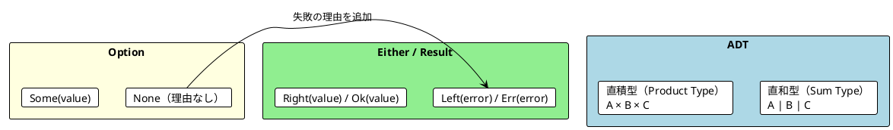
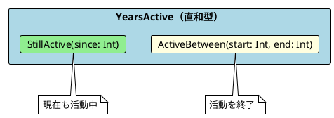
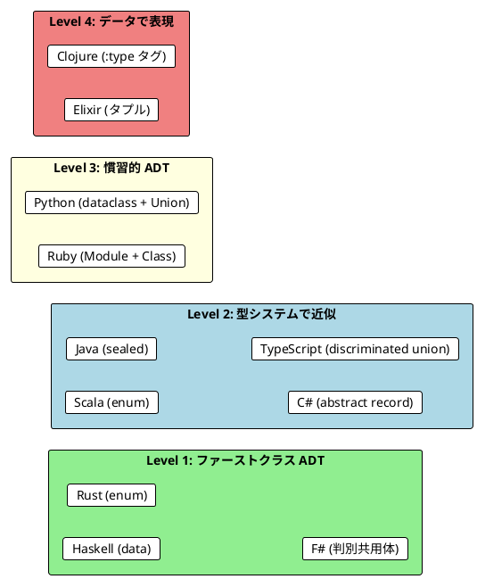

# Part III - 第 7 章：Either 型と代数的データ型

## 7.1 はじめに：Option の限界

前章で学んだ Option 型は、値の有無を型で表現する強力な手段でした。しかし、`None` は「なぜ失敗したか」の情報を持ちません。Either/Result 型は、失敗の理由をエラー値として保持し、より豊かなエラーハンドリングを実現します。

さらに本章では、**代数的データ型**（ADT: Algebraic Data Type）を学びます。ADT は「直和型」と「直積型」の組み合わせで、ドメインの概念を正確にモデリングする関数型プログラミングの基盤です。

本章では、11 言語での Either/Result と ADT の実装を横断的に比較し、以下を明らかにします：

- Either/Result の実装方式の違い（組み込み vs ライブラリ vs タプル/マップ）
- ADT の表現方法（sealed trait, enum, 判別共用体, discriminated union）
- パターンマッチの網羅性チェックの言語間差異



---

## 7.2 共通の本質：Either = Right | Left

11 言語すべてに共通する Either/Result の構造は、**成功と失敗の 2 つのケース**を持つ型です：

1. **Right / Ok / Success**: 処理が成功し、値を保持する
2. **Left / Err / Failure**: 処理が失敗し、エラー情報を保持する

3 つの言語グループから代表例を見てみましょう：

```haskell
-- Haskell: Either 型（言語組み込み）
data Either e a = Left e | Right a

-- 使用例
extractName :: String -> Either String String
extractName rawShow =
    case elemIndex '(' rawShow of
        Just idx | idx > 0 -> Right $ trim $ take idx rawShow
        _                  -> Left $ "Can't extract name from " ++ rawShow
```

```rust
// Rust: Result 型（言語組み込み）
pub fn extract_name(raw_show: &str) -> Result<String, String> {
    let bracket_open = raw_show
        .find('(')
        .ok_or_else(|| format!("Can't find '(' in {}", raw_show))?;

    if bracket_open > 0 {
        Ok(raw_show[..bracket_open].trim().to_string())
    } else {
        Err(format!("Can't extract name from {}", raw_show))
    }
}
```

```scala
// Scala: Either 型（標準ライブラリ）
def extractName(show: String): Either[String, String] = {
  val bracketOpen = show.indexOf('(')
  if (bracketOpen > 0) Right(show.substring(0, bracketOpen).trim)
  else Left(s"Can't extract name from $show")
}
```

---

## 7.3 Either/Result の実装方式

### アプローチ 1: 言語組み込み

| 言語 | 型名 | 成功 | 失敗 | 特徴 |
|------|------|------|------|------|
| **Haskell** | `Either e a` | `Right a` | `Left e` | 最も古典的な Either |
| **Rust** | `Result<T, E>` | `Ok(T)` | `Err(E)` | `?` 演算子で簡潔な伝播 |
| **F#** | `Result<'T, 'E>` | `Ok value` | `Error e` | パイプ + パターンマッチ |

### アプローチ 2: ライブラリ提供

| 言語 | ライブラリ | 型名 | 成功 | 失敗 |
|------|-----------|------|------|------|
| **Scala** | 標準ライブラリ | `Either[E, A]` | `Right(a)` | `Left(e)` |
| **Java** | Vavr | `Either<L, R>` | `Either.right(r)` | `Either.left(l)` |
| **C#** | LanguageExt | `Either<L, R>` | `Right(r)` | `Left(l)` |
| **TypeScript** | fp-ts | `Either<E, A>` | `E.right(a)` | `E.left(e)` |
| **Python** | returns | `Result[T, E]` | `Success(t)` | `Failure(e)` |
| **Ruby** | dry-monads | `Result` | `Success(t)` | `Failure(e)` |

### アプローチ 3: タプル / マップベース

| 言語 | 構造 | 成功 | 失敗 |
|------|------|------|------|
| **Elixir** | タプル | `{:ok, value}` | `{:error, reason}` |
| **Clojure** | マップ | `{:status :ok, :value v}` | `{:status :error, :error msg}` |

---

## 7.4 TV 番組パース：Either による合成

Option 版と同じ TV 番組パースを Either で実装し、**失敗の理由**が伝播する様子を比較します。

### 代表 3 言語の比較

**Haskell**: do 記法

```haskell
parseShowE :: String -> Either String TvShow
parseShowE rawShow = do
    name      <- extractNameE rawShow
    yearStart <- extractYearStartE rawShow `orElseE` extractSingleYearE rawShow
    yearEnd   <- extractYearEndE rawShow `orElseE` extractSingleYearE rawShow
    return $ TvShow name yearStart yearEnd

-- 失敗例
parseShowE "Invalid"
-- Left "Can't extract name from Invalid"（失敗の理由が残る）
```

**Scala**: for 内包表記

```scala
def parseShow(rawShow: String): Either[String, TvShow] =
  for {
    name      <- extractName(rawShow)
    yearStart <- extractYearStart(rawShow).orElse(extractSingleYear(rawShow))
    yearEnd   <- extractYearEnd(rawShow).orElse(extractSingleYear(rawShow))
  } yield TvShow(name, yearStart, yearEnd)

// 失敗例
parseShow("Invalid")
// Left("Can't extract name from Invalid")
```

**Rust**: ? 演算子

```rust
pub fn parse_show(raw_show: &str) -> Result<TvShow, String> {
    let name = extract_name(raw_show)?;
    let year_start = extract_year_start(raw_show)
        .or_else(|_| extract_single_year(raw_show))?;
    let year_end = extract_year_end(raw_show)
        .or_else(|_| extract_single_year(raw_show))?;

    Ok(TvShow::new(&name, year_start, year_end))
}

// 失敗例
parse_show("Invalid")
// Err("Can't extract name from Invalid")
```

### 全 11 言語の実装

#### 関数型ファースト言語

<details>
<summary>Haskell 実装</summary>

```haskell
parseShowE :: String -> Either String TvShow
parseShowE rawShow = do
    name      <- extractNameE rawShow
    yearStart <- extractYearStartE rawShow `orElseE` extractSingleYearE rawShow
    yearEnd   <- extractYearEndE rawShow `orElseE` extractSingleYearE rawShow
    return $ TvShow name yearStart yearEnd
```

Haskell の `Either` は `Monad` インスタンスを持ち、do 記法で `Maybe` と同じように合成できます。

</details>

<details>
<summary>Clojure 実装</summary>

```clojure
(defn ok [value] {:status :ok :value value})
(defn error [message] {:status :error :error message})

(defn result-flatmap [f result]
  (if (= (:status result) :ok)
    (f (:value result))
    result))

(defn parse-show-result [raw-show]
  (result-flatmap
    (fn [name]
      (let [year-start (result-or-else
                         (extract-year-start-result raw-show)
                         #(extract-single-year-result raw-show))
            year-end (result-or-else
                       (extract-year-end-result raw-show)
                       #(extract-single-year-result raw-show))]
        (result-flatmap
          (fn [ys]
            (result-flatmap
              (fn [ye] (ok {:title name :start ys :end ye}))
              year-end))
          year-start)))
    (extract-name-result raw-show)))
```

Clojure では専用の型を持たないため、マップベースの Result パターンと `result-flatmap` 関数を手動で実装します。

</details>

<details>
<summary>Elixir 実装</summary>

```elixir
def parse_show(raw_show) do
  with {:ok, name} <- extract_name(raw_show),
       {:ok, year_start} <- or_else(extract_year_start(raw_show),
                                    fn -> extract_single_year(raw_show) end),
       {:ok, year_end} <- or_else(extract_year_end(raw_show),
                                  fn -> extract_single_year(raw_show) end) do
    {:ok, %TvShow{title: name, start: year_start, end_year: year_end}}
  end
end
```

Elixir の `with` 式は、パターンマッチが失敗すると最初の不一致を返します。`{:ok, value}` / `{:error, reason}` のタプルパターンは Erlang/OTP の伝統です。

</details>

<details>
<summary>F# 実装</summary>

```fsharp
let parseShow (rawShow: string) : Result<TvShow, string> =
    match extractName rawShow with
    | Error e -> Error e
    | Ok name ->
        let yearStart =
            extractYearStart rawShow
            |> Result.orElse (extractSingleYear rawShow)
        let yearEnd =
            extractYearEnd rawShow
            |> Result.orElse (extractSingleYear rawShow)
        match yearStart, yearEnd with
        | Ok start, Ok endYear ->
            Ok { Title = name; Start = start; End = endYear }
        | Error e, _ -> Error e
        | _, Error e -> Error e
```

F# ではパターンマッチで `Ok` / `Error` を明示的に処理します。

</details>

#### マルチパラダイム言語

<details>
<summary>Scala 実装</summary>

```scala
def parseShow(rawShow: String): Either[String, TvShow] =
  for {
    name      <- extractName(rawShow)
    yearStart <- extractYearStart(rawShow).orElse(extractSingleYear(rawShow))
    yearEnd   <- extractYearEnd(rawShow).orElse(extractSingleYear(rawShow))
  } yield TvShow(name, yearStart, yearEnd)
```

</details>

<details>
<summary>Rust 実装</summary>

```rust
pub fn parse_show(raw_show: &str) -> Result<TvShow, String> {
    let name = extract_name(raw_show)?;
    let year_start = extract_year_start(raw_show)
        .or_else(|_| extract_single_year(raw_show))?;
    let year_end = extract_year_end(raw_show)
        .or_else(|_| extract_single_year(raw_show))?;

    Ok(TvShow::new(&name, year_start, year_end))
}
```

Rust の `?` 演算子は `Option` と `Result` の両方で使えます。`or_else(|_| ...)` のクロージャ引数 `_` はエラー値を無視することを示します。

</details>

<details>
<summary>TypeScript (fp-ts) 実装</summary>

```typescript
import * as E from 'fp-ts/Either'

const parseShow = (rawShow: string): E.Either<string, TvShow> =>
  pipe(
    E.Do,
    E.bind('name', () => extractName(rawShow)),
    E.bind('start', () =>
      pipe(
        extractYearStart(rawShow),
        E.orElse(() => extractSingleYear(rawShow))
      )
    ),
    E.bind('end', () =>
      pipe(
        extractYearEnd(rawShow),
        E.orElse(() => extractSingleYear(rawShow))
      )
    ),
    E.map(({ name, start, end }) => ({ title: name, start, end }))
  )
```

</details>

#### OOP + FP ライブラリ言語

<details>
<summary>Java (Vavr) 実装</summary>

```java
public static Either<String, TvShow> parseShow(String rawShow) {
    return extractName(rawShow).flatMap(name ->
        extractYearStart(rawShow).orElse(() -> extractSingleYear(rawShow))
            .flatMap(yearStart ->
                extractYearEnd(rawShow).orElse(() -> extractSingleYear(rawShow))
                    .map(yearEnd -> new TvShow(name, yearStart, yearEnd))
            )
    );
}
```

</details>

<details>
<summary>C# (LanguageExt) 実装</summary>

```csharp
Either<string, TvShow> ParseShow(string rawShow) =>
    from name in ExtractName(rawShow)
    from yearStart in ExtractYearStart(rawShow) || ExtractSingleYear(rawShow)
    from yearEnd in ExtractYearEnd(rawShow) || ExtractSingleYear(rawShow)
    select new TvShow(name, yearStart, yearEnd);
```

C# の LINQ + `||` 演算子で Scala の for 内包表記に匹敵する簡潔さを実現しています。

</details>

<details>
<summary>Python (returns) 実装</summary>

```python
from returns.result import Result, Success, Failure

def parse_show(raw_show: str) -> Result[TvShow, str]:
    name = extract_name_result(raw_show)
    year_start = extract_year_start_result(raw_show).lash(
        lambda _: extract_single_year_result(raw_show)
    )
    year_end = extract_year_end_result(raw_show).lash(
        lambda _: extract_single_year_result(raw_show)
    )

    return name.bind(
        lambda n: year_start.bind(
            lambda s: year_end.map(lambda e: TvShow(n, s, e))
        )
    )
```

</details>

<details>
<summary>Ruby (dry-monads) 実装</summary>

```ruby
def parse_show(raw_show)
  name = extract_name(raw_show)
  year_start = extract_year_start(raw_show).or(extract_single_year(raw_show))
  year_end = extract_year_end(raw_show).or(extract_single_year(raw_show))

  name.bind do |n|
    year_start.bind do |ys|
      year_end.fmap do |ye|
        TvShow.new(title: n, start_year: ys, end_year: ye)
      end
    end
  end
end
```

</details>

---

## 7.5 代数的データ型（ADT）

ADT は関数型プログラミングのドメインモデリングの基盤です。**直和型**（「A または B」）と**直積型**（「A かつ B」）の組み合わせで、ドメインの概念を型で正確に表現します。

### 直和型の例：YearsActive

アーティストの活動期間は「活動中」か「活動終了」のどちらかです：



### 代表 3 言語の ADT 定義

**Haskell**: data 型

```haskell
data MusicGenre = HeavyMetal | Pop | HardRock | Grunge
    deriving (Show, Eq)

data YearsActive
    = StillActive Int
    | ActiveBetween Int Int
    deriving (Show, Eq)

data Artist = Artist
    { artistName       :: String
    , artistGenre      :: MusicGenre
    , artistOrigin     :: Location
    , artistYearsActive :: YearsActive
    }
```

**Rust**: enum

```rust
#[derive(Debug, Clone, PartialEq)]
pub enum MusicGenre {
    HeavyMetal,
    Pop,
    HardRock,
    Jazz,
}

#[derive(Debug, Clone, PartialEq)]
pub enum YearsActive {
    StillActive { since: i32 },
    ActiveBetween { start: i32, end: i32 },
}

pub struct Artist {
    pub name: String,
    pub genre: MusicGenre,
    pub origin: Location,
    pub years_active: YearsActive,
}
```

**Scala**: enum（Scala 3）

```scala
enum MusicGenre {
  case HeavyMetal, Pop, HardRock
}

enum YearsActive {
  case StillActive(since: Int)
  case ActiveBetween(start: Int, end: Int)
}

case class Artist(
    name: String,
    genre: MusicGenre,
    origin: Location,
    yearsActive: YearsActive
)
```

### 全 11 言語の ADT 表現

| 言語 | 直和型の構文 | 直積型の構文 | 網羅性チェック |
|------|------------|------------|-------------|
| **Haskell** | `data T = A \| B` | `data T = T { field :: Type }` | コンパイラ警告 |
| **Rust** | `enum T { A, B }` | `struct T { field: Type }` | コンパイルエラー |
| **F#** | `type T = A \| B` | `type T = { Field: Type }` | コンパイラ警告 |
| **Scala** | `enum T { case A; case B }` | `case class T(field: Type)` | コンパイラ警告 |
| **Java** | `sealed interface T` + `record` | `record T(Type field)` | コンパイルエラー（21+） |
| **C#** | `abstract record` + 派生 record | `record T(Type Field)` | switch 式で警告 |
| **TypeScript** | `type T = { _tag: 'A' } \| { _tag: 'B' }` | `interface T { field: Type }` | なし（型レベル） |
| **Python** | `Enum` + `@dataclass` | `@dataclass(frozen=True)` | match（3.10+） |
| **Clojure** | マップ + `:type` タグ | マップ | なし |
| **Elixir** | タプル `{:tag, ...}` | `defstruct` | なし |
| **Ruby** | モジュール + クラス | `Struct` | case when |

<details>
<summary>全 11 言語の ADT 定義</summary>

**F#**（判別共用体）:
```fsharp
type MusicGenre = HeavyMetal | Pop | HardRock | Jazz

type YearsActive =
    | StillActive of since: int
    | ActiveBetween of start: int * endYear: int
```

**Java**（sealed interface + record）:
```java
public sealed interface YearsActive permits StillActive, ActiveBetween {}
public record StillActive(int since) implements YearsActive {}
public record ActiveBetween(int start, int end) implements YearsActive {}
```

**C#**（abstract record）:
```csharp
public abstract record YearsActive;
public record StillActive(int Since) : YearsActive;
public record ActiveBetween(int Start, int EndYear) : YearsActive;
```

**TypeScript**（discriminated union）:
```typescript
type YearsActive =
  | { readonly _tag: 'StillActive'; readonly since: number }
  | { readonly _tag: 'ActiveBetween'; readonly start: number; readonly end: number }
```

**Clojure**（マップ + タグ）:
```clojure
(defn still-active [since]
  {:type :still-active :since since})

(defn active-between [start end]
  {:type :active-between :start start :end end})
```

**Elixir**（タプル）:
```elixir
# {:still_active, since}
# {:active_between, start, end_year}
```

**Python**（dataclass + Union）:
```python
@dataclass(frozen=True)
class StillActive:
    since: int

@dataclass(frozen=True)
class ActiveBetween:
    start: int
    end: int

YearsActive = StillActive | ActiveBetween
```

**Ruby**（Module + Classes）:
```ruby
module YearsActive
  class StillActive
    attr_reader :since
    def initialize(since) = @since = since
  end

  class ActiveBetween
    attr_reader :start_year, :end_year
    def initialize(start_year, end_year)
      @start_year = start_year
      @end_year = end_year
    end
  end
end
```

</details>

---

## 7.6 パターンマッチ：ADT の安全な処理

ADT の各ケースを処理するパターンマッチは、関数型プログラミングの中核です。アーティストが特定期間に活動していたかを判定する関数で比較します。

### 代表 3 言語の比較

**Haskell**:

```haskell
wasArtistActive :: Artist -> Int -> Int -> Bool
wasArtistActive artist yearStart yearEnd =
    case artistYearsActive artist of
        StillActive since        -> since <= yearEnd
        ActiveBetween start end_ -> start <= yearEnd && end_ >= yearStart
```

**Rust**:

```rust
pub fn was_artist_active(artist: &Artist, year_start: i32, year_end: i32) -> bool {
    match &artist.years_active {
        YearsActive::StillActive { since } => *since <= year_end,
        YearsActive::ActiveBetween { start, end } =>
            *start <= year_end && *end >= year_start,
    }
}
```

**Scala**:

```scala
def wasArtistActive(artist: Artist, yearStart: Int, yearEnd: Int): Boolean =
  artist.yearsActive match {
    case StillActive(since)        => since <= yearEnd
    case ActiveBetween(start, end) => start <= yearEnd && end >= yearStart
  }
```

### 網羅性チェックの比較

| レベル | 言語 | 挙動 |
|--------|------|------|
| **コンパイルエラー** | Rust, Java (21+ sealed) | ケースが不足するとコンパイルが失敗する |
| **コンパイラ警告** | Haskell, Scala, F# | 警告が出るが、コンパイルは通る |
| **IDE 警告のみ** | C#, TypeScript | エディタが警告するが言語レベルでは強制しない |
| **なし** | Clojure, Elixir, Python, Ruby | 動的型付けのため網羅性チェックなし |

**発見**: Rust は `match` で全ケースを処理しないとコンパイルエラーになる唯一の言語です。これにより、ADT にケースを追加した際に、処理漏れを確実に検出できます。

---

## 7.7 Option と Either の変換

Option と Either は相互に変換可能です。失敗理由を付加して Option → Either、理由を捨てて Either → Option に変換します。

### 代表的な変換パターン

| 方向 | Scala | Haskell | Rust | F# |
|------|-------|---------|------|----|
| Option → Either | `opt.toRight("error")` | `maybeToEither "error" mb` | `opt.ok_or("error")` | `Option.toResult` |
| Either → Option | `either.toOption` | `eitherToMaybe e` | `result.ok()` | `Result.toOption` |

```scala
// Scala
val opt: Option[Int] = Some(42)
val either: Either[String, Int] = opt.toRight("Value not found")
// Right(42)

val back: Option[Int] = either.toOption
// Some(42)
```

```rust
// Rust
let opt: Option<i32> = Some(42);
let result: Result<i32, &str> = opt.ok_or("Value not found");
// Ok(42)

let back: Option<i32> = result.ok();
// Some(42)
```

---

## 7.8 比較分析：3 つの発見

### 発見 1: Either/Result の命名は 3 系統に分かれる

| 系統 | 成功 | 失敗 | 言語 |
|------|------|------|------|
| **Either 系** | `Right` | `Left` | Haskell, Scala, Java (Vavr), C# (LE), TypeScript (fp-ts) |
| **Result 系** | `Ok` | `Err` / `Error` | Rust, F# |
| **Success/Failure 系** | `Success` | `Failure` | Python (returns), Ruby (dry-monads) |

Either 系は数学的な「左右」に由来し、Result 系は実用的な命名です。Elixir の `{:ok, value}` / `{:error, reason}` は Result 系のタプル表現です。

### 発見 2: ADT の表現力は言語の型システムに依存する



Haskell, Rust, F# はファーストクラスの ADT を持ち、コンパイラによる網羅性チェックが保証されます。TypeScript の discriminated union は `_tag` フィールドで近似しますが、言語レベルの保証はありません。

### 発見 3: Either の合成構文は Option と共通

前章の Option と本章の Either は、同じ合成構文（for / do / LINQ / `?`）で使えます。これは両者が同じ**モナドインターフェース**を共有しているからです：

```
Option.flatMap: Option[A] → (A → Option[B]) → Option[B]
Either.flatMap: Either[E,A] → (A → Either[E,B]) → Either[E,B]
```

Scala の for 内包表記、Haskell の do 記法、Rust の `?` 演算子は、Option と Either の両方で同じように機能します。

---

## 7.9 言語固有の特徴

### Rust: カスタムエラー型と ? 演算子

Rust では文字列ではなく専用の enum でエラーを表現するのが慣習です：

```rust
#[derive(Debug, Clone, PartialEq)]
pub enum ParseError {
    MissingName,
    MissingYear,
    InvalidYear(String),
    MissingBracket,
}

pub fn extract_name(raw_show: &str) -> Result<String, ParseError> {
    let bracket_open = raw_show.find('(').ok_or(ParseError::MissingBracket)?;
    if bracket_open > 0 {
        Ok(raw_show[..bracket_open].trim().to_string())
    } else {
        Err(ParseError::MissingName)
    }
}
```

エラー型を enum にすることで、パターンマッチでエラーの種類ごとに処理を分けられます。

### Elixir: {:ok, value} / {:error, reason} のタプルパターン

Elixir のタプルパターンは Erlang/OTP の伝統を引き継ぎ、エコシステム全体で統一されています：

```elixir
case File.read("config.json") do
  {:ok, content} -> Jason.decode(content)
  {:error, :enoent} -> {:error, "File not found"}
  {:error, reason} -> {:error, "Failed: #{reason}"}
end
```

### Clojure: fnil によるデフォルト値関数

Clojure の `fnil` は、nil が渡された場合にデフォルト値を使う関数を生成します：

```clojure
(def safe-inc (fnil inc 0))
(safe-inc nil)  ; => 1
(safe-inc 5)    ; => 6
```

### Java: sealed interface（Java 17+）

Java 17 の `sealed interface` は、実装クラスを限定した直和型を実現します：

```java
public sealed interface YearsActive permits StillActive, ActiveBetween {}
public record StillActive(int since) implements YearsActive {}
public record ActiveBetween(int start, int end) implements YearsActive {}
```

Java 21 のパターンマッチ switch と組み合わせると、Scala に近い ADT 操作が可能になります。

---

## 7.10 実践的な選択指針

### Either/Result の選択

| 要件 | 推奨言語 | 理由 |
|------|---------|------|
| 最も簡潔なエラー伝播 | Rust | `?` 演算子 + カスタムエラー enum |
| 可読性の高い合成 | Scala, C# | for 内包表記 / LINQ |
| 完全な型安全性 | Haskell | Either モナド + do 記法 |
| 既存 OOP 資産との共存 | Java + Vavr, C# + LE | ライブラリで段階導入 |
| エコシステム統一 | Elixir | {:ok}/{:error} がエコシステム全体で統一 |

### ADT の選択

| 要件 | 推奨言語 | 理由 |
|------|---------|------|
| 網羅性チェックの強制 | Rust | match の網羅性がコンパイルエラー |
| 最も表現力の高い ADT | Haskell, F# | ファーストクラスの直和型 |
| OOP チームでの導入 | Scala, Java, C# | sealed trait/interface でなじみやすい |
| 型レベルの Union | TypeScript | discriminated union |

---

## 7.11 まとめ

本章では、11 言語での Either/Result と ADT の実装を比較し、以下を確認しました：

**共通の原則**:

- Either = Right(成功) | Left(失敗) は全言語で同じ構造
- ADT = 直和型 + 直積型でドメインを正確にモデリング
- パターンマッチによる各ケースの安全な処理

**言語間の差異**:

- 命名は 3 系統（Either 系 / Result 系 / Success/Failure 系）
- ADT の表現力は 4 段階（ファーストクラス → 型で近似 → 慣習的 → データ表現）
- 網羅性チェックは Rust が最も厳格（コンパイルエラー）

**学び**:

- Either は Option の「失敗に理由を持たせた」拡張
- 合成構文（for / do / LINQ / `?`）は Option と Either で共通
- ADT + パターンマッチは、不正な状態を型レベルで排除する強力なツール

---

### 各言語の詳細記事

| 言語 | 記事リンク |
|------|-----------|
| Scala | [Part III: エラーハンドリング](../scala/part-3.md) |
| Java | [Part III: エラーハンドリング](../java/part-3.md) |
| F# | [Part III: エラーハンドリング](../fsharp/part-3.md) |
| C# | [Part III: エラーハンドリング](../csharp/part-3.md) |
| Haskell | [Part III: エラーハンドリング](../haskell/part-3.md) |
| Clojure | [Part III: エラーハンドリング](../clojure/part-3.md) |
| Elixir | [Part III: エラーハンドリング](../elixir/part-3.md) |
| Rust | [Part III: エラーハンドリング](../rust/part-3.md) |
| Python | [Part III: エラーハンドリング](../python/part-3.md) |
| TypeScript | [Part III: エラーハンドリング](../typescript/part-3.md) |
| Ruby | [Part III: エラーハンドリング](../ruby/part-3.md) |
