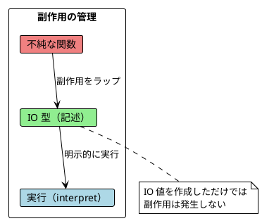
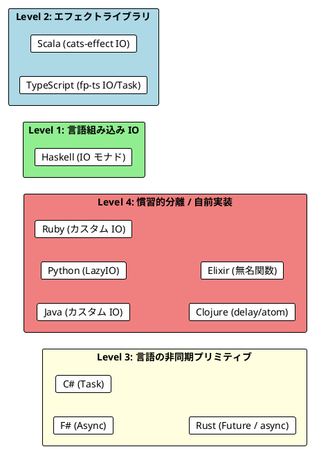
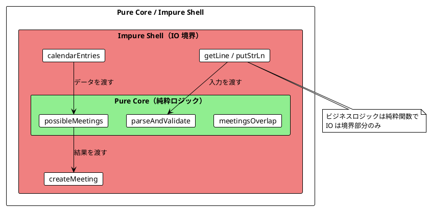

# Part IV - 第 8 章：IO モナドと副作用の分離

## 8.1 はじめに：副作用の問題

純粋関数は同じ入力に対して常に同じ出力を返し、外部の状態を変更しません。しかし、実際のプログラムには副作用が不可欠です：

- ファイルの読み書き
- ネットワーク通信
- データベースアクセス
- 乱数生成
- 現在時刻の取得

関数型プログラミングの核心的な問いは「副作用をどう管理するか」です。本章では、11 言語がこの問いにどう答えるかを横断的に比較し、以下を明らかにします：

- IO の抽象化レベルの違い（言語組み込み vs ライブラリ vs 慣習的分離）
- 「記述」と「実行」を分離する共通パターン
- IO の合成方法と糖衣構文の言語間差異



---

## 8.2 共通の本質：記述と実行の分離

11 言語すべてに共通する IO の原則は、**副作用の「記述」と「実行」を分離する**ことです：

1. **記述（Description）**: 副作用を持つ計算を「値」として表現する
2. **合成（Composition）**: IO 値を flatMap / bind / chain で組み合わせる
3. **実行（Interpretation）**: プログラムの端（main / エントリーポイント）で一度だけ実行する

3 つの言語グループから代表例を見てみましょう：

```haskell
-- Haskell: IO モナド（言語組み込み）
castTheDie :: IO Int
castTheDie = randomRIO (1, 6)

-- do 記法で合成
castTheDieTwice :: IO Int
castTheDieTwice = do
    first  <- castTheDie
    second <- castTheDie
    return (first + second)
```

```scala
// Scala: cats-effect IO（ライブラリ）
def castTheDie(): IO[Int] = IO.delay(random.nextInt(6) + 1)

// for 内包表記で合成
def castTheDieTwice(): IO[Int] =
  for {
    first  <- castTheDie()
    second <- castTheDie()
  } yield first + second

// 明示的に実行（unsafeRunSync）
castTheDieTwice().unsafeRunSync()
```

```python
# Python: カスタム LazyIO クラス
def cast_the_die() -> LazyIO[int]:
    return LazyIO(lambda: random.randint(1, 6))

# bind/map で合成
def cast_the_die_twice() -> LazyIO[int]:
    return cast_the_die().bind(
        lambda first: cast_the_die().map(lambda second: first + second)
    )

# 明示的に実行
cast_the_die_twice().run()
```

---

## 8.3 IO の実装方式

### アプローチ 1: 言語組み込み IO

| 言語 | IO 型 | 実行方法 | 特徴 |
|------|-------|---------|------|
| **Haskell** | `IO a` | `main` 関数 | 言語レベルで純粋性を強制 |

Haskell は唯一、IO を**言語レベル**で強制する言語です。`IO` 型を持たない関数は副作用を起こせません。

### アプローチ 2: エフェクトライブラリ

| 言語 | ライブラリ | IO 型 | 実行方法 |
|------|-----------|-------|---------|
| **Scala** | cats-effect | `IO[A]` | `unsafeRunSync()` |
| **TypeScript** | fp-ts | `IO<A>` / `Task<A>` | `io()` / `task()` |
| **Java** | 独自実装 | `IO<A>` | `unsafeRun()` |
| **Python** | 独自実装 | `LazyIO[A]` | `run()` |
| **Ruby** | 独自実装 | `IO` | `run!` |

### アプローチ 3: 言語固有の非同期プリミティブ

| 言語 | プリミティブ | 実行方法 | 特徴 |
|------|-----------|---------|------|
| **F#** | `Async<'a>` | `Async.RunSynchronously` | コンピュテーション式 |
| **C#** | `Task<T>` | `await` / `GetResult()` | async/await |
| **Rust** | `Future<Output=T>` | `.await` + tokio ランタイム | ゼロコスト抽象化 |

### アプローチ 4: 実用的プリミティブ

| 言語 | プリミティブ | 特徴 |
|------|-----------|------|
| **Clojure** | `delay` / `atom` / `future` | 複数のプリミティブを使い分け |
| **Elixir** | 無名関数 + `Agent` / `Task` | OTP の軽量プロセスと組み合わせ |

---

## 8.4 サイコロを振る：IO の基本パターン

最もシンプルな IO の例として、サイコロを振る関数を 11 言語で比較します。

### 代表 3 言語の比較

**Haskell**: `randomRIO` が直接 `IO Int` を返す

```haskell
import System.Random (randomRIO)

castTheDie :: IO Int
castTheDie = randomRIO (1, 6)

castTheDieTwice :: IO Int
castTheDieTwice = do
    first  <- castTheDie
    second <- castTheDie
    return (first + second)
```

**Scala**: `IO.delay` で不純な関数をラップ

```scala
import cats.effect.IO

def castTheDie(): IO[Int] = IO.delay(random.nextInt(6) + 1)

def castTheDieTwice(): IO[Int] =
  for {
    first  <- castTheDie()
    second <- castTheDie()
  } yield first + second
```

**Rust**: `async fn` が `Future` を返す

```rust
pub async fn cast_the_die() -> i32 {
    cast_the_die_impure()
}

pub async fn cast_the_die_twice() -> i32 {
    let first = cast_the_die().await;
    let second = cast_the_die().await;
    first + second
}
```

### 全 11 言語の実装

#### 関数型ファースト言語

<details>
<summary>Haskell 実装</summary>

```haskell
import System.Random (randomRIO)

castTheDie :: IO Int
castTheDie = randomRIO (1, 6)

castTheDieTwice :: IO Int
castTheDieTwice = do
    first  <- castTheDie
    second <- castTheDie
    return (first + second)

-- replicateM で n 回繰り返し
castTheDieN :: Int -> IO [Int]
castTheDieN n = replicateM n castTheDie
```

Haskell では `randomRIO` 自体が `IO Int` を返します。副作用のある関数は必ず `IO` 型を持ち、純粋関数との分離が**言語レベルで強制**されます。

</details>

<details>
<summary>Clojure 実装</summary>

```clojure
(defn cast-the-die-impure!
  "サイコロを振る（不純）"
  []
  (inc (rand-int 6)))

;; delay で遅延評価
(defn cast-the-die []
  (delay (cast-the-die-impure!)))

;; force で実行
(force (cast-the-die)) ; => 4

;; atom で状態管理
(def game-state (atom {:rolls [] :total 0}))

(defn roll-die! []
  (let [roll (cast-the-die-impure!)]
    (swap! game-state
           (fn [state]
             (-> state
                 (update :rolls conj roll)
                 (update :total + roll))))
    roll))
```

Clojure は IO モナドを使わず、`delay` / `atom` / `future` という実用的なプリミティブで副作用を管理します。`delay` は一度だけ評価されキャッシュされる点に注意してください。

</details>

<details>
<summary>Elixir 実装</summary>

```elixir
def cast_the_die_impure do
  :rand.uniform(6)
end

# 無名関数で遅延実行
@spec delay((-> any())) :: (-> any())
def delay(f) when is_function(f, 0), do: f

@spec run((-> any())) :: any()
def run(f) when is_function(f, 0), do: f.()

def cast_the_die do
  delay(fn -> cast_the_die_impure() end)
end

# flat_map で合成
def cast_the_die_twice do
  flat_map(cast_the_die(), fn first ->
    map(cast_the_die(), fn second ->
      first + second
    end)
  end)
end
```

Elixir は無名関数 `fn -> ... end` で副作用を遅延実行します。Scala の `IO.delay` に相当する `delay/1` と `run/1` を自前で定義します。

</details>

<details>
<summary>F# 実装</summary>

```fsharp
let castTheDie () : Async<int> =
    async { return (Random()).Next(1, 7) }

let castTheDieTwice () : Async<int> =
    async {
        let! firstCast = castTheDie ()
        let! secondCast = castTheDie ()
        return firstCast + secondCast
    }

// 実行
let result = Async.RunSynchronously (castTheDieTwice ())
```

F# の `async { }` コンピュテーション式は Haskell の do 記法に相当します。`let!` でバインドし、`return` で値をラップします。

</details>

#### マルチパラダイム言語

<details>
<summary>Scala 実装</summary>

```scala
import cats.effect.IO

def castTheDie(): IO[Int] = IO.delay(random.nextInt(6) + 1)

def castTheDieTwice(): IO[Int] =
  for {
    first  <- castTheDie()
    second <- castTheDie()
  } yield first + second

// IO.pure: 副作用なし
val pureValue: IO[Int] = IO.pure(42)

// 実行
castTheDieTwice().unsafeRunSync()
```

</details>

<details>
<summary>Rust 実装</summary>

```rust
pub async fn cast_the_die() -> i32 {
    use std::time::{SystemTime, UNIX_EPOCH};
    let nanos = SystemTime::now()
        .duration_since(UNIX_EPOCH)
        .unwrap()
        .subsec_nanos();
    (nanos % 6) as i32 + 1
}

pub async fn cast_the_die_twice() -> i32 {
    let first = cast_the_die().await;
    let second = cast_the_die().await;
    first + second
}
```

Rust の `async fn` は `Future` を返します。`.await` されるまで実行されない点が IO モナドと共通しています。

</details>

<details>
<summary>TypeScript (fp-ts) 実装</summary>

```typescript
import * as IO from 'fp-ts/IO'
import { pipe } from 'fp-ts/function'

const castTheDie: IO.IO<number> = () => Math.floor(Math.random() * 6) + 1

const castTheDieTwice: IO.IO<number> = pipe(
  castTheDie,
  IO.chain((first) =>
    pipe(
      castTheDie,
      IO.map((second) => first + second)
    )
  )
)

// 実行
castTheDieTwice() // 2〜12 の値
```

fp-ts の `IO<A>` は `() => A` 型のエイリアスです。`chain`（= flatMap）と `map` で合成し、`()` で実行します。

</details>

#### OOP + FP ライブラリ言語

<details>
<summary>Java 実装</summary>

```java
public final class IO<A> {
    private final Supplier<A> thunk;

    private IO(Supplier<A> thunk) { this.thunk = thunk; }

    public static <A> IO<A> delay(Supplier<A> supplier) {
        return new IO<>(supplier);
    }

    public static <A> IO<A> pure(A value) {
        return new IO<>(() -> value);
    }

    public A unsafeRun() { return thunk.get(); }

    public <B> IO<B> map(Function<A, B> f) {
        return new IO<>(() -> f.apply(thunk.get()));
    }

    public <B> IO<B> flatMap(Function<A, IO<B>> f) {
        return new IO<>(() -> f.apply(thunk.get()).unsafeRun());
    }
}

// 使用例
public static IO<Integer> castTheDie() {
    return IO.delay(() -> random.nextInt(6) + 1);
}

public static IO<Integer> castTheDieTwice() {
    return castTheDie()
        .flatMap(first -> castTheDie()
            .map(second -> first + second));
}
```

Java には IO ライブラリがないため、`Supplier<A>` ベースの IO クラスを自前で実装します。

</details>

<details>
<summary>C# 実装</summary>

```csharp
public static Task<int> CastTheDie() =>
    Task.Run(() => new Random().Next(1, 7));

public static async Task<int> CastTheDieTwice()
{
    var first = await CastTheDie();
    var second = await CastTheDie();
    return first + second;
}

// 実行
await CastTheDieTwice();
```

C# は `Task<T>` と `async/await` で副作用を管理します。Rust と同様に言語組み込みの非同期プリミティブを使います。

</details>

<details>
<summary>Python 実装</summary>

```python
class LazyIO(Generic[T]):
    def __init__(self, effect: Callable[[], T]) -> None:
        self._effect = effect

    def run(self) -> T:
        return self._effect()

    def map(self, f: Callable[[T], U]) -> "LazyIO[U]":
        return LazyIO(lambda: f(self.run()))

    def bind(self, f: Callable[[T], "LazyIO[U]"]) -> "LazyIO[U]":
        return LazyIO(lambda: f(self.run()).run())

# 使用例
def cast_the_die() -> LazyIO[int]:
    return LazyIO(lambda: random.randint(1, 6))

def cast_the_die_twice() -> LazyIO[int]:
    return cast_the_die().bind(
        lambda first: cast_the_die().map(lambda second: first + second)
    )
```

Python では Java と同様にカスタムの `LazyIO` クラスを実装します。ラムダ式で副作用を遅延評価し、`run()` で実行します。

</details>

<details>
<summary>Ruby 実装</summary>

```ruby
class IO
  def initialize(&computation)
    @computation = computation
  end

  def self.delay(&block) = new(&block)
  def self.pure(value) = new { value }

  def run! = @computation.call

  def fmap(&f) = IO.new { f.call(run!) }
  def bind(&f) = IO.new { f.call(run!).run! }
end

# 使用例
def cast_the_die
  IO.delay { rand(1..6) }
end

def cast_the_die_twice
  cast_the_die.bind do |first|
    cast_the_die.fmap { |second| first + second }
  end
end
```

Ruby もカスタム IO クラスで実装します。ブロック構文によりネストが比較的読みやすくなっています。

</details>

---

## 8.5 IO の合成構文比較

IO の合成は flatMap / bind の連鎖です。各言語の糖衣構文を比較します。

### 合成構文一覧

| 言語 | 構文 | バインド | 例 |
|------|------|---------|-----|
| **Haskell** | do 記法 | `<-` | `do { x <- io; return x }` |
| **Scala** | for 内包表記 | `<-` | `for { x <- io } yield x` |
| **F#** | async { } | `let!` | `async { let! x = io; return x }` |
| **C#** | async/await | `await` | `async { var x = await io; return x; }` |
| **Rust** | async/await | `.await` | `async { let x = io.await; x }` |
| **TypeScript** | pipe + chain | `chain` | `pipe(io, IO.chain(x => ...))` |
| **Elixir** | flat_map | `flat_map` | `flat_map(io, fn x -> ... end)` |
| **Java** | flatMap chain | `.flatMap` | `io.flatMap(x -> ...)` |
| **Python** | bind chain | `.bind` | `io.bind(lambda x: ...)` |
| **Ruby** | bind block | `.bind` | `io.bind { \|x\| ... }` |
| **Clojure** | delay + force | 手動 | `(force (delay ...))` |

### 可読性の比較

**糖衣構文あり**（手続き的に読める）:

```haskell
-- Haskell: do 記法
scheduledMeetings person1 person2 = do
    entries1 <- calendarEntries person1
    entries2 <- calendarEntries person2
    return (entries1 ++ entries2)
```

```fsharp
// F#: async { } コンピュテーション式
let scheduledMeetings person1 person2 =
    async {
        let! entries1 = calendarEntries person1
        let! entries2 = calendarEntries person2
        return entries1 @ entries2
    }
```

```csharp
// C#: async/await
public static async Task<Seq<MeetingTime>> ScheduledMeetings(
    string person1, string person2)
{
    var entries1 = await CalendarEntries(person1);
    var entries2 = await CalendarEntries(person2);
    return entries1.Concat(entries2);
}
```

**糖衣構文なし**（ラムダのネストが必要）:

```java
// Java: flatMap チェーン
public static IO<List<MeetingTime>> scheduledMeetings(
    String person1, String person2) {
    return calendarEntries(person1).flatMap(entries1 ->
        calendarEntries(person2).map(entries2 ->
            entries1.appendedAll(entries2)));
}
```

---

## 8.6 エラーハンドリングとリトライ

IO は失敗する可能性があります。各言語のエラーハンドリングとリトライ戦略を比較します。

### orElse によるフォールバック

```scala
// Scala: orElse
val year: IO[Int]   = IO.delay(996)
val noYear: IO[Int] = IO.delay(throw new Exception("no year"))

year.orElse(IO.delay(2020)).unsafeRunSync()    // 996
noYear.orElse(IO.delay(2020)).unsafeRunSync()  // 2020
```

### リトライ戦略の比較

#### 代表 3 言語

**Scala**: orElse の fold

```scala
def retry[A](action: IO[A], maxRetries: Int): IO[A] =
  List.range(0, maxRetries)
    .map(_ => action)
    .foldLeft(action)((program, retryAction) =>
      program.orElse(retryAction))
```

**Haskell**: 再帰 + try/catch

```haskell
retryIO :: Int -> IO a -> IO (Maybe a)
retryIO 0 _      = return Nothing
retryIO n action = do
    result <- try action :: IO (Either SomeException a)
    case result of
        Right a -> return (Just a)
        Left _  -> retryIO (n - 1) action
```

**Rust**: ジェネリック関数 + Result

```rust
pub async fn retry<T, E, F, Fut>(action: F, max_retries: usize) -> Result<T, E>
where
    F: Fn() -> Fut,
    Fut: Future<Output = Result<T, E>>,
{
    let mut last_error = None;
    for _ in 0..max_retries {
        match action().await {
            Ok(result) => return Ok(result),
            Err(e) => last_error = Some(e),
        }
    }
    Err(last_error.unwrap())
}
```

### 全 11 言語のエラーハンドリング比較

| 言語 | フォールバック | リトライ方式 | エラー型 |
|------|-------------|------------|---------|
| **Haskell** | `catch` / 手動 | 再帰 + `try` | `SomeException` |
| **Scala** | `IO.orElse` | fold / handleErrorWith | `Throwable` |
| **Rust** | `or_else` / `unwrap_or` | ループ + `Result` | `E` (ジェネリック) |
| **F#** | `try/with` + Async | Async.Catch | `exn` |
| **C#** | `try/catch` + Task | ループ + try/catch | `Exception` |
| **TypeScript** | `TaskEither` + `orElse` | pipe + orElse | `E` (ジェネリック) |
| **Java** | try/catch 内 IO | ループ + try/catch | `Exception` |
| **Python** | try/except 内 LazyIO | ループ + try/except | `Exception` |
| **Ruby** | `or_else` ブロック | ループ + rescue | `StandardError` |
| **Clojure** | `try/catch` | 再帰 + try/catch | Java 例外 |
| **Elixir** | `or_else` 関数 | 再帰 + rescue | `RuntimeError` |

---

## 8.7 sequence：IO のリスト変換

`List[IO[A]]` → `IO[List[A]]` の変換は、複数の IO を一つにまとめる重要なパターンです。

### 代表的な実装

```scala
// Scala: cats の sequence
import cats.implicits._

val actions: List[IO[Int]] = List(IO.pure(1), IO.pure(2), IO.pure(3))
val combined: IO[List[Int]] = actions.sequence
combined.unsafeRunSync()  // List(1, 2, 3)

// 複数人の予定を取得
def scheduledMeetings(attendees: List[String]): IO[List[MeetingTime]] =
  attendees
    .map(attendee => retry(calendarEntries(attendee), 10))
    .sequence
    .map(_.flatten)
```

```haskell
-- Haskell: sequence（標準ライブラリ）
sequenceIO :: [IO a] -> IO [a]
sequenceIO []     = return []
sequenceIO (x:xs) = do
    a  <- x
    as <- sequenceIO xs
    return (a : as)

-- replicateM で n 回実行
castTheDieN :: Int -> IO [Int]
castTheDieN n = replicateM n castTheDie
```

```rust
// Rust: join_all で並行実行
pub async fn scheduled_meetings_for_all(attendees: &[&str]) -> Vec<MeetingTime> {
    let futures: Vec<_> = attendees
        .iter()
        .map(|name| calendar_entries(name))
        .collect();

    let results = futures::future::join_all(futures).await;
    results.into_iter().flatten().collect()
}
```

### 語彙比較

| 言語 | List[IO[A]] → IO[List[A]] | 並行実行 |
|------|--------------------------|---------|
| **Haskell** | `sequence` / `mapM` | `mapConcurrently` |
| **Scala** | `.sequence` (cats) | `parSequence` |
| **Rust** | `join_all` / `try_join_all` | `join_all`（デフォルト並行） |
| **F#** | `Async.Parallel` | `Async.Parallel`（デフォルト並行） |
| **C#** | `Task.WhenAll` | `Task.WhenAll`（デフォルト並行） |
| **TypeScript** | `array.sequence(T.task)` | `Promise.all` |
| **Java** | 手動 flatMap ループ | `CompletableFuture.allOf` |
| **Python** | 手動 bind ループ | `asyncio.gather` |
| **Ruby** | 手動 bind ループ | `Thread` / `Ractor` |
| **Clojure** | `(doall (map deref ...))` | `pmap` |
| **Elixir** | 手動 fold | `Task.async_stream` |

---

## 8.8 比較分析：3 つの発見

### 発見 1: IO の抽象化レベルは 4 段階に分かれる



**Level 1（Haskell）** は言語レベルで純粋性を保証します。IO 型を持たない関数は副作用を起こせないため、型シグネチャだけで純粋性がわかります。

**Level 2（Scala, TypeScript）** はライブラリが IO 型を提供し、`unsafeRunSync` / `io()` で実行を明示します。純粋性はライブラリの規約に依存します。

**Level 3（F#, C#, Rust）** は言語の非同期プリミティブ（`Async`, `Task`, `Future`）で副作用を遅延実行します。IO モナドとは異なりますが、「記述と実行の分離」を実現しています。

**Level 4（Java, Python, Ruby, Clojure, Elixir）** は標準的な IO 型がなく、カスタム実装または慣習的な分離に頼ります。

### 発見 2: 合成構文は 3 系統に分かれる

| 系統 | 構文 | 言語 | 可読性 |
|------|------|------|--------|
| **モナド内包表記** | do / for / async { } / LINQ | Haskell, Scala, F#, C# | 高（手続き的に読める） |
| **async/await** | async fn / await | C#, Rust, F# | 高（主流の構文） |
| **明示的チェーン** | flatMap / bind / chain | Java, Python, Ruby, TypeScript, Elixir, Clojure | 低〜中（ラムダのネスト） |

モナド内包表記と async/await は本質的に同じ脱糖を行います：

```
-- Haskell do 記法の脱糖
do { x <- io1; y <- io2; return (x + y) }
  ≡ io1 >>= \x -> io2 >>= \y -> return (x + y)

-- C# async/await の脱糖
async { var x = await task1; var y = await task2; return x + y; }
  ≡ task1.ContinueWith(x => task2.ContinueWith(y => x + y))
```

### 発見 3: 純粋コア / 不純シェルはすべての言語で有効

IO の抽象化レベルに関わらず、**Pure Core / Impure Shell** パターンはすべての言語で適用できます：



```haskell
-- Haskell: 純粋関数と IO の明確な分離
-- 純粋関数（テスト容易）
possibleMeetings :: [MeetingTime] -> Int -> Int -> Int -> [MeetingTime]
possibleMeetings existingMeetings startHour endHour lengthHours =
    let slots = [MeetingTime s (s + lengthHours) | s <- [startHour .. endHour - lengthHours]]
    in filter (\slot -> all (not . meetingsOverlap slot) existingMeetings) slots

-- IO 関数（外部 API）
calendarEntries :: String -> IO [MeetingTime]
scheduledMeetings :: String -> String -> IO [MeetingTime]
```

---

## 8.9 言語固有の特徴

### Haskell: IO の純粋性保証

Haskell は唯一、**型シグネチャで純粋性を保証**する言語です：

```haskell
-- 純粋関数（IO なし）：副作用は不可能
possibleMeetings :: [MeetingTime] -> Int -> Int -> Int -> [MeetingTime]

-- IO 関数：副作用があることが明示的
calendarEntries :: String -> IO [MeetingTime]
```

コンパイラが純粋関数内の IO 使用を禁止するため、「うっかり副作用を混入」という事故が起きません。

### Rust: ゼロコスト抽象化の async/await

Rust の `async fn` はコンパイル時にステートマシンに変換され、ランタイムオーバーヘッドがゼロです：

```rust
// コンパイル後、ヒープ割り当てなしのステートマシンに変換
pub async fn scheduled_meetings(person1: &str, person2: &str) -> Vec<MeetingTime> {
    let entries1 = calendar_entries(person1).await;
    let entries2 = calendar_entries(person2).await;
    [entries1, entries2].concat()
}
```

### TypeScript: IO / Task / TaskEither の 3 層

fp-ts は同期・非同期・エラー付き非同期の 3 つの IO 型を提供します：

```typescript
import * as IO from 'fp-ts/IO'         // 同期 IO
import * as T from 'fp-ts/Task'         // 非同期 IO（成功のみ）
import * as TE from 'fp-ts/TaskEither'  // 非同期 IO（エラーあり）

// IO<A>:     () => A
// Task<A>:   () => Promise<A>
// TaskEither<E, A>: () => Promise<Either<E, A>>
```

### Clojure: 複数プリミティブの使い分け

Clojure は単一の IO 型ではなく、用途別のプリミティブを使い分けます：

```clojure
;; delay: 遅延評価（キャッシュあり）
(def lazy-val (delay (expensive-computation)))

;; atom: 状態管理（同期的な更新）
(def state (atom {:count 0}))
(swap! state update :count inc)

;; future: 非同期計算（別スレッド）
(def async-result (future (api-call)))
@async-result  ; 結果を待つ
```

### Elixir: OTP プロセスとの統合

Elixir は無名関数に加え、`Agent` と `Task` で状態管理と非同期処理を OTP の軽量プロセスで実現します：

```elixir
# Agent: 状態管理（プロセス内）
{:ok, agent} = Agent.start_link(fn -> %{} end)
Agent.update(agent, fn state -> Map.put(state, :key, "value") end)

# Task: 非同期処理（並行プロセス）
task = Task.async(fn -> expensive_computation() end)
result = Task.await(task)
```

---

## 8.10 実践的な選択指針

### IO の抽象化レベルの選択

| 要件 | 推奨言語 | 理由 |
|------|---------|------|
| 最も厳格な純粋性保証 | Haskell | 型レベルで IO と純粋関数を分離 |
| 高性能な非同期処理 | Rust | ゼロコスト抽象化の async/await |
| JVM でのエフェクト管理 | Scala + cats-effect | 成熟した IO ライブラリ |
| .NET での非同期処理 | F# (Async) / C# (Task) | コンピュテーション式 / async-await |
| フロントエンドでの型安全 IO | TypeScript + fp-ts | IO / Task / TaskEither の 3 層 |
| 分散システム | Elixir | OTP の軽量プロセスモデル |
| 並行状態管理 | Clojure | atom / ref / STM |

### プロジェクト規模別の推奨

| 規模 | 推奨アプローチ | 言語例 |
|------|-------------|-------|
| 小規模 | Pure Core / Impure Shell の慣習的分離 | Python, Ruby, Java |
| 中規模 | エフェクトライブラリの導入 | Scala (cats-effect), TypeScript (fp-ts) |
| 大規模 | 言語レベルの IO 分離 | Haskell, F# |

---

## 8.11 まとめ

本章では、11 言語での IO モナドと副作用の分離を比較し、以下を確認しました：

**共通の原則**:

- IO = 副作用の「記述」と「実行」の分離
- flatMap / bind / chain による IO の合成
- Pure Core / Impure Shell パターンはすべての言語で有効

**言語間の差異**:

- 抽象化レベルは 4 段階（言語組み込み → ライブラリ → 非同期プリミティブ → 慣習的分離）
- 合成構文は 3 系統（モナド内包表記 / async-await / 明示的チェーン）
- Haskell のみが型レベルで純粋性を保証

**学び**:

- 副作用の管理は「型で表現する」か「慣習で分離する」かの選択
- async/await は IO モナドの脱糖と本質的に同じ
- エラーハンドリングとリトライは IO の合成で自然に表現できる

---

### 各言語の詳細記事

| 言語 | 記事リンク |
|------|-----------|
| Scala | [Part IV: IO と副作用の管理](../scala/part-4.md) |
| Java | [Part IV: IO と副作用の管理](../java/part-4.md) |
| F# | [Part IV: 非同期処理とストリーム](../fsharp/part-4.md) |
| C# | [Part IV: 非同期処理とストリーム](../csharp/part-4.md) |
| Haskell | [Part IV: IO と副作用の管理](../haskell/part-4.md) |
| Clojure | [Part IV: 状態管理とストリーム処理](../clojure/part-4.md) |
| Elixir | [Part IV: IO とストリーム処理](../elixir/part-4.md) |
| Rust | [Part IV: 非同期処理とストリーム](../rust/part-4.md) |
| Python | [Part IV: IO と副作用の管理](../python/part-4.md) |
| TypeScript | [Part IV: IO と副作用の管理](../typescript/part-4.md) |
| Ruby | [Part IV: IO と副作用の管理](../ruby/part-4.md) |
