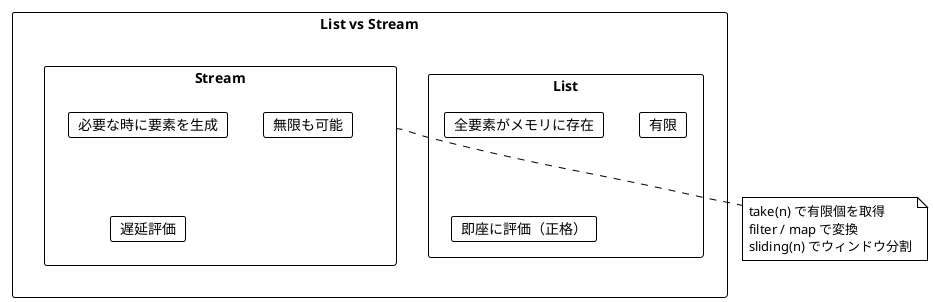
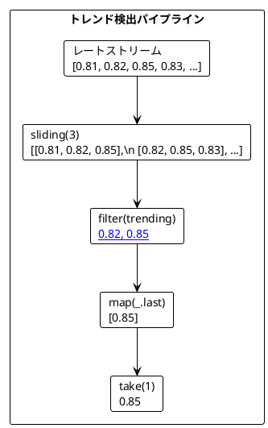
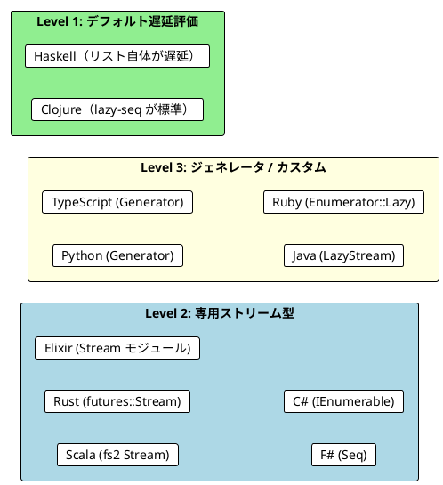

# Part IV - 第 9 章：ストリーム処理

## 9.1 はじめに：遅延評価と無限のデータ

リスト（配列）は全要素をメモリに保持する有限のデータ構造です。しかし、現実のプログラムでは「無限に続くデータ」を扱う場面があります：

- センサーからのリアルタイムデータ
- 為替レートの連続的な変動
- サイコロを何度も振る試行
- ログイベントの継続的な流れ

**ストリーム**は、遅延評価により「必要な時に必要な分だけ」要素を生成するデータ構造です。本章では、11 言語でのストリーム処理を横断的に比較し、以下を明らかにします：

- ストリームの実現方式の違い（言語組み込み遅延評価 vs ライブラリ vs ジェネレータ）
- 無限ストリームの生成パターン（repeat / iterate / unfold / cycle）
- スライディングウィンドウによるトレンド検出の実装差異



---

## 9.2 共通の本質：遅延評価による無限シーケンス

11 言語すべてに共通するストリームの原則は、**遅延評価によって無限のデータを有限のメモリで扱う**ことです：

1. **遅延生成**: 要素は要求されるまで生成されない
2. **変換の連鎖**: map / filter をストリームに適用しても即座に全要素を処理しない
3. **実体化**: take / toList / collect で必要な分だけ取り出す

3 つの言語グループから代表例を見てみましょう：

```haskell
-- Haskell: リストがデフォルトで遅延評価
naturals :: [Integer]
naturals = [1..]

take 5 naturals  -- [1, 2, 3, 4, 5]

-- フィボナッチ数列（自己参照的定義）
fibs :: [Integer]
fibs = 0 : 1 : zipWith (+) fibs (tail fibs)

take 10 fibs  -- [0, 1, 1, 2, 3, 5, 8, 13, 21, 34]
```

```scala
// Scala: fs2 Stream ライブラリ
import fs2.{Pure, Stream}

val infinite123s: Stream[Pure, Int] = Stream(1, 2, 3).repeat
infinite123s.take(8).toList  // List(1, 2, 3, 1, 2, 3, 1, 2)

// IO を含む無限ストリーム
val infiniteDieCasts: Stream[IO, Int] = Stream.eval(castTheDie()).repeat
infiniteDieCasts.take(3).compile.toList.unsafeRunSync()  // List(4, 2, 6)
```

```python
# Python: ジェネレータで遅延評価
from itertools import count, islice

def cycle_stream(items):
    while True:
        yield from items

list(islice(cycle_stream([1, 2, 3]), 8))  # [1, 2, 3, 1, 2, 3, 1, 2]
```

---

## 9.3 ストリームの実現方式

### アプローチ 1: 言語組み込みの遅延評価

| 言語 | ストリーム型 | 特徴 |
|------|-----------|------|
| **Haskell** | `[a]`（リスト自体が遅延） | デフォルト遅延評価、特別な型不要 |
| **Clojure** | `lazy-seq` / `range` 等 | 遅延シーケンスが標準 |

### アプローチ 2: ストリームライブラリ

| 言語 | ライブラリ | ストリーム型 | IO 統合 |
|------|-----------|-----------|--------|
| **Scala** | fs2 | `Stream[F, A]` | `Stream[IO, A]` で IO とストリームを統合 |
| **Rust** | futures | `Stream<Item = T>` | `then` / `buffered` で非同期処理 |

### アプローチ 3: 言語の遅延評価プリミティブ

| 言語 | プリミティブ | 構文 |
|------|-----------|------|
| **F#** | `seq { }` | `Seq.take`, `Seq.windowed` |
| **C#** | `IEnumerable<T>` | `yield return`, LINQ |
| **Elixir** | `Stream` モジュール | `Stream.cycle`, `Stream.unfold` |

### アプローチ 4: ジェネレータ / カスタム実装

| 言語 | プリミティブ | 構文 |
|------|-----------|------|
| **Python** | `Generator` | `yield` / `yield from` |
| **TypeScript** | `Generator` | `function*` / `yield` |
| **Java** | カスタム `LazyStream` | `Supplier<Option<Cons<A>>>` |
| **Ruby** | `Enumerator::Lazy` | `Enumerator.new` + `loop` |

---

## 9.4 無限ストリームの生成パターン

### 4 つの基本パターン

| パターン | 説明 | 例 |
|---------|------|-----|
| **repeat** | 同じ値（列）を無限に繰り返す | `[1,2,3,1,2,3,...]` |
| **iterate** | 関数を繰り返し適用 | `[1,2,4,8,16,...]` |
| **unfold** | 状態から次の要素と新しい状態を生成 | フィボナッチ数列 |
| **generate** | 副作用のある関数を繰り返し呼ぶ | サイコロを振り続ける |

### 全 11 言語の生成関数比較

| パターン | Haskell | Scala | Rust | F# | C# | TypeScript | Python | Java | Ruby | Clojure | Elixir |
|---------|---------|-------|------|-----|-----|-----------|--------|------|------|---------|--------|
| **repeat** | `repeat x` | `.repeat` | `stream::repeat` | `seq { while true }` | `yield return` loop | `while(true) yield` | `while True: yield` | カスタム | `Enumerator` + `loop` | `(repeat x)` | `Stream.cycle` |
| **iterate** | `iterate f x` | — | `stream::unfold` | `Seq.unfold` | カスタム | `function*` | `count` / カスタム | カスタム | `iterate` メソッド | `(iterate f x)` | `Stream.iterate` |
| **unfold** | `unfoldr f s` | `Stream.unfold` | `stream::unfold` | `Seq.unfold` | カスタム | `function*` | `function*` | カスタム | `Enumerator.new` | `lazy-seq` | `Stream.unfold` |
| **generate** | `sequence (repeat io)` | `Stream.eval(io).repeat` | `stream::repeat_with` | `seq { yield f() }` | `yield return f()` | `function*` | `while True: yield f()` | カスタム | `IOStream.repeat_eval` | `(repeatedly f)` | `Stream.repeatedly` |

### 代表例：フィボナッチ数列

**Haskell**: 自己参照的定義（遅延評価の力）

```haskell
fibs :: [Integer]
fibs = 0 : 1 : zipWith (+) fibs (tail fibs)

take 10 fibs  -- [0, 1, 1, 2, 3, 5, 8, 13, 21, 34]
```

**Rust**: `stream::unfold` で状態遷移

```rust
pub fn fibonacci_stream() -> impl Stream<Item = u64> {
    stream::unfold((0u64, 1u64), |(a, b)| async move {
        Some((a, (b, a + b)))
    })
}
```

**TypeScript**: ジェネレータ関数

```typescript
function* fibonacci(): LazyList<number> {
  let [a, b] = [0, 1]
  while (true) {
    yield a
    ;[a, b] = [b, a + b]
  }
}
```

### 全 11 言語のフィボナッチ実装

<details>
<summary>関数型ファースト言語</summary>

**Haskell**:
```haskell
fibs :: [Integer]
fibs = 0 : 1 : zipWith (+) fibs (tail fibs)
```

**Clojure**:
```clojure
(def fibs
  ((fn fib [a b]
     (lazy-seq (cons a (fib b (+ a b)))))
   0 1))

(take 10 fibs)  ; => (0 1 1 2 3 5 8 13 21 34)
```

**Elixir**:
```elixir
def fibonacci do
  Stream.unfold({0, 1}, fn {a, b} -> {a, {b, a + b}} end)
end

fibonacci() |> Enum.take(10)  # [0, 1, 1, 2, 3, 5, 8, 13, 21, 34]
```

**F#**:
```fsharp
let fibonacci =
    Seq.unfold (fun (a, b) -> Some(a, (b, a + b))) (0, 1)

fibonacci |> Seq.take 10 |> Seq.toList
// [0; 1; 1; 2; 3; 5; 8; 13; 21; 34]
```

</details>

<details>
<summary>マルチパラダイム言語</summary>

**Scala**:
```scala
val fibonacci: Stream[Pure, Long] =
  Stream.unfold((0L, 1L)) { case (a, b) => Some((a, (b, a + b))) }

fibonacci.take(10).toList  // List(0, 1, 1, 2, 3, 5, 8, 13, 21, 34)
```

**Rust**:
```rust
pub fn fibonacci_stream() -> impl Stream<Item = u64> {
    stream::unfold((0u64, 1u64), |(a, b)| async move {
        Some((a, (b, a + b)))
    })
}
```

**TypeScript**:
```typescript
function* fibonacci(): LazyList<number> {
  let [a, b] = [0, 1]
  while (true) {
    yield a
    ;[a, b] = [b, a + b]
  }
}
```

</details>

<details>
<summary>OOP + FP ライブラリ言語</summary>

**Java**:
```java
public static LazyStream<Long> fibonacci() {
    return LazyStream.unfold(
        new long[]{0, 1},
        state -> Option.some(new Tuple2<>(state[0], new long[]{state[1], state[0] + state[1]}))
    );
}
```

**C#**:
```csharp
public static IEnumerable<long> Fibonacci()
{
    long a = 0, b = 1;
    while (true)
    {
        yield return a;
        (a, b) = (b, a + b);
    }
}
```

**Python**:
```python
def fibonacci():
    a, b = 0, 1
    while True:
        yield a
        a, b = b, a + b
```

**Ruby**:
```ruby
def fibonacci
  Enumerator.new do |yielder|
    a, b = 0, 1
    loop do
      yielder << a
      a, b = b, a + b
    end
  end.lazy
end
```

</details>

---

## 9.5 ストリーム操作の比較

### 主要操作の語彙比較

| 操作 | Haskell | Scala (fs2) | Rust | F# | C# | TypeScript | Python | Clojure | Elixir | Java | Ruby |
|------|---------|-------------|------|-----|-----|-----------|--------|---------|--------|------|------|
| 先頭 n 個 | `take n` | `.take(n)` | `.take(n)` | `Seq.take n` | `.Take(n)` | `take(s, n)` | `islice(s, n)` | `(take n s)` | `Enum.take(s, n)` | `.take(n)` | `.take(n)` |
| フィルタ | `filter p` | `.filter(p)` | `.filter(p)` | `Seq.filter p` | `.Where(p)` | `filterStream` | `filter` | `(filter p s)` | `Stream.filter(s, p)` | `.filter(p)` | `.filter(p)` |
| 変換 | `map f` | `.map(f)` | `.map(f)` | `Seq.map f` | `.Select(f)` | `mapStream` | `map(f, s)` | `(map f s)` | `Stream.map(s, f)` | `.map(f)` | `.fmap(f)` |
| 結合 | `++` | `.append(s)` | `.chain(s)` | `Seq.append` | `.Concat(s)` | `append` | `chain` | `(concat s1 s2)` | `Stream.concat` | `.append(s)` | `.append(s)` |
| ウィンドウ | `sliding n` | `.sliding(n)` | `.chunks(n)` | `Seq.windowed n` | `Sliding(n)` | `sliding` | `stream_sliding` | `(partition n 1)` | `Stream.chunk_every` | `.sliding(n)` | `.sliding(n)` |
| zip | `zip` | `.zip(s)` | `.zip(s)` | `Seq.zip` | `.Zip(s)` | `zipStream` | `zip` | `(map vector s1 s2)` | `Stream.zip(s1, s2)` | `.zip(s)` | `.zip(s)` |
| 畳み込み | `foldl` | `.fold` | `.fold` | `Seq.fold` | `.Aggregate` | `reduce` | `reduce` | `(reduce f s)` | `Enum.reduce` | `.fold` | `.reduce` |

---

## 9.6 スライディングウィンドウとトレンド検出

すべての言語で共通する実践的なパターンとして、為替レートの上昇トレンドを検出する例を比較します。

### パターンの構造



### トレンド判定関数の比較

**Haskell**:

```haskell
trending :: Ord a => [a] -> Bool
trending xs =
    length xs > 1 &&
    all (uncurry (<)) (zip xs (tail xs))
```

**Scala**:

```scala
def trending(rates: List[BigDecimal]): Boolean =
  rates.size > 1 &&
  rates.zip(rates.drop(1)).forall {
    case (prev, rate) => rate > prev
  }
```

**Rust**:

```rust
pub fn trending(rates: &[f64]) -> bool {
    rates.len() > 1 &&
    rates.windows(2).all(|w| w[1] > w[0])
}
```

### 全 11 言語の実装

#### 関数型ファースト言語

<details>
<summary>Haskell 実装</summary>

```haskell
-- スライディングウィンドウ
sliding :: Int -> [a] -> [[a]]
sliding n xs
    | length window < n = []
    | otherwise         = window : sliding n (tail xs)
  where window = take n xs

-- トレンド判定
trending :: Ord a => [a] -> Bool
trending xs =
    length xs > 1 &&
    all (uncurry (<)) (zip xs (tail xs))

-- トレンド検出パイプライン
findTrending :: Ord a => Int -> [a] -> [[a]]
findTrending windowSize =
    filter trending . sliding windowSize
```

Haskell ではリストが遅延評価されるため、無限のレートストリームに対しても `findTrending` をそのまま適用できます。

</details>

<details>
<summary>Clojure 実装</summary>

```clojure
;; スライディングウィンドウ
(defn sliding-window [n coll]
  (partition n 1 coll))

;; トレンド判定
(defn trending? [rates]
  (and (> (count rates) 1)
       (every? (fn [[prev curr]] (< prev curr))
               (partition 2 1 rates))))

;; トレンド検出
(defn find-trending [window-size stream]
  (->> stream
       (sliding-window window-size)
       (filter trending?)))
```

Clojure の `partition` はステップ付きで呼ぶとスライディングウィンドウになります。

</details>

<details>
<summary>Elixir 実装</summary>

```elixir
def trending?(rates) do
  length(rates) > 1 &&
    rates
    |> Enum.chunk_every(2, 1, :discard)
    |> Enum.all?(fn [prev, curr] -> curr > prev end)
end

# ストリームパイプライン
def find_trending(rates_stream, window_size) do
  rates_stream
  |> Stream.chunk_every(window_size, 1, :discard)
  |> Stream.filter(&trending?/1)
end
```

Elixir の `Stream.chunk_every/4` はステップ引数でスライディングウィンドウを実現します。

</details>

<details>
<summary>F# 実装</summary>

```fsharp
let trending (rates: float list) =
    rates.Length > 1 &&
    List.pairwise rates |> List.forall (fun (prev, curr) -> curr > prev)

// ストリームパイプライン
let findTrending windowSize (rates: float seq) =
    rates
    |> Seq.windowed windowSize
    |> Seq.filter (fun window -> trending (Array.toList window))
```

F# の `Seq.windowed` はスライディングウィンドウを直接サポートしています。

</details>

#### マルチパラダイム言語

<details>
<summary>Scala 実装</summary>

```scala
def trending(rates: List[BigDecimal]): Boolean =
  rates.size > 1 &&
  rates.zip(rates.drop(1)).forall { case (prev, rate) => rate > prev }

// fs2 ストリームパイプライン
def exchangeIfTrending(
    amount: BigDecimal,
    from: Currency,
    to: Currency
): IO[BigDecimal] =
  rates(from, to)
    .sliding(3)
    .map(_.toList)
    .filter(trending)
    .map(_.last)
    .take(1)
    .compile
    .lastOrError
    .map(_ * amount)
```

Scala の fs2 は `sliding` を標準で提供し、IO ストリームとシームレスに統合されます。

</details>

<details>
<summary>Rust 実装</summary>

```rust
pub fn trending(rates: &[f64]) -> bool {
    rates.len() > 1 && rates.windows(2).all(|w| w[1] > w[0])
}

// 移動平均ストリーム
pub fn moving_average<S>(stream: S, window_size: usize) -> impl Stream<Item = f64>
where
    S: Stream<Item = f64> + Send + 'static,
{
    stream::unfold(
        (stream.boxed(), Vec::new(), window_size),
        |(mut stream, mut window, size)| async move {
            match stream.next().await {
                Some(value) => {
                    window.push(value);
                    if window.len() > size { window.remove(0); }
                    let avg = window.iter().sum::<f64>() / window.len() as f64;
                    Some((avg, (stream, window, size)))
                }
                None => None,
            }
        },
    )
}
```

Rust の標準ライブラリには `windows` メソッドがスライスに対して存在しますが、`futures::Stream` でのスライディングウィンドウは `unfold` で自前実装が必要です。

</details>

<details>
<summary>TypeScript 実装</summary>

```typescript
const trending = (rates: readonly number[]): boolean => {
  if (rates.length <= 1) return false
  return rates.slice(0, -1).every((prev, i) => rates[i + 1] > prev)
}

function* sliding<A>(gen: LazyList<A>, windowSize: number): LazyList<readonly A[]> {
  const buffer: A[] = []
  for (const item of gen) {
    buffer.push(item)
    if (buffer.length === windowSize) {
      yield [...buffer]
      buffer.shift()
    }
  }
}
```

</details>

#### OOP + FP ライブラリ言語

<details>
<summary>Java 実装</summary>

```java
public static boolean trending(List<BigDecimal> rates) {
    return rates.size() > 1 &&
        rates.zip(rates.drop(1))
             .forAll(t -> t._2.compareTo(t._1) > 0);
}

// LazyStream でスライディングウィンドウ
public LazyStream<List<A>> sliding(int size) {
    return LazyStream.unfold(this, stream -> {
        List<A> window = stream.take(size).toList();
        return window.size() == size
            ? Option.some(new Tuple2<>(window, stream.drop(1)))
            : Option.none();
    });
}
```

</details>

<details>
<summary>C# 実装</summary>

```csharp
public static bool Trending(IEnumerable<decimal> rates)
{
    var list = rates.ToList();
    return list.Count > 1 &&
           list.Zip(list.Skip(1), (prev, curr) => curr > prev).All(x => x);
}

// スライディングウィンドウ
public static IEnumerable<IReadOnlyList<T>> Sliding<T>(
    this IEnumerable<T> source, int windowSize)
{
    var window = new Queue<T>();
    foreach (var item in source)
    {
        window.Enqueue(item);
        if (window.Count == windowSize)
        {
            yield return window.ToList();
            window.Dequeue();
        }
    }
}
```

</details>

<details>
<summary>Python 実装</summary>

```python
from collections import deque

def trending(rates: list[float]) -> bool:
    return len(rates) > 1 and all(
        curr > prev for prev, curr in zip(rates, rates[1:])
    )

def stream_sliding(stream, window_size):
    window = deque(maxlen=window_size)
    for item in stream:
        window.append(item)
        if len(window) == window_size:
            yield list(window)
```

</details>

<details>
<summary>Ruby 実装</summary>

```ruby
def trending?(rates)
  return false if rates.size <= 1
  rates.each_cons(2).all? { |prev, curr| curr > prev }
end

# LazyStream のスライディングウィンドウ
def sliding(n)
  LazyStream.new(
    Enumerator.new do |yielder|
      buffer = []
      @enumerator.each do |item|
        buffer << item
        if buffer.size == n
          yielder << buffer.dup
          buffer.shift
        end
      end
    end
  )
end
```

</details>

---

## 9.7 IO ストリーム：副作用とストリームの統合

前章の IO モナドとストリームを組み合わせると、「副作用を持つ無限ストリーム」を安全に扱えます。

### 代表 3 言語の比較

**Scala** (fs2): `Stream[IO, A]` で IO とストリームを型レベルで統合

```scala
// IO を含む無限ストリーム
val infiniteDieCasts: Stream[IO, Int] = Stream.eval(castTheDie()).repeat

// 最初の 3 回を取得
infiniteDieCasts.take(3).compile.toList.unsafeRunSync()  // List(4, 2, 6)

// 6 が出るまで振り続ける
infiniteDieCasts.filter(_ == 6).take(1).compile.toList.unsafeRunSync()  // List(6)

// レートストリーム + 時間制御
val ratesWithDelay = rates(from, to).zipLeft(Stream.fixedRate[IO](1.second))
```

**Elixir**: `Stream.repeatedly` + パイプライン

```elixir
# 無限にサイコロを振るストリーム
def die_casts do
  Stream.repeatedly(fn -> :rand.uniform(6) end)
end

die_casts() |> Enum.take(3)  # [4, 2, 6]

# 6 が出るまで振り続ける
die_casts()
|> Stream.take_while(fn x -> x != 6 end)
|> Enum.to_list()
```

**Ruby**: IOStream クラス

```ruby
# IO アクションから無限ストリームを作成
infinite_die_casts = IOStream.repeat_eval(cast_the_die)

# 最初の 3 回を取得
first_three = infinite_die_casts.take(3).compile_to_list
first_three.run!  # [4, 2, 6]
```

### IO ストリームの統合度比較

| レベル | 言語 | 方式 | 特徴 |
|--------|------|------|------|
| **型レベル統合** | Scala (fs2) | `Stream[IO, A]` | エフェクトとストリームが同一型で統合 |
| **標準モジュール** | Elixir | `Stream` + `Task` | OTP のプロセスモデルと統合 |
| **非同期ストリーム** | C# | `IAsyncEnumerable<T>` | `await foreach` で非同期ストリーム |
| **非同期トレイト** | Rust | `futures::Stream` | `then` / `buffered` で非同期処理 |
| **カスタム** | Java, Python, Ruby, TypeScript | 自前の IOStream | IO ラッパーを手動実装 |
| **暗黙的** | Haskell | IO リスト | リストが遅延なので IO を含められる |
| **実用的** | Clojure | `lazy-seq` + `future` | 遅延シーケンスが副作用を自然に含む |

---

## 9.8 比較分析：3 つの発見

### 発見 1: 遅延評価の実現方式は 3 系統に分かれる



**Level 1（Haskell, Clojure）** はリスト自体が遅延評価されるため、特別なストリーム型が不要です。`[1..]` で無限リストを定義できる Haskell と、`(range)` で無限シーケンスを生成できる Clojure が該当します。

**Level 2（Scala, Rust, Elixir, F#, C#）** は専用のストリーム型 / モジュールで遅延評価を実現します。特に Scala の fs2 は IO とストリームを型レベルで統合する最も表現力の高いライブラリです。

**Level 3（Python, TypeScript, Java, Ruby）** はジェネレータ構文やカスタムクラスで遅延評価を実装します。

### 発見 2: スライディングウィンドウの提供方法は言語により異なる

| 方式 | 言語 | 関数/メソッド |
|------|------|-------------|
| **標準提供** | Scala (fs2), F#, Rust (スライス) | `.sliding(n)`, `Seq.windowed n`, `.windows(n)` |
| **ステップ付き分割** | Clojure, Elixir | `(partition n 1 coll)`, `Stream.chunk_every(n, 1)` |
| **隣接ペア** | Haskell, Ruby | カスタム `sliding`, `each_cons(n)` |
| **キューベース実装** | C#, Python, TypeScript, Java | `Queue` / `deque` ベースのカスタム |

### 発見 3: Haskell のフィボナッチ定義は遅延評価の本質を表す

```haskell
fibs = 0 : 1 : zipWith (+) fibs (tail fibs)
```

この**自己参照的**な定義は、遅延評価がなければ無限再帰で停止しません。Haskell のデフォルト遅延評価だからこそ可能な表現であり、他の言語では `unfold` や `iterate` による明示的な状態遷移が必要です。

---

## 9.9 言語固有の特徴

### Haskell: リスト自体が無限ストリーム

```haskell
-- 自然数、偶数、奇数の無限リスト
naturals = [1..]
evens    = [2,4..]
odds     = [1,3..]

-- エラトステネスのふるい（無限の素数列）
primes :: [Integer]
primes = sieve [2..]
  where sieve (p:xs) = p : sieve [x | x <- xs, x `mod` p /= 0]
```

### Scala (fs2): IO ストリームの型安全な合成

```scala
// レートと時間制御の結合
val ratesWithDelay: Stream[IO, BigDecimal] =
  rates(from, to).zipLeft(Stream.fixedRate[IO](1.second))

// エフェクトフルなストリームパイプライン
rates(from, to)
  .sliding(3)
  .map(_.toList)
  .filter(trending)
  .map(_.last * amount)
  .take(1)
  .compile
  .lastOrError
```

### Clojure: トランスデューサーによる効率的な合成

```clojure
;; トランスデューサー: 中間コレクションを作らない
(def xf (comp
  (partition-all 3 1)
  (filter trending?)
  (map last)))

(transduce xf conj [] rates)
```

### Python: ジェネレータの直感的な構文

```python
# yield で素数のストリームを定義
def primes():
    def sieve(numbers):
        p = next(numbers)
        yield p
        yield from sieve(n for n in numbers if n % p != 0)
    yield from sieve(count(2))
```

### Elixir: Stream + Enum のパイプライン

```elixir
# パイプ演算子でストリーム処理を連鎖
Stream.iterate(1, &(&1 + 1))
|> Stream.filter(&(rem(&1, 2) == 0))
|> Stream.map(&(&1 * &1))
|> Enum.take(5)
# [4, 16, 36, 64, 100]
```

---

## 9.10 実践的な選択指針

### ストリーム処理の選択

| 要件 | 推奨言語 | 理由 |
|------|---------|------|
| 最も自然な無限ストリーム | Haskell | デフォルト遅延評価、特別な型不要 |
| IO + ストリームの型安全な統合 | Scala (fs2) | `Stream[IO, A]` による統合 |
| 高性能な非同期ストリーム | Rust | ゼロコスト抽象化、`buffered` で並行処理 |
| 分散ストリーム処理 | Elixir | OTP + Stream のパイプライン |
| データ分析パイプライン | Python | ジェネレータ + itertools の豊富なAPI |
| 関数合成の効率化 | Clojure | トランスデューサーで中間コレクション排除 |

### プロジェクト規模別の推奨

| 規模 | 推奨アプローチ | 言語例 |
|------|-------------|-------|
| 小規模 | ジェネレータ / イテレータ | Python, TypeScript, Ruby |
| 中規模 | 標準ストリームモジュール | Elixir (Stream), F# (Seq), C# (IEnumerable) |
| 大規模 | エフェクトフルストリームライブラリ | Scala (fs2), Rust (futures::Stream) |

---

## 9.11 まとめ

本章では、11 言語でのストリーム処理を比較し、以下を確認しました：

**共通の原則**:

- ストリーム = 遅延評価による無限シーケンス
- take / filter / map / sliding で変換を連鎖
- スライディングウィンドウによるパターン検出は全言語で実装可能

**言語間の差異**:

- 遅延評価の実現方式は 3 系統（デフォルト遅延 / 専用ストリーム型 / ジェネレータ）
- Haskell のリストはそのまま無限ストリームとして機能する唯一の言語
- IO とストリームの統合度は Scala (fs2) が最も高い

**学び**:

- 遅延評価により、無限のデータを有限のメモリで安全に扱える
- スライディングウィンドウ + トレンド判定は関数型のストリーム処理の典型パターン
- IO ストリームの統合は、リアルタイムアプリケーションの基盤となる

---

### 各言語の詳細記事

| 言語 | 記事リンク |
|------|-----------|
| Scala | [Part IV: IO と副作用の管理](../scala/part-4.md) |
| Java | [Part IV: IO と副作用の管理](../java/part-4.md) |
| F# | [Part IV: 非同期処理とストリーム](../fsharp/part-4.md) |
| C# | [Part IV: 非同期処理とストリーム](../csharp/part-4.md) |
| Haskell | [Part IV: IO と副作用の管理](../haskell/part-4.md) |
| Clojure | [Part IV: 状態管理とストリーム処理](../clojure/part-4.md) |
| Elixir | [Part IV: IO とストリーム処理](../elixir/part-4.md) |
| Rust | [Part IV: 非同期処理とストリーム](../rust/part-4.md) |
| Python | [Part IV: IO と副作用の管理](../python/part-4.md) |
| TypeScript | [Part IV: IO と副作用の管理](../typescript/part-4.md) |
| Ruby | [Part IV: IO と副作用の管理](../ruby/part-4.md) |
