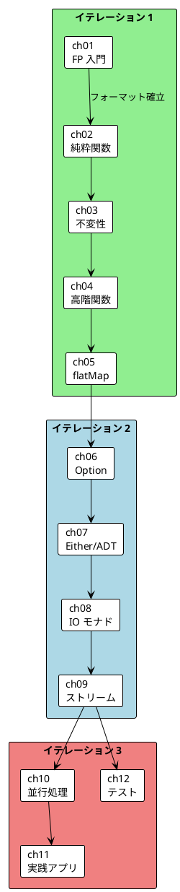

# 統合記事 執筆計画

## 概要

「Grokking Functional Programming」11 言語版の統合記事（全 12 章）を執筆する計画です。

### スコープ

| 項目 | 値 |
|------|-----|
| ソース記事数 | 66 ファイル（11 言語 × 6 Part） |
| 総ソース行数 | 55,784 行 |
| 統合記事数 | 12 本 |
| 各記事の想定規模 | 500〜1,000 行 |
| 統合記事合計（想定） | 6,000〜12,000 行 |

### ソースデータ概観

#### 言語別ボリューム

| 言語 | 合計行数 | グループ |
|------|---------|---------|
| Ruby | 5,876 | OOP + FP |
| Elixir | 5,838 | FP ファースト |
| C# | 5,398 | OOP + FP |
| TypeScript | 5,312 | マルチパラダイム |
| F# | 5,310 | FP ファースト |
| Java | 5,039 | OOP + FP |
| Haskell | 4,935 | FP ファースト |
| Python | 4,772 | OOP + FP |
| Scala | 4,733 | マルチパラダイム |
| Rust | 4,472 | マルチパラダイム |
| Clojure | 4,099 | FP ファースト |

#### Part 別ボリューム

| Part | テーマ | 合計行数 | 対応章 | 統合記事数 |
|------|--------|---------|--------|-----------|
| Part I | 関数型プログラミングの基礎 | 7,063 | 1-2 | 2 |
| Part II | 関数型スタイル | 9,977 | 3-5 | 3 |
| Part III | エラーハンドリング | 9,848 | 6-7 | 2 |
| Part IV | IO と副作用 | 9,183 | 8-9 | 2 |
| Part V | 並行処理 | 9,496 | 10 | 1 |
| Part VI | 実践とテスト | 10,217 | 11-12 | 2 |

---

## 執筆方針

### 基本方針

1. **共通の本質を先に抽出**: 11 言語を読んだ上で、言語を超えた共通原理を言語化する
2. **言語グループで整理**: FP ファースト → マルチパラダイム → OOP + FP の順で比較
3. **コードは代表例を厳選**: 11 言語全部を並べるのではなく、グループ代表 + 特徴的な差異を持つ言語を重点提示
4. **差異こそ価値**: 同じことを言っている部分は圧縮し、言語間の差異に紙幅を割く

### コード比較の方針

```
11 言語すべてのコードを <details> で折りたたみ表示し、
本文では 2〜3 言語の代表例を使って解説する。

代表言語の選定基準:
- グループごとに 1 言語（計 3 言語）
- そのテーマで最も特徴的な実装を持つ言語を優先
```

### 代表言語の選定ガイドライン

| テーマ | FP ファースト代表 | マルチパラダイム代表 | OOP + FP 代表 | 理由 |
|--------|------------------|-------------------|--------------|------|
| 基礎概念（ch1-2） | Haskell | Scala | Java | FP の純粋性の度合いが明確に差が出る |
| 不変性（ch3） | Clojure | Rust | Java | 永続データ構造 vs 所有権 vs ライブラリ |
| 高階関数（ch4） | Elixir | Scala | Python | パイプ演算子 vs メソッドチェーン vs 組み込み関数 |
| flatMap（ch5） | Haskell | Scala | C# | do 記法 vs for 内包表記 vs LINQ |
| Option（ch6） | Haskell | Rust | TypeScript | 言語組み込み vs fp-ts |
| Either/ADT（ch7） | F# | Rust | C# | 判別共用体 vs enum vs LanguageExt |
| IO モナド（ch8） | Haskell | Scala | C# | IO モナド vs cats-effect vs LanguageExt Eff |
| ストリーム（ch9） | Elixir | Scala | Python | Stream + OTP vs fs2 vs ジェネレータ |
| 並行処理（ch10） | Elixir | Rust | Java | OTP vs tokio vs Virtual Thread |
| 実践アプリ（ch11） | Haskell | Scala | TypeScript | Reader vs cats-effect Resource vs ReaderTaskEither |
| テスト（ch12） | Haskell | Scala | Python | QuickCheck vs ScalaCheck vs Hypothesis |

---

## イテレーション詳細

### イテレーション 1: 基礎と関数型スタイル

**目的**: 11 言語比較のフォーマットを確立し、基礎 5 章を完成させる

#### 第 1 章: 関数型プログラミング入門

**ファイル名**: `part-1-ch01-fp-introduction.md`

**入力ソース**:

| 言語 | ファイル | 該当セクション |
|------|---------|--------------|
| 全 11 言語 | `{lang}/part-1.md` | 第 1 章セクション |

**執筆手順**:

1. 全 11 言語の part-1.md の第 1 章部分を読み込む
2. 命令型 vs 関数型の対比構造を抽出（全言語共通）
3. 各言語の「命令型コード → 関数型コード」の変換例を収集
4. 言語グループ別の FP 表現スタイルの違いを分析
5. 統合記事テンプレートに従って執筆

**主要セクション構成**:

```
1.1 はじめに: なぜ関数型プログラミングか
1.2 共通の本質: HOW vs WHAT
1.3 言語別実装比較: ワードスコア計算
    - 11 言語の命令型 → 関数型の変換
1.4 比較分析: 言語のパラダイムポジション
    - FP ファースト vs マルチパラダイム vs OOP + FP
1.5 実践的な選択指針
1.6 まとめ
```

**想定規模**: 500〜600 行
**依存関係**: なし（最初の章）
**リスク**: Low

---

#### 第 2 章: 純粋関数と副作用

**ファイル名**: `part-1-ch02-pure-functions.md`

**入力ソース**:

| 言語 | ファイル | 該当セクション |
|------|---------|--------------|
| 全 11 言語 | `{lang}/part-1.md` | 第 2 章セクション |

**執筆手順**:

1. 全 11 言語の part-1.md の第 2 章部分を読み込む
2. 純粋関数の定義と参照透過性の共通原理を抽出
3. 各言語での純粋性の保証メカニズムを比較
4. 副作用の排除アプローチを言語グループ別に整理

**主要セクション構成**:

```
2.1 はじめに: 純粋関数の価値
2.2 共通の本質: 参照透過性と置換モデル
2.3 言語別実装比較: 純粋性の保証
    - Haskell: 型レベルで強制
    - Scala/F#/Rust: 慣習 + 型システムのサポート
    - 動的型付け言語: 規約と慣習
2.4 比較分析: 純粋性のスペクトラム
2.5 実践的な選択指針
2.6 まとめ
```

**想定規模**: 500〜600 行
**依存関係**: ch01 完了後（フォーマット確立のため）
**リスク**: Low

---

#### 第 3 章: イミュータブルなデータ操作

**ファイル名**: `part-2-ch03-immutable-data.md`

**入力ソース**:

| 言語 | ファイル | 該当セクション |
|------|---------|--------------|
| 全 11 言語 | `{lang}/part-2.md` | 第 3 章セクション |

**執筆手順**:

1. 全 11 言語の part-2.md の第 3 章部分を読み込む
2. 不変データ構造の実現方法を 4 カテゴリに分類


   - 言語組み込み（Haskell, Clojure, Elixir, F#）
   - デフォルト不変（Rust）
   - case class / record（Scala, Java 16+, C# 9+）
   - ライブラリ / 慣習（Python, TypeScript, Ruby）
3. 構造共有と永続データ構造の概念を解説
4. List/Map の基本操作を言語別に比較

**主要セクション構成**:

```
3.1 はじめに: なぜイミュータブルか
3.2 共通の本質: コピーオンライトと構造共有
3.3 不変性の実現方法（4 カテゴリ比較）
3.4 言語別実装比較: List 操作
3.5 比較分析: コピーコストとパフォーマンス
3.6 実践的な選択指針
3.7 まとめ
```

**想定規模**: 600〜700 行
**依存関係**: ch01-02 完了後
**リスク**: Low

---

#### 第 4 章: 高階関数

**ファイル名**: `part-2-ch04-higher-order-functions.md`

**入力ソース**:

| 言語 | ファイル | 該当セクション |
|------|---------|--------------|
| 全 11 言語 | `{lang}/part-2.md` | 第 4 章セクション |

**執筆手順**:

1. 全 11 言語の part-2.md の第 4 章部分を読み込む
2. map/filter/fold の共通概念を解説
3. パイプライン記法の違いを比較


   - Elixir/F# パイプ演算子 `|>`
   - Haskell 関数合成 `.` / `$`
   - Clojure スレッディングマクロ `->` / `->>`
   - Scala/Java/C#/Ruby メソッドチェーン
   - TypeScript fp-ts `pipe`
   - Python 組み込み `map`/`filter` + returns `flow`
4. カリー化と部分適用の言語間差異を分析

**主要セクション構成**:

```
4.1 はじめに: 関数を値として扱う
4.2 共通の本質: map/filter/fold の三位一体
4.3 言語別実装比較: データ変換パイプライン
4.4 パイプライン記法の比較
4.5 カリー化と部分適用
4.6 比較分析: 表現力 vs 学習コスト
4.7 まとめ
```

**想定規模**: 700〜800 行
**依存関係**: ch03 完了後
**リスク**: Low

---

#### 第 5 章: flatMap とモナド的合成

**ファイル名**: `part-2-ch05-flatmap.md`

**入力ソース**:

| 言語 | ファイル | 該当セクション |
|------|---------|--------------|
| 全 11 言語 | `{lang}/part-2.md` | 第 5 章セクション |

**執筆手順**:

1. 全 11 言語の part-2.md の第 5 章部分を読み込む
2. flatMap/bind の共通概念（コンテキスト付き計算の連鎖）を解説
3. 糖衣構文の比較


   - Scala for 内包表記
   - Haskell do 記法
   - C# LINQ クエリ式
   - F# コンピュテーション式
   - Clojure some-> / some->>
   - Elixir with 式
   - TypeScript pipe + chain
   - Python flow + bind
   - Ruby bind チェーン
   - Java For.yield (Vavr)
   - Rust and_then チェーン

**主要セクション構成**:

```
5.1 はじめに: なぜ map だけでは足りないか
5.2 共通の本質: コンテキストの連鎖
5.3 言語別実装比較: flatMap の表現
5.4 糖衣構文の比較分析
5.5 モナドの概念（言語による抽象化レベルの違い）
5.6 実践的な選択指針
5.7 まとめ
```

**想定規模**: 700〜800 行
**依存関係**: ch04 完了後
**リスク**: Low（ただしモナドの説明深度の調整が必要）

---

### イテレーション 1 完了条件

- [ ] 5 章すべてが統合記事構成テンプレートに準拠
- [ ] 11 言語すべてのコード例を `<details>` で含む
- [ ] 各章に言語グループ別の傾向分析を含む
- [ ] ch01 で確立したフォーマットが ch02-05 で一貫
- [ ] 相互リンクの整合性を確認

---

### イテレーション 2: エラーハンドリングと IO

**目的**: ライブラリ依存度の高い 4 章を、共通概念とライブラリ固有の差異を明確に分離して執筆

#### 第 6 章: Option 型による安全なエラーハンドリング

**ファイル名**: `part-3-ch06-option.md`

**入力ソース**:

| 言語 | ファイル | 該当セクション |
|------|---------|--------------|
| 全 11 言語 | `{lang}/part-3.md` | 第 6 章セクション |

**執筆手順**:

1. 全 11 言語の part-3.md の第 6 章部分を読み込む
2. Option/Maybe の共通概念（null の型安全な代替）を解説
3. 実装方式を 3 カテゴリに分類


   - 言語組み込み: Haskell Maybe, Rust Option, F# Option
   - 標準ライブラリ: Scala Option, Java Optional
   - サードパーティ: fp-ts Option, returns Maybe, dry-monads Maybe, LanguageExt Option, Vavr Option
   - 動的型付けの慣習: Clojure nil, Elixir nil/{:ok, value}
4. map/flatMap/getOrElse の言語間対応表を作成

**主要セクション構成**:

```
6.1 はじめに: null は 10 億ドルの過ち
6.2 共通の本質: 値の有無を型で表現する
6.3 Option/Maybe の実装方式（3 カテゴリ）
6.4 言語別実装比較: 安全な値アクセス
6.5 操作メソッドの対応表
6.6 比較分析: 型安全性 vs 記述の簡潔さ
6.7 まとめ
```

**想定規模**: 600〜700 行
**依存関係**: イテレーション 1 完了後
**リスク**: Medium（ライブラリ API の差異が大きい）

---

#### 第 7 章: Either 型と代数的データ型

**ファイル名**: `part-3-ch07-either-adt.md`

**入力ソース**:

| 言語 | ファイル | 該当セクション |
|------|---------|--------------|
| 全 11 言語 | `{lang}/part-3.md` | 第 7 章セクション |

**執筆手順**:

1. 全 11 言語の part-3.md の第 7 章部分を読み込む
2. Either/Result の共通概念を解説
3. ADT（代数的データ型）の表現力を比較
4. パターンマッチのサポート度合いを分析

**主要セクション構成**:

```
7.1 はじめに: 失敗の理由を型で表現する
7.2 共通の本質: 直和型と直積型
7.3 ADT の表現方法（言語別比較）
7.4 言語別実装比較: Either/Result
7.5 パターンマッチの比較
7.6 比較分析: 式問題と拡張性
7.7 まとめ
```

**想定規模**: 700〜800 行
**依存関係**: ch06 完了後
**リスク**: Medium（ADT の表現差異が大きい）

---

#### 第 8 章: IO モナドと副作用の分離

**ファイル名**: `part-4-ch08-io-monad.md`

**入力ソース**:

| 言語 | ファイル | 該当セクション |
|------|---------|--------------|
| 全 11 言語 | `{lang}/part-4.md` | 第 8 章セクション |

**執筆手順**:

1. 全 11 言語の part-4.md の第 8 章部分を読み込む
2. IO の抽象化を 4 レベルに分類


   - Level 4: 言語組み込み IO モナド（Haskell）
   - Level 3: ライブラリ IO 型（Scala cats-effect, C# LanguageExt Eff）
   - Level 2: 軽量 IO コンテナ（Python returns IO, TypeScript fp-ts Task, Ruby dry Task）
   - Level 1: 慣習的分離（Java, Clojure, Elixir, Rust, F#）
3. 記述と実行の分離の共通原理を解説
4. 各レベルのトレードオフを分析

**主要セクション構成**:

```
8.1 はじめに: 副作用をどう扱うか
8.2 共通の本質: 記述と実行の分離
8.3 IO 抽象化の 4 レベル
8.4 言語別実装比較: 副作用を持つ計算
8.5 比較分析: 抽象化のコスト vs 安全性
8.6 実践的な選択指針
8.7 まとめ
```

**想定規模**: 800〜900 行
**依存関係**: ch07 完了後
**リスク**: Medium（IO の概念説明が難しい）

---

#### 第 9 章: ストリーム処理

**ファイル名**: `part-4-ch09-streams.md`

**入力ソース**:

| 言語 | ファイル | 該当セクション |
|------|---------|--------------|
| 全 11 言語 | `{lang}/part-4.md` | 第 9 章セクション |

**執筆手順**:

1. 全 11 言語の part-4.md の第 9 章部分を読み込む
2. 遅延評価とストリームの共通概念を解説
3. ストリーム処理の実装アプローチを比較


   - 専用ライブラリ: Scala fs2, Haskell conduit
   - 言語組み込み: Elixir Stream, Rust Iterator, Python ジェネレータ, Ruby Enumerator::Lazy
   - ライブラリ拡張: TypeScript AsyncIterable, Java Vavr Stream, C# StreamT, F# Seq

**主要セクション構成**:

```
9.1 はじめに: 無限のデータを扱う
9.2 共通の本質: 遅延評価と pull ベースの処理
9.3 ストリーム処理のアプローチ分類
9.4 言語別実装比較: 無限ストリーム
9.5 比較分析: 合成可能性とパフォーマンス
9.6 まとめ
```

**想定規模**: 700〜800 行
**依存関係**: ch08 完了後
**リスク**: Medium

---

### イテレーション 2 完了条件

- [ ] 4 章すべてが統合記事構成テンプレートに準拠
- [ ] Option/Either の言語間対応表を含む
- [ ] IO 抽象化の 4 レベル図を含む
- [ ] ストリーム処理のアプローチ分類図を含む
- [ ] ライブラリ固有の情報が `<details>` で適切に分離

---

### イテレーション 3: 並行処理と実践

**目的**: 言語間の根本的差異が最も大きい 3 章を、モデル比較を軸に統合

#### 第 10 章: 並行・並列処理

**ファイル名**: `part-5-ch10-concurrency.md`

**入力ソース**:

| 言語 | ファイル | 合計行数 |
|------|---------|---------|
| 全 11 言語 | `{lang}/part-5.md` | 9,496 |

**執筆手順**:

1. 全 11 言語の part-5.md を読み込む（最大ボリューム）
2. 並行処理モデルを 5 カテゴリに分類


   - Actor モデル: Elixir OTP/GenServer
   - STM（Software Transactional Memory）: Haskell STM, Clojure ref
   - Fiber / 軽量スレッド: Scala Fiber, Java Virtual Thread
   - 所有権ベース: Rust Arc/Mutex/tokio
   - アトミック参照: F# Ref, C# Atom, TypeScript Promise, Python asyncio, Ruby Fiber
3. チェックイン集計の例題を全言語で比較
4. 共有状態管理のアプローチ比較表を作成

**主要セクション構成**:

```
10.1 はじめに: 関数型で並行処理が楽になる理由
10.2 共通の本質: イミュータブルデータと並行安全性
10.3 並行処理モデルの 5 カテゴリ
10.4 言語別実装比較: チェックイン集計
10.5 共有状態管理の比較
10.6 比較分析: 安全性 vs パフォーマンス vs 表現力
10.7 実践的な選択指針
10.8 まとめ
```

**想定規模**: 900〜1,000 行
**依存関係**: イテレーション 2 完了後
**リスク**: High（モデル差異が大きく、公平な比較が難しい）

---

#### 第 11 章: 実践的なアプリケーション構築

**ファイル名**: `part-6-ch11-practical-app.md`

**入力ソース**:

| 言語 | ファイル | 該当セクション |
|------|---------|--------------|
| 全 11 言語 | `{lang}/part-6.md` | 第 11 章セクション |

**執筆手順**:

1. 全 11 言語の part-6.md の第 11 章部分を読み込む
2. TravelGuide アプリの共通アーキテクチャを抽出
3. DI（依存性注入）の関数型アプローチを比較


   - Reader モナド: Scala, TypeScript
   - 型クラス / trait: Haskell, Rust
   - Protocol / ビヘイビア: Python, Elixir
   - インターフェース: Java, C#, F#
   - マルチメソッド: Clojure
   - Duck typing: Ruby
4. リソース管理パターンを比較

**主要セクション構成**:

```
11.1 はじめに: FP で実践的なアプリを作る
11.2 共通の本質: 関心の分離と依存性逆転
11.3 TravelGuide アプリのアーキテクチャ
11.4 DI の関数型アプローチ（言語別比較）
11.5 リソース管理パターン
11.6 比較分析: アーキテクチャの柔軟性
11.7 まとめ
```

**想定規模**: 800〜900 行
**依存関係**: ch10 完了後
**リスク**: High（アーキテクチャパターンの差異が大きい）

---

#### 第 12 章: テスト戦略とプロパティベーステスト

**ファイル名**: `part-6-ch12-testing.md`

**入力ソース**:

| 言語 | ファイル | 該当セクション |
|------|---------|--------------|
| 全 11 言語 | `{lang}/part-6.md` | 第 12 章セクション |

**執筆手順**:

1. 全 11 言語の part-6.md の第 12 章部分を読み込む
2. PBT の共通原理を解説
3. 各言語の PBT ライブラリを比較
4. 純粋関数のテスト容易性を実例で示す

**主要セクション構成**:

```
12.1 はじめに: 関数型プログラミングとテスト
12.2 共通の本質: 純粋関数のテスト容易性
12.3 PBT ライブラリの比較
12.4 言語別実装比較: プロパティベーステスト
12.5 比較分析: テスト戦略の選択
12.6 まとめ: シリーズ全体の振り返り
```

**想定規模**: 700〜800 行
**依存関係**: ch10, ch11 と並行可能
**リスク**: Medium

---

### イテレーション 3 完了条件

- [ ] 第 10 章で並行処理モデルの 5 カテゴリ比較表を含む
- [ ] 第 11 章で DI パターンの言語別比較図を含む
- [ ] 第 12 章で PBT ライブラリの比較表を含む
- [ ] 第 12 章にシリーズ全体の振り返りを含む

---

## 各章の執筆ワークフロー

各章は以下の標準ワークフローで執筆します：

```
Phase 1: 素材収集（Read）
├── 11 言語の該当セクションを読み込む
├── 共通構造と差異ポイントを特定
└── 代表コード例を選定

Phase 2: 構造設計（Design）
├── 統合記事テンプレートに沿ってセクション構成を決定
├── 比較軸（型システム / ライブラリ / イディオム）を選定
└── 図表の計画

Phase 3: 執筆（Write）
├── 共通の本質セクションを先に書く
├── 言語別実装比較を言語グループ順に書く
├── 比較分析で差異を言語化
└── 選択指針とまとめを書く

Phase 4: 品質チェック（Review）
├── 11 言語すべてのコード例が含まれているか
├── テンプレート準拠の確認
├── リンクの整合性確認
└── 言語間の公平性チェック
```

---

## 依存関係グラフ



---

## リスク管理

| リスク | 影響 | 対策 |
|--------|------|------|
| 11 言語のコード量が膨大 | 読み込み時間が長い | 言語グループ代表を先に読み、残りは差分確認 |
| ライブラリ API の差異が大きい | 公平な比較が難しい | 共通概念を先に固め、差異は `<details>` で分離 |
| Part 5（並行処理）のモデル差異 | 統合が困難 | カテゴリ分類を先に確立し、各言語をマッピング |
| 記事間の一貫性維持 | フォーマットがばらつく | ch01 でテンプレートを確定し、全章で流用 |
| ソース記事の章境界が不明確 | セクション抽出に手間 | 各 Part ファイルの見出し構造を事前にマッピング |

---

## 成果物一覧

| # | ファイル名 | Part | 章 |
|---|-----------|------|-----|
| 1 | `part-1-ch01-fp-introduction.md` | I | 1 |
| 2 | `part-1-ch02-pure-functions.md` | I | 2 |
| 3 | `part-2-ch03-immutable-data.md` | II | 3 |
| 4 | `part-2-ch04-higher-order-functions.md` | II | 4 |
| 5 | `part-2-ch05-flatmap.md` | II | 5 |
| 6 | `part-3-ch06-option.md` | III | 6 |
| 7 | `part-3-ch07-either-adt.md` | III | 7 |
| 8 | `part-4-ch08-io-monad.md` | IV | 8 |
| 9 | `part-4-ch09-streams.md` | IV | 9 |
| 10 | `part-5-ch10-concurrency.md` | V | 10 |
| 11 | `part-6-ch11-practical-app.md` | VI | 11 |
| 12 | `part-6-ch12-testing.md` | VI | 12 |
