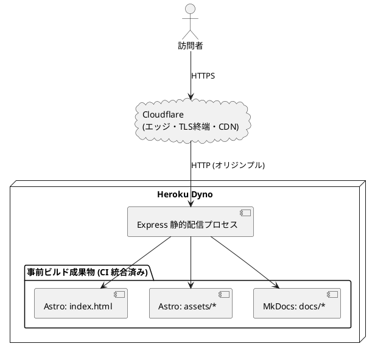

# バックエンドアーキテクチャ

## 概要

本ポートフォリオサイトは採用・営業向けの個人プロフィールを公開する**静的サイト**である。動的機能（認証・投稿・コメント等）は要件外であり、伝統的な意味でのバックエンド（業務ロジック・永続化層）は不要。

ただし、ホスティング先として Heroku を採用するため、Dyno で動作する**最小限の静的ファイル配信レイヤー**だけが存在する。本ドキュメントはその設計と将来拡張時の指針を示す。

## 業務領域とパターン選択

### 判断結果

| 判断軸 | 判定 |
|---|---|
| 業務領域カテゴリー | 補完・一般との連携 |
| データ構造の複雑さ | 単純（永続化なし） |
| 永続化モデル | なし |
| 特殊要件（金額・分析・監査） | なし |
| 採用パターン | **静的ファイル配信（最小トランザクションスクリプト）** |
| テスト形 | E2E 寄り（リンク切れ・ビルド成果物の検証） |

ガイドの判断フロー（補完領域 × 単純データ × 永続化単一）に従えばレイヤード 3 層だが、永続化自体が存在しないため、レイヤー構造は不要と判断した。

## 配信レイヤー設計

### 構成

Cloudflare 前段配置（[ADR-0004](../adr/0004-cloudflare-front-cdn.md)）により、TLS 終端・CDN キャッシュ・WAF / DDoS 緩和・HSTS は Cloudflare 側で担う。Express は **オリジンとしての最小静的配信** に責務を絞る。



ビルド成果物は GitHub Actions で統合済み（[ADR-0005](../adr/0005-build-pipeline-unification.md)）のため、Express はビルド処理を持たない。

### 責務

| 要素 | 責務 |
|---|---|
| Express プロセス | `process.env.PORT` で待ち受け、`apps/web/dist/` を静的配信 |
| ヘルスチェック | `GET /healthz` で 200 を返す（Heroku Router / Cloudflare / UptimeRobot 用） |
| ロギング | `morgan` で stdout に出力（Heroku Logplex に取り込み） |
| ヘッダ | `helmet` で **オリジン側で必要なヘッダのみ**（CSP / Referrer-Policy / X-Content-Type-Options 等）を付与。HSTS は Cloudflare 側で重複付与のため Express 側は無効化 |
| HTTPS 強制 | Cloudflare で常時 HTTPS 設定。Express は **`X-Forwarded-Proto` を信頼して http の場合のみ 301 リダイレクト**する 5 行のミドルウェア（保険的役割） |
| キャッシュヘッダ | `Cache-Control: public, max-age=31536000, immutable` を `/assets/*` に、HTML には `no-cache` を設定。Cloudflare 側が同値で上書きする |

### 実装方針

```javascript
// apps/web/server.js（イメージ・最小構成）
import express from "express";
import helmet from "helmet";
import morgan from "morgan";
import path from "path";
import { fileURLToPath } from "node:url";

const __dirname = path.dirname(fileURLToPath(import.meta.url));
const app = express();
const port = process.env.PORT ?? 3000;
const distDir = path.resolve(__dirname, "dist");
const isProduction = process.env.NODE_ENV === "production";

// Heroku Router / Cloudflare の前段を信頼
app.set("trust proxy", true);

// HTTPS 強制（保険的・5 行ミドルウェア。Cloudflare で常時 HTTPS が主、これは二重化）
app.use((req, res, next) => {
  if (isProduction && req.headers["x-forwarded-proto"] !== "https") {
    return res.redirect(301, `https://${req.headers.host}${req.url}`);
  }
  next();
});

// セキュリティヘッダ
// - HSTS は Cloudflare 側で付与するため無効化
// - CSP は Astro Islands の inline script を許可（'unsafe-inline' を script-src に明示）
app.use(
  helmet({
    strictTransportSecurity: false,
    contentSecurityPolicy: {
      directives: {
        "default-src": ["'self'"],
        "script-src": ["'self'", "'unsafe-inline'"], // Astro hydration の inline script
        "style-src": ["'self'", "'unsafe-inline'"], // Astro / Tailwind の inline style
        "img-src": ["'self'", "data:", "https:"],
        "font-src": ["'self'"],
        "connect-src": ["'self'"],
        "frame-ancestors": ["'none'"],
        "base-uri": ["'self'"],
        "form-action": ["'self'"],
      },
    },
  })
);

app.use(morgan("combined"));

app.get("/healthz", (_, res) => res.status(200).send("ok"));

// 静的配信
//  - assets/ は immutable で 1 年キャッシュ
//  - HTML は no-cache でステイル防止（Cloudflare 側で短時間キャッシュ）
app.use(
  "/assets",
  express.static(path.join(distDir, "assets"), {
    maxAge: "365d",
    immutable: true,
  })
);
app.use(
  express.static(distDir, {
    setHeaders: (res, filePath) => {
      if (filePath.endsWith(".html")) {
        res.setHeader("Cache-Control", "public, no-cache");
      }
    },
  })
);

// SPA 風 fallback ではなく、404 ページを 404 ステータスで返す
app.use((req, res) => {
  res.status(404).sendFile(path.join(distDir, "404.html"));
});

app.listen(port, () => console.log(`listening on ${port}`));
```

選定方針（[ADR-0004 / ADR-0005](../adr/) と整合）：

- **Express 採用**: Node.js 公式 Buildpack で動作、ヘルスチェック・カスタムヘッダ・将来の API 追加に対応容易
- **`compression` 不採用**: Cloudflare Brotli / gzip がエッジで実施。オリジンで二重圧縮するメリットなし
- **`express-sslify` 不採用**: Heroku 環境での無限リダイレクト罠を避け、`X-Forwarded-Proto` を見る 5 行の自前ミドルウェアで完結
- **`helmet` の HSTS 無効化**: Cloudflare 側で `Strict-Transport-Security` を付与。Express 側で重複させない
- **CSP `'unsafe-inline'` の明示許可**: Astro v5 の View Transitions / Islands ハイドレーションは inline script を出力するため、`script-src 'self'` だけだと動作しない。nonce ベースの厳格化は SSG では非現実的のため `'unsafe-inline'` を許容（[非機能要件](./non_functional.md) と整合）
- **`serve` パッケージ単体採用は却下**: ヘルスチェック・ロギング拡張が困難
- **`heroku-buildpack-static` 採用は却下**: コミュニティメンテで Heroku 本流からの追従が遅い、かつ ADR-0005 でビルド境界が GitHub Actions に一本化される

## API 設計方針

現時点では API は不要。ただし将来コンタクトフォーム等を追加する可能性に備え、以下を方針とする。

| 項目 | 方針 |
|---|---|
| プロトコル | REST（JSON）。シンプルさ優先、GraphQL は不採用 |
| ルーティング | `/api/*` をプレフィックスとし静的配信と分離 |
| 拡張順序 | フォーム送信 → 訪問者数計測 → CMS 連携 の順で必要に応じて段階追加 |

## テスト戦略

| レベル | 内容 | ツール例 |
|---|---|---|
| ユニット | サーバーサイドのミドルウェア（Express のラッパー）動作 | Vitest |
| 統合 | `/healthz` の 200、`/` の HTML 配信 | supertest |
| E2E | 主要ページの表示・リンク切れ検出 | Playwright + linkinator |
| ビルド検証 | `dist/` 配下の HTML 数・サイズ閾値 | カスタムスクリプト |

ガイドの「逆ピラミッド形（E2E 中心）」を本サイトに適用する。動的ロジックがほぼ存在せず、価値はエンドツーエンドで「ページが正しく見えるか」に集約されるため。

## 将来拡張の指針

| 拡張シナリオ | 推奨アクション |
|---|---|
| コンタクトフォーム追加 | Express にエンドポイント追加 → SendGrid/Postmark Add-on でメール送信 |
| 訪問者数の動的表示 | Heroku Postgres Mini Add-on を追加し、リポジトリ・サービス層を導入（レイヤード 3 層へ昇格） |
| CMS 連携 | Headless CMS（microCMS / Contentful）を SSG ビルド時に取得 |
| 認証付きの管理画面 | アーキテクチャ再評価。ヘキサゴナルへの移行を ADR で検討 |

## 関連ドキュメント

- [フロントエンドアーキテクチャ](./architecture_frontend.md)
- [インフラストラクチャアーキテクチャ](./architecture_infrastructure.md)
- [非機能要件](./non_functional.md)
- [ADR-0001: フロントエンドフレームワークに Astro を採用](../adr/0001-frontend-framework-astro.md)
- [ADR-0002: ホスティングプラットフォームに Heroku を採用](../adr/0002-hosting-heroku.md)
- [ADR-0004: Cloudflare 無料プランを前段に配置](../adr/0004-cloudflare-front-cdn.md)
- [ADR-0005: ビルド境界を GitHub Actions に一本化](../adr/0005-build-pipeline-unification.md)
