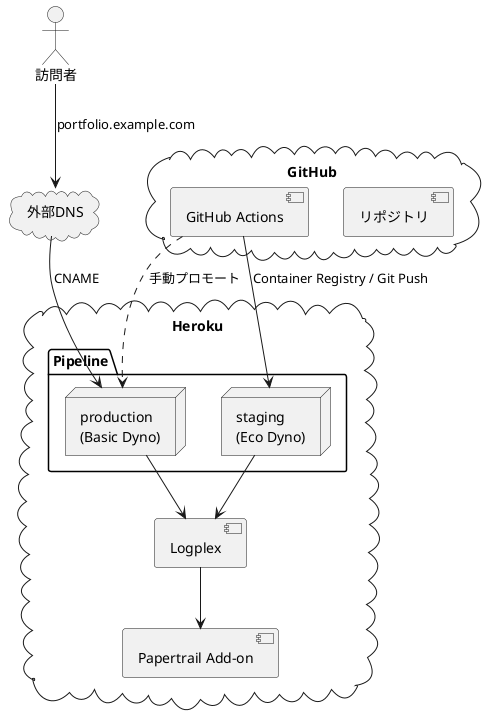
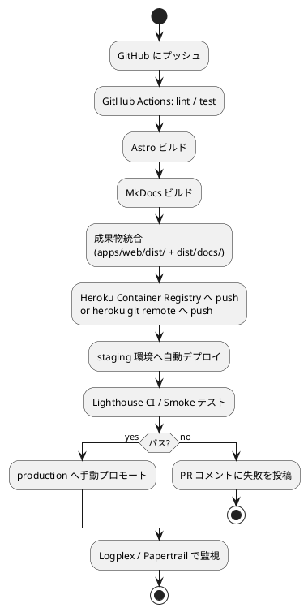
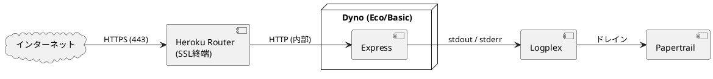

# インフラストラクチャアーキテクチャ

## 概要

Heroku を中心とした静的サイト配信構成を採用する。GitHub からのデプロイ自動化、ステージング・本番のパイプライン分離、独自ドメイン + 自動 SSL を含む。MkDocs ドキュメントとポートフォリオを**単一 Dyno で同時配信**する構成とする。

## ホスティングプラットフォーム

### 採用: Heroku

| 評価軸 | Heroku | GitHub Pages | Cloudflare Pages | AWS S3+CloudFront |
|---|:---:|:---:|:---:|:---:|
| ユーザー希望 | ◎ | ✗ | ✗ | ✗ |
| 静的サイト適性 | △（Buildpack 必要） | ◎ | ◎ | ◎ |
| 動的拡張容易性 | ◎ | ✗ | ○（Functions） | ○ |
| Pipeline / Review Apps | ◎ | △ | ○ | △ |
| 月額コスト目安 | $5（Eco）/$7（Basic） | 無料 | 無料 | $1〜 |

ユーザー指定により Heroku を採用。詳細は [ADR-0002](../adr/0002-hosting-heroku.md) 参照。

## 全体構成



## Dyno 構成

| 環境 | Dyno タイプ | 月額（参考） | 備考 |
|---|---|---|---|
| staging | Eco | $5 | スリープあり、PR ごとに Review App として起動も可 |
| production | Basic | $7 | スリープなし、独自ドメイン + 自動 SSL（ACM） |

`Procfile`:

```
web: node apps/web/server.js
```

Dyno は Express プロセス 1 つ。Heroku Router がリクエストを受け、`/` は Astro ビルド成果物、`/docs` は MkDocs ビルド成果物を配信する（[フロントエンド](./architecture_frontend.md) 参照）。

## ビルドとデプロイ

### Buildpack

| Buildpack | 役割 |
|---|---|
| `heroku/nodejs` | Astro ビルド、Express の起動 |
| `heroku-community/python` | MkDocs ビルド（`mkdocs build` を `heroku-postbuild` で実行） |

### デプロイフロー



### CI/CD（GitHub Actions）の主要ジョブ

| ジョブ | 内容 |
|---|---|
| `lint` | ESLint / Prettier / markdownlint |
| `test` | Vitest / Playwright |
| `build` | Astro + MkDocs を並列ビルド、成果物を artifact として保存 |
| `deploy-staging` | `main` への push 時に staging へ自動デプロイ |
| `lighthouse` | staging に対して Lighthouse CI を実行、予算逸脱で失敗 |
| `promote` | `workflow_dispatch` で staging → production へプロモート |

### Heroku 認証

GitHub Actions Secrets に `HEROKU_API_KEY` を保管。OAuth トークンは 90 日ごとに棚卸しする。

## ネットワーク構成



| 項目 | 仕様 |
|---|---|
| HTTPS | Heroku Automated Certificate Management（無料、ACM 経由） |
| HTTP | 301 リダイレクトで HTTPS 強制（Express ミドルウェアで実装） |
| カスタムドメイン | `portfolio.example.com`、Heroku の DNS Target を CNAME |
| WAF | Heroku 提供範囲のみ（DDoS 基本対策）。要件追加時は Cloudflare 前段配置を検討 |

## 環境変数

| 変数 | 用途 | 設定先 |
|---|---|---|
| `NODE_ENV` | `production` 固定 | Heroku Config Vars |
| `PORT` | Heroku が自動設定 | Heroku ランタイム |
| `LOG_LEVEL` | `info`（本番）/ `debug`（staging） | Heroku Config Vars |
| `BASIC_AUTH_USER/PASS` | staging のみ、検索エンジン除けと併用 | Heroku Config Vars |

ローカルは `.env`（git 管理外）、共有は `.env.vault`（dotenv-vault）で行う。Heroku 側の環境変数は手動で同期する。

## 監視・ログ

| 項目 | ツール | 内容 |
|---|---|---|
| メトリクス | Heroku Metrics | Dyno ロード、レスポンス時間、メモリ |
| ログ | Logplex + Papertrail（Add-on） | 7 日間保持、検索可能 |
| 死活監視 | UptimeRobot（外部・無料枠） | 5 分間隔で `/healthz` を監視 |
| エラートラッキング | 必要時に Sentry を後付け | 現状未導入 |
| Web Vitals | Lighthouse CI（CI 内） | Performance / SEO / A11y |

## バックアップと災害復旧

静的サイトのため永続データなし。災害復旧の対象は以下：

| 対象 | バックアップ手段 | RPO | RTO |
|---|---|---|---|
| ソースコード | GitHub（Origin） | 0 | 1 時間（再デプロイ） |
| ビルド成果物 | GitHub Actions の artifact、Heroku Slug 履歴 | コミット単位 | 5 分（直前 Slug にロールバック） |
| Heroku アカウント | 2FA + 緊急時のチーム引継ぎ手順を `ops/runbook` に整備 | - | - |

復旧手順は `ops/runbook/disaster-recovery.md` を別途用意（運用要件で定義）。

## コスト試算

| 項目 | 月額 |
|---|---|
| Heroku Eco Dyno（staging） | $5 |
| Heroku Basic Dyno（production） | $7 |
| Papertrail（Choklad） | $0（無料枠） |
| カスタムドメイン | 別途取得 |
| **小計** | **約 $12 / 月** |

## セキュリティ

| 領域 | 対策 |
|---|---|
| 通信 | HTTPS 強制、HSTS（1 年、`includeSubDomains`） |
| ヘッダ | `helmet` で CSP / X-Frame-Options / Referrer-Policy 等を設定 |
| 認証 | 公開ポートフォリオのため不要。staging のみ Basic 認証 |
| 依存性 | Dependabot を有効化、`npm audit --production` を CI で実行 |
| シークレット | Heroku Config Vars / GitHub Secrets。コミットに含めない |
| ログ機微情報 | IP・User-Agent のみ。個人情報は記録しない |

## IaC 方針

Heroku 側のリソース（App、Add-on、Pipeline、Domain）は段階的に Terraform（`heroku-provider`）で管理する。初期構築はダッシュボード操作で素早く進め、安定後にコード化する。

```hcl
# ops/terraform/heroku.tf（将来形のイメージ）
resource "heroku_app" "production" {
  name   = "portfolio-prod"
  region = "us"
  buildpacks = [
    "heroku/nodejs",
    "heroku-community/python",
  ]
  config_vars = {
    NODE_ENV  = "production"
    LOG_LEVEL = "info"
  }
}

resource "heroku_pipeline" "main" {
  name = "portfolio"
}
```

## 拡張シナリオ

| シナリオ | 影響 |
|---|---|
| トラフィック増加 | Basic → Standard-1X → Standard-2X、Dyno 数増加で水平スケール |
| 動的機能追加 | バックエンドアーキテクチャを「レイヤード 3 層」へ昇格、Heroku Postgres 追加 |
| 多リージョン | Heroku の Common Runtime では困難。Cloudflare 前段で CDN 化、または AWS への移行を ADR 化 |

## 関連ドキュメント

- [バックエンドアーキテクチャ](./architecture_backend.md)
- [フロントエンドアーキテクチャ](./architecture_frontend.md)
- [ADR-0002: ホスティングプラットフォームに Heroku を採用](../adr/0002-hosting-heroku.md)
