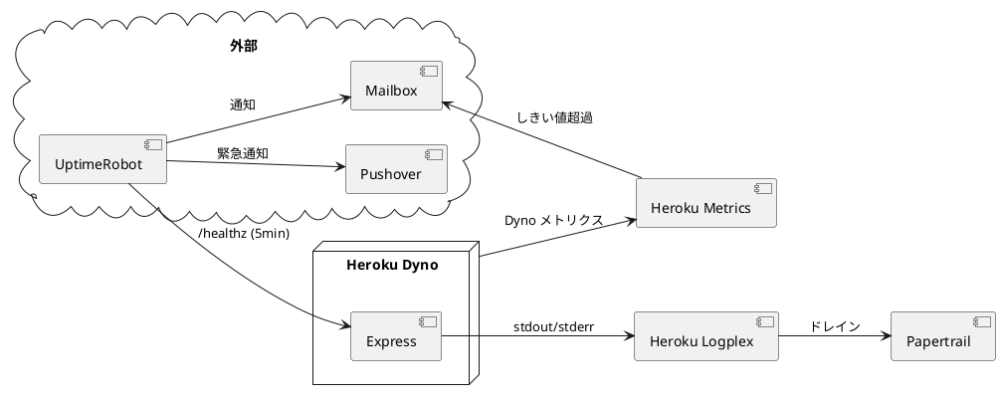
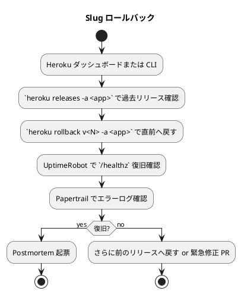
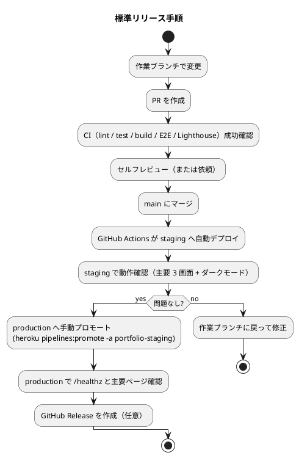
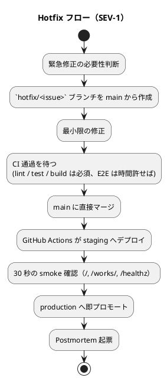

# 運用要件

## 概要

採用・営業向けの個人ポートフォリオサイト（Astro SSG + MkDocs を Heroku 単一 Dyno で配信）の運用要件を定義する。個人運用が前提のため、24/7 オンコールは設けず、自動化と best effort 対応の組み合わせで SLO 99.5% を維持する。

設計方針：

- **手動作業を最小化**: 自動化できないものだけを runbook 化する
- **観察可能性の前倒し**: 障害が起きてから「どこを見るか」を考えない
- **個人運用前提**: 業務時間外は best effort、緊急停止は携帯通知で対応
- **テスト済みの手順のみ**: リストア・ロールバック手順は半年に 1 回実演する

## 運用体制

### 役割

| 役割 | 担当 | 責務 |
|---|---|---|
| サイトオーナー | 自分（k2works） | 全体責任、緊急時対応、ドメイン・課金管理 |
| 開発者 | 自分（k2works） | コード変更、PR、リリース |
| オンコール | 自分（k2works） | 緊急アラート対応、business hours は 30 分以内、業務時間外は best effort |

将来的にチーム化する場合の引継ぎ手順は `ops/runbook/handover.md` に記載する。

### 連絡体制

| 重要度 | 通知方法 | 受領者 | 期待対応時間 |
|---|---|---|---|
| Critical（サイト停止） | UptimeRobot → メール + 携帯 Push（Pushover 等） | オーナー | 30 分以内（業務時間外 best effort） |
| Warning（性能劣化、ヘッダ欠落等） | メール | オーナー | 翌営業日 |
| Info（CI 失敗、Dependabot PR） | GitHub 通知 | オーナー | 業務時間内 |

## 運用フロー

### 日次運用

| 項目 | 担当 | 自動化 | 内容 |
|---|---|---|---|
| 死活監視 | UptimeRobot | 自動 | `/healthz` を 5 分間隔で監視 |
| アクセスログ確認 | - | 不要（オンデマンド） | 障害時に Papertrail で検索 |
| Heroku Metrics 確認 | - | 不要（オンデマンド） | 重大アラート時のみ |
| Lighthouse CI 実行 | GitHub Actions | 自動 | PR / main ごと |

業務時間外でもアラート受信時のみ対応。アクセスログを毎日眺める運用はしない。

### 週次運用

| 項目 | 自動化 | 内容 |
|---|---|---|
| Dependabot PR の確認・マージ | 半自動 | 月曜にまとめて見る、`patch`/`minor` は CI 通過後マージ、`major` は内容確認 |
| `npm audit` レビュー | 自動 | CI が高/致命の脆弱性で失敗。手動で `npm audit fix` 実行 |
| Lighthouse 実行（main） | 自動 | スコア低下時に Issue 化 |
| linkinator 実行（main） | 自動 | 外部リンク切れ時に Issue 化 |

### 月次運用

| 項目 | 自動化 | 内容 |
|---|---|---|
| Heroku 請求確認 | 手動 | 想定 $12/月から逸脱がないか |
| ドメイン更新確認 | 手動 | レジストラの自動更新が有効か |
| Mozilla Observatory スキャン | 手動 | セキュリティヘッダの A 評価維持 |
| バックアップリストアの簡易確認 | 手動 | Slug ロールバック手順を 1 度実演 |
| 月次稼働率の集計 | 半自動 | UptimeRobot のレポートを SLO（99.5%）と比較 |

### 四半期運用

| 項目 | 内容 |
|---|---|
| シークレットローテーション | `HEROKU_API_KEY` / `BASIC_AUTH_USER/PASS` を新しい値に交換、GitHub Secrets / Heroku Config Vars を更新 |
| 障害対応手順の見直し | runbook を読み直し、古い記述を更新 |
| 依存ライブラリのメジャー版評価 | Astro / Tailwind / Playwright のメジャーアップを評価 |

### 年次運用

| 項目 | 内容 |
|---|---|
| Heroku Stack 移行 | Heroku の新 Stack（heroku-N+1）に移行 |
| Node.js LTS 移行 | EOL 6 ヶ月前までに次 LTS へ移行 |
| Python（MkDocs）バージョン更新 | EOL 6 ヶ月前までに新バージョンへ |
| DR 訓練 | Heroku アカウント停止を想定し GitHub Pages へ一時退避を実演 |
| ドキュメント全面見直し | アーキテクチャ・ADR・運用要件の全体棚卸し |

## 監視設計

### 監視スタック



### 監視項目とアラート閾値

非機能要件の SLO に整合させる：

| カテゴリ | 項目 | Warning | Critical | 通知 | 対応 |
|---|---|---|---|---|---|
| 死活 | `/healthz` 失敗 | 1 回失敗 | 連続 2 回失敗 | Pushover + メール | 直ちに調査 |
| 性能 | p95 レスポンス時間 | 1.0s 超 5 分 | 1.5s 超 5 分 | メール | 翌営業日に調査 |
| エラー率 | 5xx 比率 | 2% 超 5 分 | 5% 超 5 分 | メール | 直ちに調査 |
| Dyno 負荷 | メモリ使用率 | 70% 超 5 分 | 80% 超 5 分 | メール | 翌営業日に Dyno サイズ見直し |
| 証明書 | Heroku ACM 失敗 | - | 即時 | Heroku 標準通知 | 直ちにダッシュボード確認 |
| ドメイン | 名前解決失敗 | - | 連続 2 回失敗 | UptimeRobot | DNS プロバイダ確認 |
| Lighthouse | Performance < 90 | 1 週間継続 | - | GitHub Issue | 最適化タスク化 |
| 依存性 | 致命的脆弱性検出 | - | 即時 | GitHub 通知 | 1 週間以内に修正 |

### Synthetic vs RUM

| 種別 | 採用 | ツール | 役割 |
|---|---|---|---|
| Synthetic（合成監視） | 採用 | UptimeRobot + Lighthouse CI | SLO の主要根拠 |
| RUM（実ユーザー監視） | 任意 | web-vitals + Plausible / Cloudflare Web Analytics | 補助。Cookie レス前提 |

### ダッシュボード

| ダッシュボード | 提供元 | URL | 用途 |
|---|---|---|---|
| Heroku Metrics | Heroku | `https://dashboard.heroku.com/apps/<app>/metrics/web` | Dyno ロード、応答時間、エラー率 |
| Papertrail | Add-on | `https://papertrailapp.com/` | ログ検索、保存検索 |
| UptimeRobot Status | UptimeRobot | パブリックステータスページ（任意公開） | 訪問者向けの稼働状況 |
| GitHub Actions | GitHub | リポジトリの Actions タブ | CI / CD ステータス |

## バックアップ設計

### バックアップ対象と方式

静的サイトのため永続データなし。バックアップ対象はソースとビルド成果物に限定する。

| 対象 | バックアップ手段 | 頻度 | RPO | RTO |
|---|---|---|---|---|
| ソースコード | GitHub（Origin） + ローカルクローン | コミットごと | 0（コミット = 即時） | 1 時間（再デプロイ） |
| ビルド成果物（Slug） | Heroku Slug 履歴（直近 5 件相当） | デプロイごと | デプロイ単位 | 5 分（直前 Slug にロールバック） |
| GitHub Actions artifact | GitHub（90 日保持） | CI ごと | CI 成功単位 | 10 分（artifact 再アップロードしてデプロイ） |
| Heroku 構成（Config Vars / Pipeline） | Terraform 化（段階移行）+ ダッシュボードのスクリーンショット | 変更時 | 変更単位 | 1 時間（手作業再構築） |
| Heroku Add-on（Papertrail） | 構成は Terraform、ログ自体は 7 日保持 | リアルタイム | 7 日のログ消失許容 | - |
| ドメイン情報 | レジストラ管理画面のスクショ + DNS レコード一覧 | 変更時 | - | DNS 切替 1 時間 |

### バックアップ検証

| 項目 | 頻度 | 手順 |
|---|---|---|
| Slug ロールバック | 月次 | `heroku rollback` を staging で実演、production には触れない |
| Terraform 適用テスト | 四半期 | `terraform plan` を staging に対して実行、差分が 0 であることを確認 |
| Heroku アカウント緊急復旧 | 年次 | アカウントロックアウトを想定したパスワード再設定 + 2FA 復旧 |

### 復旧手順（簡略）



詳細は `ops/runbook/rollback.md` に記載する（運用フェーズで作成）。

## 障害対応設計

### 障害検知

| 検知元 | 検知範囲 | 検知時間 |
|---|---|---|
| UptimeRobot | サイト停止、ドメイン名前解決失敗 | 5〜10 分（連続 2 回失敗） |
| Heroku Metrics | エラー率、応答時間、メモリ | 5 分〜 |
| Papertrail Saved Search | 特定エラーパターン（`ERROR` レベル等） | 5 分〜 |
| Lighthouse CI（main） | 性能・SEO・A11y の退化 | デプロイごと |
| ユーザー報告（メール / SNS） | 上記で検知できない UI 不具合 | 不定 |

### インシデントレベル定義

| レベル | 状態 | 例 | 対応時間 |
|---|---|---|---|
| SEV-1（緊急） | サイト全停止、データ損失（将来） | Dyno クラッシュループ、Heroku Region 障害 | 30 分以内 best effort |
| SEV-2（重大） | 一部画面停止、性能劣化 | Lighthouse 70 以下、特定ルート 500 | 翌営業日 |
| SEV-3（軽微） | 機能影響なし、警告状態 | リンク切れ、画像最適化失敗 | 1 週間以内 |

### 障害対応フロー

```plantuml
@startuml
title 障害対応フロー（SEV-1 / SEV-2）

start

:アラート受信
(UptimeRobot / Heroku / Lighthouse);
:重要度判定;

if (SEV-1?) then (yes)
  :ステータスページ更新（任意）;
  fork
    :Heroku ダッシュボードで Dyno ステータス確認;
  fork again
    :Papertrail でエラーログ確認;
  fork again
    :Heroku Status で広域障害確認
    (https://status.heroku.com/);
  end fork

  if (Heroku 広域障害?) then (yes)
    :受容 / 必要なら GitHub Pages 退避;
  else (no)
    if (直近デプロイ起因?) then (yes)
      :Slug ロールバック;
    else (no)
      :Dyno 再起動 (heroku ps:restart);
      if (復旧?) then (no)
        :緊急修正 PR;
      else (yes)
        nop
      endif
    endif
  endif
  :復旧確認 (/healthz, 主要ページ);
  :ユーザー影響を Postmortem に記録;
else (SEV-2/3)
  :GitHub Issue 起票;
  :優先度に応じて修正 PR;
endif

stop
@enduml
```

### 障害パターンと初動

| パターン | 初動コマンド / 操作 |
|---|---|
| Dyno がクラッシュループ | `heroku ps -a <app>` で状態確認 → `heroku logs --tail -a <app>` でエラー特定 → 直前リリースへロールバック |
| `/healthz` が 503 | `heroku ps:restart -a <app>` → 5 分待って復旧確認、ダメならロールバック |
| メモリ使用率高騰 | `heroku ps:resize web=basic -a <app>` で一時昇格、原因特定後にコード修正 |
| 証明書失敗 | Heroku ダッシュボード「Certificates」を確認、`heroku certs:auto -a <app>` で再有効化 |
| ドメイン名前解決失敗 | レジストラ・DNS プロバイダのダッシュボードで NS / A レコード確認 |
| Heroku Region 全断 | https://status.heroku.com/ を確認、必要なら GitHub Pages へ一時退避（`ops/runbook/dr-github-pages.md`） |

### Postmortem

SEV-1 / SEV-2 が発生した場合は `ops/runbook/postmortem/YYYY-MM-DD-<title>.md` を作成する。テンプレート：

- **概要**: 何が起きたか
- **影響範囲**: ユーザーへの影響（時間、機能）
- **タイムライン**: 検知 → 初動 → 復旧の時系列
- **直接原因 / 根本原因**: 5 Whys で深掘り
- **再発防止策**: アクションアイテム（担当・期限）
- **学び**: 改善点

非難なし（blameless）の文化を維持する。

## 変更管理設計

### 変更カテゴリ

| カテゴリ | 例 | 承認 | リリース方法 |
|---|---|---|---|
| 通常変更 | コンテンツ追記、UI 微調整、依存性 patch/minor | PR セルフレビュー | main マージで自動 staging → 手動プロモート |
| 重要変更 | アーキテクチャ変更、Dyno タイプ変更、認証導入 | ADR + PR | main マージ後、staging で 24 時間ソーク → 手動プロモート |
| 緊急変更 | セキュリティパッチ、SEV-1 修正 | 事後承認可 | hotfix ブランチ → main 直接 → 即プロモート |

### リリース手順（標準）



### ロールバック手順

| 種別 | 手順 | 所要時間 |
|---|---|---|
| Heroku Slug | `heroku rollback v<N> -a portfolio-prod` | 1〜2 分 |
| GitHub Revert | `git revert <sha> && git push` → 通常リリースフロー | 10〜20 分 |
| 構成変更（Config Vars） | 変更前の値に戻す（Terraform 化後は `git revert`） | 数分 |
| ドメイン切替 | DNS の TTL 経過待ち（最長 1 時間） | TTL 依存 |

ロールバック判断基準：

- production で SEV-1 が発生し、原因が直近デプロイと相関
- 5xx 比率が 5% を超え、5 分以内に解消しない
- Lighthouse Performance が < 70 に急落

判断は迷ったら**ロールバックを優先**。詳細調査は staging で行う。

### Hotfix フロー



### 変更承認・履歴

| 項目 | 仕組み |
|---|---|
| PR テンプレート | チェックリスト（テスト追加、ドキュメント更新、影響範囲）を必須化 |
| Conventional Commits | `feat:` / `fix:` / `chore:` でコミット種別を統一 |
| CHANGELOG | リリースごとに自動生成（任意で `release-please` 等） |
| ADR | 重要変更は ADR 起票必須（[docs/adr/](../adr/)） |

## ランブック構成

`ops/runbook/` 配下に以下を整備する（運用フェーズで実装）：

```
ops/runbook/
├── README.md                 # 入口、目次
├── deploy.md                 # 通常リリース手順
├── hotfix.md                 # 緊急修正手順
├── rollback.md               # ロールバック手順
├── disaster-recovery.md      # Heroku 全停止時の GitHub Pages 退避
├── handover.md               # 引継ぎ資料（チーム化時）
├── on-call.md                # オンコール時の初動チェックリスト
├── secret-rotation.md        # シークレットローテーション手順
├── domain-renewal.md         # ドメイン更新手順
└── postmortem/               # 障害事後報告
    └── YYYY-MM-DD-<slug>.md
```

各ランブックは「目的・前提条件・手順（コピペ可能なコマンド）・確認方法・想定外の挙動」を含む。

## 自動化推進

### 既に自動化されている事項

| 領域 | 仕組み |
|---|---|
| ビルド・デプロイ | GitHub Actions → Heroku Pipeline |
| 性能監視 | Lighthouse CI |
| 死活監視 | UptimeRobot |
| 依存性更新 | Dependabot |
| 脆弱性スキャン | `npm audit`、gitleaks |
| 証明書 | Heroku ACM |

### 段階的に自動化する事項

| 領域 | 現状 | 目標 |
|---|---|---|
| 構成管理 | Heroku ダッシュボード手動 | Terraform で IaC 化（半年以内） |
| アラート集約 | メール / Pushover 個別 | 必要に応じて統合（PagerDuty 等。コストに見合わなければ採用しない） |
| ログ分析 | Papertrail で目視 | 必要に応じて Saved Search 化 |
| Postmortem テンプレート | 手書き | テンプレートを GitHub Issue Form で提供 |

### 自動化しない（あえて手動）

| 領域 | 理由 |
|---|---|
| production プロモート | 個人サイトでも本番リリースは人間判断を介在させる |
| シークレットローテーション | 90 日に 1 度の手動作業として実施、自動化のリスクが上回る |
| メジャーバージョン更新 | 影響範囲を確認して計画的に |

## 容量管理

| リソース | 上限 | 現状予測 | アクション基準 |
|---|---|---|---|
| Heroku Slug サイズ | 500 MB | < 50 MB（Astro + MkDocs 成果物） | 200 MB を超えたら不要ファイル除外を検討 |
| Heroku 帯域 | 月間ソフトリミット | < 10 GB | 月間 5 GB を超えたら Cloudflare 検討 |
| Papertrail ログ | 100 MB/月（無料枠） | < 50 MB | 80% で有料プラン or サンプリング検討 |
| GitHub LFS | 1 GB（無料枠） | 未使用 | 大容量画像追加時に検討 |
| Heroku 課金 | $12/月 | $12/月 | $30/月を超えたら見直し |

## 環境管理

| 環境 | 役割 | URL（仮） | 認証 |
|---|---|---|---|
| ローカル | 個人開発 | `http://localhost:4321` | なし |
| staging | 統合確認、Lighthouse CI | `https://portfolio-staging.herokuapp.com` | Basic 認証 |
| production | 公開 | `https://portfolio.example.com` | なし |

各環境間の差分：

| 項目 | local | staging | production |
|---|---|---|---|
| `NODE_ENV` | development | production | production |
| `LOG_LEVEL` | debug | debug | info |
| `robots.txt` | - | `Disallow: /` | 通常 |
| 認証 | なし | Basic 認証 | なし |
| 監視 | なし | UptimeRobot 10 分間隔 | UptimeRobot 5 分間隔 |
| Dyno | - | Eco | Basic |

## SLO レポーティング

| 指標 | 集計頻度 | レポート先 |
|---|---|---|
| 月間稼働率 | 月次 | `ops/reports/availability-YYYY-MM.md`（任意。SLO 違反時のみ作成） |
| Lighthouse スコア推移 | 週次 | GitHub Actions の artifact から手動集計、必要時のみ可視化 |
| 主要メトリクス | 必要時 | Heroku Metrics ダッシュボードのスクショで代用 |

エラーバジェット（許容ダウンタイム 3.6 時間/月）の運用：

- 残り 50% を切ったら新規変更のリスク評価を慎重に
- 残り 0% で完全消化したら、機能追加を停止し信頼性改善に集中

## トレードオフと意思決定

| トレードオフ | 採用 | 理由 |
|---|---|---|
| 24/7 オンコール vs best effort | best effort | 個人サイト、業務時間外コストに見合わない |
| 完全自動デプロイ vs 手動プロモート | 手動プロモート | 個人でも本番には人間判断を入れる |
| 完全 IaC vs 手動 + 一部 IaC | 段階的 IaC | 初期は速度重視、安定後にコード化 |
| 高度なオブザーバビリティ vs シンプル監視 | シンプル | UptimeRobot + Heroku Metrics + Papertrail で十分 |
| Postmortem 必須 vs 任意 | SEV-1/2 のみ必須 | 軽微なものは負担を増やさない |

## 関連ドキュメント

- [非機能要件](./non_functional.md)
- [インフラストラクチャアーキテクチャ](./architecture_infrastructure.md)
- [バックエンドアーキテクチャ](./architecture_backend.md)
- [テスト戦略](./test_strategy.md)
- [運用要件定義ガイド](../reference/運用要件定義ガイド.md)
- [ADR-0002: ホスティングプラットフォームに Heroku を採用](../adr/0002-hosting-heroku.md)
