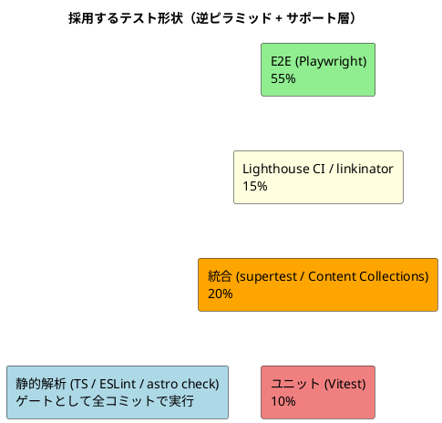
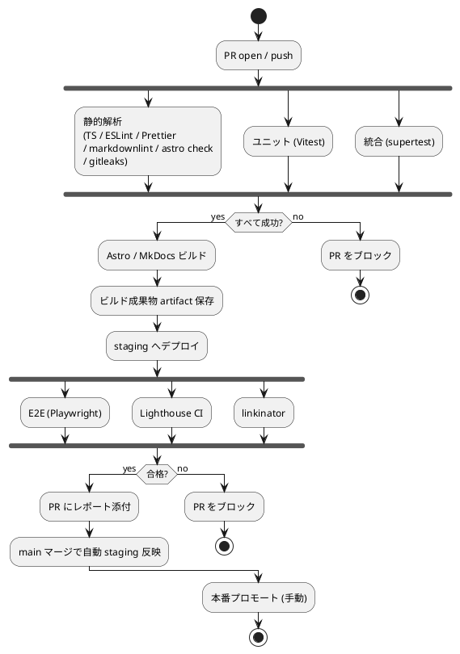

# テスト戦略

## 概要

ポートフォリオサイト（Astro SSG + Heroku 上の Express 静的配信）に対するテスト戦略を定義する。動的ロジックがほぼ存在せず、価値はエンドツーエンドで「ページが正しく見え、リンクが繋がり、性能・アクセシビリティ予算を守れているか」に集約されるため、**逆ピラミッド形を補強した形状**を採用する。

戦略の柱：

1. **逆ピラミッド形（E2E 中心）** — 静的サイトの価値検証は E2E が最適
2. **静的解析の徹底** — 型・lint・フォーマットを強制し、ユニットテストの代替として動かす
3. **Lighthouse CI による予算管理** — 性能 / SEO / A11y を数値で守る
4. **ビルド時バリデーション** — Astro Content Collections の Zod スキーマで Markdown 入力を型検証

## テスト形状の選択

### 採用: 逆ピラミッド形（補強型）



### 選択理由

| 判断軸 | 判定 |
|---|---|
| バックエンドのアーキテクチャパターン | 静的ファイル配信（最小トランザクションスクリプト） |
| バックエンドの推奨形状（ガイド） | 逆ピラミッド形 |
| フロントエンドの動的ロジック量 | 低（Markdown / 表示主体） |
| 価値の大半 | エンドユーザーが見る「画面とリンク」の正しさ |
| 採用形状 | **逆ピラミッド形 + 静的解析 + Lighthouse CI** |

ピラミッド形は却下：ビジネスロジックがほぼ存在しないため、ユニットテストを 80% 確保しても価値が低い。代わりに**静的解析と E2E に投資する**。

ダイヤモンド形は却下：データアクセス層が存在しない。

## テスト分布の目標

| レイヤー | 配分 | 主な検証対象 |
|---|---:|---|
| 静的解析 | ゲート（全実行） | 型違反、lint 違反、未フォーマット、Markdown 違反 |
| ユニット | 10% | サーバーミドルウェア・ユーティリティ関数 |
| 統合 | 20% | Express ルーティング（supertest）、Content Collections スキーマ |
| Lighthouse / リンク | 15% | LCP / TBT / SEO / A11y 予算、リンク切れ |
| E2E | 55% | 全画面の表示、主要シナリオ、OGP、ナビゲーション、ビジュアル |

## テストレベル別の戦略

### レベル 0: 静的解析（ゲート）

**目的**: 実行前にエラーを排除する。ユニットテストの代替として機能させる。

| 項目 | ツール | 失敗時の挙動 |
|---|---|---|
| 型検査 | `tsc --noEmit`、`astro check` | CI 失敗、PR ブロック |
| Lint | ESLint（Flat Config）+ `eslint-plugin-astro` | CI 失敗 |
| フォーマット | Prettier（`--check`） | CI 失敗 |
| Markdown | markdownlint-cli2 | CI 失敗 |
| シークレット漏洩 | gitleaks | CI 失敗 |
| 依存性脆弱性 | `npm audit --production` | CI 警告（高/致命のみ失敗） |

**実装方針**:

- pre-commit フックではなく CI ゲートで強制（個人開発のため hook の運用負荷を避ける）
- 段階的に PR レベルで失敗 → mainline ブランチを常にクリーンに保つ

### レベル 1: ユニットテスト（10%）

**目的**: 純関数・サーバーミドルウェアの振る舞いを検証する。

| 対象 | 例 |
|---|---|
| Express ミドルウェア | HTTPS 強制、Basic 認証（staging のみ）、ヘルスチェックハンドラ |
| ユーティリティ関数 | 日付フォーマッタ、URL 構築、フロントマターのフィルタリング |
| Astro コンポーネントのロジック層 | `getStaticPaths` の純粋部分 |

**ツール**:

- Vitest 2.x（jest 互換 API、ESM ネイティブ）
- `supertest` でサーバーハンドラ単体テスト

**実装例**:

```ts
// apps/web/tests/unit/healthz.spec.ts
import { describe, it, expect } from "vitest";
import express from "express";
import request from "supertest";
import { healthz } from "../../server/healthz.js";

describe("healthz", () => {
  it("returns 200 with body 'ok'", async () => {
    const app = express();
    app.get("/healthz", healthz);
    const res = await request(app).get("/healthz");
    expect(res.status).toBe(200);
    expect(res.text).toBe("ok");
  });
});
```

### レベル 2: 統合テスト（20%）

**目的**: Express ルーティング、静的配信、Content Collections のスキーマ整合を検証する。

| 検証対象 | 内容 |
|---|---|
| `/` レンダリング | `index.html` を 200 で返す |
| `/works/{slug}` | 既存スラッグは 200、未知は 404 |
| `/healthz` | 200 + `ok` |
| `/docs/*` | MkDocs ビルド成果物の配信 |
| 不明 URL | `404.html` を 200 で返す（SPA 風 fallback） |
| HTTPS 強制 | `X-Forwarded-Proto: http` で 301 にリダイレクト |
| セキュリティヘッダ | `helmet` の主要ヘッダが付与される |
| Content Collections | 全 Markdown が Zod スキーマを通過する（`astro build` 内で実行） |

**ツール**:

- supertest（Express）
- `astro build`（CI 内で必ず通す）

### レベル 3: E2E テスト（55%）

**目的**: UI 設計で定義した画面遷移とシナリオを実ブラウザで検証する。

#### シナリオカタログ

UI 設計のシナリオを E2E テストに 1:1 マッピングする：

| ID | シナリオ | 検証点 |
|---|---|---|
| E01 | ホーム表示 | `<h1>` 存在、Featured Works 3 件、Skills Highlights 表示 |
| E02 | ヘッダーナビ | Home/Works/Skills/Contact/Docs の遷移、`aria-current` の更新 |
| E03 | Works 一覧 | カード件数、絞り込みボタン操作、詳細遷移 |
| E04 | Works 詳細 | パンくず、概要・技術・成果セクション、外部リンクの `target="_blank"` |
| E05 | Skills | Backend / Frontend / Infrastructure の各テーブル表示 |
| E06 | Contact | 連絡手段リンク存在、`mailto:` の起動可能性 |
| E07 | 404 | 不存在 URL で 404 ページが表示、ホームに戻れる |
| E08 | ダークモード | トグルクリックで `<html data-theme>` が切替、リロード後も保持 |
| E09 | レスポンシブ | sm / md / lg ブレイクポイントでレイアウトが崩れない |
| E10 | OGP | 各ページの `og:title` `og:image` `og:url` が出力される |
| E11 | キーボード操作 | Tab で全インタラクティブ要素にフォーカス可能、Enter で遷移 |
| E12 | 外部リンク属性 | 外部 `<a>` がすべて `rel="noopener noreferrer"` を持つ |

**ツール**:

- Playwright 1.49+（Chromium / WebKit / Firefox）
- ビジュアル比較は Playwright Snapshot（プラットフォーム差を抑えるため CI で固定 OS）
- 実行は `staging` 環境（Heroku Eco Dyno）に対しても定期実行

**実装例**:

```ts
// apps/web/tests/e2e/home.spec.ts
import { test, expect } from "@playwright/test";

test("ホームに名前と Featured Works が表示される", async ({ page }) => {
  await page.goto("/");
  await expect(page.getByRole("heading", { level: 1 })).toBeVisible();
  await expect(page.getByText("Featured Works")).toBeVisible();
  const cards = page.locator('[data-testid="work-card"]');
  await expect(cards).toHaveCount(3);
});

test("ヘッダーナビで Works に遷移できる", async ({ page }) => {
  await page.goto("/");
  await page.getByRole("link", { name: "Works" }).click();
  await expect(page).toHaveURL(/\/works\/?$/);
  await expect(page.getByRole("link", { name: "Works" })).toHaveAttribute(
    "aria-current",
    "page"
  );
});
```

### レベル 4: Lighthouse CI / リンク切れ（15%）

**目的**: 性能・SEO・アクセシビリティを数値予算で守り、リンク切れを検出する。

#### Lighthouse CI 予算

| 指標 | しきい値 | 失敗時 |
|---|---|---|
| Performance | ≥ 90 | CI 失敗 |
| SEO | ≥ 95 | CI 失敗 |
| Accessibility | ≥ 95 | CI 失敗 |
| Best Practices | ≥ 95 | CI 失敗 |
| LCP | < 2.5s | 警告 |
| CLS | < 0.05 | 警告 |
| TBT | < 200ms | 警告 |
| 初期 JS バンドル | < 30 KB（gzip） | 警告 |

**実装方針**:

```jsonc
// apps/web/lighthouserc.json（イメージ）
{
  "ci": {
    "collect": {
      "url": ["http://localhost:4321/", "/works/", "/skills/", "/contact/"],
      "numberOfRuns": 3
    },
    "assert": {
      "assertions": {
        "categories:performance": ["error", { "minScore": 0.9 }],
        "categories:seo": ["error", { "minScore": 0.95 }],
        "categories:accessibility": ["error", { "minScore": 0.95 }]
      }
    },
    "upload": { "target": "temporary-public-storage" }
  }
}
```

#### リンク切れ検出

- linkinator 6.x で `apps/web/dist/` を再帰スキャン
- 内部リンク・外部リンクの両方を対象、外部リンクは 5xx と 404 のみ失敗扱い（一時的なレートリミットは許容）
- `/docs/` 配下（MkDocs）も同時走査

## CI/CD との連携

### パイプライン全体像



### ジョブ別の実行タイミング

| ジョブ | トリガー | 必須 / 任意 | 失敗時 |
|---|---|---|---|
| 静的解析 | 全 push / PR | 必須 | PR ブロック |
| ユニット | 全 push / PR | 必須 | PR ブロック |
| 統合 | 全 push / PR | 必須 | PR ブロック |
| ビルド | 全 push / PR | 必須 | PR ブロック |
| E2E（Playwright） | PR / main | 必須 | PR ブロック |
| Lighthouse CI | main / 週次 | 必須（main） | main ブランチでアラート |
| linkinator | main / 週次 | 必須（main） | main ブランチでアラート |
| `npm audit` | 週次 + PR | 警告 | 高/致命のみ失敗 |

### 実行時間の目標

| ジョブ | 目標 |
|---|---|
| 静的解析 | 1 分以内 |
| ユニット | 30 秒以内 |
| 統合 | 1 分以内 |
| ビルド（Astro + MkDocs） | 3 分以内 |
| E2E（Playwright、3 ブラウザ並列） | 5 分以内 |
| Lighthouse CI | 3 分以内 |
| **PR フィードバック合計** | **10 分以内** |

## カバレッジ目標

ロジック量が少ないため、カバレッジは「数値」より「シナリオ網羅」を優先する。

| 対象 | 指標 | 目標 |
|---|---|---|
| Express サーバ層 | 行カバレッジ | 90% |
| ユーティリティ関数 | 行カバレッジ | 90% |
| Astro コンポーネント | E2E でのページ網羅 | 100%（全ページ） |
| Content Collections | スキーマ通過率 | 100%（ビルド時に強制） |
| E2E シナリオ | UI 設計のシナリオ網羅 | 100%（E01〜E12） |
| Lighthouse | 全ページ Performance ≥ 90 | 100% |

## TDD / BDD の適用

### TDD の実践

| 局面 | 手順 |
|---|---|
| Express ミドルウェア追加 | failing test → 実装 → リファクタ |
| ユーティリティ関数追加 | failing test → 実装 → リファクタ |
| 新規ページ追加 | E2E スケルトン（タイトル・主要要素）を先に書き、コンポーネント実装で緑化 |
| 新規 Content Collection | Zod スキーマを先に定義し、サンプル Markdown でビルドが通ることを確認 |

### BDD の活用

- E2E テストは「ユーザーシナリオ」を Given-When-Then 風に記述（Playwright の `test.step` を使用）
- 例：

```ts
test("採用担当者が Works を確認する", async ({ page }) => {
  await test.step("Given: ホームに訪問", async () => {
    await page.goto("/");
  });
  await test.step("When: Works タブをクリック", async () => {
    await page.getByRole("link", { name: "Works" }).click();
  });
  await test.step("Then: Works 一覧が表示される", async () => {
    await expect(page.getByRole("heading", { name: "Works" })).toBeVisible();
  });
});
```

## トレーサビリティ

### UI 設計シナリオ ↔ E2E の対応

| UI 設計シナリオ | E2E ID | テストファイル（想定） |
|---|---|---|
| シナリオ A: 採用担当者が成果物を確認する | E01 / E03 / E04 | `tests/e2e/scenario-recruiter.spec.ts` |
| シナリオ B: 連絡を取る | E06 | `tests/e2e/scenario-contact.spec.ts` |
| 共通: ヘッダーナビゲーション | E02 | `tests/e2e/navigation.spec.ts` |
| 共通: ダークモード | E08 | `tests/e2e/theme.spec.ts` |
| 共通: 404 リカバリ | E07 | `tests/e2e/not-found.spec.ts` |
| 共通: アクセシビリティ | E11 | `tests/e2e/a11y.spec.ts` |
| 共通: SEO / OGP | E10 | `tests/e2e/seo.spec.ts` |

### ユーザーストーリーが整備された場合

ユーザーストーリーが `docs/requirements/user_story.md` に追加され次第、各ストーリーの**受入条件**を本テーブルに追加し、E2E ID と紐付ける。

## テストデータ管理

| 種類 | 管理方法 |
|---|---|
| Works / Skills のサンプルデータ | `apps/web/src/content/` の Markdown（プロダクションと同じ） |
| 個人情報（メール等） | テスト用ダミーアドレスを `tests/fixtures/contact.ts` に集約 |
| 環境差分 | `playwright.config.ts` で `baseURL` を CI / staging / 本番で切替 |
| スナップショット | `tests/e2e/__screenshots__/` に保存、CI で固定 OS（Ubuntu 22.04） |

## モック戦略

静的サイトのため、外部依存はほぼ存在しない。例外：

| 対象 | 戦略 |
|---|---|
| 外部リンク（GitHub / LinkedIn 等） | E2E では HEAD で疎通確認のみ、内容検証はしない |
| 画像 CDN | 自サイト配信 + CI ではレート制限を考慮しキャッシュ |
| Heroku Eco Dyno コールドスタート | E2E は staging 起床後に実行（`/healthz` でウォームアップ） |

## 失敗時のリカバリ手順

| 失敗種別 | 対応 |
|---|---|
| 静的解析失敗 | ローカルで `npm run lint -- --fix` を試行、修正後再 push |
| ユニット / 統合失敗 | ローカル再現、`vitest --watch` でデバッグ |
| E2E 失敗 | Playwright Trace を artifact から取得、`npx playwright show-trace`で原因特定 |
| Lighthouse 退化 | 直近の変更で重い JS / 画像を追加していないか確認、`astro:assets` 経由で最適化 |
| リンク切れ | 該当ページの修正、外部リンク死活はリポジトリ Issue として記録し PR 化 |

## 継続的改善

| 指標 | 評価頻度 | 改善トリガー |
|---|---|---|
| E2E 実行時間 | PR ごと | 5 分超過で並列化見直し |
| Lighthouse スコア | main マージ後 | 90 を割ったら原因調査 |
| Flaky テスト率 | 月次 | 5% 超過で安定化 PR |
| 検出欠陥 vs 種別 | 四半期 | E2E のみで検出される欠陥が増えたら下層追加を検討 |

## 関連ドキュメント

- [バックエンドアーキテクチャ](./architecture_backend.md)
- [フロントエンドアーキテクチャ](./architecture_frontend.md)
- [インフラストラクチャアーキテクチャ](./architecture_infrastructure.md)
- [UI 設計](./ui_design.md)
- [技術スタック](./tech_stack.md)
- [テスト戦略ガイド](../reference/テスト戦略ガイド.md)
