# UI 設計

## 概要

採用・営業向けの個人プロフィールサイトとして、訪問者が「この人は誰か」「何ができるか」「何を作ってきたか」「どう連絡を取るか」を最短経路で把握できる UI を設計する。OOUX（オブジェクト指向 UI 設計）に基づき、オブジェクト中心の画面構成を採用する。

## オブジェクトモデル

### 主要オブジェクト

レビュー（H07 / H09 / H10）を踏まえ、採用判断・業務委託判断に耐える属性を追加した。

| オブジェクト | 説明 | 主属性 |
|---|---|---|
| **Profile** | サイト所有者本人の自己紹介 | name / role / **catch_copy**（1 行 20〜40 字）/ **specialties**（5〜7 タグ）/ **highlight**（実績 1 行）/ bio / **availability**（稼働可否） / photo / social_links |
| **Work** | 成果物・プロジェクト実績 | title / summary / period / **role / team_size / position / involvement** / **domain / category** / tech[] / repo / demo / cover / **featured**（boolean） / **context / challenge / solution / outcome[]**（before/after の指標配列） |
| **Skill** | スキル項目 | category / name / **since**（西暦年・経験年数は自動計算） / **status**（current / past）/ level（任意・凡例必須） / **works[]**（Work への逆参照） |
| **Contact** | 連絡手段 | channel（email / github / linkedin / x） / url |

### オブジェクト間の関係

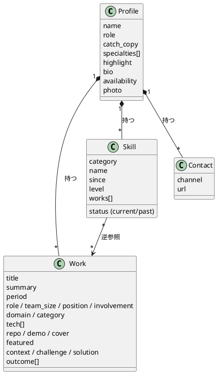

### アクション

訪問者が実行できる操作は閲覧と外部遷移のみ。Create/Update/Delete は GitHub 上の Markdown 編集（Git ベース CMS）で行うため、UI には現れない。

| オブジェクト | 訪問者のアクション |
|---|---|
| Profile | 閲覧、SNS リンクへ遷移 |
| Work | 一覧閲覧（コレクション）、詳細閲覧（シングル）、外部 repo / デモへ遷移 |
| Skill | 閲覧（カテゴリーでグルーピング） |
| Contact | 連絡手段リンクへ遷移（mailto / 外部 URL） |

## 画面一覧

### 主要画面

| ID | 画面名 | URL | パターン | 目的 |
|---|---|---|---|---|
| S01 | ホーム | `/` | プロフィール特化 | 第一印象、ファーストビューで「誰か」を伝える |
| S02 | 成果物一覧 | `/works/` | コレクションビュー | 実績の俯瞰、絞り込み |
| S03 | 成果物詳細 | `/works/{slug}/` | シングルビュー | 個別案件の深掘り、外部リンク提供 |
| S04 | スキル | `/skills/` | カテゴリ別リスト | 技術領域の網羅と深さの提示 |
| S05 | 連絡先 | `/contact/` | リンク集 | 採用・営業の問い合わせ動線 |

### 補助画面

| ID | 画面名 | URL | 目的 |
|---|---|---|---|
| S90 | 404 | `/404.html` | 存在しない URL のリカバリ |
| S91 | Tech Notes（MkDocs） | `/docs/` | 既存 MkDocs サイトへ**同一タブ遷移**（[ADR-0003](../adr/0003-mkdocs-coexistence-strategy.md)）。初期は `noindex` |

## 共通レイアウト

### ヘッダー（全画面共通）

```plantuml
@startsalt
{+
  {* Home | Works | Skills | Contact | Tech Notes ↗ }
}
@endsalt
```

| 要素 | 仕様 |
|---|---|
| ロゴ / 氏名 | 左上配置、クリックで `/` へ |
| ナビゲーション | Home / Works / Skills / Contact / **Tech Notes ↗**（[ADR-0003](../adr/0003-mkdocs-coexistence-strategy.md)） |
| Tech Notes | アイコン `↗` で別レイアウトを予告、**同一タブ**で `/docs/` へ遷移 |
| ダークモード切替 | 右端にトグル、`localStorage` に永続化、`prefers-color-scheme` を初回尊重 |
| モバイル | 768px 未満でハンバーガーメニュー（48×48 px）、フォーカストラップ + Esc で閉じる |

### フッター（全画面共通）

| 要素 | 仕様 |
|---|---|
| コピーライト | © {year} {name} |
| SNS アイコン | GitHub / LinkedIn / X 等 |
| ソースリンク | このサイトのリポジトリへの GitHub リンク |

## 画面遷移図

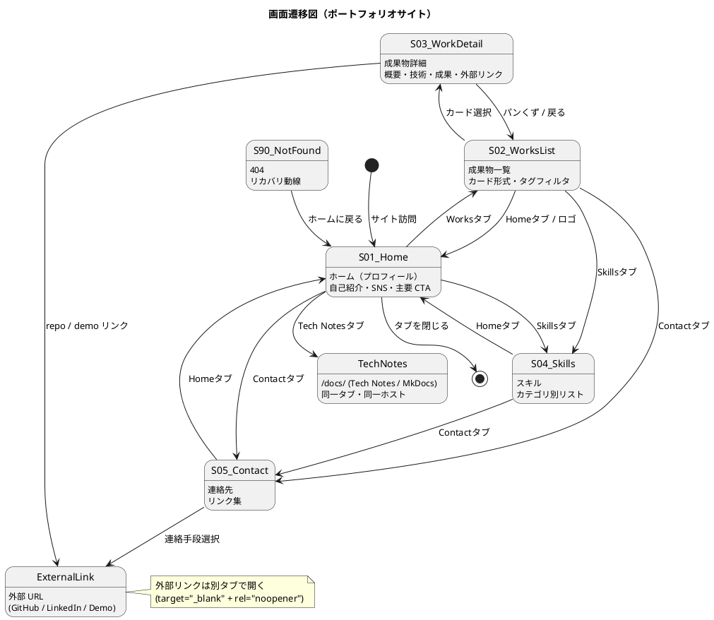

## 画面イメージ

### S01: ホーム

ファーストビューで「採用判断の核」（得意領域タグ・キャッチコピー・実績ハイライト）を 5 秒で渡せる構成とする（[US-01](../requirements/user_story.md#us-01-プロフィールを-30-秒で把握できる)）。

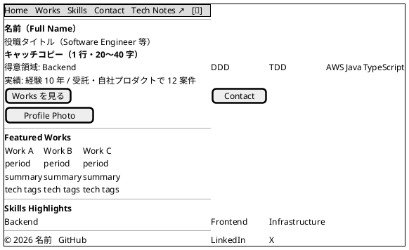

**ファーストビュー構成原則**:

| 要素 | 役割 | 表示優先度 |
|---|---|---|
| 氏名 + 役職 | 「誰か」を最短で示す | 1（最初に視認） |
| キャッチコピー | 自分を一言で表現 | 2 |
| 得意領域タグ | 専門性の解像度を上げる（5〜7 個） | 3 |
| 実績ハイライト | 経験の量を 1 行で示す | 4 |
| 主要 CTA（Works / Contact） | 次の動線を即提示 | 5 |
| プロフィール写真 | 人柄の手がかり | 並列（画面右） |

### S02: 成果物一覧

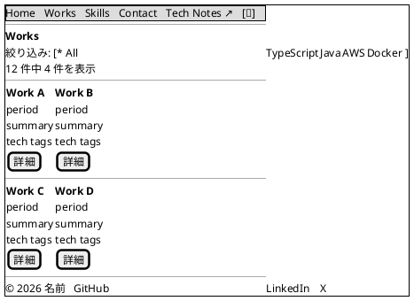

#### 絞り込み挙動の詳細

| 操作 | 挙動 |
|---|---|
| タグクリック | 該当タグを持つ Work のみを表示。URL に `?tag=java` を付与し共有可能 |
| 複数選択 | v1 では単一選択（複数は v2 以降）。「All」で解除 |
| 結果 0 件 | 「該当する Work がありません」+「フィルタを解除」ボタンを表示 |
| 件数表示 | フィルタ近傍に「N 件中 M 件を表示」を常時表示 |
| キーボード | Tab で各タグへ、Enter で適用、現在選択は `aria-pressed="true"` |
| 直接 URL 流入 | `?tag=java` で訪問した場合は即時にフィルタ適用済みで表示 |
| 不明タグ | 不明タグでアクセスされた場合は「All」状態で全件表示 + URL を `/works/` に正規化 |

業務領域でのフィルタ（`domain` / `category`）は v2 以降。v1 では技術タグ単一軸とする。

### S03: 成果物詳細

「課題 → 挑戦 → 解決 → 成果」のストーリー構造で、業務委託発注検討者が「再現性のある成果か」「同じ仕事を任せられるか」を判断できる粒度で記述する（[US-03](../requirements/user_story.md#us-03-works-詳細で関与の深さと成果を判断できる)）。

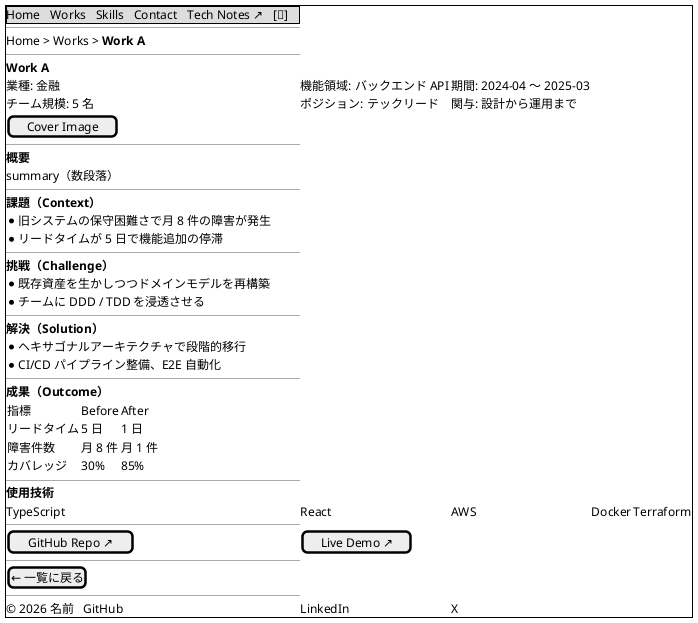

#### Work シングルビュー構成原則

| ブロック | 役割 | 必須 / 任意 |
|---|---|---|
| パンくず | 現在地と戻り動線 | 必須 |
| メタ情報（業種 / 機能領域 / 期間 / チーム規模 / ポジション / 関与の深さ） | 業務委託判断の核 | 必須 |
| カバー画像 | 視覚的要約 | 任意 |
| 概要 | 全体像の要約 | 必須 |
| 課題（Context） | なぜ取り組んだか | 必須 |
| 挑戦（Challenge） | 技術的・業務的な難しさ | 必須 |
| 解決（Solution） | どう解決したか | 必須 |
| 成果（Outcome） | before/after の定量指標 | 必須 |
| 使用技術 | タグ列挙 | 必須 |
| 外部リンク（Repo / Demo） | 一次情報への動線 | 任意 |
| 戻り動線 | 一覧へ戻る | 必須 |

### S04: スキル

経験年数は `since`（西暦年）から自動計算し毎年更新する。レベル ★ には**凡例を必ず併記**する。各 Skill は関連 Work への逆参照を持つ（[US-04](../requirements/user_story.md#us-04-skills-で技術領域の網羅性を確認できる)）。

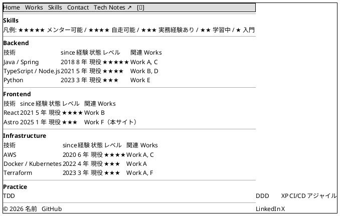

#### Skill 表現の原則

| 項目 | 仕様 |
|---|---|
| `since` | 西暦年で記録、ビルド時に現在年から経験年数を自動計算（メンテ忘れ防止） |
| `status` | `current`（現役）/ `past`（直近 3 年使用なし）。`past` は色を薄く表示 |
| レベル ★ | 採用する場合は**凡例を画面上に明示**。または ★ を廃止し `status` のみ |
| `works[]` | 関連 Work タイトルへのリンク（業務裏付けの逆参照） |
| ハッシュリンク | `/skills/#java` で該当行にスクロール、Work 詳細から逆引き可能 |

### S05: 連絡先

業務委託発注検討者の最大の関心は「今、新規案件を受ける状態か」。冒頭で稼働可否（`availability`）を必ず提示する（[US-05](../requirements/user_story.md#us-05-稼働可否を確認して問い合わせ判断できる)）。

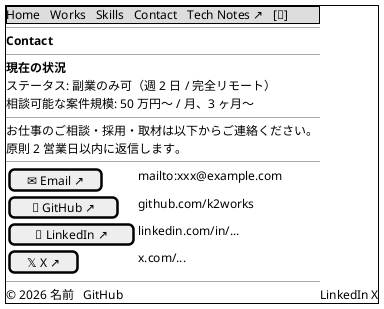

#### Contact 構成原則

| 要素 | 仕様 |
|---|---|
| 稼働可否（`availability`） | 「正社員転職検討中」「副業のみ」「案件は満員」等のステータスを冒頭に明示 |
| 希望条件 | 稼働日数・勤務形態・案件規模（任意） |
| 返信目標 | 「原則 2 営業日以内」を明示 |
| 各リンクのタッチターゲット | 44×44 px 以上、間隔 8px 以上（WCAG 2.5.5） |

### S90: 404

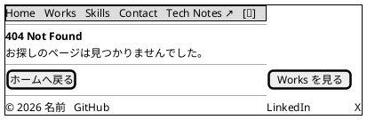

## インタラクション設計

### 共通インタラクション

| 操作 | 挙動 |
|---|---|
| ナビゲーションクリック | 同一タブで遷移、現在地はナビでハイライト（`aria-current="page"`） |
| 外部リンククリック | 別タブで開く（`target="_blank" rel="noopener noreferrer"`） |
| ダークモード切替 | クリックで即時反映、`localStorage.theme` に保存、初回は `prefers-color-scheme` を尊重 |
| キーボード Tab | フォーカス可視化（`focus-visible` リング）、論理的なタブ順序 |
| スクロール | スムーズスクロール、ヘッダーは sticky で常時表示 |

### 主要シナリオ

#### シナリオ A: 採用担当者が成果物を確認する

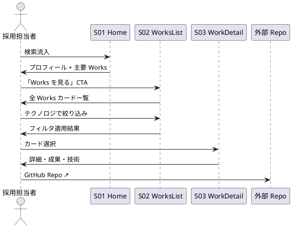

#### シナリオ B: 連絡を取る

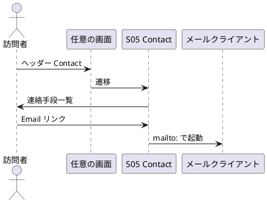

### フィードバック・エラー処理

| 状況 | UI フィードバック |
|---|---|
| ページ遷移中 | View Transitions API による軽量アニメーション（対応ブラウザのみ）。**未対応時は即時遷移、視覚的不連続なし**（退化的） |
| 画像読み込み中 | `loading="lazy"` + skeleton 風の背景色プレースホルダ |
| 画像読み込み失敗 | 代替テキスト + フォールバック背景色 |
| 存在しない URL | 404 画面（S90）へ、ホーム / Works への動線提示 |
| Heroku Eco Dyno コールドスタート（staging のみ） | Cloudflare 前段（[ADR-0004](../adr/0004-cloudflare-front-cdn.md)）の HTML 5 分キャッシュで吸収、最悪時は skeleton 表示を初回ロード時のみ |
| ダークモード未対応ブラウザ | デフォルトのライトモードで配信、機能は退化的に削除 |
| JavaScript 無効環境 | Astro Zero JS 出力により基本動作は維持、ダークモード切替のみ無効化（[テスト戦略 M08](./test_strategy.md) で検証） |

## OGP / SNS シェア指針

[US-12](../requirements/user_story.md#us-12-sns-シェアで-ogp-プレビューが正しく表示される) 対応。`@astrojs/og` で動的生成。

| ページ | OGP 画像の構成 | `og:title` |
|---|---|---|
| ホーム | 名前 + 役職 + 得意領域タグ + 顔アイコン | サイト名（氏名） |
| Works 一覧 | 「Works」+ 主要技術タグ | 「Works | 氏名」 |
| Works 詳細 | Work タイトル + tech tags + 期間 | Work タイトル |
| Skills | 「Skills」+ カテゴリ一覧 | 「Skills | 氏名」 |
| Contact | 「Contact」+ 連絡手段アイコン | 「Contact | 氏名」 |
| 404 | 「404 Not Found」+ サイト名 | 「ページが見つかりません」 |

| 仕様 | 値 |
|---|---|
| 画像サイズ | 1200×630 px |
| 形式 | PNG（`@astrojs/og` 既定）または JPEG |
| Twitter Card | `summary_large_image` |
| 配信 | `apps/web/dist/og/{slug}.png` |
| 検証 | E10 + 実体ダウンロード可否（200）と寸法（1200×630）まで E2E で確認 |

## アクセシビリティ要件

| 項目 | 方針 |
|---|---|
| WCAG | 2.1 AA 準拠を目標 |
| ランドマーク | `header / nav / main / footer` を配置、`aria-label` で識別 |
| 見出し | `h1` は各画面 1 個、階層を飛ばさない |
| カラーコントラスト | 本文 4.5:1、大きい文字 3:1 |
| リンク文言 | 「こちら」のような曖昧な表現を禁止、リンク先が分かる文言 |
| 画像 `alt` | 装飾画像は `alt=""`、意味画像は内容を表現 |
| キーボード | 全機能をマウスなしで操作可能 |
| フォーカストラップ | モバイルメニュー展開時のみ |

## レスポンシブ設計

| ブレイクポイント | 対応 |
|---|---|
| < 640px (sm) | 1 カラム、ハンバーガーメニュー、Works カードは縦積み |
| 640〜1024px (md) | Works カード 2 列、ナビは横並び |
| > 1024px (lg) | Works カード 3 列、ホームのプロフィール 2 カラム |

### タッチターゲット仕様

| 要素 | 最小サイズ | 間隔 | 由来 |
|---|---|---|---|
| インタラクティブ要素全般 | 44×44 CSS px | 8px 以上 | WCAG 2.5.5 AAA / 2.5.8 AA |
| ハンバーガーアイコン | 48×48 CSS px | - | Apple HIG / Material Design |
| Works 一覧の「詳細」ボタン | 44×44 px、カード全体クリック可 | カード間 16px | 親指操作前提 |
| Contact のリンク行 | 行高 56 px | 行間 8px | スワイプ誤タップ抑制 |

### モバイルの縦長対策

ホーム画面はセクション数が多くスクロールが長くなりがちなため、以下を満たすこと：

- ファーストビュー内に「氏名 + 役職 + キャッチコピー + 得意領域タグ + 主要 CTA」を必ず収める
- セクション間に余白を取りすぎない（縦パディング 32px〜48px）
- 「Featured Works」「Skills Highlights」は最大 3 件まで、それ以上は各専用ページで提供

### Featured Works の選定方針

ホーム「Featured Works」に表示する Work の選定基準は [フロントエンドアーキテクチャ - Featured Work の選定基準](./architecture_frontend.md#featured-work-の選定基準) に記載する（多様性 / 公開可能性 / 完成度 / 直近性 / 見直しタイミングの 5 観点）。実装は Content Collection の `Work.featured: boolean` フィールドで表現する。

## 計測・改善指針

| 指標 | 想定計測手段 |
|---|---|
| ページビュー | 簡易な Plausible / Cloudflare Web Analytics（Cookie レス） |
| Contact CTA クリック率 | クリックイベントを集計（外部リンクのアウトバウンド計測） |
| Lighthouse スコア | CI で常時計測（[インフラ参照](./architecture_infrastructure.md)） |
| Core Web Vitals | 同上、Performance < 2.0s LCP を維持 |

## 関連ドキュメント

- [フロントエンドアーキテクチャ](./architecture_frontend.md)
- [バックエンドアーキテクチャ](./architecture_backend.md)
- [インフラストラクチャアーキテクチャ](./architecture_infrastructure.md)
- [UI 設計ガイド](../reference/UI設計ガイド.md)
