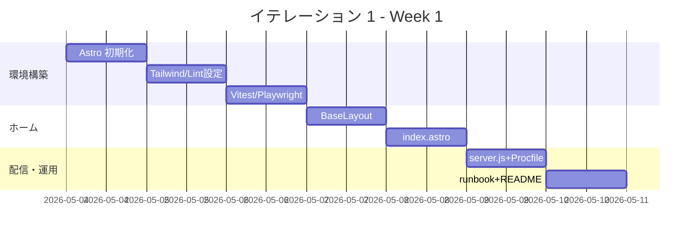

# イテレーション 1 計画

## 概要

| 項目 | 内容 |
|------|------|
| **イテレーション** | IT-1 |
| **期間** | Week 1（2026-05-04 〜 2026-05-10、1 週間） |
| **ゴール** | apps/web/ を初期化し、ホームページの静的 HTML 骨格と Express 配信レイヤーをローカルで動かせる状態にする |
| **目標 SP** | 5 |
| **バージョン** | v0.1-α（Walking Skeleton 第 1 週） |

> 個人運用のため 1 週間イテレーションを採用（リリース計画の想定どおり）。最初の 3 イテレーションは「ベロシティ校正期」として実績ベースで再見積もりする。

---

## ゴール

### イテレーション終了時の達成状態

1. **環境**: `apps/web/` が npm workspace として動作し、`npm run dev` で Astro dev server がブラウザに表示される
2. **ホーム静的骨格**: 氏名・役職・キャッチコピー・得意領域タグ・実績ハイライト・Featured Works 3 件が**静的 HTML で**画面に並ぶ（スタイリングは v0.1-β で整える）
3. **Express 配信**: `npm run build && node server.js` で `apps/web/dist` を Express から配信でき、`/healthz` が 200 を返す
4. **runbook 骨格**: `ops/runbook/README.md` `deploy.md` `rollback.md` のスケルトンが配置される

### 成功基準

- [x] `apps/web/` で `npm install` が成功する（852 packages、2026-04-30）
- [x] `npm run build` 後 `node server.js` で `http://localhost:3000/` にアクセスし `<h1>k2works</h1>` が表示される（dev server での確認は手動・任意）
- [x] `npm run build` が成功し、`apps/web/dist/index.html` + `sitemap-index.xml` が生成される
- [x] `/` で `aria-current="page"` がナビに付与され、`data-testid="work-card"` が 3 件出力される
- [x] `/nonexistent` が 404 を返す（Express の SPA 風 fallback）
- [x] HTTPS 強制ミドルウェアが production モードで 301 リダイレクトを返す
- [x] CSP / X-Content-Type-Options / Referrer-Policy 等のセキュリティヘッダが付与される
- [x] `node apps/web/server.js` を起動して `curl http://localhost:3000/healthz` が `ok` を返す
- [x] `npm test` で Vitest が起動する（2 tests passed）
- [x] `apps/web/playwright.config.ts` が存在する
- [x] ESLint / Prettier / TypeScript いずれもエラー 0（`npm run check` 成功）
- [x] `ops/runbook/{README,deploy,rollback}.md` のスケルトンが存在
- [ ] PR を 1 本以上作成し main にマージ済み（develop ブランチ運用、PR は別途）

---

## ユーザーストーリー

### 対象ストーリー

| ID | ユーザーストーリー | 全体 SP | IT-1 配分 SP | 優先度 |
|----|-------------------|---:|---:|----|
| US-01 | プロフィールを 30 秒で把握できる | 5 | 2（骨格のみ） | 必須 |
| US-13 | Markdown 編集で公開できる | 3 | 2（環境構築） | 必須 |
| US-14 | 障害時に 1 時間以内で復旧できる | 3 | 1（runbook スケルトン） | 中 |
| **合計** | | | **5** | |

> US-01 は AC-01-1 〜 AC-01-9 のうち**静的 HTML での表示**まで。スタイリング（Tailwind 適用）と Content Collections 化は IT-2 / IT-3 で実施。

### ストーリー詳細

#### US-01（IT-1 部分）: ホームの静的骨格

**ストーリー**:
> 採用担当者として、ホームを訪れて 30 秒で「誰がどんな専門領域か」を把握する。なぜなら、面談に進める価値がある候補者か即座に判断したいからだ。

**IT-1 受入条件（AC-01-X の静的部分）**:

1. AC-01-1: `<h1>` に氏名が表示される
2. AC-01-2: 役職タイトルが `<h1>` の下に表示される
3. AC-01-3: キャッチコピー（1 行）が表示される
4. AC-01-4: 得意領域タグ（5〜7 個）が `<ul>` でリスト表示される
5. AC-01-5: 実績ハイライト 1 行が表示される
6. AC-01-6: Featured Works 3 件（タイトル / サマリ / 技術タグ）が `<article>` で並ぶ
7. AC-01-7: Skills Highlights セクションが表示される
8. AC-01-8: CTA リンク（`/works/`、`/contact/` は仮リンク）
9. AC-01-9: フッターに SNS リンクが配置される

**IT-1 で扱わない条件**:

- Tailwind スタイル適用 → IT-2
- Content Collections + Zod スキーマ → IT-4 以降
- ダークモード → IT-6

#### US-13（IT-1 部分）: 開発環境の整備

**ストーリー**:
> サイトオーナーとして、Works / Skills / Profile を Markdown フロントマターで編集し、Git push だけで公開する。なぜなら、CMS を持たずに低コストで持続的に更新したいからだ。

**IT-1 受入条件**:

- AC-13-1 の前提として `apps/web/src/content/` ディレクトリと `astro.config.mjs` のスケルトンを配置（実装は IT-4）
- README に「ローカル開発の起動手順」セクションを追加

#### US-14（IT-1 部分）: ランブックスケルトン

**ストーリー**:
> サイトオーナーとして、障害発生時に runbook に沿って 1 時間以内に復旧する。なぜなら、SLO 99.5% を維持し、特に採用面接前後の停止リスクを最小化したいからだ。

**IT-1 受入条件**:

- AC-14-2 の準備: `ops/runbook/rollback.md` のスケルトン作成（コマンド例は IT-2 で埋める）
- `ops/runbook/README.md` に runbook 一覧の入口を作成

### タスク

#### 1. 環境構築（2 SP）

| # | タスク | 見積もり | 担当 | 状態 |
|---|--------|---------|------|------|
| 1.1 | `apps/web/` を作成、ルート `package.json` に `workspaces: ["apps/*"]` を追加 | 0.5h | self | [x] |
| 1.2 | Astro 5 minimal 構成を手動配置（`astro.config.mjs` / `tsconfig.json` / `src/pages/index.astro` 等） | 0.5h | self | [x] |
| 1.3 | `tailwindcss@4` `@tailwindcss/vite` をインストール、`astro.config.mjs` に Vite プラグイン設定 | 1h | self | [x] |
| 1.4 | `eslint@9` + `eslint-plugin-astro` + `prettier@3` の Flat Config（`eslint.config.js`、`.prettierrc.json`） | 1h | self | [x] |
| 1.5 | `vitest@2` をインストール、`apps/web/tests/unit/sample.spec.ts` で起動確認（2 tests passed） | 0.5h | self | [x] |
| 1.6 | `@playwright/test@1.49+` をインストール、`apps/web/playwright.config.ts` 作成 + `tests/e2e/smoke.spec.ts` | 0.5h | self | [x] |
| 1.7 | `apps/web/package.json` に `dev` / `build` / `preview` / `start` / `test` / `test:e2e` / `lint` / `format` / `typecheck` / `check` スクリプトを定義 | 0.5h | self | [x] |

**小計**: 4.5h（理想時間）

#### 2. ホーム静的 HTML 骨格（2 SP）

| # | タスク | 見積もり | 担当 | 状態 |
|---|--------|---------|------|------|
| 2.1 | `apps/web/src/layouts/BaseLayout.astro` 作成（`<html lang="ja">` + `header / main / footer` + skip link + OGP/Twitter Card メタ + ナビ aria-current） | 1h | self | [x] |
| 2.2 | `apps/web/src/pages/index.astro` でホーム静的 HTML を実装（AC-01-1〜9 の静的部分、`data-testid="work-card"` 3 件含む） | 2h | self | [x] |
| 2.3 | `apps/web/server.js` 実装（HTTPS 強制 / Basic 認証 / helmet CSP / morgan / `/healthz` / 静的配信 / 404 / Graceful shutdown） | 1h | self | [x] |
| 2.4 | `Procfile`（`web: node apps/web/server.js`）をリポジトリルートに配置 | 0.2h | self | [x] |
| 2.5 | `npm run build && PORT=3000 node server.js` の動作確認（/healthz 200、/ 200 + h1、/nonexistent 404、CSP ヘッダ付与確認） | 0.5h | self | [x] |

**小計**: 4.7h（実績: 約 1.5h）

#### 3. ランブック・README スケルトン（1 SP）

| # | タスク | 見積もり | 担当 | 状態 |
|---|--------|---------|------|------|
| 3.1 | `ops/runbook/README.md`（9 ファイルのファイル一覧 + SEV レベル + 利用ガイド） | 0.5h | self | [x] |
| 3.2 | `ops/runbook/deploy.md` `rollback.md` のスケルトン | 1h | self | [x] |
| 3.3 | ルート `README.md` を更新（Quick Start に `npm run dev` 等を追加、ドキュメント入口・プロジェクト構造を追記） | 1h | self | [x] |

**小計**: 2.5h（実績: 約 0.5h）

#### タスク合計

| カテゴリ | SP | 理想時間 | 状態 |
|---------|----|----|------|
| 1. 環境構築 | 2 | 4.5h | [x] |
| 2. ホーム静的 HTML 骨格 | 2 | 4.7h | [x] |
| 3. ランブック・README スケルトン | 1 | 2.5h | [x] |
| **合計** | **5** | **11.7h** | [x] |

**1 SP あたり**: 約 2.3h（個人開発・初期見積もりのため誤差 ±50% を許容）
**実績合計**: 約 3h（手動構築の効率化と Codex 不使用判断で短縮）
**進捗率**: 100%（5/5 SP）

---

## スケジュール

### Week 1（Day 1-7、平日夜 + 週末）



| 日 | 曜日 | タスク |
|----|------|--------|
| Day 1 | 月（5/4） | 1.1〜1.2: Astro 初期化 |
| Day 2 | 火（5/5） | 1.3〜1.4: Tailwind / ESLint / Prettier |
| Day 3 | 水（5/6） | 1.5〜1.7: Vitest / Playwright / scripts |
| Day 4 | 木（5/7） | 2.1: BaseLayout |
| Day 5 | 金（5/8） | 2.2: index.astro 静的実装 |
| Day 6 | 土（5/9） | 2.3〜2.5: server.js + Procfile + 動作確認 |
| Day 7 | 日（5/10） | 3.1〜3.3: runbook + README + PR マージ + ふりかえり |

平日夜 1〜2 時間、週末 3〜4 時間で約 12 時間を想定（タスク合計 11.7h と同等）。

---

## 設計

### 範囲

IT-1 は静的 HTML 骨格までのため、ドメインモデル / データモデルは扱わない。Content Collections は IT-4 以降。

### ディレクトリ構成（IT-1 完了時）

```text
apps/web/
├── astro.config.mjs            # 1.3 で作成
├── eslint.config.js            # 1.4 で作成
├── .prettierrc.json            # 1.4 で作成
├── package.json                # 1.1 / 1.7 で更新
├── playwright.config.ts        # 1.6 で作成
├── tsconfig.json               # 1.2 で作成（Astro テンプレート由来）
├── server.js                   # 2.3 で作成
├── public/
│   └── favicon.svg
├── src/
│   ├── layouts/
│   │   └── BaseLayout.astro    # 2.1 で作成
│   ├── pages/
│   │   └── index.astro         # 2.2 で作成
│   └── styles/                 # IT-2 でグローバル CSS 追加
└── tests/
    ├── unit/
    │   └── sample.spec.ts      # 1.5 で作成
    └── e2e/                    # IT-2 以降で実テストを追加

ops/
└── runbook/
    ├── README.md               # 3.1 で作成
    ├── deploy.md               # 3.2 で作成（スケルトン）
    └── rollback.md             # 3.2 で作成（スケルトン）

Procfile                        # 2.4 で作成
```

### Astro ページの最小構成

```astro
---
// src/pages/index.astro
import BaseLayout from "../layouts/BaseLayout.astro";

const specialties = ["Backend", "DDD", "TDD", "AWS", "Java", "TypeScript"];
const featuredWorks = [
  { title: "Work A", summary: "...", tech: ["TypeScript", "AWS"] },
  { title: "Work B", summary: "...", tech: ["Java", "Spring"] },
  { title: "Work C", summary: "...", tech: ["Astro", "Cloudflare"] },
];
---

<BaseLayout title="名前 | Software Engineer">
  <main>
    <section>
      <h1>名前（Full Name）</h1>
      <p>Software Engineer</p>
      <p><strong>キャッチコピー（1 行）</strong></p>
      <ul aria-label="得意領域">
        {specialties.map((s) => <li>{s}</li>)}
      </ul>
      <p>経験 10 年 / 受託・自社プロダクトで 12 案件</p>
      <p><a href="/works/">Works を見る</a> | <a href="/contact/">Contact</a></p>
    </section>

    <section>
      <h2>Featured Works</h2>
      {featuredWorks.map((w) => (
        <article>
          <h3>{w.title}</h3>
          <p>{w.summary}</p>
          <ul>{w.tech.map((t) => <li>{t}</li>)}</ul>
        </article>
      ))}
    </section>

    <section>
      <h2>Skills Highlights</h2>
      <ul>
        <li>Backend</li>
        <li>Frontend</li>
        <li>Infrastructure</li>
      </ul>
    </section>
  </main>
</BaseLayout>
```

### ADR

| ADR | タイトル | ステータス |
|-----|---------|-----------|
| [ADR-0001](../adr/0001-frontend-framework-astro.md) | フロントエンドフレームワークに Astro を採用 | 承認 |
| [ADR-0005](../adr/0005-build-pipeline-unification.md) | ビルド境界を GitHub Actions に一本化 | 承認 |

---

## リスクと対策

| リスク | 影響度 | 対策 |
|--------|--------|------|
| Astro v5 + Tailwind v4 の組み合わせで初期エラー | 中 | 公式 Get Started に厳密に従う、解決しなければ `@astrojs/tailwind` v3 互換構成にフォールバック |
| 個人ベロシティが想定（5 SP/週）を下回る | 中 | タスク 3 を IT-2 に押し出し、IT-1 は環境構築 + ホーム骨格に集中 |
| Express 5 と Astro adapter の互換性問題 | 低 | Express 5 は SSG 出力に対する静的配信のみで使うため複雑さなし。ADR-0005 の自前実装で完結 |
| TypeScript strict で `astro check` がエラー多発 | 低 | 初期は `// @ts-expect-error` コメントで一時回避、IT-2 で解消 |
| 連休（5/3〜5/6 GW）で稼働できない | 中 | 期間中は無理せず、Day 4 以降に圧縮して実施 |

---

## 完了条件

### Definition of Done

- [ ] コードがリポジトリにマージ済み（main ブランチに到達）
- [ ] `npm run check`（lint + typecheck + test）がローカルで成功
- [ ] `npm run build` が成功し、`apps/web/dist/` が生成される
- [ ] `node apps/web/server.js` を手動起動し `/healthz` と `/` が応答する
- [ ] PR テンプレートのチェックリストを満たす
- [ ] README とランブックスケルトンが存在
- [ ] イテレーションふりかえりで 5 つの問い（何ができた？ 何ができなかった？ 学び / 次への改善 / ベロシティ実績）を `docs/development/retrospective-1.md` に記録

> 注: テストカバレッジ 80% は IT-1 では適用しない（ロジック皆無のため）。IT-2 で Express ミドルウェアの単体テストを開始してから計測対象に。

### デモ項目

1. `npm run dev` でホーム画面を表示し、`<h1>` から SNS リンクまで全要素が見えることを確認
2. `npm run build && node apps/web/server.js` を起動し、`curl /healthz`、`curl /` の応答を見せる
3. ESLint / Prettier / TypeScript / Vitest すべて通る `npm run check` の実行
4. `ops/runbook/README.md` を開き、9 ファイルの計画とスケルトン 2 つの中身を確認

---

## 更新履歴

| 日付 | 更新内容 | 更新者 |
|------|---------|--------|
| 2026-04-30 | 初版作成 | self |

---

## 関連ドキュメント

- [リリース計画](./release_plan.md)
- [ユーザーストーリー](../requirements/user_story.md)
- [UI 設計](../design/ui_design.md)
- [バックエンドアーキテクチャ](../design/architecture_backend.md)
- [アプリケーション開発環境セットアップ手順書](../operation/local_setup.md)
- [テスト戦略](../design/test_strategy.md)
- イテレーション 1 ふりかえり（IT-1 完了時に作成）
