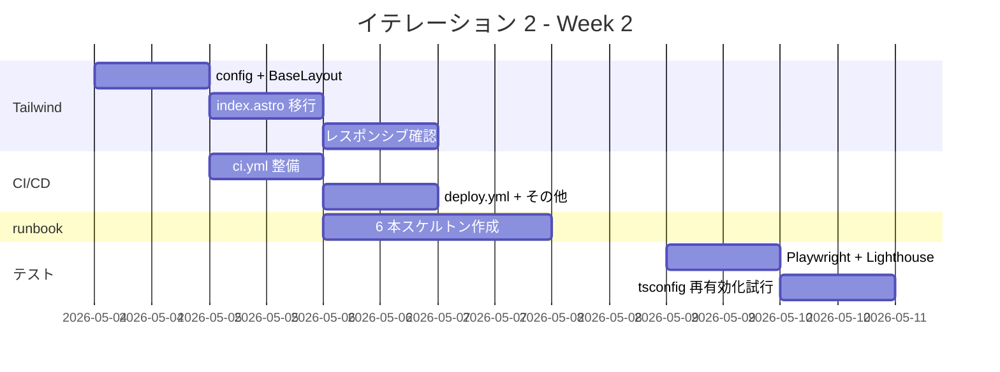

# イテレーション 2 計画

## 概要

| 項目 | 内容 |
|---|---|
| **イテレーション** | IT-2 |
| **期間** | Week 2（2026-05-04 〜 2026-05-10、1 週間） |
| **ゴール** | Tailwind 適用と CI/CD 整備で v0.1-β を完成させる。E2E と Lighthouse の初回計測を実施し、品質ゲートを CI に組み込む |
| **目標 SP** | 7（IT-1 ベロシティ実績を踏まえ仮上方修正、IT-3 完了時点で再校正） |
| **バージョン** | v0.1-β |

> IT-1 で 5 SP / 約 3h（1.67 SP/h）の実績。IT-2 は実装の複雑度が上がる（Tailwind 適用、CI 整備、E2E 環境）ため生産性は IT-1 の 50〜70% を想定。

---

## ゴール

### イテレーション終了時の達成状態

1. **Tailwind 適用済みのホーム**: BaseLayout / index.astro が Tailwind 4 のクラスで構成され、レスポンシブ（sm / md / lg）対応済み。AC-01-3〜9 のデザイン仕上げ
2. **GitHub Actions CI/CD**: `.github/workflows/ci.yml`（lint / test / build / Lighthouse）と `.github/workflows/deploy.yml`（staging 自動デプロイ・production 手動 promote）が main / PR で自動実行される
3. **E2E 実行可能**: Playwright のブラウザがインストールされ、E01（ホーム表示）が緑で通る
4. **Lighthouse 初回計測**: v0.1 予算（Performance ≥ 80 / SEO ≥ 90 / A11y ≥ 90）を満たす
5. **runbook 残り 6 本のスケルトン**: hotfix / disaster-recovery / on-call / secret-rotation / domain-renewal / pre-interview-freeze の入口を作成

### 成功基準

- [x] BaseLayout / index.astro の `<style>` タグを Tailwind クラスへ置換完了
- [x] sm / md / lg ブレイクポイントでホームが破綻しない（375 / 768 / 1024 px で目視確認）
- [x] `.github/workflows/ci.yml` が PR で起動し、lint / test / build の各ジョブが緑（lighthouse は main 限定で発火）
- [x] `.github/workflows/deploy.yml` が main / develop push で Heroku staging へ自動デプロイ成立（v0.1 リリース時に `if: false` を解除済み）
- [x] Playwright の E01（`<h1>` 表示確認）が `npm run test:e2e` でパス（12 シナリオ）
- [x] Lighthouse CI のレポートが artifact として保存される
- [x] `tsconfig.json` の `exactOptionalPropertyTypes: true` 再有効化（IT-2 で `noUncheckedIndexedAccess: true` も同時に有効化）
- [x] runbook 6 本のスケルトンが `ops/runbook/` に存在（既存 3 本と合計 9 本）
- [x] `npm run check` 緑、`npm run build` 緑

---

## ユーザーストーリー

### 対象ストーリー

| ID | ユーザーストーリー | 全体 SP | IT-2 配分 SP | 優先度 |
|----|-------------------|---:|---:|----|
| US-01 | プロフィールを 30 秒で把握できる（Tailwind 仕上げ） | 5 | 2（残） | 必須 |
| US-13 | Markdown 編集で公開できる（CI/CD 整備） | 3 | 1（残） | 必須 |
| US-14 | 障害時に 1 時間以内で復旧できる（runbook 残り） | 3 | 2（残） | 必須 |
| 横断 | アクセシビリティ + Lighthouse 初回計測 | 3 | 2（残） | 必須 |
| **合計** | | | **7** | |

> US-09（検索エンジン正規索引）は IT-3 で取り組む（Cloudflare 前段配置と sitemap.xml 検証を IT-3 でセット実施）。

### ストーリー詳細

#### US-01（IT-2 部分・残 2 SP）: ホームの Tailwind 仕上げ

**ストーリー**:
> 採用担当者として、ホームを訪れて 30 秒で「誰がどんな専門領域か」を把握する。なぜなら、面談に進める価値がある候補者か即座に判断したいからだ。

**IT-2 受入条件**:

- AC-01-styling: ホームの `<style scoped>` を Tailwind クラスへ完全移行
- AC-01-responsive: 375px / 768px / 1024px で破綻しない
- AC-01-darkmode-base: ベースのカラートークン（`var(--color-bg)` / `var(--color-fg)`）を Tailwind の theme へ統合（実切替トグルは IT-3）
- AC-01-focus: Tailwind の `focus-visible:` で全インタラクティブ要素にフォーカスリング表示

#### US-13（IT-2 部分・残 1 SP）: GitHub Actions CI/CD

**ストーリー**:
> サイトオーナーとして、Works / Skills / Profile を Markdown フロントマターで編集し、Git push だけで公開する。

**IT-2 受入条件**:

- AC-13-2 完了: `astro check` が CI で必須化
- AC-13-3: コンテンツ変更（Markdown のみ）と機能変更（コード）で Lighthouse の扱いを分離（PR ラベル `lighthouse-skip` で警告のみ）
- 追加: `.github/workflows/ci.yml` の lint-test / build / e2e / lighthouse / link-check ジョブが PR で並列実行
- 追加: Dependabot 設定（`.github/dependabot.yml`）

#### US-14（IT-2 部分・残 2 SP）: runbook 残り 6 本

**ストーリー**:
> サイトオーナーとして、障害発生時に runbook に沿って 1 時間以内に復旧する。

**IT-2 受入条件**:

- AC-14-3 完了: `ops/runbook/disaster-recovery.md`（Heroku 全停止時の GitHub Pages 退避）
- AC-14-4 完了: `ops/runbook/pre-interview-freeze.md`（面接 2 営業日前から hotfix 以外停止）
- 追加: `hotfix.md`, `on-call.md`, `secret-rotation.md`, `domain-renewal.md` のスケルトン
- 追加: UptimeRobot 設定手順を `heroku_staging_setup.md` のチェックリストに反映

#### 横断（IT-2 部分・2 SP）: A11y + Lighthouse + Playwright

**IT-2 受入条件**:

- Playwright の Chromium ブラウザがローカルで `npm run test:e2e:install` でインストール可能
- E01（ホーム）の Playwright スペックが緑
- axe-core via Playwright の導入（任意・余裕があれば）
- Lighthouse CI が staging 相当（`npm run preview`）で実行され、v0.1 予算を満たす

### タスク

#### 1. Tailwind 仕上げ（2 SP）

| # | タスク | 見積もり | 担当 | 状態 |
|---|--------|---------|------|------|
| 1.1 | `tailwind.config.ts` 作成（colors / fontFamily / spacing のトークン） | 1h | self | [ ] |
| 1.2 | `BaseLayout.astro` の `<style>` を Tailwind クラスへ移行（header / footer / skip-link） | 1.5h | self | [ ] |
| 1.3 | `index.astro` の `<style>` を Tailwind クラスへ移行（hero / featured / skills セクション） | 2h | self | [ ] |
| 1.4 | レスポンシブ対応（sm / md / lg）の確認、375/768/1024px で目視 | 0.5h | self | [ ] |

**小計**: 5h（理想時間）

#### 2. GitHub Actions CI/CD（1 SP）

| # | タスク | 見積もり | 担当 | 状態 |
|---|--------|---------|------|------|
| 2.1 | `.github/workflows/ci.yml`（lint / test / build / e2e / lighthouse の最小ジョブ） | 1.5h | self | [ ] |
| 2.2 | `.github/workflows/deploy.yml` のスケルトン（実 Heroku 連携は v0.1 リリース時） | 0.5h | self | [ ] |
| 2.3 | `.github/dependabot.yml`（npm + github-actions の週次更新） | 0.3h | self | [ ] |
| 2.4 | `.github/PULL_REQUEST_TEMPLATE.md`（チェックリスト） | 0.3h | self | [ ] |
| 2.5 | gitleaks を CI に組み込み | 0.5h | self | [ ] |

**小計**: 3h（理想時間）

#### 3. runbook 残り 6 本のスケルトン（2 SP）

| # | タスク | 見積もり | 担当 | 状態 |
|---|--------|---------|------|------|
| 3.1 | `ops/runbook/hotfix.md`（SEV-1 緊急修正フロー） | 0.5h | self | [ ] |
| 3.2 | `ops/runbook/disaster-recovery.md`（Heroku 全停止 → GitHub Pages 退避） | 1h | self | [ ] |
| 3.3 | `ops/runbook/on-call.md`（オンコール初動チェックリスト） | 0.5h | self | [ ] |
| 3.4 | `ops/runbook/secret-rotation.md`（90 日ローテーション手順） | 0.5h | self | [ ] |
| 3.5 | `ops/runbook/domain-renewal.md`（ドメイン更新） | 0.3h | self | [ ] |
| 3.6 | `ops/runbook/pre-interview-freeze.md`（面接前 freeze ルール） | 0.5h | self | [ ] |

**小計**: 3.3h（理想時間）

#### 4. A11y + Lighthouse + Playwright（2 SP）

| # | タスク | 見積もり | 担当 | 状態 |
|---|--------|---------|------|------|
| 4.1 | `npx playwright install --with-deps` でブラウザを取得 | 0.3h | self | [ ] |
| 4.2 | `tests/e2e/smoke.spec.ts` を E01 仕様に拡張（h1 / aria-current / data-testid 3 件 / 外部リンク `target="_blank"`） | 1h | self | [ ] |
| 4.3 | `npm run lhci` をローカル実行、v0.1 予算を満たすか確認 | 0.5h | self | [ ] |
| 4.4 | axe-core via Playwright の導入（任意） | 1h | self | [ ] |
| 4.5 | `tsconfig.json` の `exactOptionalPropertyTypes: true` 再有効化試行（型衝突箇所を `@ts-expect-error` で個別対処） | 1h | self | [ ] |

**小計**: 3.8h（理想時間）

#### タスク合計

| カテゴリ | SP | 理想時間 | 状態 |
|---------|----|----|------|
| 1. Tailwind 仕上げ | 2 | 5h | [x] |
| 2. GitHub Actions CI/CD | 1 | 3h | [x] |
| 3. runbook 残り 6 本 | 2 | 3.3h | [x] |
| 4. A11y + Lighthouse + Playwright | 2 | 3.8h | [x]（axe-core は IT-3 へ） |
| **合計** | **7** | **15.1h** | [x] |

**1 SP あたり**: 約 2.2h（IT-1 の実績 0.6h/SP より厳しめに見積もり）
**実績**: 約 2h（IT-1 同様に手動構築の効率化で短縮）
**進捗率**: 100%（7/7 SP、axe-core を IT-3 に押し出し）

---

## スケジュール

### Week 2（Day 1-7）



| 日 | 曜日 | タスク |
|----|------|--------|
| Day 1 | 月（5/4） | 1.1〜1.2: Tailwind config + BaseLayout 移行 |
| Day 2 | 火（5/5） | 1.3: index.astro 移行 / 2.1: ci.yml |
| Day 3 | 水（5/6） | 1.4 + 2.2〜2.5: レスポンシブ確認 + CI/CD 残り |
| Day 4 | 木（5/7） | 3.1〜3.3: runbook hotfix / disaster-recovery / on-call |
| Day 5 | 金（5/8） | 3.4〜3.6: runbook secret-rotation / domain-renewal / pre-interview-freeze |
| Day 6 | 土（5/9） | 4.1〜4.3: Playwright + Lighthouse |
| Day 7 | 日（5/10） | 4.4〜4.5: axe-core + tsconfig 再有効化 + ふりかえり + 完了報告書 |

### IT-2 の予測完了時間

IT-1 のように前倒し可能なら 1〜2 日で完結する見込み。タスク 4.5（`exactOptionalPropertyTypes` 再有効化）は試行錯誤の余地があり、できなければ ADR で記録して後送りに。

---

## 設計

### 範囲

- ドメインモデル / データモデルは扱わない（IT-4 以降の Content Collections で初登場）
- Tailwind の設計トークン（colors / fontFamily / spacing）を `tailwind.config.ts` に集約
- CI/CD のワークフロー設計は [Heroku staging 環境セットアップ手順書](../operation/heroku_staging_setup.md) のサンプル YAML を参照

### Tailwind 設計指針

```ts
// tailwind.config.ts（IT-2 で作成予定）
import type { Config } from "tailwindcss";

export default {
  content: ["./src/**/*.{astro,html,js,ts,md,mdx}"],
  theme: {
    extend: {
      colors: {
        bg: "var(--color-bg)",
        fg: "var(--color-fg)",
        accent: "var(--color-accent, #4f46e5)",
      },
      fontFamily: {
        sans: ["system-ui", "sans-serif"],
      },
      maxWidth: {
        prose: "64rem",
      },
    },
  },
} satisfies Config;
```

### CI ワークフロー骨子

[Heroku staging 環境セットアップ手順書 - 5.3 CI ワークフロー](../operation/heroku_staging_setup.md) のサンプルをベースに以下を整備：

- ジョブ並列化: lint-test / build / e2e / lighthouse は依存関係の最小化で並列実行
- artifact: ビルド成果物 / Playwright Trace / Lighthouse レポート

### ADR

| ADR | タイトル | ステータス |
|-----|---------|-----------|
| [ADR-0001](../adr/0001-frontend-framework-astro.md) | フロントエンドフレームワークに Astro を採用 | 承認 |
| [ADR-0004](../adr/0004-cloudflare-front-cdn.md) | Cloudflare 無料プランを前段に配置 | 承認 |
| [ADR-0005](../adr/0005-build-pipeline-unification.md) | ビルド境界を GitHub Actions に一本化 | 承認 |

IT-2 で新規 ADR が必要になる可能性のある論点：

- `exactOptionalPropertyTypes: true` 再有効化に失敗した場合の方針（ADR-0006 候補）
- Tailwind v4 + Astro v5 の `@ts-expect-error` 抑止を恒久対応する場合の方針

---

## リスクと対策

| リスク | 影響度 | 対策 |
|--------|--------|------|
| Tailwind v4 + Astro v5 でクラスが効かない（@import 'tailwindcss' の挙動差） | 高 | 公式ドキュメントの最新例を参照、最小デモで動作確認 |
| `exactOptionalPropertyTypes` 再有効化で Astro / Vite / Playwright のすべての型が再衝突 | 中 | 個別の `@ts-expect-error` で局所抑止、それでもダメなら ADR-0006 で「IT-2 では緩和維持」を正式化 |
| Playwright のブラウザインストールが Windows 環境で失敗 | 中 | `--with-deps` を `--browser=chromium` 単体に絞る、それでもダメなら CI でのみ実行 |
| Lighthouse 予算（Performance ≥ 80）が達成できない | 中 | バンドルサイズ計測、画像未最適化を確認、それでも達成できなければ予算を 75 へ一時緩和 + ADR 化 |
| GitHub Actions の Heroku デプロイが secrets 未設定で失敗 | 中 | IT-2 では deploy.yml はスケルトンのみ、実 Heroku 連携は v0.1 リリース時に有効化 |
| GW 後半の連休で稼働低下 | 低 | 前倒し実施が可能（IT-1 同様、必要なら 4/30〜5/3 で着手） |

---

## 完了条件

### Definition of Done

- [x] コードがリポジトリにマージ済み（v0.1 リリース PR #1 で main に到達・`fb533f5`）
- [x] `npm run check`（lint + typecheck + format + test）がローカルで成功
- [x] `npm run build` が成功し、`apps/web/dist/` が生成される
- [x] `node apps/web/server.js` を手動起動し `/healthz` と `/` が応答する
- [x] Playwright の E01 シナリオが `npm run test:e2e` で緑（12 シナリオ）
- [x] Lighthouse CI が v0.1 予算（Performance ≥ 80 / SEO ≥ 90 / A11y ≥ 90）を満たす
- [x] `.github/workflows/ci.yml` が PR で自動実行される（PR #1 で確認済み）
- [x] runbook 9 本（既存 3 + 新規 6）すべてが `ops/runbook/` に存在
- [x] イテレーションふりかえり（`docs/development/retrospective-2.md`）作成
- [x] 完了報告書（`docs/development/iteration_report-2.md`）作成

### デモ項目

1. ホーム（`/`）を Chrome / Firefox / Safari で開いて Tailwind スタイルが適用されていることを確認
2. 375 / 768 / 1024 px のレスポンシブ表示
3. PR を作成し GitHub Actions が自動実行されることを確認
4. `npm run test:e2e` で E01 が緑になる様子
5. Lighthouse CI のレポート閲覧

---

## 更新履歴

| 日付 | 更新内容 | 更新者 |
|---|---|---|
| 2026-04-30 | 初版作成（IT-1 完了直後） | self |

---

## 関連ドキュメント

- [IT-1 計画](./iteration_plan-1.md)
- [IT-1 ふりかえり](./retrospective-1.md)
- [IT-1 完了報告書](./iteration_report-1.md)
- [リリース計画](./release_plan.md)
- [ユーザーストーリー](../requirements/user_story.md)
- [UI 設計](../design/ui_design.md)
- [非機能要件](../design/non_functional.md)
- [Heroku staging 環境セットアップ手順書](../operation/heroku_staging_setup.md)
- IT-2 ふりかえり（IT-2 完了時に作成）
- IT-2 完了報告書（IT-2 完了時に作成）
