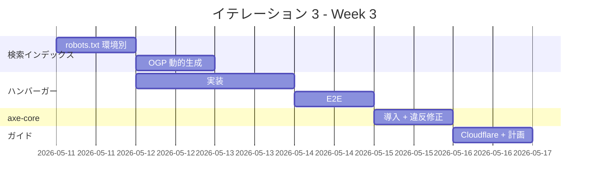

# イテレーション 3 計画

## 概要

| 項目 | 内容 |
|---|---|
| **イテレーション** | IT-3 |
| **期間** | Week 3（2026-05-11 〜 2026-05-17、1 週間想定） |
| **ゴール** | v0.1 のリリース準備を完了する。検索インデックス対応、ハンバーガーメニュー、axe-core 統合、Cloudflare 実機セットアップガイドの整備 |
| **目標 SP** | 4（v0.1 残） |
| **バージョン** | v0.1 RC（リリース候補） |

> IT-3 完了 = v0.1 リリース準備完了。続いて Heroku / Cloudflare の実機セットアップ → main マージ → リリース完了報告書（`creating-release-report` スキル）。

---

## ゴール

### イテレーション終了時の達成状態

1. **検索インデックス対応**: robots.txt が環境別に出力（development / staging で `Disallow: /`、production は許可）、各ページの OGP メタタグが動的に正しい URL を生成、`sitemap.xml` で全ページが索引対象
2. **モバイルナビ**: 768px 未満でハンバーガーメニューに切り替わり、開閉トグル + Esc 閉じる + body スクロール抑止 + フォーカストラップ
3. **axe-core via Playwright**: 主要ページ（`/` のみ v0.1 では）で violations 0 を E2E に組み込み
4. **Cloudflare 実機セットアップガイド**: `heroku_staging_setup.md` の Cloudflare セクションを実際の手順に詳細化、スクリーンショットなしでも追える内容に
5. **リリース計画再校正**: IT-1 + IT-2 の実績（2.4 SP/h）を反映し、v0.2 / v0.3 / v1.0 の到達日を更新

### 成功基準

- [ ] `robots.txt` が NODE_ENV / 環境変数で `Disallow: /` ↔ 通常の切替が動作
- [ ] OGP の `og:url` が production の絶対 URL（`portfolio.example.com`）で出力される
- [ ] `sitemap.xml` に全ページが含まれる（IT-3 時点ではホーム 1 件 + 将来の Works/Skills/Contact プレースホルダ）
- [ ] 768px 未満でハンバーガーメニューが表示・展開・閉じる
- [ ] ハンバーガーメニュー展開時に Esc キーで閉じる、フォーカスがトラップされる
- [ ] axe-core via Playwright が `/` で violations 0
- [ ] `heroku_staging_setup.md` の「Cloudflare の前段配置」セクションが手順 → 確認コマンド → トラブルシュート構成
- [ ] リリース計画の到達日テーブルが IT-1 + IT-2 実績で再校正
- [ ] `npm run check` 緑、`npm run build` 緑、`npm run test:e2e` 緑

---

## ユーザーストーリー

### 対象ストーリー

| ID | ユーザーストーリー | 全体 SP | IT-3 配分 SP | 優先度 |
|----|-------------------|---:|---:|----|
| US-09 | 検索エンジンに正しく索引される | 2 | 2 | 必須 |
| US-01 | プロフィールを 30 秒で把握できる（ハンバーガー残） | 5 | 1 | 必須 |
| 横断 | アクセシビリティ axe-core | 3 | 1 | 中 |
| **合計** | | | **4** | |

### ストーリー詳細

#### US-09（IT-3・2 SP）: 検索インデックス対応

**ストーリー**:
> クローラ（および検索流入を期待するサイトオーナー）として、主要ページが検索エンジンに索引される。なぜなら、採用担当者が検索でこのサイトに到達できるからだ。

**IT-3 受入条件**:

- AC-09-1: `/sitemap.xml` が自動生成される（既に `@astrojs/sitemap` で対応済み・IT-2 で確認済み）
- AC-09-2: `/robots.txt` が production では索引許可、staging / development では `Disallow: /`
- AC-09-3: 各ページに `og:title` / `og:image` / `og:url` / `og:description` が設定される（IT-2 で実装済み・本タスクで `og:image` の動的生成を追加検討）
- AC-09-4: `/docs/*` には `<meta name="robots" content="noindex,nofollow">` が設定される（[ADR-0003](../adr/0003-mkdocs-coexistence-strategy.md) 整合・MkDocs ビルド側で対応）

#### US-01（IT-3・1 SP）: ハンバーガーメニュー実装

**ストーリー**:
> 採用担当者として、モバイルでも快適にプロフィールを閲覧する。

**IT-3 受入条件**:

- 768px 未満でナビが横並びでなくハンバーガーアイコンに切り替わる
- ハンバーガークリックでドロワーまたはオーバーレイメニューが開く
- 開いた状態で Esc キーを押すと閉じる、外側タップでも閉じる
- メニュー展開中は body スクロール抑止
- メニュー内最後の要素から Tab するとトリガーボタンへ循環（フォーカストラップ）
- スクリーンリーダー対応（`aria-expanded` / `aria-controls` / `role="dialog"` + `aria-label="メインメニュー"`）

#### 横断 A11y（IT-3・1 SP）: axe-core via Playwright

**ストーリー**:
> 多様な訪問者として、マウスを使わずに全コンテンツに到達する。

**IT-3 受入条件**:

- `@axe-core/playwright` パッケージを `apps/web/devDependencies` に追加
- `tests/e2e/smoke.spec.ts` または別の `tests/e2e/a11y.spec.ts` で `axe.run()` を実行
- ホーム（`/`）で violations が 0 件
- 違反が出た場合は HTML 修正（`color-contrast` / `landmark-unique` / `link-name` 等）

### タスク

#### 1. 検索インデックス対応（2 SP）

| # | タスク | 見積もり | 担当 | 状態 |
|---|--------|---------|------|------|
| 1.1 | `apps/web/public/robots.txt` を環境別に切り替え（`PUBLIC_ROBOTS_DISALLOW=true` の場合は `Disallow: /` を出力する build スクリプトまたは Astro エンドポイント） | 1h | self | [ ] |
| 1.2 | `og:image` の動的生成検討（`@astrojs/og` 試行 / 1 ページなので静的画像でも可） | 1h | self | [ ] |
| 1.3 | `sitemap.xml` 検証（複数ページ追加時に正しく更新されるかテスト） | 0.5h | self | [ ] |
| 1.4 | MkDocs 側で `<meta name="robots" content="noindex,nofollow">` を CI ビルド時に注入する手順を `heroku_staging_setup.md` に追記 | 0.5h | self | [ ] |

**小計**: 3h（理想時間）

#### 2. ハンバーガーメニュー（1 SP）

| # | タスク | 見積もり | 担当 | 状態 |
|---|--------|---------|------|------|
| 2.1 | `BaseLayout.astro` のヘッダーナビをハンバーガー対応（768px 未満でアイコン、クリックでオーバーレイ） | 1.5h | self | [ ] |
| 2.2 | Astro の `<script>` タグで開閉ロジック（`aria-expanded`、Esc キー、外側タップ、body スクロール抑止） | 1h | self | [ ] |
| 2.3 | フォーカストラップ実装（最初・最後のフォーカス要素間で循環） | 0.5h | self | [ ] |
| 2.4 | E2E 追加（`mobile.spec.ts` でビューポート 375x667、開閉動作） | 1h | self | [ ] |

**小計**: 4h（理想時間）

#### 3. axe-core via Playwright（1 SP）

| # | タスク | 見積もり | 担当 | 状態 |
|---|--------|---------|------|------|
| 3.1 | `@axe-core/playwright` をインストール | 0.2h | self | [ ] |
| 3.2 | `tests/e2e/a11y.spec.ts` 新規作成、ホームで `axe.run()` を実行 | 0.5h | self | [ ] |
| 3.3 | violations が出た場合の HTML 修正 | 1h | self | [ ] |
| 3.4 | CI（`.github/workflows/ci.yml`）の e2e ジョブで axe-core も実行されることを確認 | 0.3h | self | [ ] |

**小計**: 2h（理想時間）

#### 4. Cloudflare ガイド + リリース計画再校正（横断・SP 計上なし）

| # | タスク | 見積もり | 担当 | 状態 |
|---|--------|---------|------|------|
| 4.1 | `docs/operation/heroku_staging_setup.md` の「Cloudflare の前段配置」セクションを実機手順に詳細化 | 1h | self | [ ] |
| 4.2 | `docs/development/release_plan.md` の到達日を IT-1+IT-2 実績で再校正、楽観 / 標準 / 悲観の 3 シナリオを併記 | 1h | self | [ ] |

**小計**: 2h（理想時間）

#### タスク合計

| カテゴリ | SP | 理想時間 | 状態 |
|---------|----|----|------|
| 1. 検索インデックス対応 | 2 | 3h | [ ] |
| 2. ハンバーガーメニュー | 1 | 4h | [ ] |
| 3. axe-core via Playwright | 1 | 2h | [ ] |
| 4. ガイド整備 + 計画再校正（横断） | - | 2h | [ ] |
| **合計** | **4** | **11h** | |

**1 SP あたり**: 約 2.75h（IT-1 / IT-2 の実績 0.4h/SP より厳しめに見積もり、UI 実装が含まれるため）

**進捗率**: 0%（0/4 SP）

---

## スケジュール

### Week 3（Day 1-7）



| 日 | 曜日 | タスク |
|----|------|--------|
| Day 1 | 月（5/11） | 1.1〜1.2: robots.txt + OGP |
| Day 2 | 火（5/12） | 1.3〜1.4: sitemap 検証 + MkDocs noindex |
| Day 3 | 水（5/13） | 2.1〜2.2: ハンバーガー UI + 開閉ロジック |
| Day 4 | 木（5/14） | 2.3〜2.4: フォーカストラップ + E2E |
| Day 5 | 金（5/15） | 3.1〜3.4: axe-core 導入 + 違反修正 |
| Day 6 | 土（5/16） | 4.1: Cloudflare ガイド整備 |
| Day 7 | 日（5/17） | 4.2: リリース計画再校正 + ふりかえり + 完了報告書 |

IT-1 / IT-2 と同じく前倒し可能。

---

## 設計

### robots.txt の環境別出力

```ts
// apps/web/src/pages/robots.txt.ts（新規・候補）
import type { APIRoute } from "astro";

export const GET: APIRoute = ({ site }) => {
  const disallow = process.env.PUBLIC_ROBOTS_DISALLOW === "true";
  const body = disallow
    ? "User-agent: *\nDisallow: /\n"
    : `User-agent: *\nAllow: /\n\nSitemap: ${site}sitemap-index.xml\n`;
  return new Response(body, {
    headers: { "Content-Type": "text/plain" },
  });
};
```

### ハンバーガーメニュー設計

- 768px 未満：ヘッダー右端にハンバーガーアイコン（`<button aria-expanded="false" aria-controls="mobile-nav">`）
- クリックで `<dialog>` または `<div role="dialog" aria-modal="true">` を開く
- `Esc` で閉じる、`focus()` をトリガーボタンに戻す
- メニュー外クリックで閉じる（`<dialog>` の standard behavior or 自前）
- アニメーション: Tailwind の `transition-transform` / `transition-opacity`

### ADR

| ADR | タイトル | ステータス |
|-----|---------|-----------|
| [ADR-0003](../adr/0003-mkdocs-coexistence-strategy.md) | MkDocs を Tech Notes として共存 | 承認 |
| [ADR-0004](../adr/0004-cloudflare-front-cdn.md) | Cloudflare 無料プランを前段に配置 | 承認 |

IT-3 で新規 ADR が必要になる可能性のある論点：

- ハンバーガーメニューを `<dialog>` で実装するか自前で書くか
- OGP 画像を `@astrojs/og` で動的生成するか静的画像 1 枚にするか

---

## リスクと対策

| リスク | 影響度 | 対策 |
|--------|--------|------|
| `<dialog>` の挙動が古い Safari で不安定 | 中 | 対応ブラウザを「直近 2 メジャー」に絞る方針（[非機能要件](../design/non_functional.md)）に従い、自前 fallback を最小限に |
| axe-core の違反が大量に出てフィードバックループが長くなる | 中 | 違反が多い場合は `tags: ['wcag2a']` だけに絞り、AAA 系は IT-4 以降へ |
| `@astrojs/og` のパッケージサイズが大きい | 低 | OGP 画像が 1 種類なら静的画像でフォールバック |
| robots.txt の環境別出力が Astro endpoint だと SSG で固定化される | 中 | ビルド時環境変数 `PUBLIC_ROBOTS_DISALLOW` で 2 種類のビルドを使い分け（CI で staging / production を別ビルド） |

---

## 完了条件

### Definition of Done

- [ ] コードがリポジトリにマージ済み（`develop` ブランチに到達）
- [ ] `npm run check`（lint + typecheck + format + test）がローカルで成功
- [ ] `npm run build` が成功し、`apps/web/dist/` が生成される
- [ ] `npm run test:e2e` で全シナリオ緑（モバイルメニュー追加分含む）
- [ ] `axe-core` で violations 0
- [ ] Lighthouse CI が v0.1 予算（Performance ≥ 80 / SEO ≥ 90 / A11y ≥ 90）を満たす
- [ ] `robots.txt` の環境別動作確認
- [ ] ふりかえり（`docs/development/retrospective-3.md`）作成
- [ ] 完了報告書（`docs/development/iteration_report-3.md`）作成
- [ ] リリース計画再校正（`docs/development/release_plan.md` 更新）

### v0.1 リリース準備完了の条件（IT-3 後）

- [ ] Heroku アカウント作成 + Eco Dyno（staging） + Basic Dyno（production） 課金開始
- [ ] Heroku Pipeline 作成、Buildpack 設定（`heroku/nodejs` のみ）
- [ ] GitHub Actions の deploy ワークフロー有効化（`if: false` を本物の条件式に置換）
- [ ] ドメイン取得 + Cloudflare DNS 委譲
- [ ] Cloudflare の SSL 設定（Full strict）+ Heroku ACM 有効化
- [ ] UptimeRobot で `/healthz` 監視登録
- [ ] main へ PR + マージ + 初回プロモート
- [ ] リリース完了報告書（`creating-release-report` スキル）作成

---

## 更新履歴

| 日付 | 更新内容 | 更新者 |
|---|---|---|
| 2026-04-30 | 初版作成（IT-2 完了直後） | self |

---

## 関連ドキュメント

- [IT-2 計画](./iteration_plan-2.md)
- [IT-2 ふりかえり](./retrospective-2.md)
- [IT-2 完了報告書](./iteration_report-2.md)
- [リリース計画](./release_plan.md)
- [ユーザーストーリー](../requirements/user_story.md)
- [UI 設計](../design/ui_design.md)
- [非機能要件](../design/non_functional.md)
- [Heroku staging 環境セットアップ手順書](../operation/heroku_staging_setup.md)
- IT-3 ふりかえり（IT-3 完了時に作成）
- IT-3 完了報告書（IT-3 完了時に作成）
