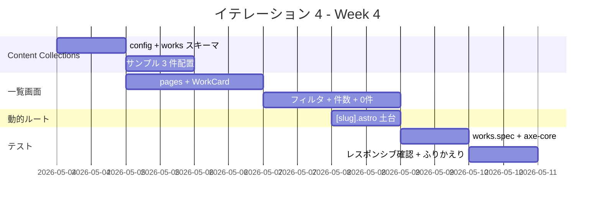

# イテレーション 4 計画

## 概要

| 項目 | 内容 |
|---|---|
| **イテレーション** | IT-4 |
| **期間** | Week 4（2026-05-04 〜 2026-05-10、1 週間想定） |
| **ゴール** | v0.2 のうち Works 一覧側を完成させる。Astro Content Collections + Zod スキーマ で works コレクションを構築し、`/works/` で技術タグフィルタ付きの一覧表示が動く状態にする |
| **目標 SP** | 7（標準シナリオ 5 SP/週より上方、設計先行ボーナスが薄まり実装重視のため計画を厚めにする） |
| **バージョン** | v0.2-α |

> v0.1 リリース完了（2026-04-30）後の最初のイテレーション。v0.1 の高生産性は「設計が先行完了」「個人開発の意思決定速度」に起因していた。IT-4 以降は新規実装比率が上がるため、v0.1 ほどの工期短縮は再現しない想定で、計画 SP を実装ボリュームに合わせる。

---

## ゴール

### イテレーション終了時の達成状態

1. **Content Collections + Zod スキーマ**: `src/content/works/` 配下の Markdown ファイルから Works を読み込み、ビルド時にスキーマ検証が走る
2. **/works/ 一覧画面**: カード形式で全 Works が一覧表示される（タイトル / 期間 / サマリ / 技術タグ / 詳細ボタン）
3. **技術タグフィルタ**: 単一選択でタグ絞り込みが動作し、URL `?tag=...` で共有可能、「All」で解除
4. **動的ルーティングの土台**: `/works/[slug]/` が `getStaticPaths` で生成される（中身は IT-5 で完成、IT-4 では 404 を返さないことを確認）
5. **E2E + axe-core**: 一覧表示・フィルタ操作・件数表示・0 件状態の Playwright + axe-core で violations 0

### 成功基準

- [ ] `apps/web/src/content/config.ts` に works コレクションのスキーマ（Zod）が定義されている
- [ ] `apps/web/src/content/works/` に v0.2 リリース時の 5 件分のうち少なくとも 3 件のサンプル Works（Markdown）が配置されている
- [ ] `npm run build` でスキーマ検証が走り、未定義フィールドや型違いをビルド時に検出できる
- [ ] `/works/` でカード形式の一覧が表示される（AC-02-1 / AC-02-2）
- [ ] 技術タグフィルタが動作し、URL `?tag=...` で共有可能（AC-02-3 / AC-02-4）
- [ ] 0 件時に「該当する Work がありません + フィルタ解除」が表示される（AC-02-5）
- [ ] 件数表示「N 件中 M 件を表示」がフィルタ近傍にある（AC-02-6）
- [ ] Tab で各タグへ移動、Enter で適用、現在選択は `aria-pressed="true"`（AC-02-7）
- [ ] `/works/[slug]/` が `getStaticPaths` で全 Works 分生成される（中身は仮実装でよい）
- [ ] `tests/e2e/works.spec.ts` で一覧 / フィルタ / 件数 / 0 件 / Tab 移動が緑
- [ ] axe-core via Playwright で `/works/` の violations 0
- [ ] `npm run check` 緑、`npm run build` 緑、`npm run test:e2e` 緑

---

## ユーザーストーリー

### 対象ストーリー

| ID | ユーザーストーリー | 全体 SP | IT-4 配分 SP | 優先度 |
|----|-------------------|---:|---:|----|
| US-02 | Works 一覧で実績の傾向を把握できる | 5 | 5 | 必須 |
| US-13 | Markdown 編集で公開できる（Content Collections の本実装） | 3 | 2（残） | 必須 |
| **合計** | | | **7** | |

> US-13 は IT-1（環境構築）と IT-2（CI/CD）で 3 SP のうち 3 SP を消化したが、本来の「Markdown 編集 → 公開」の中核である Content Collections + Zod スキーマがまだ未実装。本 IT で残り 2 SP を消化する。
>
> US-03（Works 詳細）は IT-5 で取り組む。IT-4 では `/works/[slug]/` のページ自体は生成するが、本文の表示はプレースホルダで進める。

### ストーリー詳細

#### US-02（IT-4・5 SP）: Works 一覧

**ストーリー**:

> 採用担当者として、Works の一覧を見て、絞り込みながら実績の傾向を把握する。なぜなら、自社の課題に関連する経験があるか判断できるからだ。

**IT-4 受入条件**:

- AC-02-1: `/works/` で全 Works がカード形式で表示される
- AC-02-2: 各カードに「タイトル / 期間 / サマリ / 技術タグ / 詳細ボタン」が含まれる
- AC-02-3: 技術タグでフィルタできる（単一選択、URL に `?tag=...` を付与し共有可能）
- AC-02-4: 「All」で絞り込み解除
- AC-02-5: 0 件時は「該当する Work がありません + フィルタ解除」を表示
- AC-02-6: 件数表示（「N 件中 M 件を表示」）がフィルタ近傍にある
- AC-02-7: Tab で各タグへ移動、Enter で適用、現在選択は `aria-pressed="true"`
- AC-02-8: 不明タグでアクセスされた場合は「All」状態で全件表示 + URL を `/works/` に正規化（[ui_design.md S02](../design/ui_design.md#s02-成果物一覧) 参照）

#### US-13（IT-4・残 2 SP）: Content Collections + Zod スキーマ

**ストーリー**:

> サイトオーナーとして、Works / Skills / Profile を Markdown フロントマターで編集し、Git push だけで公開する。なぜなら、CMS を持たずに低コストで持続的に更新したいからだ。

**IT-4 受入条件**:

- AC-13-1 完了: `src/content/works/*.md` を編集してコミットすると、ビルド時に Zod スキーマ検証が走り、`/works/` に反映される
- AC-13-2 完了（IT-2 で達成済み）: `astro check` が CI で必須化
- AC-13-3 完了（IT-2 で達成済み）: コンテンツ変更と機能変更で Lighthouse の扱いを分離

### タスク

#### 1. Content Collections + Zod スキーマ（2 SP）

| # | タスク | 見積もり | 担当 | 状態 |
|---|--------|---------|------|------|
| 1.1 | `apps/web/src/content/config.ts` を作成し works コレクションのスキーマを定義 | 1h | self | [ ] |
| 1.2 | スキーマフィールドを user_story.md / system_usecase.md と整合させる（title / summary / role / period / tech / domain / category / team_size / position / involvement / repo / demo / cover / featured） | 0.5h | self | [ ] |
| 1.3 | `apps/web/src/content/works/` ディレクトリ作成 + サンプル Works 3 件をプレースホルダで配置（後で実コンテンツに置換） | 1.5h | self | [ ] |
| 1.4 | `npm run build` で Zod 検証が走ることを確認（意図的にスキーマ違反を入れて失敗 → 修正で成功） | 0.3h | self | [ ] |

**小計**: 3.3h（理想時間）

#### 2. /works/ 一覧画面（4 SP）

| # | タスク | 見積もり | 担当 | 状態 |
|---|--------|---------|------|------|
| 2.1 | `apps/web/src/pages/works/index.astro` 作成、Content Collections から Works を取得 | 1h | self | [ ] |
| 2.2 | `apps/web/src/components/WorkCard.astro` 作成（タイトル / 期間 / サマリ / 技術タグ / 詳細ボタン） | 1.5h | self | [ ] |
| 2.3 | 技術タグフィルタ UI（`<a href="?tag=...">` ベースで SSG と相性確保、`aria-pressed`） | 2h | self | [ ] |
| 2.4 | 「All」での絞り込み解除リンク + URL パラメータと整合 | 0.5h | self | [ ] |
| 2.5 | 件数表示「N 件中 M 件を表示」をフィルタ近傍に配置 | 0.3h | self | [ ] |
| 2.6 | 0 件時メッセージ + フィルタ解除リンク | 0.5h | self | [ ] |
| 2.7 | 不明タグの URL 正規化（不明な `?tag=...` で訪問された場合は「All」状態にして URL を `/works/` に書き換える、JS で `history.replaceState` を使用） | 0.5h | self | [ ] |
| 2.8 | `BaseLayout.astro` のナビゲーションに Works を追加（Home / Works / About / Contact のうち Home / Works を有効化） | 0.5h | self | [ ] |
| 2.9 | レスポンシブ確認（375 / 768 / 1024px でカードグリッドが破綻しない） | 0.5h | self | [ ] |

**小計**: 7.3h（理想時間、タスク 2.7 = 不明タグ正規化を追加）

#### 3. /works/[slug]/ 動的ルーティング土台（0.5 SP）

| # | タスク | 見積もり | 担当 | 状態 |
|---|--------|---------|------|------|
| 3.1 | `apps/web/src/pages/works/[slug].astro` 作成、`getStaticPaths` で全 Works を生成 | 1h | self | [ ] |
| 3.2 | 詳細ページは仮表示（タイトル + 「詳細は IT-5 で実装予定」のプレースホルダ + ← 一覧に戻る） | 0.5h | self | [ ] |
| 3.3 | 存在しない slug は 404（Astro デフォルト動作で OK、確認のみ） | 0.2h | self | [ ] |

**小計**: 1.7h（理想時間）

#### 4. E2E + axe-core（0.5 SP）

| # | タスク | 見積もり | 担当 | 状態 |
|---|--------|---------|------|------|
| 4.1 | `tests/e2e/works.spec.ts` 作成（一覧表示 / フィルタ操作 / 件数表示 / 0 件 / Tab 移動 / aria-pressed） | 2h | self | [ ] |
| 4.2 | `tests/e2e/a11y.spec.ts` を `/works/` でも検証するよう拡張（axe-core violations 0） | 0.5h | self | [ ] |
| 4.3 | 既存 `smoke.spec.ts` をナビ Works 追加で更新（aria-current 等） | 0.5h | self | [ ] |

**小計**: 3h（理想時間）

#### タスク合計

| カテゴリ | SP | 理想時間 | 状態 |
|---------|----|----|------|
| 1. Content Collections + Zod スキーマ | 2 | 3.3h | [ ] |
| 2. /works/ 一覧画面 | 4 | 7.3h | [ ] |
| 3. /works/[slug]/ 動的ルーティング土台 | 0.5 | 1.7h | [ ] |
| 4. E2E + axe-core | 0.5 | 3h | [ ] |
| **合計** | **7** | **15.3h** | [ ] |

**1 SP あたり**: 約 2.1h（IT-1〜IT-3 の実績 0.4〜0.6h/SP より厳しめ）
**実績見込み**: 約 3〜5h（v0.1 ほどの設計先行ボーナスは薄れるが、TDD と既存スキャフォールドの再利用で短縮可能）
**進捗率**: 0%（0/7 SP、開始前）

---

## スケジュール

### Week 4（Day 1-7）



| 日 | 曜日 | タスク |
|----|------|--------|
| Day 1 | 月（5/4） | 1.1〜1.2: config.ts + Zod スキーマ |
| Day 2 | 火（5/5） | 1.3〜1.4: サンプル Works 3 件 + ビルド検証 / 2.1: pages/works/index.astro |
| Day 3 | 水（5/6） | 2.2: WorkCard.astro / 2.3: 技術タグフィルタ UI |
| Day 4 | 木（5/7） | 2.4〜2.6: 「All」解除 + 件数 + 0 件 |
| Day 5 | 金（5/8） | 2.7〜2.8: ナビ + レスポンシブ / 3.1〜3.3: 動的ルート土台 |
| Day 6 | 土（5/9） | 4.1〜4.2: works.spec + axe-core |
| Day 7 | 日（5/10） | 4.3 + ふりかえり + 完了報告書 |

### IT-4 の予測完了時間

v0.1 と同様に前倒し可能だが、「サンプル Works のテキスト作成」が手作業要素として残るため、IT-1〜IT-3 ほどは短縮しない想定。実際のテキストは v0.2 リリース時に 5 件揃える方針で、IT-4 ではプレースホルダ 3 件で進める。

---

## 設計

### Content Collections のスキーマ

```ts
// apps/web/src/content/config.ts（IT-4 で作成）
import { defineCollection, z } from "astro:content";

const works = defineCollection({
  type: "content",
  schema: z.object({
    title: z.string(),
    summary: z.string().max(200),
    role: z.string(),
    period: z.object({
      from: z.string(), // YYYY-MM
      to: z.string().optional(), // 進行中は省略
    }),
    tech: z.array(z.string()).min(1),
    domain: z.string().optional(), // 業種（金融・医療・SaaS 等）
    category: z.string().optional(), // 機能領域（決済・認証 等）
    team_size: z.number().int().positive().optional(),
    position: z.string().optional(), // テックリード / メンバー 等
    involvement: z.enum(["lead", "core", "member", "advisor"]).optional(),
    repo: z.string().url().optional(),
    demo: z.string().url().optional(),
    cover: z.string().optional(), // 画像パス
    featured: z.boolean().default(false), // ホームの Featured Works フラグ
  }),
});

export const collections = { works };
```

### /works/ ページの URL パラメータ設計

SSG（静的サイト生成）と URL パラメータの両立は以下の方針で行う：

- **HTML 自体は全 Works 含む単一ページ**として生成し、CSS（`:has` セレクタ）または最小 JS でクライアントサイドフィルタする方式を採用
- ただし URL `?tag=TypeScript` は共有可能性のために必要なので、JS で `URLSearchParams` を読んで初期表示時にフィルタを適用
- 単純な `<a href="?tag=...">` リンクで遷移すると同じページの再読み込みになるが、ブラウザキャッシュが効くため許容範囲

代替案: 全タグのパターン × ページを `getStaticPaths` で事前生成（タグ数が多いとビルド時間が増える）

**結論**: 単一ページ + クライアントサイドフィルタで進める。タグ数が爆発したら静的事前生成に切り替える ADR を起票。

### Works カードのレイアウト（Tailwind）

```astro
---
// src/components/WorkCard.astro
interface Props {
  slug: string;
  title: string;
  period: { from: string; to?: string };
  summary: string;
  tech: string[];
}

const { slug, title, period, summary, tech } = Astro.props;
const periodLabel = period.to
  ? `${period.from} 〜 ${period.to}`
  : `${period.from} 〜 現在`;
---

<article class="rounded border border-zinc-200 p-4 hover:border-zinc-400 transition">
  <h3 class="text-lg font-semibold">{title}</h3>
  <p class="text-sm text-zinc-500 mt-1">{periodLabel}</p>
  <p class="mt-2 text-zinc-700">{summary}</p>
  <ul class="flex flex-wrap gap-2 mt-3" aria-label="使用技術">
    {tech.map((t) => <li class="text-xs px-2 py-1 bg-zinc-100 rounded">{t}</li>)}
  </ul>
  <a
    href={`/works/${slug}/`}
    class="inline-block mt-3 text-sm font-medium text-indigo-600 hover:underline focus-visible:underline"
  >
    詳細を見る →
  </a>
</article>
```

### ADR

| ADR | タイトル | ステータス |
|-----|---------|-----------|
| [ADR-0001](../adr/0001-frontend-framework-astro.md) | フロントエンドフレームワークに Astro を採用 | 承認 |
| [ADR-0005](../adr/0005-build-pipeline-unification.md) | ビルド境界を GitHub Actions に一本化 | 承認（部分置換: ADR-0007） |
| [ADR-0007](../adr/0007-mkdocs-independent-delivery.md) | MkDocs を CI から外し GitHub Pages へ独立配信 | 承認 |

IT-4 で新規 ADR が必要になる可能性のある論点：

- Works タグフィルタを「クライアント JS」「`<a>` リンクで再読み込み」「`getStaticPaths` で全パターン生成」のどれで実装するか（タグ数が爆発した場合の方針）
- Works のスキーマフィールド（`involvement` の enum 値など）を後方互換のために変更する場合のマイグレーション方針

### 設計ドキュメントへの反映が必要な変更点

整合性検証（`validating-iteration-plan` スキル）で発見した、IT-4 完了時に既存の設計ドキュメントへ反映する変更：

| 対象ドキュメント | 変更箇所 | 変更内容 |
|---|---|---|
| `docs/design/architecture_frontend.md`（line 82-99 の Content Collections スキーマ例） | works スキーマ | IT-4 で確定する拡張スキーマ（`summary.max(200)` / `tech.min(1)` / `domain` / `category` / `team_size` / `position` / `involvement` / `demo` / `featured` を含む）で上書きする。理由: US-03 の AC-03-2〜7 を満たし、レビュー指摘 [M02](../review/design_review_20260430.md)（`team_size` / `position` / `involvement`）と [L06](../review/design_review_20260430.md)（`featured` フィールド）を反映するため |

---

## リスクと対策

| リスク | 影響度 | 対策 |
|--------|--------|------|
| Content Collections の Zod スキーマがプレースホルダ Works のフィールドと不整合になる | 中 | スキーマ確定 → サンプル Works 作成の順序を厳守。スキーマを先に書き、ビルドエラーで検出 |
| URL パラメータ `?tag=...` と SSG の組み合わせで初期表示にフラッシュ（FOUC）が出る | 中 | `<style is:inline>` で初期非表示 → JS で適切なクラス付与、または CSS `:has` セレクタで JS なしフィルタ |
| サンプル Works のテキスト作成に時間がかかる | 高 | IT-4 では 3 件のプレースホルダで進める。v0.2 リリース時に 5 件揃える前提でスコープを切る |
| Lighthouse v0.2 予算（Performance ≥ 85）が達成できない | 中 | 画像未最適化を優先確認、JS バンドル増を最小化、フィルタ JS は最小実装に留める |
| `/works/[slug]/` の getStaticPaths が複雑化する | 低 | IT-4 では単純な `(await getCollection("works")).map((w) => ({ params: { slug: w.slug } }))` のみ |

---

## 完了条件

### Definition of Done

- [ ] コードがリポジトリにマージ済み（`develop` ブランチに到達。main へは v0.2 リリース時にまとめて PR）
- [ ] `npm run check`（lint + typecheck + format + test）がローカルで成功
- [ ] `npm run build` が成功し、`apps/web/dist/works/index.html` + `apps/web/dist/works/[slug]/index.html` が生成される
- [ ] `npm run test:e2e` で全シナリオ緑（works.spec.ts 追加分含む）
- [ ] `axe-core` で `/works/` の violations 0
- [ ] Lighthouse CI が v0.2 予算（Performance ≥ 85 / SEO ≥ 90 / A11y ≥ 90 / Best Practices ≥ 90）を満たす
- [ ] サンプル Works 3 件以上が `src/content/works/` に配置されている
- [ ] `docs/design/architecture_frontend.md` の Content Collections スキーマ例を IT-4 確定版で上書き（整合性検証の指摘）
- [ ] ふりかえり（`docs/development/retrospective-4.md`）作成
- [ ] 完了報告書（`docs/development/iteration_report-4.md`）作成

### v0.2 リリース準備完了の条件（IT-5 後）

- [ ] US-03 Works 詳細ページが完成（4 ブロック構造で本文表示、外部リンク、戻り動線）
- [ ] サンプル Works が 5 件以上揃っている
- [ ] Featured フラグの選定基準が `Profile.featured_works[]` で明文化されている
- [ ] E03（Works 一覧）/ E04（Works 詳細）の E2E が緑
- [ ] Lighthouse v0.2 予算達成
- [ ] main へ PR + マージ + `v0.2.0` タグ
- [ ] リリース完了報告書（`creating-release-report` スキル）作成

### デモ項目

1. `npm run dev` で `/works/` を開いて 3 件のカードが並ぶことを確認
2. 技術タグをクリックしてフィルタが適用され、URL に `?tag=...` が反映されることを確認
3. 「All」で絞り込み解除されることを確認
4. URL `/works/?tag=Astro` を直接共有して同じ状態が再現されることを確認
5. 0 件状態（存在しないタグで URL を直接開く）でメッセージが表示されることを確認
6. `/works/[slug]/` を開いてプレースホルダが表示されることを確認

---

## 更新履歴

| 日付 | 更新内容 | 更新者 |
|---|---|---|
| 2026-04-30 | 初版作成（v0.1 リリース完了直後 / IT-3 完了直後） | self |

---

## 関連ドキュメント

- [IT-3 計画](./iteration_plan-3.md) / [IT-3 ふりかえり](./retrospective-3.md) / [IT-3 完了報告書](./iteration_report-3.md)
- [v0.1 リリース完了報告書](./release_report-0_1_0.md)
- [リリース計画](./release_plan.md)
- [ユーザーストーリー](../requirements/user_story.md)（US-02 / US-03 / US-13）
- [UI 設計](../design/ui_design.md)
- [フロントエンドアーキテクチャ](../design/architecture_frontend.md)（Content Collections）
- [テスト戦略](../design/test_strategy.md)
- IT-4 ふりかえり（IT-4 完了時に作成）
- IT-4 完了報告書（IT-4 完了時に作成）
