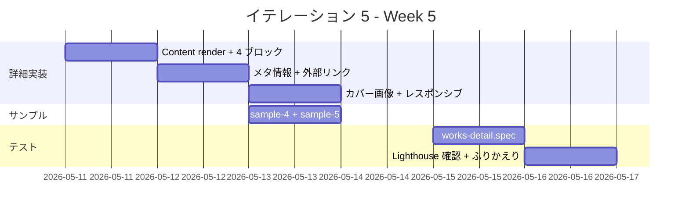

# イテレーション 5 計画

## 概要

| 項目 | 内容 |
|---|---|
| **イテレーション** | IT-5 |
| **期間** | Week 5（2026-05-11 〜 2026-05-17、1 週間想定） |
| **ゴール** | v0.2 のリリース準備を完了する。Works 詳細画面（4 ブロック構造 + 外部リンク + 業種 / 機能領域 / チーム規模 / ポジション / 関与の深さ）を本実装し、サンプル Works を 5 件以上揃える |
| **目標 SP** | 6（US-03 = 5 SP + サンプル Works 残り = 1 SP） |
| **バージョン** | v0.2 RC（リリース候補） |

> IT-5 完了 = v0.2 リリース準備完了。続いて main マージ + `v0.2.0` タグ + リリース完了報告書（`creating-release-report` スキル）。

---

## ゴール

### イテレーション終了時の達成状態

1. **/works/[slug]/ 詳細画面の本実装**: パンくず + タイトル / 役職 / 期間 / カバー画像 + 4 ブロック構造（課題 → 挑戦 → 解決 → 成果）+ team_size / position / involvement / domain / category + 外部リンク（repo / demo）+ 戻り動線
2. **サンプル Works が 5 件以上揃う**: IT-4 で 3 件配置済み、IT-5 で 2 件以上追加して [レビュー指摘](../review/design_review_20260430.md) User Rep 「公開時に Works が 5 件以上揃っている」を満たす
3. **E2E 詳細シナリオ**: `tests/e2e/works-detail.spec.ts` で 4 ブロック構造 / 外部リンク属性（target="_blank" rel="noopener noreferrer"）/ 戻り動線 / 404 を検証
4. **Lighthouse CI v0.2 予算達成**: Performance ≥ 85 / SEO ≥ 90 / A11y ≥ 90 / Best Practices ≥ 90（ローカル `npm run lhci` で確認 → main トリガーで再確認）
5. **WorkCard コンポーネント抽出**: home の Featured Works と /works/ 一覧でカードを共有する局面が来たら抽出（Rule of Three の判断）

### 成功基準

- [ ] `/works/[slug]/` でパンくず（Home > Works > Work タイトル）が表示される（AC-03-1）
- [ ] Work タイトル / 役職 / 期間 / カバー画像が表示される（AC-03-2）
- [ ] 「課題 → 挑戦 → 解決 → 成果」の 4 ブロック構造で本文が表示される（AC-03-3、Markdown 本文の `<Content />` レンダリング）
- [ ] team_size / position / involvement が表示される（AC-03-4）
- [ ] domain / category が表示される（AC-03-5）
- [ ] 使用技術タグが表示される（AC-03-6、IT-4 で実装済み）
- [ ] 成果が定量指標（before/after）形式で表示される（AC-03-7、Markdown の構造で表現）
- [ ] 外部リンク（repo / demo）が `target="_blank" rel="noopener noreferrer"` で別タブ（AC-03-8）
- [ ] 「← 一覧に戻る」動線がある（AC-03-9、IT-4 で実装済み）
- [ ] 存在しない slug は 404（AC-03-10、Astro デフォルト動作）
- [ ] サンプル Works が `src/content/works/` に 5 件以上配置されている
- [ ] `tests/e2e/works-detail.spec.ts` で詳細表示 / 外部リンク属性 / 4 ブロック構造 / 404 が緑
- [ ] axe-core via Playwright で `/works/[slug]/` の violations 0（IT-4 で達成済み・継続維持）
- [ ] Lighthouse CI が v0.2 予算（Performance ≥ 85 / SEO ≥ 90 / A11y ≥ 90 / Best Practices ≥ 90）を満たす
- [ ] `npm run check` 緑、`npm run build` 緑、`npm run test:e2e` 緑

---

## ユーザーストーリー

### 対象ストーリー

| ID | ユーザーストーリー | 全体 SP | IT-5 配分 SP | 優先度 |
|----|-------------------|---:|---:|----|
| US-03 | Works 詳細で関与の深さと成果を判断できる | 5 | 5 | 必須 |
| サンプル Works 追加 | 5 件揃え（v0.2 リリース基準） | - | 1 | 必須 |
| **合計** | | | **6** | |

### ストーリー詳細

#### US-03（IT-5・5 SP）: Works 詳細で関与の深さと成果を判断できる

**ストーリー**:

> 採用担当者 / 業務委託発注検討者として、Works 詳細を見て、課題から成果までのストーリーと関与の深さを判断する。なぜなら「再現性のある成果か」「同じ仕事を任せられるか」を評価できるからだ。

**IT-5 受入条件**:

- AC-03-1（IT-4 で部分実装）: パンくず（Home > Works > Work タイトル）を表示
- AC-03-2: Work タイトル / 役職 / 期間 / カバー画像を表示
- AC-03-3: **「課題 → 挑戦 → 解決 → 成果」**の 4 ブロック構造で本文を表示。本文上部に **概要（summary）** を表示する（[ui_design.md S03 構成原則](../design/ui_design.md#s03-成果物詳細) に従い、メタ情報の直後・課題ブロックの直前に配置）
- AC-03-4: チーム規模（`team_size`）/ ポジション（`position`） / 関与の深さ（`involvement`） を表示
- AC-03-5: 業種（`domain`） / 機能領域（`category`）を表示
- AC-03-6（IT-4 で実装済み）: 使用技術タグを表示
- AC-03-7: 成果は定量指標（before/after）形式で表示。**Markdown 本文の `## 成果` セクションでは Markdown の表記法で `指標 | Before | After` の表（または `before → after` の矢印表記）を用いる**。既存サンプル（sample-1〜3）の成果セクションを表形式 + 矢印を併用するよう統一する
- AC-03-8: 外部リンク（GitHub Repo / Live Demo）が `target="_blank" rel="noopener noreferrer"` で別タブ
- AC-03-9（IT-4 で実装済み）: 「← 一覧に戻る」動線がある
- AC-03-10: 存在しない slug は 404（US-15 相当、Astro デフォルト動作）

#### サンプル Works 追加（IT-5・1 SP）: v0.2 リリース基準

**理由**: [レビュー指摘](../review/design_review_20260430.md) User Rep 「公開時に Works が 5 件以上揃っている」を満たすため、IT-4 配置の 3 件に加えて 2 件以上を追加する。

**IT-5 受入条件**:

- `apps/web/src/content/works/` に Markdown ファイルが 5 件以上存在
- 各サンプルは Zod スキーマを満たす（必須フィールド + 4 ブロック本文）
- 業種 / 機能領域がバラけている（金融 / SaaS / EC に加えて新ドメイン）

### タスク

#### 1. /works/[slug]/ 詳細実装（4 SP）

| # | タスク | 見積もり | 担当 | 状態 |
|---|--------|---------|------|------|
| 1.1 | `[slug].astro` のプレースホルダを削除し、Astro Content `entry.render()` で `<Content />` を表示（4 ブロック構造） | 1.5h | self | [ ] |
| 1.2 | 役職（role）+ team_size + position + involvement の表示セクションを追加 | 1h | self | [ ] |
| 1.3 | domain + category の表示（メタ情報行） | 0.5h | self | [ ] |
| 1.4 | **summary を本文上部（メタ情報直後・課題ブロック直前）に独立セクションとして表示**（ui_design.md S03 構成原則準拠） | 0.5h | self | [ ] |
| 1.5 | カバー画像（cover）の表示（cover フィールドが空の場合はスキップ） | 1h | self | [ ] |
| 1.6 | 外部リンク（repo / demo）を `target="_blank" rel="noopener noreferrer"` で表示 | 0.5h | self | [ ] |
| 1.7 | 詳細レイアウトのレスポンシブ確認（375 / 768 / 1024px） | 0.5h | self | [ ] |
| 1.8 | **既存サンプル sample-1〜3 の `## 成果` を Markdown 表形式（`指標 \| Before \| After`）+ 矢印表記の併用に統一**（AC-03-7 のスタイルガイド適用） | 0.5h | self | [ ] |
| 1.9 | （Optional）WorkCard 抽出: `src/components/WorkCard.astro` 作成 + index.astro / home（IT-5 で home 連動する場合）で再利用 | 1h | self | [ ] |

**小計**: 7h（理想時間、1.9 を含む）

#### 2. サンプル Works 残り 2 件追加（1 SP）

| # | タスク | 見積もり | 担当 | 状態 |
|---|--------|---------|------|------|
| 2.1 | `apps/web/src/content/works/sample-4.md` 作成（医療 / ヘルスケア領域、フロントエンド系） | 1h | self | [ ] |
| 2.2 | `apps/web/src/content/works/sample-5.md` 作成（教育 / EdTech 領域、フルスタック系） | 1h | self | [ ] |
| 2.3 | サンプル 5 件で `/works/` 一覧の表示が破綻しないことを確認（grid 列、フィルタ動作） | 0.3h | self | [ ] |

**小計**: 2.3h（理想時間）

#### 3. E2E + 品質ゲート（1 SP）

| # | タスク | 見積もり | 担当 | 状態 |
|---|--------|---------|------|------|
| 3.1 | `tests/e2e/works-detail.spec.ts` 作成（パンくず / summary / 4 ブロック見出し / 成果セクションの表 or 矢印 / メタ情報 / 外部リンク属性 / 404 / 戻り動線） | 1.5h | self | [ ] |
| 3.2 | 既存 `works.spec.ts` のサンプル件数を 5 件以上対応（`toHaveCount(3)` 等を `toBeGreaterThanOrEqual(5)` に） | 0.5h | self | [ ] |
| 3.3 | `npm run lhci` をローカルで実行し、v0.2 予算（85/90/90/90）を達成しているか確認 | 0.5h | self | [ ] |
| 3.4 | axe-core via Playwright で /works/[slug]/ violations 0 を継続維持（IT-4 で実装済み・確認のみ） | 0.2h | self | [ ] |

**小計**: 2.7h（理想時間）

#### タスク合計

| カテゴリ | SP | 理想時間 | 状態 |
|---------|----|----|------|
| 1. /works/[slug]/ 詳細実装 | 4 | 7h | [ ] |
| 2. サンプル Works 残り 2 件 | 1 | 2.3h | [ ] |
| 3. E2E + 品質ゲート | 1 | 2.7h | [ ] |
| **合計** | **6** | **12h** | [ ] |

**1 SP あたり**: 約 2h（IT-1〜IT-4 の実績平均 0.4h/SP より厳しめ）
**実績見込み**: 約 2〜4h（v0.1 / IT-4 の生産性が継続するなら 2h、サンプル Works のテキスト作成に時間がかかる場合 4h）
**進捗率**: 0%（0/6 SP、開始前）

---

## スケジュール

### Week 5（Day 1-7）



| 日 | 曜日 | タスク |
|----|------|--------|
| Day 1 | 月（5/11） | 1.1〜1.2: Content render + 4 ブロック + メタ情報 |
| Day 2 | 火（5/12） | 1.3〜1.5: domain / category + カバー画像 + 外部リンク |
| Day 3 | 水（5/13） | 1.6〜1.7: レスポンシブ + WorkCard 抽出 |
| Day 4 | 木（5/14） | 2.1〜2.3: サンプル Works sample-4 / 5 |
| Day 5 | 金（5/15） | 3.1〜3.2: works-detail.spec + works.spec 修正 |
| Day 6 | 土（5/16） | 3.3〜3.4: Lighthouse 確認 + axe-core 確認 |
| Day 7 | 日（5/17） | ふりかえり + 完了報告書 + v0.2 リリース準備 |

### IT-5 の予測完了時間

v0.1 / IT-4 と同じく前倒し可能。サンプル Works のテキスト作成（2.1 / 2.2）が最も時間を要する想定。

---

## 設計

### Astro Content の本文レンダリング

Markdown ファイルの本文（`## 課題` 〜 `## 成果`）は Astro Content の `entry.render()` でレンダリングする：

```astro
---
import { getCollection, type CollectionEntry } from "astro:content";
import BaseLayout from "../../layouts/BaseLayout.astro";

type Work = CollectionEntry<"works">;

export async function getStaticPaths() {
  const works = await getCollection("works");
  return works.map((work: Work) => ({
    params: { slug: work.slug },
    props: { work },
  }));
}

const { work } = Astro.props as { work: Work };
const { Content } = await work.render();
---

<BaseLayout title={...}>
  <article class="prose">
    <h1>{work.data.title}</h1>
    <!-- メタ情報 -->
    <Content />
  </article>
</BaseLayout>
```

`Tailwind の prose クラス` または独自スタイルで `## 課題` 等の見出しを目立たせる。

### メタ情報の表示

```astro
<dl class="grid grid-cols-2 gap-2">
  {work.data.domain && <><dt>業種</dt><dd>{work.data.domain}</dd></>}
  {work.data.category && <><dt>機能領域</dt><dd>{work.data.category}</dd></>}
  {work.data.team_size && <><dt>チーム規模</dt><dd>{work.data.team_size} 名</dd></>}
  {work.data.position && <><dt>ポジション</dt><dd>{work.data.position}</dd></>}
  {work.data.involvement && <><dt>関与</dt><dd>{INVOLVEMENT_LABELS[work.data.involvement]}</dd></>}
</dl>
```

`involvement` の enum 値（lead / core / member / advisor）を日本語ラベルに変換する辞書を定義。

### 成果セクションの記法（AC-03-7 スタイルガイド）

`## 成果` セクションでは Markdown 表形式 + 矢印表記を併用する：

```markdown
## 成果

| 指標 | Before | After |
|---|---|---|
| p95 レスポンスタイム | 850ms | 340ms（60% 改善） |
| デプロイ頻度 | 月 1 回 | 週 3 回 |
| インシデント MTTR | 4 時間 | 30 分 |

主要数値の要約：

- p95 レスポンスタイム: 850ms → 340ms（60% 改善）
```

理由：

- 表形式は [ui_design.md S03 salt 図](../design/ui_design.md#s03-成果物詳細) の Outcome ブロックと整合
- 矢印表記は一覧画面（card 内 summary）や OGP 等で短く転記しやすい
- 既存サンプル sample-1〜3 は矢印表記のみのため、IT-5 のタスク 1.8 で表形式を追加して統一する

### 外部リンクの A11y

```astro
{work.data.repo && (
  <a href={work.data.repo} target="_blank" rel="noopener noreferrer">
    GitHub Repo
    <span class="sr-only">（新しいタブで開く）</span>
  </a>
)}
```

`rel="noopener noreferrer"` は `target="_blank"` と必ずセット（XSS と performance リーク対策）。

### カバー画像

サンプル Works では `cover` フィールドを使わずに進める方針（v0.2 では文字情報優先）。実装は条件付きで「`cover` があれば表示、なければ非表示」とし、画像生成は v1.0 の OGP 自動生成（US-12）で扱う。

### ADR

| ADR | タイトル | ステータス |
|-----|---------|-----------|
| [ADR-0001](../adr/0001-frontend-framework-astro.md) | フロントエンドフレームワークに Astro を採用 | 承認 |
| [ADR-0005](../adr/0005-build-pipeline-unification.md) | ビルド境界を GitHub Actions に一本化 | 承認（部分置換: ADR-0007） |
| [ADR-0007](../adr/0007-mkdocs-independent-delivery.md) | MkDocs を CI から外し GitHub Pages へ独立配信 | 承認 |

IT-5 で新規 ADR が必要になる可能性のある論点：

- WorkCard を共有コンポーネント化する場合のディレクトリ規約（`src/components/WorkCard.astro` か `src/components/works/Card.astro` か）
- カバー画像が Markdown 内のリンクと外部 URL の両方を扱う場合の処理（`astro:assets` の Image コンポーネントとの統合）

---

## リスクと対策

| リスク | 影響度 | 対策 |
|--------|--------|------|
| サンプル Works のテキスト作成（sample-4 / 5）に予想以上の時間 | 中 | 既存の sample-1〜3 のテンプレートを再利用、業種だけ変更して内容のパターンを共有 |
| Markdown の `<Content />` レンダリングが Tailwind と相性が悪い（見出しスタイル消失） | 中 | `@tailwindcss/typography` プラグイン追加（任意）、または scoped style で見出しをカスタム |
| Lighthouse v0.2 予算（Performance ≥ 85）が達成できない | 中 | 画像最適化、JS バンドル削減、達成不可なら予算を 80 に一時緩和 + ADR 化 |
| getCollection の型衝突が IT-4 同様に発生 | 低 | IT-4 で確立した as キャストパターンを踏襲 |
| サンプル 5 件で `/works/` 一覧のグリッドが崩れる | 低 | grid-cols-2 で 2 列、5 件目は 1 列分余白でレイアウト OK |

---

## 完了条件

### Definition of Done

- [ ] コードがリポジトリにマージ済み（`develop` ブランチに到達。main へは v0.2 リリース時にまとめて PR）
- [ ] `npm run check`（lint + typecheck + format + test）がローカルで成功
- [ ] `npm run build` が成功し、`apps/web/dist/works/[slug]/index.html` が 5 件以上生成される
- [ ] `npm run test:e2e` で全シナリオ緑（works-detail.spec.ts 追加分含む）
- [ ] axe-core で `/works/[slug]/` の violations 0
- [ ] Lighthouse CI が v0.2 予算（Performance ≥ 85 / SEO ≥ 90 / A11y ≥ 90 / Best Practices ≥ 90）を満たす
- [ ] サンプル Works 5 件以上が `src/content/works/` に配置されている
- [ ] ふりかえり（`docs/development/retrospective-5.md`）作成
- [ ] 完了報告書（`docs/development/iteration_report-5.md`）作成

### v0.2 リリース準備完了の条件（IT-5 後）

- [ ] US-02 + US-03 + US-13（残）の受入条件すべて達成
- [ ] サンプル Works 5 件以上揃い、Featured フラグの選定基準が明文化されている
- [ ] E03（Works 一覧）/ E04（Works 詳細）の E2E が緑
- [ ] Lighthouse v0.2 予算達成
- [ ] main へ PR + マージ + `v0.2.0` タグ
- [ ] リリース完了報告書（`creating-release-report` スキル）作成

### デモ項目

1. `npm run dev` で `/works/` を開いてサンプル 5 件以上が並ぶことを確認
2. 任意のカードの「詳細を見る」をクリックして `/works/[slug]/` で 4 ブロック構造の本文が表示されることを確認
3. メタ情報（domain / category / team_size / position / involvement）の表示確認
4. 外部リンク（GitHub Repo / Live Demo）が `target="_blank"` で別タブ起動することを確認
5. 「← 一覧に戻る」で `/works/` に戻れることを確認
6. 存在しない slug（例: `/works/non-existent-slug/`）で 404 が表示されることを確認

---

## 更新履歴

| 日付 | 更新内容 | 更新者 |
|---|---|---|
| 2026-04-30 | 初版作成（IT-4 完了直後） | self |

---

## 関連ドキュメント

- [IT-4 計画](./iteration_plan-4.md) / [IT-4 ふりかえり](./retrospective-4.md) / [IT-4 完了報告書](./iteration_report-4.md)
- [v0.1 リリース完了報告書](./release_report-0_1_0.md)
- [リリース計画](./release_plan.md)
- [ユーザーストーリー](../requirements/user_story.md)（US-03）
- [UI 設計](../design/ui_design.md)（S03）
- [フロントエンドアーキテクチャ](../design/architecture_frontend.md)（Content Collections）
- [テスト戦略](../design/test_strategy.md)
- [分析成果物レビュー](../review/design_review_20260430.md)（H09 ストーリー構造、M02 / L06 を IT-4 で反映済み）
- IT-5 ふりかえり（IT-5 完了時に作成）
- IT-5 完了報告書（IT-5 完了時に作成）
