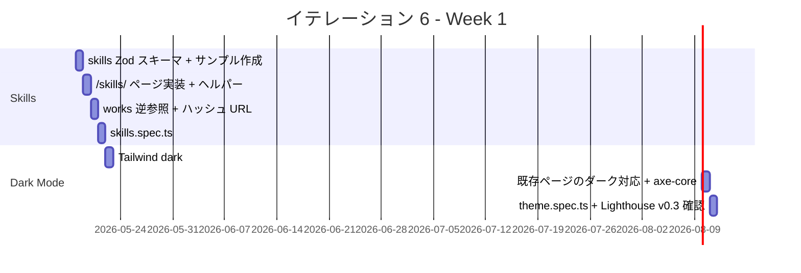
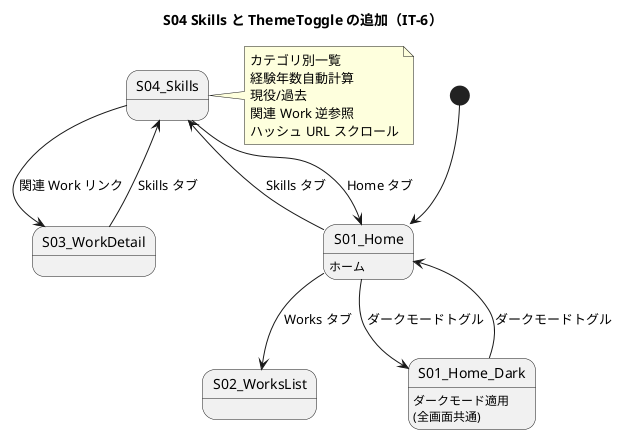

# イテレーション 6 計画

## 概要

| 項目 | 内容 |
|------|------|
| **イテレーション** | 6（v0.3-α） |
| **期間** | Week 6（1 週間想定） / 計画期間 2026-05-18 〜 2026-05-24 |
| **ゴール** | Skills 専用ページ（US-04）とダークモード切替（US-07）を実装し、v0.3-α として「採用担当者が技術領域の網羅性を確認でき、訪問者がダークモードで快適に閲覧できる」状態を作る |
| **目標 SP** | 7 |

---

## ゴール

### イテレーション終了時の達成状態

1. **Skills ページ**: `/skills/` で Backend / Frontend / Infrastructure / Practice の 4 カテゴリ別に Skill 一覧が表示され、経験年数自動計算 / 現役 vs 過去ステータス / 関連 Work 逆参照 / ハッシュ URL スクロールが動作する
2. **ダークモード**: ヘッダーのトグルでライト ⇔ ダーク即時切替、`localStorage.theme` に永続化、初回は `prefers-color-scheme` を尊重、全画面で WCAG 2.1 AA コントラスト達成
3. **既存ページの整合**: home / works 一覧 / works 詳細 / 404 がダークモードでも表示崩れなく見える

### 成功基準

- [ ] AC-04-1〜AC-04-5 が全て達成される（Skills 受入条件）
- [ ] AC-07-1〜AC-07-5 が全て達成される（ダークモード受入条件）
- [ ] Playwright E2E が全て緑（既存 39 + skills 5 + theme 5 程度を想定）
- [ ] axe-core via Playwright で `/skills/` + ダークモード適用時の violations が 0
- [ ] Lighthouse v0.3 予算（Performance ≥ 85 / SEO ≥ 95 / A11y ≥ 92 / BP ≥ 92）が達成される
- [ ] テストカバレッジ（既存基準）を維持

---

## ユーザーストーリー

### 対象ストーリー

| ID | ユーザーストーリー | SP | 優先度 |
|----|-------------------|----|----|
| US-04 | Skills で技術領域の網羅性を確認できる | 3 | 必須 |
| US-07 | ダークモードで快適に閲覧できる | 3 | 必須 |
| 横断 | a11y / Lighthouse v0.3 予算 / テスト整備 | 1 | 中 |
| **合計** | | **7** | |

### ストーリー詳細

#### US-04: Skills で技術領域の網羅性を確認できる

**ストーリー**:
> 採用担当者として、Skills を見て、各カテゴリの経験年数・現役/過去・関連 Works を確認したい。なぜなら、求める技術領域に応えられるか評価できるからだ。

**受入条件**:

1. AC-04-1: Backend / Frontend / Infrastructure / Practice の各カテゴリで一覧表示
2. AC-04-2: 各 Skill に「経験年数」（`since` から自動計算）、「現役/過去」ステータスを表示
3. AC-04-3: ★ レベル表現の場合は **凡例**を画面に明示（例: ★★★★★ = メンター可能）、または ★ を廃止し「現役/過去」のみ
4. AC-04-4: 各 Skill から関連 Work へのリンク（Work 逆参照）を 1 つ以上表示
5. AC-04-5: ハッシュ URL（`/skills/#java`）で該当 Skill にスクロールできる

#### US-07: ダークモードで快適に閲覧できる

**ストーリー**:
> 訪問者として、ダークモードに切り替えて閲覧したい。なぜなら、夜間 / 画面が眩しい環境でも快適に読めるからだ。

**受入条件**:

1. AC-07-1: 初回訪問時は `prefers-color-scheme` を尊重
2. AC-07-2: ヘッダーのトグルクリックで即時切替
3. AC-07-3: `localStorage.theme` に永続化、リロードしても保持
4. AC-07-4: ダークモードでも WCAG 2.1 AA のコントラストを満たす
5. AC-07-5: View Transitions API 未対応ブラウザでは即時遷移（視覚的不連続なし）

### タスク

#### 1. Skills 実装（US-04 / 3 SP）

| # | タスク | 見積もり | 担当 | 状態 |
|---|--------|---------|------|------|
| 1.1 | `skills` Content Collection の Zod スキーマ定義（category / name / since / status / level / works[]） | 1.0h | self | [ ] |
| 1.2 | サンプル Skills Markdown 12〜15 件作成（Backend 4 + Frontend 3 + Infra 4 + Practice 3〜4） | 1.5h | self | [ ] |
| 1.3 | `apps/web/src/pages/skills/index.astro` 実装（カテゴリ別カード + 凡例 + 経験年数自動計算 + 現役/過去スタイル） | 1.5h | self | [ ] |
| 1.4 | 経験年数自動計算ヘルパー（`since` から `new Date().getFullYear() - since` を計算する関数） | 0.5h | self | [ ] |
| 1.5 | 関連 Work 逆参照リンク（`works[]` の各エントリを `/works/[slug]/` へリンク化） | 0.5h | self | [ ] |
| 1.6 | ハッシュ URL スクロール（`<section id="java">` 等を付与し `/skills/#java` で該当行ハイライト） | 0.5h | self | [ ] |
| 1.7 | `tests/e2e/skills.spec.ts` 5 シナリオ追加（AC-04-1〜5 を網羅） | 0.5h | self | [ ] |

**小計**: 6.0h（理想時間）

#### 2. ダークモード実装（US-07 / 3 SP）

| # | タスク | 見積もり | 担当 | 状態 |
|---|--------|---------|------|------|
| 2.1 | Tailwind の `darkMode: "class"` 設定確認 + ダーク用カスタムプロパティ整理（`--color-bg-dark` 等） | 0.5h | self | [ ] |
| 2.2 | `ThemeToggle.astro` コンポーネント実装（ヘッダーに配置、🌙 / ☀ アイコン） | 1.0h | self | [ ] |
| 2.3 | `<script>` で `localStorage.theme` + `prefers-color-scheme` 切替ロジック（FOUC 回避用に inline） | 1.0h | self | [ ] |
| 2.4 | 既存ページ（home / works / works/[slug] / 404）のダーク対応（CSS 変数の参照を統一） | 1.5h | self | [ ] |
| 2.5 | axe-core でダークモード適用時のコントラスト violations 0 検証（既存 a11y.spec.ts の拡張） | 0.5h | self | [ ] |
| 2.6 | View Transitions API（任意・対応ブラウザのみ）と非対応時の即時切替フォールバック | 0.5h | self | [ ] |
| 2.7 | `tests/e2e/theme.spec.ts` 5 シナリオ追加（AC-07-1〜5 を網羅） | 1.0h | self | [ ] |

**小計**: 6.0h（理想時間）

#### 3. 横断（a11y / 品質 / 締め / 1 SP）

| # | タスク | 見積もり | 担当 | 状態 |
|---|--------|---------|------|------|
| 3.1 | `npm run lhci` をローカルでスポット実行し v0.3 予算（P≥85 / SEO≥95 / A11y≥92 / BP≥92）達成を確認 | 0.5h | self | [ ] |
| 3.2 | BaseLayout のヘッダーレイアウト調整（モバイル時のトグル配置） | 0.5h | self | [ ] |
| 3.3 | ふりかえり（retrospective-6.md）+ 完了報告書（iteration_report-6.md） | 1.0h | self | [ ] |

**小計**: 2.0h（理想時間）

#### タスク合計

| カテゴリ | SP | 理想時間 | 状態 |
|---------|----|----|------|
| Skills 実装（US-04） | 3 | 6.0h | [ ] |
| ダークモード実装（US-07） | 3 | 6.0h | [ ] |
| 横断（a11y / 品質 / 締め） | 1 | 2.0h | [ ] |
| **合計** | **7** | **14.0h** | |

**1 SP あたり**: 約 2.0h
**進捗率**: 0% (0/7 SP)

---

## スケジュール

### Week 1（Day 1-7）



| 日 | タスク |
|----|--------|
| Day 1 | 1.1 skills Zod スキーマ定義 + 1.2 サンプル Skills 作成 |
| Day 2 | 1.3 /skills/ ページ実装 + 1.4 経験年数ヘルパー |
| Day 3 | 1.5 works 逆参照 + 1.6 ハッシュ URL スクロール |
| Day 4 | 1.7 skills.spec.ts E2E + 整合性確認 |
| Day 5 | 2.1 darkMode 設定 + 2.2 ThemeToggle 実装 + 2.3 切替ロジック |
| Day 6 | 2.4 既存ページのダーク対応 + 2.5 axe-core 検証 |
| Day 7 | 2.6 View Transitions + 2.7 theme.spec.ts + 3.1 Lighthouse v0.3 + 3.3 ふりかえり |

> v0.1 / v0.2 と同じく前倒し継続実施の可能性あり。実績で 1〜2 日に圧縮できる見込み。

---

## 設計

### Skills Content Collection スキーマ

```typescript
const skills = defineCollection({
  type: "content",
  schema: z.object({
    category: z.enum(["Backend", "Frontend", "Infrastructure", "Practice"]),
    name: z.string(),
    since: z.number().int().min(1990).max(2100),
    status: z.enum(["current", "past"]).default("current"),
    level: z.number().int().min(1).max(5).optional(),
    works: z.array(z.string()).optional(),
  }),
});
```

`works[]` は Work の slug 配列。`/works/[slug]/` への逆参照を生成する。`level` は ★ 表現を採用する場合のみ使用し、画面に凡例を必ず併記する（[UI 設計 S04](../design/ui_design.md#s04-スキル) 参照）。

### ダークモード切替ロジック（FOUC 回避）

`BaseLayout.astro` の `<head>` 直後に inline `<script>` を配置し、ページレンダリング前に `localStorage.theme` + `prefers-color-scheme` を評価して `<html>` に `class="dark"` を付与する。

```html
<script is:inline>
  const stored = localStorage.getItem("theme");
  const prefersDark = window.matchMedia("(prefers-color-scheme: dark)").matches;
  const theme = stored ?? (prefersDark ? "dark" : "light");
  if (theme === "dark") document.documentElement.classList.add("dark");
</script>
```

### Tailwind ダークモード設定

`tailwind.config.ts` に `darkMode: "class"` を設定し、既存の `var(--color-bg)` 等のカスタムプロパティをダーク値に切り替える。具体的な対応色は [UI 設計 S04 / 全画面 ダークモード](../design/ui_design.md) を参照。

### 画面遷移図（IT-6 で追加される画面）



### ディレクトリ構成（IT-6 追加）

```
apps/web/src/
├── components/
│   └── ThemeToggle.astro       # 新規
├── content/
│   ├── config.ts                # skills コレクション追加
│   ├── skills/                  # 新規ディレクトリ
│   │   ├── java-spring.md
│   │   ├── typescript-node.md
│   │   ├── react.md
│   │   ├── astro.md
│   │   ├── aws.md
│   │   ├── docker-k8s.md
│   │   └── ...                  # 12〜15 件
│   └── works/                   # 既存
├── pages/
│   ├── skills/
│   │   └── index.astro          # 新規
│   └── ...                      # 既存
└── lib/
    └── experience.ts            # 新規（経験年数自動計算）

apps/web/tests/e2e/
├── skills.spec.ts               # 新規（5 シナリオ）
├── theme.spec.ts                # 新規（5 シナリオ）
└── a11y.spec.ts                 # 拡張（/skills/ + dark 検証）
```

### ADR

| ADR | タイトル | ステータス |
|-----|---------|-----------|
| - | （新規 ADR は不要。既存 ADR の範囲内で実装） | - |

> ダークモード切替方式（class-based vs CSS variables）は ADR 化の余地あり。実装後に必要なら IT-6 後半で起票する。

### ui_design.md への反映が必要な変更点

IT-6 完了時に [ui_design.md](../design/ui_design.md) 側へ以下の更新を反映する：

- **画面遷移図への追加遷移**: `S04_Skills --> S03_WorkDetail`（関連 Work リンク）と `S03_WorkDetail --> S04_Skills`（Skills タブ）。現状の画面遷移図では `S04_Skills` から `S03_WorkDetail` への遷移が未定義（[整合性検証スキル](../../.claude/skills/validating-iteration-plan)で検出）
- **S04 salt 図への補足**: Practice カテゴリの表示は他カテゴリ（表形式）と異なる横並びリスト形式（TDD | DDD | XP | CI/CD | アジャイル）であることを実装方針として明記

---

## リスクと対策

| リスク | 影響度 | 対策 |
|--------|--------|------|
| 既存ページのダーク対応で予想外のコントラスト破綻（特に Featured Works カードや Work 詳細の prose） | 中 | 各ページで axe-core を走らせ、color-contrast 違反 0 を確認。CSS 変数の参照を `var(--color-text)` に統一 |
| View Transitions API のブラウザサポート差（Chrome 111+ / Safari 18+ / Firefox 未対応） | 低 | feature detection で対応ブラウザのみ適用、非対応は即時切替に fallback |
| Skills サンプルデータ作成の時間（IT-5 の Works コンテンツ作成と同じパターン） | 中 | 12〜15 件中、Backend / Frontend / Infrastructure / Practice 各 3〜4 件で網羅性を確保し、内容は ui_design S04 のサンプルを下敷きに作る |
| ハッシュ URL スクロールがモバイル sticky ヘッダーで隠れる | 低 | `scroll-margin-top` を CSS で指定して、ヘッダー分のオフセットを確保 |
| ThemeToggle のタッチターゲットがモバイルで小さすぎる（[L08](../review/design_review_20260430.md) WCAG 2.5.5 / Apple HIG） | 低 | 44×44 px 以上の hit area を確保。アイコンを `inline-flex h-12 w-12 items-center justify-center` 等で囲み、隣接要素との間隔は 8 px 以上 |

---

## 完了条件

### Definition of Done

- [ ] コードレビュー完了（セルフレビュー、PR 経由）
- [ ] `npm run check` がローカルで全緑（typecheck + lint + format + vitest）
- [ ] `npm run build` 成功（`/skills/` + 既存ページが生成、dist 内に `.html` ファイル群）
- [ ] Playwright E2E 全シナリオ緑（既存 39 + skills 5 + theme 5 = 約 49）
- [ ] axe-core で `/skills/` + ダークモード適用時の WCAG 2.1 A/AA violations が 0
- [ ] ThemeToggle のタッチターゲットが 44×44 px 以上（WCAG 2.5.5 / [L08](../review/design_review_20260430.md) 反映）
- [ ] Lighthouse v0.3 予算（Performance ≥ 85 / SEO ≥ 95 / A11y ≥ 92 / BP ≥ 92）達成
- [ ] ふりかえり（retrospective-6.md）作成
- [ ] 完了報告書（iteration_report-6.md）作成

### デモ項目

1. `/skills/` にアクセスして Backend / Frontend / Infrastructure / Practice の 4 カテゴリ表示と経験年数自動計算を確認
2. Skills の関連 Work リンクをクリックして `/works/[slug]/` に遷移できることを確認
3. ヘッダーのトグルでダークモード切替（即時 + リロード後も維持）
4. `/skills/#java` でハッシュリンク経由で該当 Skill にスクロールできることを確認

---

## 更新履歴

| 日付 | 更新内容 | 更新者 |
|------|---------|--------|
| 2026-05-01 | 初版作成（IT-5 完了後・v0.2.0 リリース直後） | self |

---

## 関連ドキュメント

- [リリース計画](./release_plan.md)（v0.3 セクション）
- [IT-5 完了報告書](./iteration_report-5.md)（直前イテレーション）
- [IT-5 ふりかえり](./retrospective-5.md)（v0.3 への引き継ぎ事項）
- [v0.2 リリース完了報告書](./release_report-0_2_0.md)
- [ユーザーストーリー](../requirements/user_story.md)（US-04 / US-07）
- [UI 設計](../design/ui_design.md)（S04 / ダークモード切替）
- [フロントエンドアーキテクチャ](../design/architecture_frontend.md)（Content Collections スキーマ）
- [テスト戦略](../design/test_strategy.md)
- [非機能要件](../design/non_functional.md)（Lighthouse v0.3 予算）
- [IT-6 ふりかえり](./retrospective-6.md)（実施後作成）
