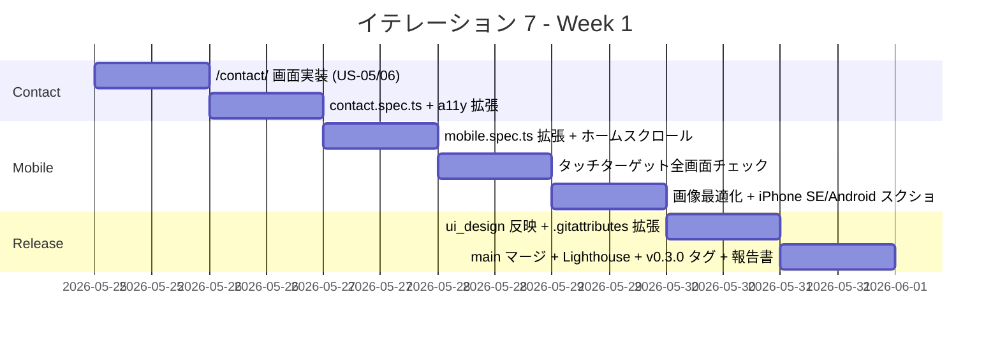

# イテレーション 7 計画

## 概要

| 項目 | 内容 |
|------|------|
| **イテレーション** | 7（v0.3 リリース） |
| **期間** | Week 7（1 週間想定） / 計画期間 2026-05-25 〜 2026-05-31 |
| **ゴール** | Contact 画面（US-05 + US-06）を新規実装し、モバイル仕上げ（US-08）と v0.3 リリース基準（4 ブラウザ動作確認 + iPhone SE / Android スクショ）を達成して **v0.3 リリース完了** に到達する |
| **目標 SP** | 7 |

---

## ゴール

### イテレーション終了時の達成状態

1. **Contact 画面の新規実装（US-05 + US-06）**: `/contact/` で稼働可否ステータス + 返信目標 + 案件規模 + 外部リンク 4 種（Email / GitHub / LinkedIn / X）が表示され、各リンクは 44×44 px 以上のタッチターゲットを満たす
2. **モバイル仕上げ（US-08）**: iPhone SE（375px）/ Android 標準ブラウザで全画面の表示崩れが 0、ハンバーガー切替・タッチターゲットが要件通り、画像最適化（AVIF/WebP）/ LCP < 200KB、ホームのスクロール 6〜8 内
3. **v0.3 リリース完了**: main マージ + Lighthouse v0.3 予算（P≥85 / SEO≥95 / A11y≥92 / BP≥92）達成 + v0.3.0 タグ + リリース完了報告書

### 成功基準

- [ ] AC-05-1〜3 が全て達成される（Contact 稼働可否）
- [ ] AC-06-1〜3 が全て達成される（外部チャネル）
- [ ] AC-08-1〜5 が全て達成される（モバイル）
- [ ] Playwright E2E が全て緑（既存 62 + contact 5 + mobile-additional 数件）
- [ ] axe-core via Playwright で `/contact/` の WCAG 2.1 A/AA violations が 0
- [ ] iPhone SE（375px）/ Android Chromium スクリーンショットを `ops/qa/` に保存
- [ ] Lighthouse v0.3 予算（Performance ≥ 85 / SEO ≥ 95 / A11y ≥ 92 / BP ≥ 92）達成

---

## ユーザーストーリー

### 対象ストーリー

| ID | ユーザーストーリー | SP | 優先度 |
|----|-------------------|----|----|
| US-05 | 稼働可否を確認して問い合わせ判断できる | 2 | 必須 |
| US-06 | 外部チャネルから連絡できる | 2 | 必須 |
| US-08 | モバイルで快適に閲覧できる | 3 | 必須 |
| 横断 | ui_design.md 反映 + `.gitattributes` 拡張 + Card 共通化判断 | （0）| 中 |
| **合計** | | **7** | |

### ストーリー詳細

#### US-05: 稼働可否を確認して問い合わせ判断できる

**ストーリー**:
> 業務委託発注検討者として、Contact 画面で稼働可否を確認したい。なぜなら、問い合わせに費やす時間が無駄にならないか判断できるからだ。

**受入条件**:

1. AC-05-1: Contact 画面の冒頭に **稼働可否ステータス**（例: 「副業のみ可 / 週 2 日 / リモート」）を表示
2. AC-05-2: 返信目標時間（「原則 2 営業日以内」）を表示
3. AC-05-3: 相談可能な案件規模（任意）を表示

#### US-06: 外部チャネルから連絡できる

**ストーリー**:
> 訪問者として、Email / GitHub / LinkedIn / X の中から好きなチャネルで連絡したい。なぜなら、自分の慣れた方法で問い合わせできるからだ。

**受入条件**:

1. AC-06-1: 各リンクが `target="_blank" rel="noopener noreferrer"` を持つ
2. AC-06-2: Email は `mailto:` でクリック時にメールクライアントが起動する
3. AC-06-3: 全リンクは 44×44 px 以上のタッチターゲットを満たす

#### US-08: モバイルで快適に閲覧できる

**ストーリー**:
> 採用担当者（移動中・電車内）として、モバイル端末で快適にポートフォリオを閲覧したい。なぜなら、デスクに戻る前にスクリーニングを完了できるからだ。

**受入条件**:

1. AC-08-1: iPhone SE（375px）以上で破綻しない
2. AC-08-2: 768px 未満でハンバーガーメニューに切り替わる
3. AC-08-3: タッチターゲットは 44×44 px 以上、間隔は 8px 以上
4. AC-08-4: 画像は AVIF/WebP 優先、LCP 候補は < 200KB
5. AC-08-5: モバイルでホームの主要セクションが 6〜8 スクロール以内

### タスク

#### 1. Contact 画面実装（US-05 + US-06 / 4 SP）

| # | タスク | 見積もり | 担当 | 状態 |
|---|--------|---------|------|------|
| 1.1 | `apps/web/src/pages/contact/index.astro` 新規（[ui_design.md S05](../design/ui_design.md#s05-連絡先) salt 図の順序に従い、**稼働可否（ステータス + 案件規模）→ 返信目標 → 外部リンク 4 種** で配置） | 1.5h | self | [ ] |
| 1.2 | 稼働可否ステータスのデータ管理（src/data/contact.ts または直接記述） | 0.5h | self | [ ] |
| 1.3 | 外部リンクボタンを 44×44 px 以上、間隔 8px 以上で実装（WCAG 2.5.5） | 0.5h | self | [ ] |
| 1.4 | `mailto:` リンクの動作確認 + Email 公開可否の確認（隠す場合は obfuscate） | 0.5h | self | [ ] |
| 1.5 | tests/e2e/contact.spec.ts 5 シナリオ（AC-05-1〜3 + AC-06-1〜3） | 1.0h | self | [ ] |
| 1.6 | a11y.spec.ts に /contact/ + ダーク時の /contact/ violations 0 を追加 | 0.5h | self | [ ] |

**小計**: 4.5h（理想時間）

#### 2. モバイル仕上げ（US-08 / 3 SP）

| # | タスク | 見積もり | 担当 | 状態 |
|---|--------|---------|------|------|
| 2.1 | mobile.spec.ts を iPhone SE（375×667）と Android Chromium 相当（412×915）の 2 デバイスで実行する形に拡張 | 1.0h | self | [ ] |
| 2.2 | ホームの主要セクションが 6〜8 スクロール以内に収まるか実測 + 必要なら余白調整 | 1.0h | self | [ ] |
| 2.3 | タッチターゲット 44×44 px / 間隔 8px の全画面チェック（外部リンク / フィルタボタン / トグル / ナビ） | 1.0h | self | [ ] |
| 2.4 | 画像の AVIF/WebP 出力（`astro:assets` 経由）と LCP 候補のサイズ確認 | 1.0h | self | [ ] |
| 2.5 | iPhone SE / Android Chromium のスクリーンショットを `ops/qa/v0.3/` に保存 | 0.5h | self | [ ] |

**小計**: 4.5h（理想時間）

#### 3. 横断（リリース確定 + ドキュメント整合 / 1 SP）

| # | タスク | 見積もり | 担当 | 状態 |
|---|--------|---------|------|------|
| 3.1 | ui_design.md の更新（4 件まとめて反映）: (1) 画面遷移図に `S04_Skills ↔ S03_WorkDetail` を追加（[IT-6 計画](./iteration_plan-6.md) で約束）/ (2) 画面一覧テーブルに `S06 / Books / /books/` を追加（IT-6 後の Books 追加と整合）/ (3) ヘッダーナビ記述に「Books」を追加 / (4) 画面遷移図に `S06_Books` の state と遷移を追加 | 1.0h | self | [ ] |
| 3.2 | `.gitattributes` 拡張（`*.astro` `*.ts` `*.json` `*.md` `*.css` `*.html` に `text eol=lf` を指定）でローカル CRLF 衝突を恒久解消 | 0.5h | self | [ ] |
| 3.3 | Card.astro 共通化の判断（home Featured / /works/ 一覧 / /skills/ Work 逆参照 / /books/ で Rule of Three 達成）— 抽出するか見送るかを記録 | 0.5h | self | [ ] |
| 3.4 | v0.3 リリース実行（main マージ + Lighthouse v0.3 予算確認 + v0.3.0 タグ + リリース完了報告書） | 1.5h | self | [ ] |
| 3.5 | ふりかえり（retrospective-7.md）+ 完了報告書（iteration_report-7.md） | 1.0h | self | [ ] |

**小計**: 4.0h（理想時間）

#### タスク合計

| カテゴリ | SP | 理想時間 | 状態 |
|---------|----|----|------|
| Contact 画面実装（US-05 + US-06） | 4 | 4.5h | [ ] |
| モバイル仕上げ（US-08） | 3 | 4.5h | [ ] |
| 横断（リリース確定 + ドキュメント整合） | 0 | 4.5h | [ ] |
| **合計** | **7** | **13.5h** | |

> 横断は SP=0（ストーリーに対応しない開発外作業）として計上し、実績ベロシティに加算しない。リリース確定作業を含むため工数は 4.0h 確保。

**1 SP あたり**: 約 1.9h（横断除く）
**進捗率**: 0% (0/7 SP)

---

## スケジュール

### Week 1（Day 1-7）



| 日 | タスク |
|----|--------|
| Day 1 | 1.1〜1.4 Contact 画面実装 |
| Day 2 | 1.5〜1.6 Contact E2E + a11y |
| Day 3 | 2.1〜2.2 mobile.spec.ts 拡張 + ホームスクロール調整 |
| Day 4 | 2.3 タッチターゲット全画面チェック |
| Day 5 | 2.4〜2.5 画像最適化 + iPhone SE / Android スクショ |
| Day 6 | 3.1〜3.3 ui_design / .gitattributes / Card 共通化判断 |
| Day 7 | 3.4〜3.5 v0.3 リリース実行 + ふりかえり + 完了報告書 |

> v0.1 / v0.2 / IT-6 と同じく前倒し継続実施の可能性あり。実績で 1〜2 日に圧縮できる見込み。

---

## 設計

### Contact 画面（S05）の構造

```typescript
// 案: src/data/contact.ts
export const AVAILABILITY = {
  status: "副業のみ可（週 2 日 / 完全リモート）",
  scope: "50 万円〜 / 月、3 ヶ月〜",
  responseTime: "原則 2 営業日以内",
} as const;

export const CONTACT_CHANNELS = [
  { kind: "email", label: "Email", href: "mailto:contact@example.com", icon: "✉" },
  { kind: "github", label: "GitHub", href: "https://github.com/k2works", icon: "🐙" },
  { kind: "linkedin", label: "LinkedIn", href: "https://www.linkedin.com/", icon: "💼" },
  { kind: "x", label: "X", href: "https://x.com/", icon: "𝕏" },
] as const;
```

実装の配置順序は [ui_design.md S05](../design/ui_design.md#s05-連絡先) salt 図に従う：

1. **現在の状況（稼働可否）**: ステータス（status）+ 案件規模（scope）
2. **問い合わせ案内**: 返信目標時間（"原則 2 営業日以内"）+ 1 行の案内文
3. **外部リンク 4 種**: Email / GitHub / LinkedIn / X

各リンクは `min-h-[44px] min-w-[44px]` + `gap-2` 以上で WCAG 2.5.5 を満たす。

### モバイル要件のチェックリスト

| 観点 | 検証方法 |
|---|---|
| iPhone SE 375px で破綻なし | Playwright `viewport: { width: 375, height: 667 }` で全画面 smoke + スクショ |
| Android Chromium で破綻なし | Playwright `viewport: { width: 412, height: 915 }` で全画面 smoke + スクショ |
| ハンバーガー切替 | 既存 mobile.spec.ts を流用 + 768px 境界で確認 |
| タッチターゲット 44×44 px | DevTools / 手動 + axe-core の `target-size`（実験的）または Playwright で `box.width / box.height >= 44` を検証 |
| 間隔 8px | 隣接インタラクティブ要素間の距離を Playwright で測定 |
| 画像 AVIF/WebP | `astro:assets` 経由で `<Picture>` 化、`loading="lazy"` 付与 |
| LCP 候補 < 200KB | Lighthouse CI のレポートで確認 |
| ホーム 6〜8 スクロール | iPhone SE 縦長スクリーンショットでセクション数を実測 |

### v0.3 リリース基準（再確認）

[release_plan.md](./release_plan.md) より：

- v0.2 基準を維持
- E03 / E04（v0.2）+ E05 / E06 / E08 / E09（v0.3）が全て成功
- 主要 4 ブラウザ（Chrome / Firefox / Safari / Edge）の最新版で動作確認
- iPhone SE（375px）と Android 標準ブラウザでのスクショを `ops/qa/` に残す
- Lighthouse v0.3 予算: P≥85 / SEO≥95 / A11y≥92 / BP≥92

> **主要 4 ブラウザのうち、Playwright で対応するのは Chromium**。Firefox / Safari / Edge は IT-2 で見送られたため、IT-7 中に Playwright projects を有効化するか、手動検証＋スクショ保存とするかを判断する。

### ディレクトリ構成（IT-7 追加）

```
apps/web/src/
├── data/
│   └── contact.ts            # 新規（稼働可否 + 連絡チャネル）
├── pages/
│   └── contact/
│       └── index.astro       # 新規
└── ...

apps/web/tests/e2e/
├── contact.spec.ts           # 新規（5 シナリオ）
├── mobile.spec.ts            # 拡張（iPhone SE + Android Chromium）
└── a11y.spec.ts              # 拡張（/contact/ + ダーク時 /contact/）

ops/qa/v0.3/
├── iphone-se-home.png        # 新規
├── iphone-se-works.png
├── iphone-se-skills.png
├── iphone-se-books.png
├── iphone-se-contact.png
└── android-*.png

apps/web/.gitattributes       # 新規（または既存拡張）
docs/design/ui_design.md      # 画面遷移図に S04↔S03 追記
```

### ADR

| ADR | タイトル | ステータス |
|-----|---------|-----------|
| - | （新規 ADR は不要。Card 共通化を見送る場合のみ判断記録を retrospective に残す） | - |

### ui_design.md への反映が必要な変更点（IT-7 タスク 3.1 で対応）

整合性検証スキル（[validating-iteration-plan](../../.claude/skills/validating-iteration-plan)）で検出された ui_design.md の更新項目をまとめる：

1. **画面一覧テーブル（[ui_design.md 行 81-87](../design/ui_design.md#画面一覧)）**: `S06 / Books / /books/ / リスト + フィルタ / 知識バックグラウンドの可視化` を追加
2. **ヘッダーナビ記述（行 103, 111）**: ナビゲーション項目に「Books」を含めて `Home / Works / Skills / Books / Contact / Tech Notes ↗` の順に書き換え
3. **画面遷移図（行 124-170）**: `S06_Books` の state（URL `/books/`、説明「読書リスト + 軸 / カテゴリフィルタ」）と他画面との遷移（Books タブ ⇔ Home / Works / Skills / Contact）を追加
4. **画面遷移図（IT-6 約束）**: `S04_Skills ↔ S03_WorkDetail`（関連 Work 逆参照リンク）の遷移を追加

---

## リスクと対策

| リスク | 影響度 | 対策 |
|--------|--------|------|
| Contact のメールアドレスを公開すると spam が増える | 中 | `mailto:` の代わりに難読化（cloudflare email obfuscation 等）または GitHub Issue 経由動線を併用 |
| iPhone SE（375px）でホームのスクロールが 8 を超える | 中 | セクション間余白調整 + Featured Works のグリッドを 1 列化 |
| Lighthouse v0.3 予算（A11y ≥ 92）が画像追加で割り込む | 低 | `astro:assets` で AVIF/WebP 出力 + alt 属性必須化 + axe-core の `image-alt` で機械検証 |
| Playwright の Firefox / Safari の有効化に時間がかかる | 中 | IT-7 内では Chromium のみで継続、Firefox/Safari は手動検証 + v1.0 で自動化 |
| Email 公開可否が未決のため Contact 実装が遅延 | 低 | 暫定で「お問い合わせは GitHub Issue 経由」とする逃げ道を用意（[ADR](../adr/)化はしない簡易判断）|

---

## 完了条件

### Definition of Done

- [ ] コードレビュー完了（セルフレビュー、PR 経由）
- [ ] `npm run check` がローカルで全緑（typecheck + lint + format + vitest / Windows ローカルは format:check 環境問題で警告）
- [ ] `npm run build` 成功（`/contact/` + 既存ページ）
- [ ] Playwright E2E 全シナリオ緑（既存 62 + contact 5 + mobile 拡張）
- [ ] axe-core で `/contact/` + ダークモード時の `/contact/` violations 0
- [ ] iPhone SE / Android Chromium スクリーンショットを `ops/qa/v0.3/` に保存
- [ ] Lighthouse v0.3 予算（P≥85 / SEO≥95 / A11y≥92 / BP≥92）達成
- [ ] main マージ + v0.3.0 タグ + リリース完了報告書（release_report-0_3_0.md）
- [ ] ふりかえり（retrospective-7.md）+ 完了報告書（iteration_report-7.md）作成

### デモ項目

1. `/contact/` で稼働可否ステータス + 返信目標 + 案件規模 + 外部リンク 4 種を確認
2. 各外部リンクのタッチターゲットが 44×44 px 以上であることを iPhone SE viewport で確認
3. ホーム / Works / Skills / Books / Contact を iPhone SE で表示崩れなく閲覧
4. Lighthouse v0.3 予算が main で達成
5. v0.3.0 タグの付与と main マージの完了

---

## 更新履歴

| 日付 | 更新内容 | 更新者 |
|------|---------|--------|
| 2026-05-01 | 初版作成（IT-6 完了後・Books ページ追加直後） | self |

---

## 関連ドキュメント

- [リリース計画](./release_plan.md)（v0.3 セクション）
- [IT-6 完了報告書](./iteration_report-6.md)
- [IT-6 ふりかえり](./retrospective-6.md)（IT-7 への引き継ぎ事項あり）
- [v0.2 リリース完了報告書](./release_report-0_2_0.md)
- [ユーザーストーリー](../requirements/user_story.md)（US-05 / US-06 / US-08）
- [UI 設計](../design/ui_design.md)（S05 Contact / モバイル要件）
- [非機能要件](../design/non_functional.md)（Lighthouse v0.3 予算）
- [分析成果物レビュー](../review/design_review_20260430.md)（M03 / L08 反映予定）
- [IT-7 ふりかえり](./retrospective-7.md)（実施後作成）
