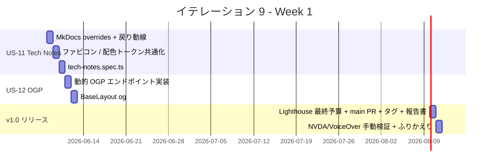

# イテレーション 9 計画

## 概要

| 項目 | 内容 |
|------|------|
| **イテレーション** | 9（v1.0 リリース） |
| **期間** | Week 9（1 週間想定） / 計画期間 2026-06-08 〜 2026-06-14 |
| **ゴール** | US-11（Tech Notes から技術的詳細に到達できる）+ US-12（SNS シェアで OGP プレビューが正しく表示される）を実装し、Lighthouse v1.0 予算（残 P / SEO / BP）の最終引き上げ + main マージ + v1.0.0 タグで **v1.0 リリース完了** に到達する |
| **目標 SP** | 5 |

---

## ゴール

### イテレーション終了時の達成状態

1. **Tech Notes 同居（US-11）**: `/docs/` への同一タブ遷移 + MkDocs 側に「これは個人の学習・設計メモです」のガイダンスバナー + 「← ポートフォリオに戻る」戻り動線 + ファビコン / 配色トークンの共通化
2. **OGP 自動生成（US-12）**: 全画面で OGP メタタグを出力 + 1200×630 の OGP 画像生成（`@astrojs/og`）+ Twitter Card は `summary_large_image` + Works 詳細で動的 OGP（タイトル + 期間）
3. **v1.0 リリース完了**: Lighthouse v1.0 予算（**Performance ≥ 90 / SEO ≥ 95 / A11y ≥ 95 / Best Practices ≥ 95**）を main CI で達成 + main マージ + v1.0.0 タグ + リリース完了報告書

### 成功基準

- [ ] AC-11-1〜5 が全て達成される（Tech Notes 同居）
- [ ] AC-12-1〜4 が全て達成される（OGP）
- [ ] Playwright E2E が全て緑（既存 95 + Tech Notes 戻り動線 + OGP 検証 数件）
- [ ] axe-core via Playwright で全画面 + ダークモード時の violations が 0（既存維持）
- [ ] Lighthouse v1.0 予算（**P≥0.90 / SEO≥0.95 / A11y≥0.95 / BP≥0.95**）達成
- [ ] main マージ + `v1.0.0` タグ + `release_report-1_0_0.md` 作成

---

## ユーザーストーリー

### 対象ストーリー

| ID | ユーザーストーリー | SP | 優先度 |
|----|-------------------|----|----|
| US-11 | Tech Notes から技術的詳細に到達できる | 3 | 必須 |
| US-12 | SNS シェアで OGP プレビューが正しく表示される | 2 | 必須 |
| **合計** | | **5** | |

### ストーリー詳細

#### US-11: Tech Notes から技術的詳細に到達できる

**ストーリー**:
> 同業エンジニアとして、ポートフォリオから Tech Notes（MkDocs）へ遷移し、ADR や設計ドキュメントを読みたい。なぜなら、技術的判断の根拠と思考プロセスを参考にできるからだ。

**受入条件**:

1. AC-11-1: ヘッダーナビに「Tech Notes」（「Docs」ではない）と「↗」アイコン付きで表示
2. AC-11-2: クリックで `/docs/` に同一タブ遷移
3. AC-11-3: `/docs/` トップに「これは個人の学習・設計メモです」のガイダンスバナー
4. AC-11-4: MkDocs 側のヘッダーに「← ポートフォリオに戻る」リンク
5. AC-11-5: ファビコン・サイト名・配色トークンが Astro と共通

> AC-11-1 / AC-11-2 は v0.1 から実装済み。本イテレーションで AC-11-3 / AC-11-4 / AC-11-5 を達成する。

#### US-12: SNS シェアで OGP プレビューが正しく表示される

**ストーリー**:
> 訪問者（シェアする側）として、ポートフォリオの URL を SNS / Slack / Teams で共有したときに、適切なプレビュー画像とタイトルが表示されたい。なぜなら、受け取った人にコンテンツの第一印象を渡せるからだ。

**受入条件**:

1. AC-12-1: ホーム / Works 一覧 / Works 詳細 / Skills / Contact ですべて OGP メタタグが出力される
2. AC-12-2: OGP 画像が 1200×630 で `og:image` が `Content-Type: image/png` または `image/jpeg`
3. AC-12-3: Works 詳細では `og:title` が Work タイトル + 期間
4. AC-12-4: Twitter Card が `summary_large_image` で出力される

> AC-12-1 / AC-12-4 は v0.1 から実装済み（BaseLayout.astro）。本イテレーションで AC-12-2（動的 OGP 画像生成）+ AC-12-3（Works 詳細の動的 og:title）を達成する。

### タスク

#### 1. Tech Notes 同居の補完（US-11 / 3 SP）

| # | タスク | 見積もり | 担当 | 状態 |
|---|--------|---------|------|------|
| 1.1 | MkDocs `docs/overrides/main.html` を作成し「ポートフォリオに戻る」リンク + ガイダンスバナー（noindex 含む）を注入（AC-11-3 / AC-11-4） | 1.5h | self | [ ] |
| 1.2 | MkDocs カスタム CSS でファビコン + 配色トークンを Astro と共通化（AC-11-5） | 1.0h | self | [ ] |
| 1.3 | `tests/e2e/tech-notes.spec.ts` 新規（ヘッダーナビ「Tech Notes ↗」のクリックで `/docs/` へ遷移し、戻り動線が表示される 3 シナリオ）| 0.5h | self | [ ] |

**小計**: 3.0h（理想時間）

#### 2. OGP 自動生成（US-12 / 2 SP）

| # | タスク | 見積もり | 担当 | 状態 |
|---|--------|---------|------|------|
| 2.1 | `@astrojs/og` または自前 SVG → PNG 変換で OGP 画像エンドポイント（`src/pages/og/[...slug].png.ts`）を実装。1200×630 で氏名 / Work タイトル / 期間 / 技術タグを描画。対象は **ホーム / Works 一覧 / Works 詳細 / Skills / Books / Contact / 404** の 7 種類（[ui_design OGP 指針](../design/ui_design.md#ogp--sns-シェア指針) + IT-7 で追加された Books も含める）| 1.5h | self | [ ] |
| 2.2 | `BaseLayout.astro` の `og:image` を動的生成エンドポイントへ向ける（Works 詳細では Work 固有画像、その他は共通画像） | 0.5h | self | [ ] |
| 2.3 | `tests/e2e/seo.spec.ts`（または smoke 拡張）で OGP 画像 URL の HEAD レスポンスが 200 + Content-Type が image/png であることを確認（AC-12-2） | 0.5h | self | [ ] |
| 2.4 | Works 詳細で `og:title = "Work タイトル｜期間"` の動的出力を確認する E2E（AC-12-3）| 0.5h | self | [ ] |

**小計**: 3.0h（理想時間）

#### 3. v1.0 リリース実行 + 横断（0 SP / バッファ）

| # | タスク | 見積もり | 担当 | 状態 |
|---|--------|---------|------|------|
| 3.1 | `apps/web/lighthouserc.json` を v1.0 最終予算（P≥0.90 / SEO≥0.95 / A11y≥0.95 / BP≥0.95）に引き上げ | 0.3h | self | [ ] |
| 3.2 | main へ PR 作成 → CI 全緑確認（E2E + Lighthouse） | 0.5h | self | [ ] |
| 3.3 | main マージ + `v1.0.0` タグ付与 | 0.3h | self | [ ] |
| 3.4 | `release_report-1_0_0.md` 作成（`creating-release-report` スキル）+ `docs/index.md` / `mkdocs.yml` / `docs/development/index.md` 同期 | 1.0h | self | [ ] |
| 3.5 | GitHub Milestone v1.0 を Close + 残ストーリー Issue 化（US-10 / US-11 / US-12）| 0.5h | self | [ ] |
| 3.6 | NVDA / VoiceOver 手動検証（[runbook](../operation/a11y_manual_check.md)）の実施結果を `docs/operation/a11y_manual_check_v1_0.md` に記録 | 1.0h | self | [ ] |
| 3.7 | ふりかえり（retrospective-9.md）+ 完了報告書（iteration_report-9.md） | 1.0h | self | [ ] |

**小計**: 4.6h（理想時間）

#### タスク合計

| カテゴリ | SP | 理想時間 | 状態 |
|---------|----|----|------|
| Tech Notes 同居（US-11）| 3 | 3.0h | [ ] |
| OGP 自動生成（US-12）| 2 | 3.0h | [ ] |
| v1.0 リリース実行 + 横断 | 0 | 4.6h | [ ] |
| **合計** | **5** | **10.6h** | |

**1 SP あたり**: 約 1.20h（横断除く）
**進捗率**: 0% (0/5 SP)

---

## スケジュール

### Week 1（Day 1-7）



| 日 | タスク |
|----|--------|
| Day 1 | 1.1 MkDocs overrides + 戻り動線 |
| Day 2 | 1.2 ファビコン / 配色共通化 |
| Day 3 | 1.3 tech-notes.spec.ts |
| Day 4 | 2.1 OGP 動的エンドポイント |
| Day 5 | 2.2 BaseLayout og:image + 2.3 / 2.4 E2E |
| Day 6 | 3.1 Lighthouse + 3.2 PR + 3.3 main マージ + v1.0.0 タグ + 3.4 リリース完了報告書 |
| Day 7 | 3.5 GitHub Milestone Close + 3.6 NVDA / VoiceOver + 3.7 ふりかえり |

> v0.1〜v0.3 + IT-8 と同様に前倒し継続実施の可能性あり。IT-8 単独 10.00 SP/h を踏まえると **約 0.5h で完了**見込み（5 SP / 10.00 SP/h）。

---

## 設計

### MkDocs `overrides/main.html` の構造

```html



  {{ super() }}
  <meta name="robots" content="noindex" />
  <link rel="icon" type="image/svg+xml" href="/favicon.svg" />



  <div class="md-announce-banner">
    これは個人の学習・設計メモです（採用評価対象ではありません）。
    <a href="/" class="md-announce-link">← ポートフォリオに戻る</a>
  </div>

```

> ガイダンスバナー文言は AC-11-3 に従い「これは個人の学習・設計メモです」を含む。戻り動線は AC-11-4 に従い「← ポートフォリオに戻る」を表示。

### OGP 動的エンドポイントの実装

`@astrojs/og` を採用するか、自前実装（`@vercel/og` ベースの SVG → PNG）かは性能とビルド時間で判断する。

**案 A: `@astrojs/og` 採用**

- メリット: 公式インテグレーション、メンテナンスが安定
- デメリット: 追加依存、ビルド時間増加の可能性

**案 B: 自前 OG**

- メリット: 依存最小、Astro ファイル単独で実装
- デメリット: 画像生成ロジックを自前で書く必要

**判断**: まず案 B（最小依存）で試行し、品質に問題があれば案 A に切替（リスク表に記載）。

ディレクトリ構成案：

```
apps/web/src/pages/og/
├── default.png.ts       # 共通 OGP（ホーム / Skills / Books / Contact 用）
└── works/
    └── [slug].png.ts    # Works 詳細用動的 OGP
```

### Lighthouse v1.0 予算（最終）

```jsonc
{
  "ci": {
    "assert": {
      "assertions": {
        "categories:performance": ["error", { "minScore": 0.90 }],
        "categories:seo": ["error", { "minScore": 0.95 }],
        "categories:accessibility": ["error", { "minScore": 0.95 }],
        "categories:best-practices": ["error", { "minScore": 0.95 }]
      }
    }
  }
}
```

### v1.0 リリース基準（再確認）

[release_plan.md](./release_plan.md) より：

- v0.3 基準を維持
- E02 / E10 / E11（フル）/ E12 が全て成功
- axe-core via Playwright で違反 0
- NVDA / VoiceOver で主要画面の手動検証完了
- Lighthouse Performance ≥ 90 / SEO ≥ 95 / A11y ≥ 95（[非機能要件](../design/non_functional.md) 正式化）

### ディレクトリ構成（IT-9 追加）

```
apps/web/src/pages/og/
├── default.png.ts            # 新規
└── works/
    └── [slug].png.ts         # 新規

apps/web/tests/e2e/
└── tech-notes.spec.ts        # 新規（ヘッダーナビから /docs/ 遷移 + 戻り動線）

apps/web/lighthouserc.json    # 更新（v1.0 最終予算）

docs/overrides/               # 新規（MkDocs カスタマイズ）
└── main.html

docs/operation/
└── a11y_manual_check_v1_0.md # 新規（手動検証結果記録）
```

### ADR

| ADR | タイトル | ステータス |
|-----|---------|-----------|
| - | （新規 ADR は不要。既存 [ADR-0003 MkDocs 共存戦略](../adr/0003-mkdocs-coexistence-strategy.md) を実装段階に移行） | - |

### ui_design.md / 既存設計ドキュメントとの整合性

整合性検証で問題が出ない見込み：

- Tech Notes（S91）は既に画面一覧に記載済み（`/docs/`、同一タブ遷移、初期 noindex）
- OGP 設計は ui_design.md「OGP / SNS シェア指針」セクション + architecture_frontend.md の項目に既記載
- Books（S06）は IT-7 で反映済み

→ 本イテレーションでは設計ドキュメントへの追記は不要。

### ui_design.md への反映が必要な変更点（IT-9 タスク 3.4 で対応）

整合性検証スキル（[validating-iteration-plan](../../.claude/skills/validating-iteration-plan)）で検出された ui_design.md の更新項目：

- **OGP / SNS シェア指針テーブル**: IT-7 で追加された Books（S06）の OGP 構成（例: 「Books」+ カテゴリ別冊数 / `og:title = "Books | 氏名"`）を追記。Books は IT-7 でナビと画面一覧には反映済みだが、OGP 表は未更新だった

→ 本不整合は計画書段階で発見されたため、IT-9 リリース時の `release_report-1_0_0.md` 作成時か、`docs/development/` ドキュメント整合フェーズ（タスク 3.4）でまとめて反映する。

---

## リスクと対策

| リスク | 影響度 | 対策 |
|--------|--------|------|
| `@astrojs/og` のビルド時間増加（OGP 画像生成で 13 ページ × OGP = 約 10 秒の追加） | 中 | 自前 OG（案 B）から開始。品質問題があれば案 A に切替 |
| MkDocs overrides の動作確認（dev server / 本番 GitHub Actions ビルドの差） | 中 | ローカル `mkdocs serve` + GitHub Actions の Deploy MkDocs ジョブで両方確認 |
| Lighthouse Performance ≥ 0.90 達成困難（OGP 画像追加で LCP 悪化リスク） | 中 | OGP 画像は **キャッシュ可能 + 遅延読み込み** で配信、LCP に影響しないよう設計 |
| NVDA / VoiceOver 手動検証で意外な不整合が見つかる | 低 | runbook の MA-1〜9 に沿って実施、見つかった不整合は v1.1 で対応 |
| v1.0.0 リリース時の本番動作確認の漏れ | 中 | main マージ後、Heroku staging で全画面の目視確認 + Lighthouse 実測 |
| design_review M07（XSS / Markdown サニタイズ）が IT-8 計画で「IT-9 で対応」と約束済みだが、OGP 実装方針（SVG / PNG 描画）では XSS リスクが低い | 低 | OGP 動的生成は **構造化された data から SVG/PNG を生成する** 形のため、ユーザー入力を直接埋め込まず、`set:html` も使わない。タスク 2.1 で実装する OGP エンドポイントは XSS リスクなしで設計し、M07 の対応を **「OGP の実装方針として XSS リスクを設計上排除」** という形で完了とする（フィクスチャ E2E は v1.1 以降で必要なら追加）|

---

## 完了条件

### Definition of Done

- [ ] コードレビュー完了（セルフレビュー、PR 経由）
- [ ] `npm run check` がローカルで全緑（typecheck + lint + format + vitest）
- [ ] `npm run build` 成功（19 + OGP エンドポイント）
- [ ] Playwright E2E 全シナリオ緑（既存 95 + tech-notes 3 + OGP 関連 2 = 約 100）
- [ ] axe-core で全画面 + ダークモード時の WCAG 2.1 A/AA violations 0
- [ ] Lighthouse v1.0 予算（**P≥0.90 / SEO≥0.95 / A11y≥0.95 / BP≥0.95**）達成
- [ ] MkDocs `/docs/` トップにガイダンスバナー + 戻り動線が表示される
- [ ] OGP 画像（1200×630）が動的生成され、ホーム / Works 詳細で適切にプレビューされる
- [ ] main マージ + `v1.0.0` タグ
- [ ] `release_report-1_0_0.md` 作成（v1.0 リリース完了報告書）
- [ ] NVDA / VoiceOver 手動検証結果を `a11y_manual_check_v1_0.md` に記録
- [ ] ふりかえり（retrospective-9.md）+ 完了報告書（iteration_report-9.md）作成

### デモ項目

1. ヘッダーナビの「Tech Notes ↗」をクリックして `/docs/` に同一タブ遷移し、ガイダンスバナーと戻り動線を確認
2. `/docs/` の「← ポートフォリオに戻る」をクリックして `/` に戻る
3. ホーム URL（/）を Slack / Twitter にペーストして OGP プレビューが正しく表示される
4. Works 詳細 URL を共有し、Work タイトル + 期間が `og:title` に反映されている
5. Lighthouse v1.0 予算が main で達成（P≥0.90 / SEO≥0.95 / A11y≥0.95 / BP≥0.95）
6. v1.0.0 タグの付与確認

---

## 更新履歴

| 日付 | 更新内容 | 更新者 |
|------|---------|--------|
| 2026-05-01 | 初版作成（IT-8 完了直後・v1.0-α 到達直後） | self |

---

## 関連ドキュメント

- [リリース計画](./release_plan.md)（v1.0 セクション）
- [IT-8 完了報告書](./iteration_report-8.md)（直前イテレーション）
- [IT-8 ふりかえり](./retrospective-8.md)（v1.0 リリースへの引き継ぎ事項）
- [v0.3 リリース完了報告書](./release_report-0_3_0.md)
- [ユーザーストーリー](../requirements/user_story.md)（US-11 / US-12）
- [UI 設計](../design/ui_design.md)（S91 Tech Notes / OGP 指針）
- [フロントエンドアーキテクチャ](../design/architecture_frontend.md)（OGP 実装方針）
- [非機能要件](../design/non_functional.md)（Lighthouse v1.0 予算）
- [ADR-0003 MkDocs 共存戦略](../adr/0003-mkdocs-coexistence-strategy.md)
- [アクセシビリティ手動検証手順](../operation/a11y_manual_check.md)
- [IT-9 ふりかえり](./retrospective-9.md)（実施後作成）
