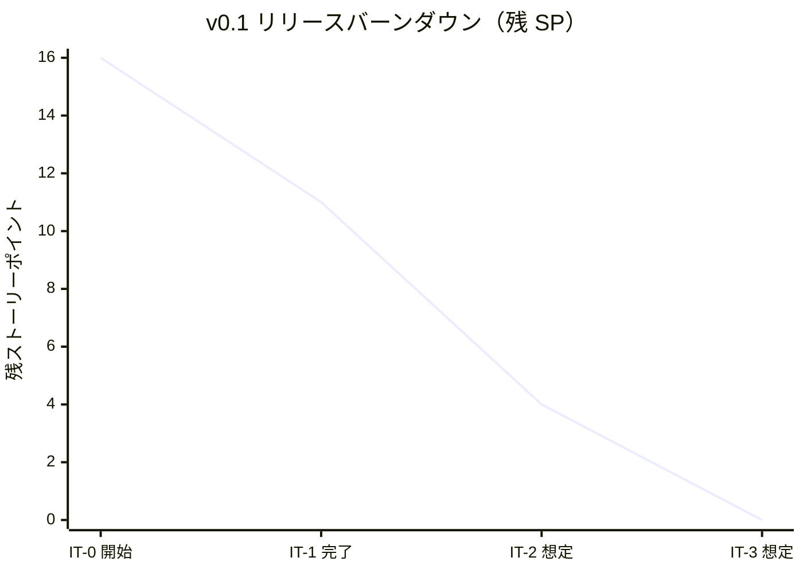
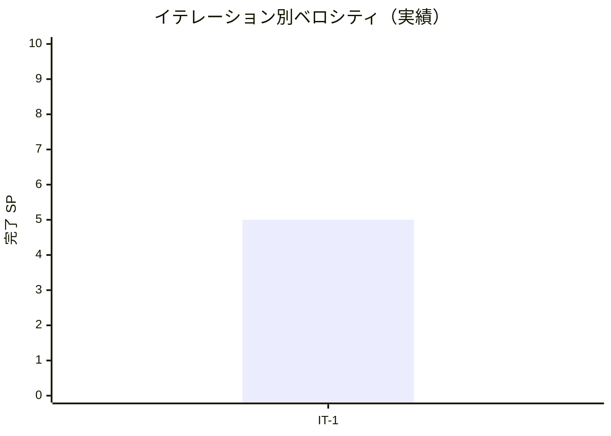

# イテレーション 1 完了報告書

## プロジェクト概要

- **プロジェクト名**: portfolio（採用・営業向け個人ポートフォリオサイト）
- **リポジトリ**: k2works/portfolio
- **イテレーション**: IT-1（v0.1-α / Walking Skeleton 第 1 週）

## 日程

| 項目 | 値 |
|---|---|
| イテレーション計画日 | 2026-04-30 |
| 計画期間 | 2026-05-04 〜 2026-05-10（1 週間想定） |
| 実施日 | 2026-04-30（前倒し実施・1 日完結） |
| 実績作業時間 | 約 3 時間 |

## 要員

| 名前 | 予定作業時間 | 実績作業時間 | 備考 |
|---|---:|---:|---|
| self（k2works） | 11.7h | 約 3h | 個人開発、Codex 分業はせず Claude 直接実行 |

## 指標

### 達成 SP

| 指標 | 計画 | 実績 |
|---|---:|---:|
| ストーリーポイント | 5 | 5 |
| 達成率 | 100% | 100% |
| ストーリー数 | 4（US-01 / US-13 / US-14 / US-09 横断 + 横断 A11y） | 3（US-01 骨格 / US-13 環境 / US-14 runbook） |

> US-09（検索インデックス）と横断アクセシビリティの一部は IT-2 以降に押し出し（実 UI が整ってから検証する方が効率的）。

### バーンダウン（v0.1）

### ベロシティ

| 項目 | 値 |
|---|---|
| 計画ベロシティ | 5 SP/週 |
| 実績ベロシティ | 5 SP（約 3h 内）= **1.67 SP/h** |
| 仮再見積もり | 7-8 SP/週（IT-2〜3 で校正） |

> 1 イテレーションのみのデータのため、平均線は IT-3 完了後に算出する。

### 品質メトリクス

| 指標 | 値 | 備考 |
|---|---|---|
| `npm run check` | ✅ 成功 | typecheck + lint + format:check + test |
| Vitest | 2 passed / 0 failed | サンプル smoke のみ |
| Astro check | 0 errors | `@ts-expect-error` 1 件（Tailwind v4 + Astro v5 の型差異） |
| ESLint | 0 errors | Flat Config |
| Prettier | All matched files use Prettier code style | 一度自動修正後緑化 |
| Astro build | 成功 | `dist/index.html` + `sitemap-index.xml`、約 0.7 秒 |
| `/healthz` 応答 | 200 + `ok` | curl で確認 |
| HTTPS 強制 | 301 リダイレクト | production モードで動作 |
| CSP / セキュリティヘッダ | 付与確認 | helmet 経由、HSTS は Cloudflare 側 |
| `/nonexistent` 404 | ✅ | 404.html フォールバック |
| Lighthouse | 未計測 | IT-2 で初回計測 |
| E2E（Playwright） | スケルトン配置のみ | ブラウザ未インストール、IT-2 で実行 |

### コミット履歴

| Hash | スコープ | 概要 |
|---|---|---|
| 734b9b3 | `feat(web)` | apps/web の Astro 5 + Express 配信レイヤーを初期化 |
| d954c97 | `docs(ops)` | 運用 runbook スケルトン（README / deploy / rollback）を追加 |
| 2c0a9d9 | `docs(development)` | IT-1 計画の追加と進捗（タスク 1, 3 完了）を反映 |
| 592a5a1 | `feat(web)` | IT-1 タスク 2 - ホーム静的 HTML 骨格と Express 配信を実装 |
| 85401d5 | `docs(development)` | IT-1 完了の進捗を反映（5/5 SP 完了） |
| c8211fd | `docs(development)` | IT-1 ふりかえり（5 つの問い + KPT + 数値指標）を追加 |

合計 **6 コミット** をブランチ `develop` に積み上げ。

### ファイル変更統計

| 区分 | 新規 | 更新 | 行数（追加） |
|---|---:|---:|---:|
| `apps/web/` | 18 | 1 | 約 530 |
| `ops/runbook/` | 3 | 0 | 269 |
| `docs/development/` | 3 | 1 | 約 530 |
| ルート（`Procfile` / `README.md` / `package.json` / `package-lock.json` / `mkdocs.yml`） | 1 | 4 | 約 14,000（package-lock 含む） |
| **合計** | **25** | **6** | **約 15,300** |

## 実施内容と評価

| ストーリー | 結果 | 計画 SP | ベロシティ加算 SP | 備考 |
|---|---|---:|---:|---|
| US-01 プロフィールを 30 秒で把握できる（骨格部分） | 完了（静的 HTML 部分） | 2 | 2 | スタイリング・Tailwind 適用は IT-2 |
| US-13 Markdown 編集で公開できる（環境構築） | 完了 | 2 | 2 | CI/CD 整備は IT-2 |
| US-14 障害時に 1 時間以内で復旧できる（runbook 骨格） | 完了 | 1 | 1 | 残り 6 ランブックは IT-2 以降 |
| **合計** | | **5** | **5** | 100% |

### Definition of Done 達成状況

| 項目 | 達成 | 備考 |
|---|:---:|---|
| コードがリポジトリにマージ済み | △ | develop ブランチに到達。main へは v0.1 リリース時にまとめて PR |
| `npm run check` がローカル成功 | ✅ | typecheck / lint / format / test 全成功 |
| `npm run build` 成功 | ✅ | dist/ 生成 |
| `node apps/web/server.js` 起動 + /healthz と / 応答 | ✅ | 動作確認済み |
| PR テンプレートのチェックリスト | △ | PR 自体を作成していない（develop 運用） |
| README + ランブックスケルトン | ✅ | README に Quick Start 追加、runbook 3 本作成 |
| ふりかえりで 5 つの問い記録 | ✅ | retrospective-1.md 作成 |

> △ の 2 項目は v0.1 リリース時に main 向け PR でまとめて対応する方針。

### 主要成果物

#### 実装

- `apps/web/` の Astro 5 + Express 5 配信レイヤー（22 ファイル + ビルド設定一式）
- `apps/web/src/layouts/BaseLayout.astro`：`<html lang="ja">` + skip link + ランドマーク + OGP/Twitter Card メタ + ヘッダーナビ（aria-current 自動付与）+ フッター
- `apps/web/src/pages/index.astro`：US-01 静的版（氏名 / 役職 / キャッチコピー / 得意領域 7 タグ / 実績ハイライト / CTA / Featured Works 3 件 / Skills Highlights 3 カテゴリ）
- `apps/web/server.js`：HTTPS 強制 + Basic 認証 + helmet CSP + morgan + `/healthz` + immutable キャッシュ + 404 fallback + Graceful shutdown

#### ドキュメント

- `docs/development/iteration_plan-1.md`（IT-1 計画）
- `docs/development/retrospective-1.md`（IT-1 ふりかえり）
- `docs/development/iteration_report-1.md`（本書）
- `ops/runbook/{README,deploy,rollback}.md`

#### 設定 / 構成

- ルート `package.json` に npm workspaces 追加（`apps/*`）
- `Procfile`（`web: node apps/web/server.js`）

## イテレーションレビュー

### 達成項目

| アクションアイテム | 担当 | 状態 |
|---|---|---|
| Astro 5 + Tailwind 4 + TypeScript 5.7 環境構築 | self | ✅ 完了 |
| `npm run check` の品質ゲート確立 | self | ✅ 完了 |
| ホーム静的 HTML 骨格（AC-01-1〜9 の静的部分） | self | ✅ 完了 |
| Heroku 配信レイヤー Express 5 実装 | self | ✅ 完了 |
| runbook 入口（README / deploy / rollback） | self | ✅ 完了 |
| ふりかえり（5 つの問い + KPT + 数値指標） | self | ✅ 完了 |

### IT-2 へのアクションアイテム

| アクションアイテム | 担当 | 優先度 |
|---|---|---|
| Tailwind 4 を BaseLayout / index.astro に適用 | self | 高 |
| GitHub Actions（`.github/workflows/ci.yml` + `deploy.yml`）整備 | self | 高 |
| Playwright ブラウザインストール + E01 ホーム表示 E2E 実行 | self | 中 |
| `tsconfig.json` の `exactOptionalPropertyTypes: true` 再有効化試行 | self | 中 |
| `ops/runbook/` 残り 6 本（hotfix / disaster-recovery / on-call / secret-rotation / domain-renewal / pre-interview-freeze） | self | 中 |
| Lighthouse CI の初回計測（v0.1 予算 80/90/90） | self | 中 |
| ベロシティ実績 7-8 SP/週で IT-2〜3 を校正 | self | 中 |

### IT-1 で発見・解消した技術課題

| 課題 | 対処 |
|---|---|
| `exactOptionalPropertyTypes: true` で Astro / Vite / Playwright の型衝突 | tsconfig 緩和（IT-2 で再評価） |
| Tailwind v4 + Astro 5 の `PluginOption` 型差異 | `@ts-expect-error` で抑止 |
| ESLint で server.js の `process` / `console` / `Buffer` が `no-undef` | Flat Config に Node.js グローバル追加、`no-console` を `.js` で無効化 |
| `@ts-check` 付き server.js で `signal` パラメータが implicit any | JSDoc `@param {NodeJS.Signals}` 付与 |
| Prettier の BaseLayout.astro 改行 | `npm run format` で自動修正 |

## 関連ドキュメント

- [IT-1 計画](./iteration_plan-1.md)
- [IT-1 ふりかえり](./retrospective-1.md)
- [リリース計画](./release_plan.md)
- [ユーザーストーリー](../requirements/user_story.md)
- [非機能要件](../design/non_functional.md)
- [運用要件](../design/operation.md)

---

## 更新履歴

| 日付 | 更新内容 | 更新者 |
|---|---|---|
| 2026-04-30 | 初版作成（IT-1 完了直後） | self |
