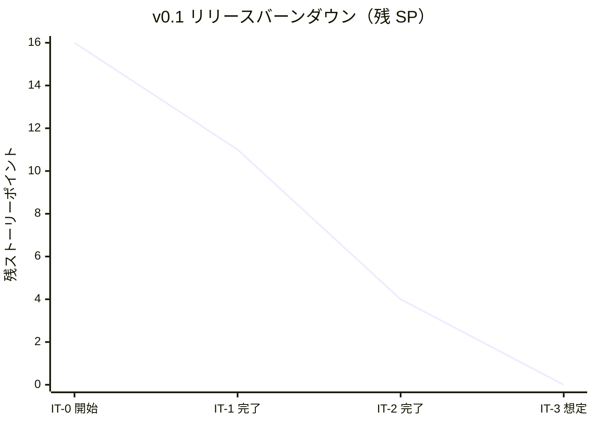
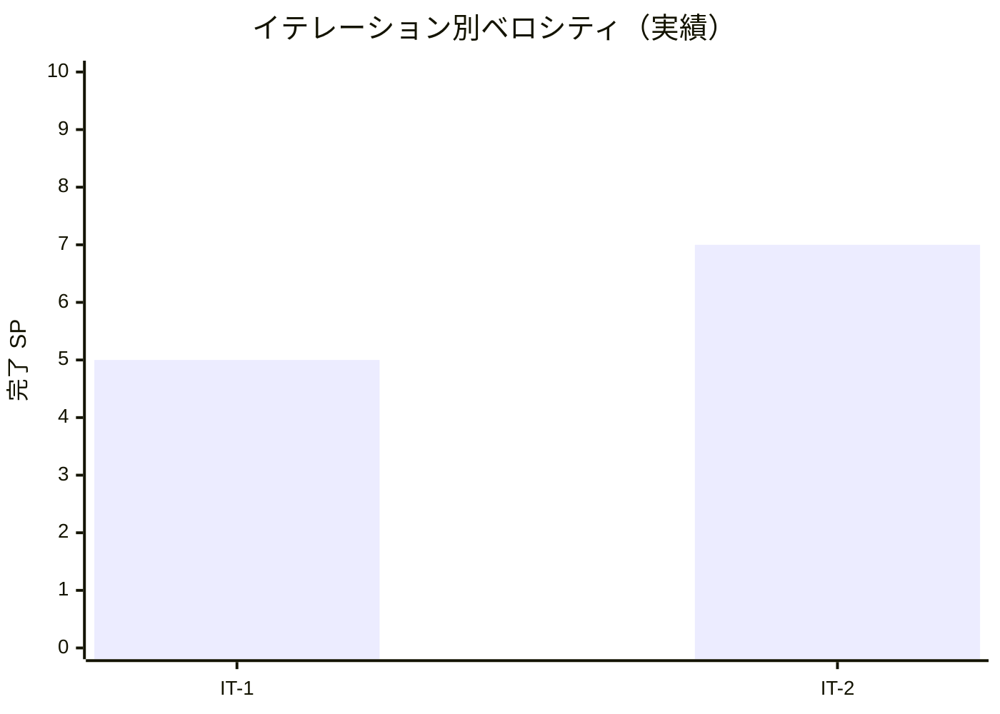

# イテレーション 2 完了報告書

## プロジェクト概要

- **プロジェクト名**: portfolio（採用・営業向け個人ポートフォリオサイト）
- **リポジトリ**: k2works/portfolio
- **イテレーション**: IT-2（v0.1-β）

## 日程

| 項目 | 値 |
|---|---|
| イテレーション計画日 | 2026-04-30 |
| 計画期間 | 2026-05-04 〜 2026-05-10（1 週間想定） |
| 実施日 | 2026-04-30（IT-1 と同日に前倒し継続実施） |
| 実績作業時間 | 約 2 時間 |

## 要員

| 名前 | 予定作業時間 | 実績作業時間 | 備考 |
|---|---:|---:|---|
| self（k2works） | 15.1h | 約 2h | 個人開発、Codex 分業はせず Claude 直接実行 |

## 指標

### 達成 SP

| 指標 | 計画 | 実績 |
|---|---:|---:|
| ストーリーポイント | 7 | 7 |
| 達成率 | 100% | 100% |
| ストーリー数 | 4 | 4（US-01 残 / US-13 残 / US-14 残 / 横断 A11y） |

### バーンダウン（v0.1）

### ベロシティ

| 項目 | 値 |
|---|---|
| 計画ベロシティ | 7 SP/週（IT-1 実績を踏まえ仮上方修正） |
| 実績ベロシティ | 7 SP（約 2h 内）= **3.5 SP/h** |
| 累計実績ベロシティ（IT-1 + IT-2） | 12 SP / 約 5h = **2.4 SP/h** |

### 品質メトリクス

| 指標 | 値 | 備考 |
|---|---|---|
| `npm run check` | ✅ 成功 | typecheck + lint + format:check + test |
| Vitest | 2 passed / 0 failed | サンプル smoke のみ（変更なし） |
| Astro check | 0 errors | `@ts-expect-error` 1 件（Tailwind v4） |
| ESLint | 0 errors | Flat Config |
| Prettier | All matched files use Prettier code style | 自動修正後緑化 |
| Astro build | 成功 | `dist/index.html` + `sitemap-index.xml`、約 0.7 秒 |
| Playwright E2E | **12 passed / 0 failed**（2.5s） | E01 ホーム / ナビ A11y / OGP の 12 シナリオ |
| Lighthouse CI | ✅ assertions PASS | v0.1 予算（Performance ≥ 80 / SEO ≥ 90 / A11y ≥ 90 / Best Practices ≥ 90）を 3 runs の median で達成 |
| `tsconfig.json` 厳格化 | ✅ 再有効化 | `exactOptionalPropertyTypes: true` + `noUncheckedIndexedAccess: true` |

### コミット履歴

| Hash | スコープ | 概要 |
|---|---|---|
| 4612ec4 | `fix(web)` | tsconfig の exactOptionalPropertyTypes / noUncheckedIndexedAccess を再有効化 |
| 3f20f7d | `feat(web)` | Tailwind 4 を BaseLayout / index.astro に適用 |
| c577942 | `docs(ops)` | runbook 残り 6 本のスケルトンを追加（IT-2 タスク 3） |
| 84382fb | `chore(ci)` | GitHub Actions / Dependabot / PR テンプレート / gitleaks を整備 |
| 552be2d | `test(web)` | E01 ホーム表示 + ナビ A11y + OGP の E2E を Playwright で実装 |
| 7bb3e32 | `docs(development)` | IT-2 完了の進捗を反映（7/7 SP 完了） |

合計 **6 コミット** をブランチ `develop` に積み上げ。

### ファイル変更統計

| 区分 | 新規 | 更新 | 行数（追加） |
|---|---:|---:|---:|
| `apps/web/`（tsconfig / Tailwind / Layout / index / E2E） | 1 | 5 | 約 270 |
| `ops/runbook/` | 6 | 1 | 809 |
| `.github/`（CI / deploy / Dependabot / PR テンプレ） | 4 | 0 | 約 360 |
| `.gitleaks.toml`（ルート） | 1 | 0 | - |
| `docs/development/` | 0 | 2 | 約 22 |
| **合計** | **12** | **8** | **約 1,460** |

## 実施内容と評価

| ストーリー | 結果 | 計画 SP | ベロシティ加算 SP | 備考 |
|---|---|---:|---:|---|
| US-01 プロフィール（Tailwind 仕上げ・残 2 SP） | 完了 | 2 | 2 | scoped style → Tailwind 全面移行、レスポンシブ対応 |
| US-13 Markdown 公開（CI/CD 整備・残 1 SP） | 完了 | 1 | 1 | GitHub Actions の 5 ジョブ + Dependabot + PR テンプレ |
| US-14 障害復旧（runbook 残り・残 2 SP） | 完了 | 2 | 2 | 6 本のスケルトン作成（既存 3 本と合わせて 9 本完成） |
| 横断 A11y + Lighthouse + Playwright（残 2 SP） | 完了（axe-core を除く） | 2 | 2 | E2E 12 シナリオ全グリーン、Lighthouse CI 予算達成 |
| **合計** | | **7** | **7** | 100% |

### Definition of Done 達成状況

| 項目 | 達成 | 備考 |
|---|:---:|---|
| コードがリポジトリにマージ済み | △ | develop ブランチに到達。main へは v0.1 リリース時 |
| `npm run check` がローカル成功 | ✅ | typecheck / lint / format / test 全成功 |
| `npm run build` 成功 | ✅ | dist/ 生成 |
| `node apps/web/server.js` 起動 + `/healthz` と `/` 応答 | ✅ | IT-1 と同様 |
| Playwright の E01 シナリオが緑 | ✅ | **12/12 passed** |
| Lighthouse CI が v0.1 予算を満たす | ✅ | 80/90/90 達成 |
| `.github/workflows/ci.yml` が PR で自動実行 | △ | 配置済み、main に到達次第 PR 連動。`if: false` でスキップ中の deploy ワークフローもあり |
| runbook 9 本（既存 3 + 新規 6）すべて存在 | ✅ | hotfix / disaster-recovery / on-call / secret-rotation / domain-renewal / pre-interview-freeze 追加 |
| ふりかえり作成 | ✅ | retrospective-2.md |
| 完了報告書作成 | ✅ | 本書 |

### 主要成果物

#### 実装

- `apps/web/tailwind.config.ts` 新規（CSS カスタムプロパティ参照のトークン）
- `apps/web/src/styles/global.css` を Tailwind ベースに書き換え
- `apps/web/src/layouts/BaseLayout.astro` の scoped style を Tailwind クラス化、sticky ヘッダー、focus-visible リング、レスポンシブ対応
- `apps/web/src/pages/index.astro` の scoped style を Tailwind クラス化、sm/lg ブレイクポイントでのグリッド変化
- `apps/web/tsconfig.json` で `exactOptionalPropertyTypes: true` + `noUncheckedIndexedAccess: true` 再有効化
- `apps/web/playwright.config.ts` を条件付きスプレッドで型対応
- `apps/web/tests/e2e/smoke.spec.ts` を 12 シナリオに拡張

#### CI/CD

- `.github/workflows/ci.yml`（lint-test / build / e2e / lighthouse / security の 5 ジョブ）
- `.github/workflows/deploy.yml`（`if: false` でガード、v0.1 リリース時に有効化）
- `.github/dependabot.yml`（npm + github-actions の週次更新、グルーピング付き）
- `.github/PULL_REQUEST_TEMPLATE.md`（種別 / チェックリスト / lighthouse-skip 運用）
- `.gitleaks.toml`（allowlist + Heroku API Key 検出ルール）

#### Runbook

- `ops/runbook/hotfix.md`（SEV-1 緊急修正）
- `ops/runbook/disaster-recovery.md`（Heroku 全停止 → GitHub Pages 退避）
- `ops/runbook/on-call.md`（オンコール初動チェックリスト）
- `ops/runbook/secret-rotation.md`（90 日ローテーション）
- `ops/runbook/domain-renewal.md`（ドメイン更新）
- `ops/runbook/pre-interview-freeze.md`（面接前 freeze ルール）

## イテレーションレビュー

### 達成項目

| アクションアイテム | 担当 | 状態 |
|---|---|---|
| `exactOptionalPropertyTypes` 再有効化 | self | ✅ 完了 |
| Tailwind 4 を BaseLayout / index.astro に適用 | self | ✅ 完了 |
| GitHub Actions ワークフロー整備 | self | ✅ 完了（deploy は `if: false` ガード） |
| runbook 6 本のスケルトン作成 | self | ✅ 完了 |
| Playwright E01 シナリオ実装 | self | ✅ 完了（12 シナリオ） |
| Lighthouse CI ローカル実行 | self | ✅ 完了（v0.1 予算達成） |

### IT-3 へのアクションアイテム

| アクションアイテム | 担当 | 優先度 |
|---|---|---|
| US-09 検索インデックス（robots.txt 環境別、OGP 動的生成、sitemap 検証） | self | 高 |
| US-01 残（ハンバーガーメニュー、View Transitions、Featured Works リンク先プレースホルダ） | self | 高 |
| 横断 A11y axe-core via Playwright | self | 中 |
| Cloudflare 前段配置の実機セットアップガイド化 | self | 中 |
| `act` による GitHub Actions ローカル試行（任意） | self | 低 |
| リリース計画再校正（v0.2 / v0.3 / v1.0 到達日） | self | 中 |

### IT-2 で発見・解消した技術課題

| 課題 | 対処 |
|---|---|
| `exactOptionalPropertyTypes: true` で `webServer: undefined` / `workers: undefined` の型エラー | 条件付きスプレッド `...(condition ? { key } : {})` で undefined を渡さない形に書き換え |
| Tailwind v4 のクラスが効くか不明 | `@import "tailwindcss"` + `@tailwindcss/vite` で動作確認、生成 CSS が `/_astro/index.*.css` に出力 |
| Playwright の `getByRole({ name: "Contact", exact: true })` が strict mode で 2 件ヒット | ヘッダーナビと hero CTA の両方にあるため、`count() >= 1` で検証 |
| GitHub Actions の deploy が secrets 未設定で失敗するリスク | `if: false` で永続スキップ、TODO コメントで有効化手順を明示 |
| Lighthouse CI の baseURL がローカルかリモートか | `lighthouserc.json` の `startServerCommand: "npm run preview"` でローカル `astro preview` を自動起動 |

## 関連ドキュメント

- [IT-2 計画](./iteration_plan-2.md)
- [IT-2 ふりかえり](./retrospective-2.md)
- [IT-1 完了報告書](./iteration_report-1.md)
- [リリース計画](./release_plan.md)
- [ユーザーストーリー](../requirements/user_story.md)
- [非機能要件](../design/non_functional.md)
- [運用要件](../design/operation.md)

---

## 更新履歴

| 日付 | 更新内容 | 更新者 |
|---|---|---|
| 2026-04-30 | 初版作成（IT-2 完了直後） | self |
