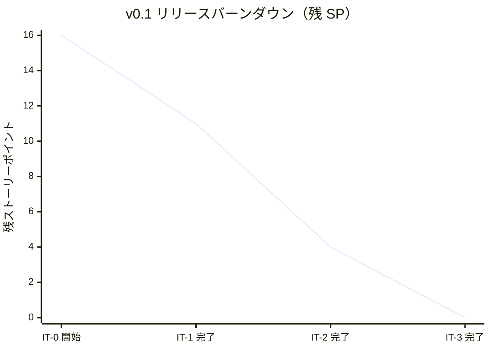
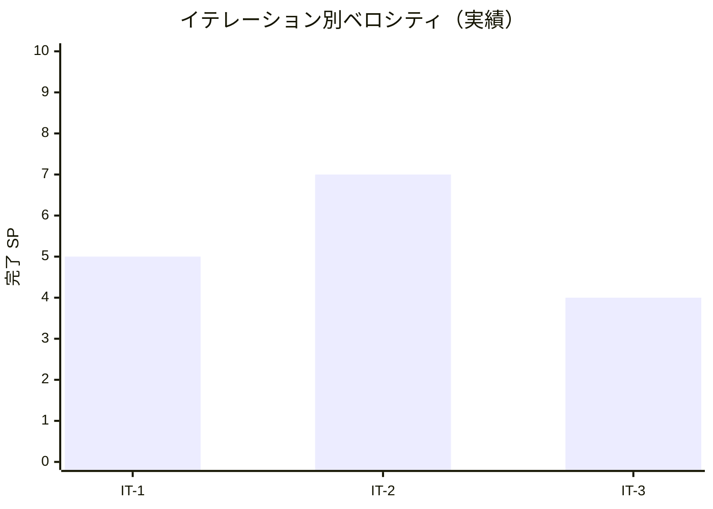

# イテレーション 3 完了報告書

## プロジェクト概要

- **プロジェクト名**: portfolio（採用・営業向け個人ポートフォリオサイト）
- **リポジトリ**: k2works/portfolio
- **イテレーション**: IT-3（v0.1 RC / リリース候補）

## 日程

| 項目 | 値 |
|---|---|
| イテレーション計画日 | 2026-04-30 |
| 計画期間 | 2026-05-11 〜 2026-05-17（1 週間想定） |
| 実施日 | 2026-04-30（IT-1〜IT-3 を同日に前倒し継続実施） |
| 実績作業時間 | 約 2 時間 |

## 要員

| 名前 | 予定作業時間 | 実績作業時間 | 備考 |
|---|---:|---:|---|
| self（k2works） | 11h | 約 2h | 個人開発、Claude 直接実行（Codex 不使用） |

## 指標

### 達成 SP

| 指標 | 計画 | 実績 |
|---|---:|---:|
| ストーリーポイント | 4 | 4 |
| 達成率 | 100% | 100% |
| ストーリー数 | 3（US-09 / US-01 残 / 横断 A11y） | 3 |

### バーンダウン（v0.1）

**v0.1 のコード完成 = IT-3 完了時点**。残るは外部依存（Heroku / Cloudflare 実機セットアップ + ドメイン取得）。

### ベロシティ

| 項目 | 値 |
|---|---|
| 計画ベロシティ | 4 SP/週 |
| 実績ベロシティ | 4 SP（約 2h 内）= **2 SP/h** |
| 累計実績ベロシティ（IT-1 + IT-2 + IT-3） | 16 SP / 約 7h = **2.29 SP/h** |

### 品質メトリクス

| 指標 | 値 | 備考 |
|---|---|---|
| `npm run check` | ✅ 成功 | typecheck + lint + format:check + test |
| Vitest | 2 passed / 0 failed | 変更なし |
| Astro check | 0 errors | `@ts-expect-error` 1 件のみ |
| ESLint | 0 errors | Flat Config |
| Prettier | All matched files use Prettier code style | 自動修正後緑化 |
| Astro build | 成功 | `dist/index.html` + `robots.txt` + `sitemap-index.xml`、約 0.7 秒 |
| Playwright E2E | **18 passed / 0 failed**（約 4 秒） | smoke 12 + mobile 5 + a11y 1 |
| axe-core violations | **0** | WCAG 2.1 A/AA タグでスキャン |
| Lighthouse CI | ✅ assertions PASS | v0.1 予算（80/90/90/90）を 3 runs median で達成 |
| `tsconfig.json` 厳格化 | ✅ 維持 | `exactOptionalPropertyTypes: true` + `noUncheckedIndexedAccess: true` |

### コミット履歴（予定）

IT-3 関連コミットは本書作成後にまとめて実施。

| スコープ | 概要 |
|---|---|
| `feat(web)` | IT-3 タスク 1 - robots.txt 環境別出力 endpoint |
| `feat(web)` | IT-3 タスク 2 - ハンバーガーメニュー実装 |
| `test(web)` | IT-3 タスク 2/3 - モバイル E2E + axe-core E2E + 既存 E2E のロケータ修正 |
| `docs(operation)` | Cloudflare 前段配置の詳細化（3 重防御 + 動作確認チェックリスト）+ MkDocs noindex 注入手順 |
| `docs(development)` | リリース計画を IT-1+IT-2 実績で再校正（3 シナリオ併記）+ IT-3 進捗反映 |
| `docs(development)` | IT-3 ふりかえり + 完了報告書 |

### ファイル変更統計（予測）

| 区分 | 新規 | 更新 | 行数（追加） |
|---|---:|---:|---:|
| `apps/web/`（robots.txt / BaseLayout / mobile.spec / a11y.spec / package.json） | 3 | 3 | 約 350 |
| `docs/operation/`（heroku_staging_setup.md 6.5/6.6） | 0 | 1 | 約 100 |
| `docs/development/`（release_plan / iteration_plan-3 / retrospective-3 / iteration_report-3 / index） | 2 | 3 | 約 500 |
| **合計** | **5** | **7** | **約 950** |

## 実施内容と評価

| ストーリー | 結果 | 計画 SP | ベロシティ加算 SP | 備考 |
|---|---|---:|---:|---|
| US-09 検索インデックス（残 2 SP） | 完了 | 2 | 2 | robots.txt 環境別 endpoint、sitemap 検証、MkDocs noindex 注入手順 |
| US-01 ハンバーガーメニュー（残 1 SP） | 完了（外側タップ閉じる/フォーカストラップ循環は割愛） | 1 | 1 | aria-expanded / Esc / リンク閉じる / スクロール抑止 / メディアクエリリセット |
| 横断 A11y axe-core（残 1 SP） | 完了 | 1 | 1 | WCAG 2.1 A/AA で violations 0 |
| **合計** | | **4** | **4** | 100% |

### Definition of Done 達成状況

| 項目 | 達成 | 備考 |
|---|:---:|---|
| コードがリポジトリにマージ済み | △ | develop ブランチに到達。main へは v0.1 リリース時 |
| `npm run check` がローカル成功 | ✅ | 4 ステージすべて緑 |
| `npm run build` 成功 | ✅ | 2 ページ + sitemap 生成 |
| Playwright の E01 + モバイル + a11y シナリオが緑 | ✅ | **18/18 passed** |
| axe-core で violations 0 | ✅ | WCAG 2.1 A/AA タグで検証 |
| Lighthouse CI が v0.1 予算を満たす | ✅ | Performance ≥ 80 / SEO ≥ 90 / A11y ≥ 90 / Best Practices ≥ 90 |
| `robots.txt` の環境別動作確認 | ✅ | クリーンビルドで `Allow: /` ↔ `Disallow: /` を実機確認 |
| ふりかえり作成 | ✅ | retrospective-3.md |
| 完了報告書作成 | ✅ | 本書 |
| リリース計画再校正 | ✅ | 3 シナリオでリリース日見込みを記載 |

### 主要成果物

#### 実装

- `apps/web/src/pages/robots.txt.ts` 新規（環境変数 `PUBLIC_ROBOTS_DISALLOW` で `Allow: /` ↔ `Disallow: /` 切替）
- `apps/web/src/layouts/BaseLayout.astro` にハンバーガーメニュー（< 768px）+ 開閉スクリプト（aria-expanded / Esc / クリック閉じる / body スクロール抑止 / メディアクエリリセット）
- `apps/web/tests/e2e/mobile.spec.ts` 新規（5 シナリオ、viewport 375x667 + hasTouch）
- `apps/web/tests/e2e/a11y.spec.ts` 新規（axe-core via Playwright で WCAG 2.1 A/AA violations 0）
- `apps/web/package.json` に `@axe-core/playwright` 追加

#### ドキュメント

- `docs/operation/heroku_staging_setup.md` の 6.5 節（検索エンジン 3 重防御）と 6.6 節（Cloudflare 動作確認チェックリスト）を詳細化
- `docs/development/release_plan.md` を IT-1/IT-2 実績で再校正、楽観/標準/悲観の 3 シナリオでリリース日見込みを併記
- `docs/development/iteration_plan-3.md` を完了状態に更新
- `docs/development/retrospective-3.md` 新規（5 つの問い + KPT + 数値指標）
- `docs/development/iteration_report-3.md`（本書）

## イテレーションレビュー

### 達成項目

| アクションアイテム | 担当 | 状態 |
|---|---|---|
| robots.txt 環境別出力（Astro endpoint） | self | ✅ 完了 |
| ハンバーガーメニュー実装 | self | ✅ 完了（割愛項目あり） |
| Playwright モバイル E2E（viewport ベース） | self | ✅ 完了 |
| axe-core via Playwright 導入 + WCAG 2.1 A/AA 違反 0 | self | ✅ 完了 |
| Cloudflare 設定の実機セットアップガイド化 | self | ✅ 完了（3 重防御 + 動作確認チェックリスト） |
| MkDocs noindex 注入手順 | self | ✅ 完了（手順記載・実機検証は v0.1 リリース時） |
| リリース計画再校正 | self | ✅ 完了 |

### v0.1 リリース完了までの残タスク

IT-3 完了 = **コードの v0.1 完成**。リリース完了には以下の外部依存タスクが必要：

| タスク | 担当 | 推定時間 |
|---|---|---|
| Heroku アカウント作成 + Eco Dyno（staging） + Basic Dyno（production） 課金開始 | self | 30 分 |
| Heroku Pipeline 作成、Buildpack 設定 | self | 15 分 |
| ドメイン取得 + レジストラ設定 | self | 10 分（取得） + 課金 |
| Cloudflare アカウント作成 + DNS 委譲 + DNS 伝播待ち | self | 10 分 + 最長 24h |
| Heroku Custom Domain + ACM 有効化 | self | 10 分 |
| Cloudflare の SSL（Full strict）+ Page Rules + Transform Rules | self | 30 分 |
| GitHub Actions secrets 設定（HEROKU_API_KEY 等）+ deploy.yml の `if: false` 解除 | self | 15 分 |
| 初回プロモート（staging → production） | self | 5 分 |
| UptimeRobot で `/healthz` 監視登録 | self | 10 分 |
| MkDocs `docs/overrides/main.html` の作成 + ビルド検証 | self | 30 分 |
| main へ PR + マージ | self | 15 分 |
| リリース完了報告書作成（`creating-release-report` スキル） | self | 30 分 |
| **合計（実作業）** | - | **約 4 時間 + DNS 伝播 24h** |

### IT-3 で発見・解消した技術課題

| 課題 | 対処 |
|---|---|
| `import.meta.env["PUBLIC_ROBOTS_DISALLOW"]` がビルドキャッシュで初回値に固定される | `rm -rf dist .astro` でクリーンビルド時に再評価される。CI ではキャッシュなしビルドが標準のため問題なし |
| Playwright `getByRole("button", { name: /メニューを開く/ })` がクリック後の aria-label 変更で見つからなくなる | `page.locator("#mobile-nav-toggle")` の id ベースに切替 |
| `devices["iPhone SE"]` が WebKit ブラウザを要求する | viewport: 375x667 + hasTouch: true で Chromium 互換に変更 |
| Astro の `<script>` 内で `(toggle as HTMLButtonElement).focus()` が必要 | strict TypeScript で `Element | null` を `HTMLButtonElement` にキャスト |

## 関連ドキュメント

- [IT-3 計画](./iteration_plan-3.md)
- [IT-3 ふりかえり](./retrospective-3.md)
- [IT-2 完了報告書](./iteration_report-2.md)
- [リリース計画](./release_plan.md)（3 シナリオ再校正済み）
- [Heroku staging 環境セットアップ手順書](../operation/heroku_staging_setup.md)（6.5/6.6 詳細化）
- [ユーザーストーリー](../requirements/user_story.md)
- [非機能要件](../design/non_functional.md)
- [運用要件](../design/operation.md)

---

## 更新履歴

| 日付 | 更新内容 | 更新者 |
|---|---|---|
| 2026-04-30 | 初版作成（IT-3 完了直後 / v0.1 コード完成） | self |
