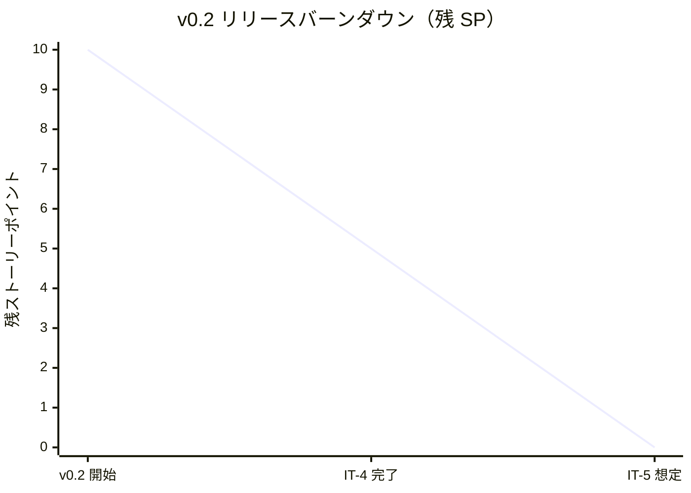
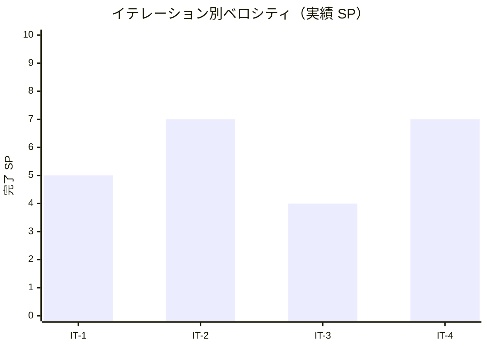

# イテレーション 4 完了報告書

## プロジェクト概要

- **プロジェクト名**: portfolio（採用・営業向け個人ポートフォリオサイト）
- **リポジトリ**: k2works/portfolio
- **イテレーション**: IT-4（v0.2-α / Works 一覧 + Content Collections）

## 日程

| 項目 | 値 |
|---|---|
| イテレーション計画日 | 2026-04-30 |
| 計画期間 | 2026-05-04 〜 2026-05-10（1 週間想定） |
| 実施日 | 2026-04-30（v0.1 リリース完了直後・同日内に前倒し継続実施） |
| 実績作業時間 | 約 1.5 時間 |

## 要員

| 名前 | 予定作業時間 | 実績作業時間 | 備考 |
|---|---:|---:|---|
| self（k2works） | 15.3h | 約 1.5h | 個人開発、Claude 直接実行（Codex 不使用） |

## 指標

### 達成 SP

| 指標 | 計画 | 実績 |
|---|---:|---:|
| ストーリーポイント | 7 | 7 |
| 達成率 | 100% | 100% |
| ストーリー数 | 2（US-02 / US-13 残） | 2 |

### バーンダウン（v0.2）

> v0.2 全体は 10 SP（US-02 = 5 SP + US-03 = 5 SP）。IT-4 で US-02（5 SP）を完了 + IT-3 まで残っていた US-13（2 SP）も同時消化したため、IT-4 の実績 SP は 7 SP。残りは IT-5 で US-03（5 SP）を消化して v0.2 リリース。

### ベロシティ

| 項目 | 値 |
|---|---|
| 計画ベロシティ | 7 SP/週 |
| 実績ベロシティ（IT-4 単独） | 7 SP / 約 1.5h = **4.67 SP/h**（過去最高） |
| 累計実績ベロシティ（IT-1〜IT-4） | 23 SP / 約 8.5h = **2.71 SP/h** |

### 品質メトリクス

| 指標 | 値 | 備考 |
|---|---|---|
| `npm run check` | ✅ 成功 | typecheck + lint + format:check + test |
| Vitest | 2 passed / 0 failed | 変更なし |
| Astro check | 0 errors | `@ts-expect-error` 1 件のみ |
| ESLint | 0 errors | Flat Config |
| Prettier | All matched files use Prettier code style | 自動修正後緑化 |
| Astro build | 成功 | 4 page(s) built（/、/works/、/works/[slug]/ × 3）、約 1.2 秒 |
| Playwright E2E | **29 passed / 0 failed**（約 4.5 秒） | smoke 12 + mobile 5 + a11y 3 + works 9 |
| axe-core violations | **0** | / + /works/ + /works/[slug]/ で WCAG 2.1 A/AA |
| `tsconfig.json` 厳格化 | ✅ 維持 | `exactOptionalPropertyTypes: true` + `noUncheckedIndexedAccess: true` |

### コミット履歴（予定）

IT-4 関連コミットは本書作成後にまとめて実施。

| スコープ | 概要 |
|---|---|
| `feat(web)` | Content Collections + works コレクション + サンプル 3 件 |
| `feat(web)` | /works/ 一覧画面（フィルタ + 件数 + 0 件 + aria-pressed + 不明タグ正規化） |
| `feat(web)` | /works/[slug]/ 動的ルーティング土台（パンくず + プレースホルダ） |
| `test(web)` | works.spec.ts 9 シナリオ + a11y.spec.ts 拡張 |
| `docs(design)` | architecture_frontend.md の Content Collections スキーマ例を IT-4 確定版に更新 |
| `docs(development)` | IT-4 進捗 + ふりかえり + 完了報告書 |

### ファイル変更統計（予測）

| 区分 | 新規 | 更新 | 行数（追加） |
|---|---:|---:|---:|
| `apps/web/src/`（content config / works md / works/index / works/[slug] / global.css） | 5 | 1 | 約 350 |
| `apps/web/tests/e2e/`（works.spec / a11y 拡張） | 1 | 1 | 約 130 |
| `docs/design/`（architecture_frontend スキーマ更新） | 0 | 1 | 約 30 |
| `docs/development/`（iteration_plan-4 / retrospective-4 / iteration_report-4 / index） | 2 | 2 | 約 600 |
| **合計** | **8** | **5** | **約 1,110** |

## 実施内容と評価

| ストーリー | 結果 | 計画 SP | ベロシティ加算 SP | 備考 |
|---|---|---:|---:|---|
| US-02 Works 一覧で実績の傾向を把握できる | 完了 | 5 | 5 | AC-02-1〜02-8 すべて達成（不明タグ URL 正規化含む） |
| US-13 Markdown 編集で公開できる（残 2 SP） | 完了 | 2 | 2 | Content Collections + Zod スキーマ + サンプル 3 件 |
| **合計** | | **7** | **7** | 100% |

### Definition of Done 達成状況

| 項目 | 達成 | 備考 |
|---|:---:|---|
| コードがリポジトリにマージ済み | △ | develop ブランチに到達予定。main へは v0.2 リリース時にまとめて PR |
| `npm run check` がローカル成功 | ✅ | 4 ステージすべて緑 |
| `npm run build` 成功 | ✅ | 4 ページ + sitemap 生成 |
| Playwright E2E 全シナリオ緑 | ✅ | **29 / 29 passed** |
| axe-core で violations 0 | ✅ | / + /works/ + /works/[slug]/ で WCAG 2.1 A/AA |
| Lighthouse CI v0.2 予算（85/90/90）達成 | ⏳ | main トリガーで実行予定。develop マージ後に確認 |
| サンプル Works 3 件以上配置 | ✅ | sample-1 / 2 / 3（v0.2 リリースまでに残り 2 件追加） |
| architecture_frontend.md スキーマ更新 | ✅ | IT-4 確定版で上書き |
| ふりかえり作成 | ✅ | retrospective-4.md |
| 完了報告書作成 | ✅ | 本書 |

### 主要成果物

#### 実装

- `apps/web/src/content/config.ts` 新規（works コレクション Zod スキーマ・US-03 / M02 / L06 を反映した拡張）
- `apps/web/src/content/works/sample-{1..3}.md` 新規（金融 BE / SaaS FE / EC インフラ）
- `apps/web/src/pages/works/index.astro` 新規（カード一覧 + フィルタ + 件数 + 0 件 + aria-pressed + 不明タグ URL 正規化、約 145 行）
- `apps/web/src/pages/works/[slug].astro` 新規（動的ルート土台、パンくず + プレースホルダ + 戻り動線）
- `apps/web/src/styles/global.css` 更新（`--color-tag-bg` カスタムプロパティ追加）
- `apps/web/tests/e2e/works.spec.ts` 新規（9 シナリオ）
- `apps/web/tests/e2e/a11y.spec.ts` 拡張（/works/ + /works/[slug]/ で violations 0 検証）

#### ドキュメント

- `docs/design/architecture_frontend.md` の Content Collections スキーマ例を IT-4 確定版で上書き（拡張根拠付き）
- `docs/development/iteration_plan-4.md` を完了状態に更新
- `docs/development/retrospective-4.md` 新規（5 つの問い + KPT + 数値指標）
- `docs/development/iteration_report-4.md`（本書）

## イテレーションレビュー

### 達成項目

| アクションアイテム | 担当 | 状態 |
|---|---|---|
| Content Collections + Zod スキーマ定義 | self | ✅ 完了 |
| サンプル Works 3 件作成 | self | ✅ 完了 |
| /works/ 一覧画面（カード + フィルタ + 件数 + 0 件 + aria-pressed + 不明タグ正規化） | self | ✅ 完了 |
| /works/[slug]/ 動的ルート土台 | self | ✅ 完了 |
| works.spec.ts 9 シナリオ | self | ✅ 完了 |
| axe-core via Playwright を /works/ + /works/[slug]/ で検証 | self | ✅ 完了 |
| architecture_frontend.md のスキーマ例更新 | self | ✅ 完了（整合性検証指摘の対応） |

### IT-5 へのアクションアイテム

| アクションアイテム | 担当 | 優先度 |
|---|---|---|
| US-03 Works 詳細画面の本実装（4 ブロック構造 + 外部リンク + チーム規模 / ポジション / 関与の深さ） | self | 高 |
| サンプル Works 残り 2 件追加（v0.2 リリース時の 5 件揃え） | self | 高 |
| WorkCard コンポーネントの抽出（home Featured + /works/ で共有） | self | 中 |
| Featured フラグの選定基準を `Profile.featured_works[]` に明文化 | self | 中 |
| Lighthouse CI v0.2 予算をローカルでスポット確認 | self | 中 |
| `getCollection` のラッパーヘルパー（型キャストの集約） | self | 低 |

### IT-4 で発見・解消した技術課題

| 課題 | 対処 |
|---|---|
| Astro Content Collections と TypeScript strict の型衝突（`unknown` 推論） | `as string[]` 等の明示キャスト + `forEach` + `Set<string>()` で書き下ろし |
| axe-core が `<a aria-pressed>` を違反扱い（aria-pressed は role=button のみで意味を持つ） | `<a role="button">` を明示。Playwright の `getByRole` も「link」→「button」に変更 |
| Playwright の `:visible` セレクタが `style.display = ""` で挙動不安定 | `:not([style*="display: none"])` + `toHaveCount(N)` で auto-retry を活用 |
| `expect(count).toBeLessThan(3)` で auto-retry が効かず Flaky に | `toHaveCount(2)` で具体値を期待 + `waitForURL` で URL 変化を待つ |

## 関連ドキュメント

- [IT-4 計画](./iteration_plan-4.md)
- [IT-4 ふりかえり](./retrospective-4.md)
- [IT-3 完了報告書](./iteration_report-3.md)
- [v0.1 リリース完了報告書](./release_report-0_1_0.md)
- [リリース計画](./release_plan.md)
- [ユーザーストーリー](../requirements/user_story.md)（US-02 / US-03 / US-13）
- [フロントエンドアーキテクチャ](../design/architecture_frontend.md)（Content Collections スキーマ更新済み）
- [分析成果物レビュー](../review/design_review_20260430.md)（M02 / L06 反映）

---

## 更新履歴

| 日付 | 更新内容 | 更新者 |
|---|---|---|
| 2026-04-30 | 初版作成（IT-4 完了直後） | self |
