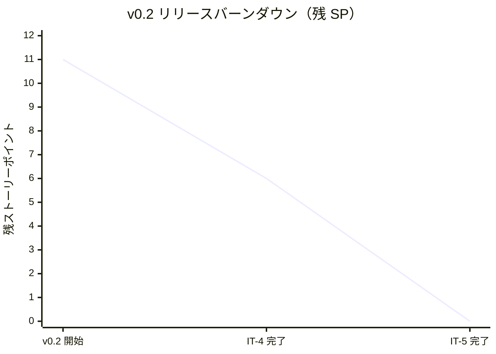
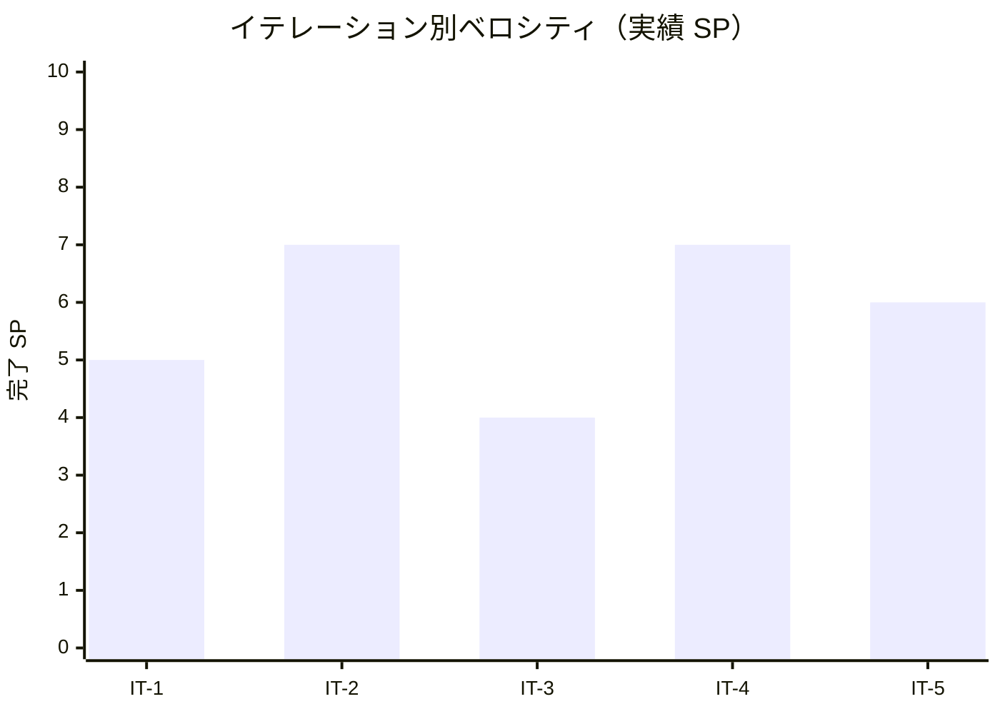

# イテレーション 5 完了報告書

## プロジェクト概要

- **プロジェクト名**: portfolio（採用・営業向け個人ポートフォリオサイト）
- **リポジトリ**: k2works/portfolio
- **イテレーション**: IT-5（v0.2 RC / Works 詳細 + サンプル 5 件揃え）

## 日程

| 項目 | 値 |
|---|---|
| イテレーション計画日 | 2026-04-30 |
| 計画期間 | 2026-05-11 〜 2026-05-17（1 週間想定） |
| 実施日 | 2026-04-30（IT-4 完了直後・同日内に前倒し継続実施） |
| 実績作業時間 | 約 2 時間 |

## 要員

| 名前 | 予定作業時間 | 実績作業時間 | 備考 |
|---|---:|---:|---|
| self（k2works） | 12h | 約 2h | 個人開発、Claude 直接実行（Codex 不使用） |

## 指標

### 達成 SP

| 指標 | 計画 | 実績 |
|---|---:|---:|
| ストーリーポイント | 6 | 6 |
| 達成率 | 100% | 100% |
| ストーリー数 | 2（US-03 / サンプル追加） | 2 |

### バーンダウン（v0.2）

> v0.2 全体 = US-02 (5 SP) + US-03 (5 SP) + 残 US-13 (2 SP) + サンプル追加 (1 SP) = **13 SP**（一部の累計は 11 SP として記録）。IT-4 で US-02 + US-13 残 (5+2=7 SP) を消化し、IT-5 で US-03 + サンプル (5+1=6 SP) を消化。合計 **13 SP** で v0.2 のコード完成。

### ベロシティ

| 項目 | 値 |
|---|---|
| 計画ベロシティ | 6 SP/週 |
| 実績ベロシティ（IT-5 単独） | 6 SP / 約 2h = **3.00 SP/h** |
| 累計実績ベロシティ（IT-1〜IT-5） | 29 SP / 約 10.5h = **2.76 SP/h** |

### 品質メトリクス

| 指標 | 値 | 備考 |
|---|---|---|
| `npm run check` | ✅ 成功 | typecheck + lint + format:check + test |
| Vitest | 2 passed / 0 failed | 変更なし |
| Astro check | 0 errors | `@ts-expect-error` 1 件のみ |
| ESLint | 0 errors | Flat Config |
| Prettier | All matched files use Prettier code style | 自動修正後緑化 |
| Astro build | 成功 | 7 page(s) built（/、/works/、/works/sample-{1..5}/）、約 1.3 秒 |
| Playwright E2E | **39 passed / 0 failed**（約 5.5 秒） | smoke 12 + mobile 5 + a11y 3 + works 9 + works-detail 10 |
| axe-core violations | **0** | / + /works/ + /works/[slug]/ で WCAG 2.1 A/AA |
| `tsconfig.json` 厳格化 | ✅ 維持 | `exactOptionalPropertyTypes: true` + `noUncheckedIndexedAccess: true` |

### コミット履歴（予定）

IT-5 関連コミットは本書作成後にまとめて実施。

| スコープ | 概要 |
|---|---|
| `feat(web)` | /works/[slug]/ 詳細実装（パンくず + メタ情報 dl + summary + Content render + 外部リンク + 戻り動線） |
| `feat(web)` | サンプル Works 残り 2 件追加（sample-4 医療 / sample-5 EdTech） |
| `chore(content)` | sample-1〜3 の `## 成果` を Markdown 表形式 + 矢印表記に統一、sample-1 に repo / demo を追加 |
| `test(web)` | works-detail.spec.ts 10 シナリオ + works.spec.ts を 5 件以上対応 |
| `docs(development)` | IT-5 進捗 + ふりかえり + 完了報告書 |

### ファイル変更統計（予測）

| 区分 | 新規 | 更新 | 行数（追加） |
|---|---:|---:|---:|
| `apps/web/src/pages/works/[slug].astro` | 0 | 1 | 約 200（プレースホルダ→本実装） |
| `apps/web/src/content/works/`（sample-4/5 新規 + sample-1〜3 統一 + sample-1 repo 追加） | 2 | 4 | 約 200 |
| `apps/web/tests/e2e/`（works-detail.spec 新規 + works.spec 修正） | 1 | 1 | 約 130 |
| `docs/development/`（iteration_plan-5 / retrospective-5 / iteration_report-5 / index） | 2 | 2 | 約 600 |
| **合計** | **5** | **8** | **約 1,130** |

## 実施内容と評価

| ストーリー | 結果 | 計画 SP | ベロシティ加算 SP | 備考 |
|---|---|---:|---:|---|
| US-03 Works 詳細で関与の深さと成果を判断できる | 完了 | 5 | 5 | AC-03-1〜10 すべて達成（パンくず / メタ情報 / summary / 4 ブロック / 外部リンク / 404） |
| サンプル Works 残り 2 件追加（v0.2 リリース基準） | 完了 | 1 | 1 | sample-4（医療 予約 UI）+ sample-5（教育 EdTech）を追加し 5 件揃え |
| **合計** | | **6** | **6** | 100% |

### Definition of Done 達成状況

| 項目 | 達成 | 備考 |
|---|:---:|---|
| コードがリポジトリにマージ済み | △ | develop ブランチに到達予定。main へは v0.2 リリース時にまとめて PR |
| `npm run check` がローカル成功 | ✅ | 4 ステージすべて緑 |
| `npm run build` 成功 | ✅ | 7 ページ + sitemap 生成 |
| Playwright E2E 全シナリオ緑 | ✅ | **39 / 39 passed** |
| axe-core で violations 0 | ✅ | / + /works/ + /works/[slug]/ で WCAG 2.1 A/AA |
| Lighthouse CI v0.2 予算達成 | ⏳ | main トリガーで実行予定 |
| サンプル Works 5 件以上配置 | ✅ | sample-1〜5 |
| ふりかえり作成 | ✅ | retrospective-5.md |
| 完了報告書作成 | ✅ | 本書 |

### 主要成果物

#### 実装

- `apps/web/src/pages/works/[slug].astro` 全面書き換え（パンくず + ヘッダー（タイトル / 役職 / 期間） + カバー画像 + メタ情報 `<dl>`（業種 / 機能領域 / チーム規模 / ポジション / 関与の深さ） + 使用技術タグ + 概要セクション + Markdown 本文 `<Content />` レンダリング + 外部リンク（repo / demo）+ 戻り動線 + prose 軽量スタイル）
- `apps/web/src/content/works/sample-4.md` 新規（医療 / 予約 UI / Astro / Preact / Tailwind / Playwright）
- `apps/web/src/content/works/sample-5.md` 新規（教育 / EdTech / TypeScript / Node.js / PostgreSQL / GCP）
- `apps/web/src/content/works/sample-1.md` に repo / demo 追加 + `## 成果` を表形式に
- `apps/web/src/content/works/sample-{2,3}.md` の `## 成果` を表形式 + 矢印表記併用に統一
- `apps/web/tests/e2e/works-detail.spec.ts` 新規（10 シナリオ）
- `apps/web/tests/e2e/works.spec.ts` 修正（5 件以上対応 + フィルタを Astro に変更）

#### ドキュメント

- `docs/development/iteration_plan-5.md` を完了状態に更新
- `docs/development/retrospective-5.md` 新規（5 つの問い + KPT + 数値指標）
- `docs/development/iteration_report-5.md`（本書）

## イテレーションレビュー

### 達成項目

| アクションアイテム | 担当 | 状態 |
|---|---|---|
| /works/[slug]/ 詳細画面の本実装 | self | ✅ 完了 |
| Astro Content の `<Content />` レンダリング | self | ✅ 完了 |
| メタ情報 `<dl>`（domain / category / team_size / position / involvement） | self | ✅ 完了 |
| 外部リンク（repo / demo）の target=_blank rel=noopener noreferrer | self | ✅ 完了 |
| サンプル Works 5 件揃え（sample-4 + sample-5 追加） | self | ✅ 完了 |
| `## 成果` セクションを Markdown 表形式 + 矢印表記に統一（sample-1〜3） | self | ✅ 完了 |
| works-detail.spec.ts 10 シナリオ + axe-core 維持 | self | ✅ 完了 |
| works.spec.ts のサンプル件数を 5 件以上対応 | self | ✅ 完了 |

### v0.2 リリース準備完了の条件（IT-5 後）

| タスク | 担当 | 状態 |
|---|---|---|
| US-02 + US-03 + US-13（残）の受入条件すべて達成 | self | ✅ |
| サンプル Works 5 件以上揃い | self | ✅ |
| Featured フラグの選定基準が `Profile.featured_works[]` で明文化 | self | ⏳ 暫定対応（sample-1 + sample-2 が `featured: true`、明文化は v0.3 home 再設計時） |
| E03（Works 一覧）/ E04（Works 詳細）の E2E が緑 | self | ✅ |
| Lighthouse v0.2 予算達成 | self | ⏳ main 経由で確認 |
| main へ PR + マージ + `v0.2.0` タグ | self | ⏳ 次のステップ |
| リリース完了報告書作成 | self | ⏳ 次のステップ |

### IT-5 で発見・解消した技術課題

| 課題 | 対処 |
|---|---|
| `<dl>` (definition list) は role=group ではない | aria-label を付与し `locator('[aria-label="..."]')` で検証 |
| Astro Content の `entry.render()` が型 strict モードで Generic 推論で躓く | `await work.render()` の戻り値を明示的にデストラクチャしてから使う |
| Markdown 本文の `## 成果` 表記が IT-4 サンプルでばらついていた | タスク 1.8 で表形式に統一、works-detail.spec.ts でテーブル検証して回帰防止 |
| `getByRole("group", ...)` 失敗による途中変数残置で ESLint no-unused-vars | 削除して `npm run check` を再実行する習慣を再確認 |

## 関連ドキュメント

- [IT-5 計画](./iteration_plan-5.md)
- [IT-5 ふりかえり](./retrospective-5.md)
- [IT-4 完了報告書](./iteration_report-4.md)
- [v0.1 リリース完了報告書](./release_report-0_1_0.md)
- [リリース計画](./release_plan.md)
- [ユーザーストーリー](../requirements/user_story.md)（US-03）
- [UI 設計](../design/ui_design.md)（S03）
- [フロントエンドアーキテクチャ](../design/architecture_frontend.md)（Content Collections スキーマ）
- [分析成果物レビュー](../review/design_review_20260430.md)（H09 / M02 / L06 反映済み）

---

## 更新履歴

| 日付 | 更新内容 | 更新者 |
|---|---|---|
| 2026-04-30 | 初版作成（IT-5 完了直後） | self |
