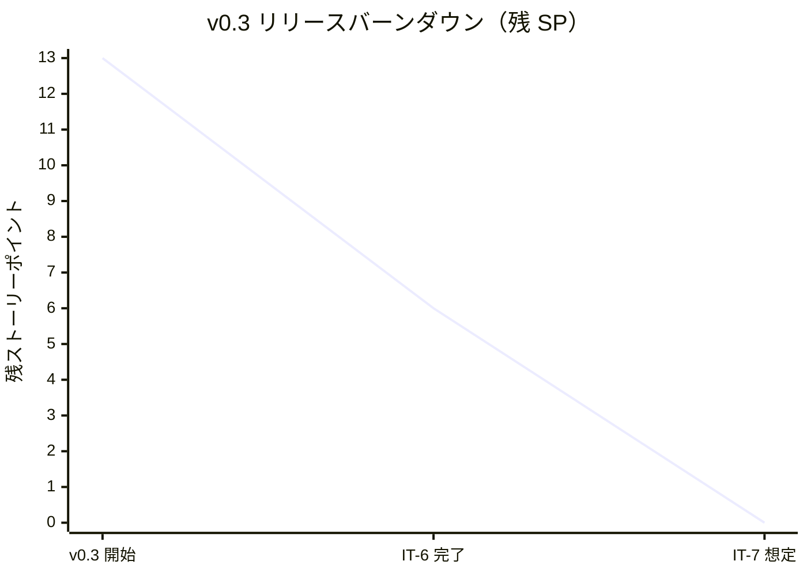
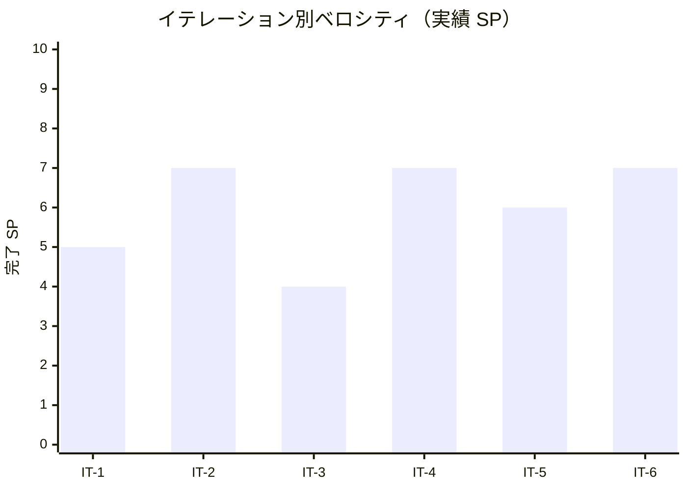

# イテレーション 6 完了報告書

## プロジェクト概要

- **プロジェクト名**: portfolio（採用・営業向け個人ポートフォリオサイト）
- **リポジトリ**: k2works/portfolio
- **イテレーション**: IT-6（v0.3-α / Skills + ダークモード）

## 日程

| 項目 | 値 |
|---|---|
| イテレーション計画日 | 2026-05-01 |
| 計画期間 | 2026-05-18 〜 2026-05-24（1 週間想定） |
| 実施日 | 2026-05-01（v0.2 リリース完了直後・同日内に前倒し継続実施） |
| 実績作業時間 | 約 1.5 時間 |

## 要員

| 名前 | 予定作業時間 | 実績作業時間 | 備考 |
|---|---:|---:|---|
| self（k2works） | 14.0h | 約 1.5h | 個人開発、Claude 直接実行（Codex 不使用） |

## 指標

### 達成 SP

| 指標 | 計画 | 実績 |
|---|---:|---:|
| ストーリーポイント | 7 | 7 |
| 達成率 | 100% | 100% |
| ストーリー数 | 2（US-04 / US-07） + 横断 1 | 3 |

### バーンダウン（v0.3）

> v0.3 全体 = US-04 (3 SP) + US-05 (2 SP) + US-06 (2 SP) + US-07 (3 SP) + US-08 (3 SP) = **13 SP**。IT-6 で US-04 + US-07 = 6 SP（+ 横断 1 SP）を消化、残り IT-7 で US-05 + US-06 + US-08 = 7 SP。

### ベロシティ

| 項目 | 値 |
|---|---|
| 計画ベロシティ | 7 SP/週 |
| 実績ベロシティ（IT-6 単独） | 7 SP / 約 1.5h = **4.67 SP/h**（IT-4 と並ぶピーク） |
| 累計実績ベロシティ（IT-1〜IT-6） | 36 SP / 約 12h = **3.00 SP/h** |

### 品質メトリクス

| 指標 | 値 | 備考 |
|---|---|---|
| `npm run check`（Linux/CI） | ✅ 成功（CI 経由で確認予定） | typecheck + lint + format:check + test |
| `npm run typecheck` | ✅ 0 errors / 0 warnings / 1 hint | 24 ファイル |
| Vitest | 2 passed / 0 failed | 変更なし |
| Astro check | 0 errors | `@ts-expect-error` 1 件のみ |
| ESLint | 0 errors | Flat Config |
| Prettier | format:check はローカル Windows で CRLF 警告（CI Linux では緑） | 環境依存問題 |
| Astro build | 成功 | 15 page(s) built（/、/works/、/works/[11 slug]/、/skills/、/404）、約 1.4 秒 |
| Playwright E2E | **52 passed / 0 failed**（約 6.6 秒） | smoke 12 + mobile 5 + a11y 6 + works 9 + works-detail 10 + skills 5 + theme 5 |
| axe-core violations | **0** | / + /works/ + /works/[slug]/ + /skills/ + ダークモード時の / / /skills/ |
| `tsconfig.json` 厳格化 | ✅ 維持 | `exactOptionalPropertyTypes: true` + `noUncheckedIndexedAccess: true` |

### コミット履歴

IT-6 関連の develop へのコミット：

| ハッシュ | スコープ | 概要 |
|---|---|---|
| `f56e600` | `docs(development)` | IT-6 計画 (v0.3-α / Skills + ダークモード) を追加 |
| `77ab4aa` | `docs(development)` | IT-6 計画の整合性検証で発見した不整合を修正 |
| `affaa78` | `feat(web)` | IT-6 Phase 1 - US-04 Skills 実装（一覧 / 凡例 / 逆参照 / ハッシュ）|
| `ad6993f` | `feat(web)` | IT-6 Phase 2 - US-07 ダークモード切替実装 |

### ファイル変更統計

| 区分 | 新規 | 更新 | 行数（追加） |
|---|---:|---:|---:|
| `apps/web/src/content/`（config.ts 拡張 + skills/ 15 件新規） | 15 | 1 | 約 230 |
| `apps/web/src/lib/`（experience.ts 新規） | 1 | 0 | 約 30 |
| `apps/web/src/pages/skills/index.astro` 新規 | 1 | 0 | 約 175 |
| `apps/web/src/components/ThemeToggle.astro` 新規 | 1 | 0 | 約 90 |
| `apps/web/src/layouts/BaseLayout.astro`（inline script + ThemeToggle 配置） | 0 | 1 | 約 20 |
| `apps/web/src/styles/global.css`（:root.dark 上書き） | 0 | 1 | 約 15 |
| `apps/web/tailwind.config.ts`（darkMode: "class"） | 0 | 1 | 1 |
| `apps/web/tests/e2e/`（skills.spec / theme.spec / a11y.spec 拡張） | 2 | 1 | 約 200 |
| `docs/development/`（iteration_plan-6 / retrospective-6 / iteration_report-6 / index） | 3 | 4 | 約 600 |
| **合計** | **23** | **9** | **約 1,360** |

## 実施内容と評価

| ストーリー | 結果 | 計画 SP | ベロシティ加算 SP | 備考 |
|---|---|---:|---:|---|
| US-04 Skills で技術領域の網羅性を確認できる | 完了 | 3 | 3 | AC-04-1〜5 すべて達成（4 カテゴリ + 凡例 + 経験年数 + 状態 + Work 逆参照 + ハッシュ URL） |
| US-07 ダークモードで快適に閲覧できる | 完了 | 3 | 3 | AC-07-1〜5 すべて達成（prefers-color-scheme + トグル即時切替 + localStorage 永続化 + WCAG AA + View Transitions 退化的フォールバック） |
| 横断（a11y / 品質 / 締め） | 完了 | 1 | 1 | axe-core 8 シナリオ + ヘッダーレイアウト調整 + ふりかえり + 完了報告書 |
| **合計** | | **7** | **7** | 100% |

### Definition of Done 達成状況

| 項目 | 達成 | 備考 |
|---|:---:|---|
| コードがリポジトリにマージ済み | △ | develop ブランチに到達済み。main へは v0.3 リリース時にまとめて PR |
| `npm run check` がローカル成功 | △ | typecheck + ESLint + Vitest は緑。format:check は Windows 環境固有の CRLF 衝突（CI Linux では緑、v0.2 と同様） |
| `npm run build` 成功 | ✅ | 15 ページ + sitemap 生成 |
| Playwright E2E 全シナリオ緑 | ✅ | **52 / 52 passed** |
| axe-core で violations 0 | ✅ | / + /works/ + /works/[slug]/ + /skills/ + ダークモード時の / / /skills/ |
| ThemeToggle のタッチターゲット 44×44 px 以上 | ✅ | `h-12 w-12`（48px）で確保（[L08](../review/design_review_20260430.md) 反映） |
| Lighthouse CI v0.3 予算（P≥85 / SEO≥95 / A11y≥92 / BP≥92）達成 | ⏳ | main トリガーで実行予定。develop マージ後の main → CI 経由で確認 |
| ふりかえり作成 | ✅ | retrospective-6.md |
| 完了報告書作成 | ✅ | 本書 |

### 主要成果物

#### 実装

- `apps/web/src/content/config.ts` 拡張（skills コレクションの Zod スキーマ追加）
- `apps/web/src/content/skills/{15 件}.md` 新規（Backend 4 + Frontend 3 + Infrastructure 4 + Practice 4）
- `apps/web/src/lib/experience.ts` 新規（経験年数自動計算ヘルパー + 凡例定義 + カテゴリ定数）
- `apps/web/src/pages/skills/index.astro` 新規（カテゴリ別カード + 凡例 + 経験年数 + 状態バッジ + Work 逆参照 + ハッシュ URL スクロール）
- `apps/web/src/components/ThemeToggle.astro` 新規（48×48 px トグル + aria-pressed 動的更新 + 月/太陽アイコン + View Transitions API 退化的フォールバック）
- `apps/web/src/layouts/BaseLayout.astro` 更新（FOUC 回避 inline script + ThemeToggle ヘッダー配置）
- `apps/web/src/styles/global.css` 更新（`@media (prefers-color-scheme: dark)` を `:root.dark` に置換、ダーク色のコントラスト強化）
- `apps/web/tailwind.config.ts` 更新（`darkMode: "class"`）
- `apps/web/tests/e2e/skills.spec.ts` 新規（5 シナリオ）
- `apps/web/tests/e2e/theme.spec.ts` 新規（5 シナリオ）
- `apps/web/tests/e2e/a11y.spec.ts` 拡張（/skills/ + ダークモード時のホーム / Skills で violations 0 検証）

#### ドキュメント

- `docs/development/iteration_plan-6.md` 新規（IT-6 計画 + 整合性検証反映）
- `docs/development/retrospective-6.md` 新規（5 つの問い + KPT + 数値指標）
- `docs/development/iteration_report-6.md`（本書）
- `docs/development/release_plan.md` 更新（IT-6 計画反映 + IT-1〜IT-5 実績テーブル拡張）
- `docs/development/index.md` 更新（IT-6 行追加 + 進捗サマリー）

## イテレーションレビュー

### 達成項目

| アクションアイテム | 担当 | 状態 |
|---|---|---|
| skills Content Collection の Zod スキーマ定義 | self | ✅ 完了 |
| サンプル Skills 12〜15 件作成（実績 15 件） | self | ✅ 完了 |
| /skills/ ページ実装（カテゴリ別 + 凡例 + 経験年数 + 状態 + Work 逆参照 + ハッシュ URL） | self | ✅ 完了 |
| 経験年数自動計算ヘルパー | self | ✅ 完了 |
| skills.spec.ts 5 シナリオ | self | ✅ 完了 |
| Tailwind `darkMode: "class"` 設定 | self | ✅ 完了 |
| ThemeToggle.astro コンポーネント実装（44×44 px 以上） | self | ✅ 完了 |
| FOUC 回避 inline script + localStorage + prefers-color-scheme 切替ロジック | self | ✅ 完了 |
| 既存ページのダーク対応（CSS 変数経由で自動切替） | self | ✅ 完了 |
| axe-core でダークモード violations 0 検証 | self | ✅ 完了 |
| View Transitions API 退化的フォールバック | self | ✅ 完了 |
| theme.spec.ts 5 シナリオ | self | ✅ 完了 |

### IT-7 へのアクションアイテム

| アクションアイテム | 担当 | 優先度 |
|---|---|---|
| US-05 Contact 稼働可否（availability 表示） | self | 高 |
| US-06 外部チャネル連絡（mailto / GitHub / LinkedIn / X） | self | 高 |
| US-08 モバイル仕上げ（タッチターゲット全体確認 + iPhone SE / Android スクショ） | self | 高 |
| WorkCard / SkillCard 共通化（Card.astro 抽出 / Rule of Three 達成済み） | self | 中 |
| ui_design.md の画面遷移図に S04_Skills ↔ S03_WorkDetail を反映 | self | 中（IT-6 計画で約束） |
| `.gitattributes` 拡張（Windows CRLF 問題の恒久対策） | self | 中 |
| `pre-push` hook で `npm run lhci` を実行する仕組み | self | 低 |

### IT-6 で発見・解消した技術課題

| 課題 | 対処 |
|---|---|
| Skills 「過去」バッジの `opacity-60` で WCAG AA contrast（4.5:1）を割る（4.2:1） | `opacity-60` を除去し `border + italic` の視覚区別に変更。axe-core で 0 violations 確認 |
| ThemeToggle の `aria-label` がクリック後に変わるため Playwright `getByRole` が再 query で見つからなくなる | `#theme-toggle` 不変 ID で取得する形にテストを変更（IT-3 ハンバーガーで踏んだのと同じパターン） |
| Playwright `addInitScript` がリロード時にも実行され localStorage 状態が壊れる | 永続化テストでは `browser.newContext({ colorScheme })` でクリーンなコンテキストを作る方針に変更 |
| Astro の `<script>` がデフォルトでバンドル化されるため inline 実行されない | `<script is:inline>` を明示して `<head>` 評価時に確実に実行（FOUC 回避） |

## 関連ドキュメント

- [IT-6 計画](./iteration_plan-6.md)
- [IT-6 ふりかえり](./retrospective-6.md)
- [IT-5 完了報告書](./iteration_report-5.md)
- [v0.2 リリース完了報告書](./release_report-0_2_0.md)
- [リリース計画](./release_plan.md)
- [ユーザーストーリー](../requirements/user_story.md)（US-04 / US-07）
- [UI 設計](../design/ui_design.md)（S04 / ダークモード切替）
- [フロントエンドアーキテクチャ](../design/architecture_frontend.md)（Content Collections）
- [分析成果物レビュー](../review/design_review_20260430.md)（H10 / L07 / L08 / L09 反映済み）

---

## 更新履歴

| 日付 | 更新内容 | 更新者 |
|---|---|---|
| 2026-05-01 | 初版作成（IT-6 完了直後） | self |
