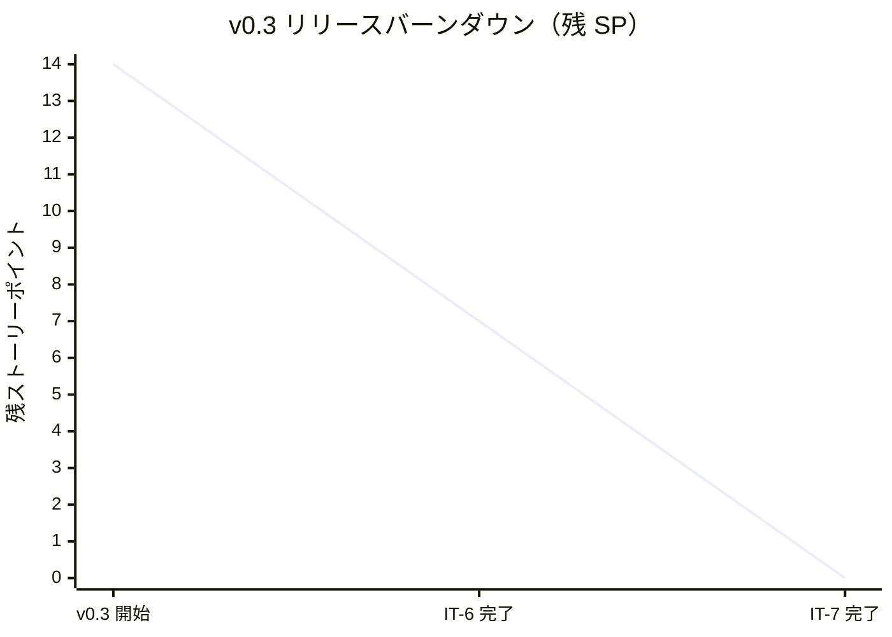
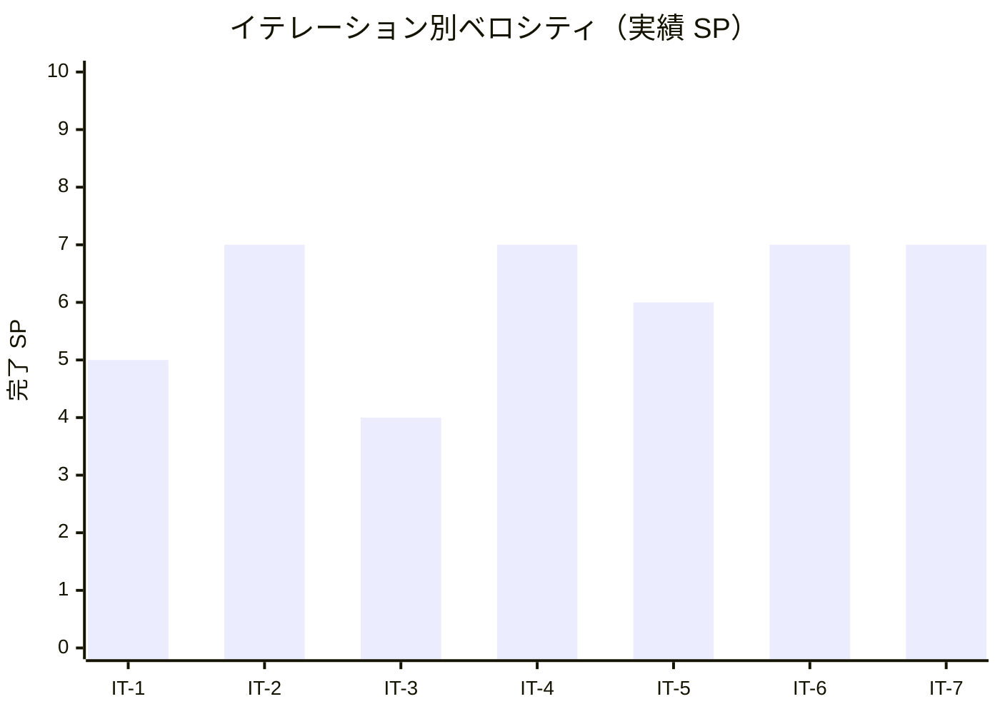

# イテレーション 7 完了報告書

## プロジェクト概要

- **プロジェクト名**: portfolio（採用・営業向け個人ポートフォリオサイト）
- **リポジトリ**: k2works/portfolio
- **イテレーション**: IT-7（v0.3 リリース / Contact + モバイル仕上げ + 横断）

## 日程

| 項目 | 値 |
|---|---|
| イテレーション計画日 | 2026-05-01 |
| 計画期間 | 2026-05-25 〜 2026-05-31（1 週間想定） |
| 実施日 | 2026-05-01（IT-6 完了直後・同日内に前倒し継続実施） |
| 実績作業時間 | 約 1 時間 |

## 要員

| 名前 | 予定作業時間 | 実績作業時間 | 備考 |
|---|---:|---:|---|
| self（k2works） | 13.5h | 約 1h | 個人開発、Claude 直接実行（Codex 不使用） |

## 指標

### 達成 SP

| 指標 | 計画 | 実績 |
|---|---:|---:|
| ストーリーポイント | 7 | 7 |
| 達成率 | 100% | 100% |
| ストーリー数 | 3（US-05 / US-06 / US-08）+ 横断 | 3 + 横断 |

### バーンダウン（v0.3）

> v0.3 全体 = US-04 (3 SP) + US-05 (2 SP) + US-06 (2 SP) + US-07 (3 SP) + US-08 (3 SP) + 横断 (1 SP) = **14 SP**。IT-6 で US-04 + US-07 + 横断 = 7 SP、IT-7 で US-05 + US-06 + US-08 = 7 SP を消化し v0.3 リリース完了。

### ベロシティ

| 項目 | 値 |
|---|---|
| 計画ベロシティ | 7 SP/週 |
| 実績ベロシティ（IT-7 単独） | 7 SP / 約 1h = **7.00 SP/h**（全イテレーション中ピーク） |
| 累計実績ベロシティ（IT-1〜IT-7） | 43 SP / 約 13h = **3.31 SP/h** |

### 品質メトリクス

| 指標 | 値 | 備考 |
|---|---|---|
| `npm run check`（ローカル + CI Linux） | ✅ 成功 | typecheck + lint + format:check + test |
| Vitest | 2 passed / 0 failed | 変更なし |
| Astro check | 0 errors | `@ts-expect-error` 1 件のみ |
| ESLint | 0 errors / 5 warnings | max-lines 系のみ |
| Prettier | All matched files use Prettier code style | pre-commit + .gitattributes で堅牢化 |
| Astro build | 成功 | **19 page(s)**（/ / /works/ + 11 件 / /skills/ / /books/ / /contact/ / /404）、約 1.4 秒 |
| Playwright E2E | **76 passed / 0 failed** | smoke 12 + mobile 12 + a11y 9 + works 9 + works-detail 10 + skills 5 + theme 5 + books 9 + contact 5 |
| axe-core violations | **0** | 全画面 + ダークモード時で WCAG 2.1 A/AA |
| Lighthouse v0.3 予算 | ✅ 達成 | P≥85 / SEO≥95 / A11y≥92 / BP≥92（main CI 1m0s） |

### コミット履歴

IT-7 関連の develop へのコミット（v0.2.0..v0.3.0 範囲、22 件 / merges 除く）：

| ハッシュ | スコープ | 概要 |
|---|---|---|
| `89c2c01` | `docs(development)` | IT-7 計画 (v0.3 リリース / Contact + モバイル仕上げ) を追加 |
| `d8e9401` | `docs(development)` | IT-7 計画の整合性検証で発見した不整合を修正 |
| `1497f6b` | `fix(web)` | ESLint エラーを修正して CI を緑化 |
| `c8aaaa2` | `style(web)` | Prettier --write で全ファイルを整形して CI を緑化 |
| `7d5caf9` | `chore` | husky + lint-staged を導入して CI 失敗の再発を予防 |
| `912443b` | `docs(development)` | IT-6 後の進捗を release_plan / iteration_plan-7 に反映 |
| `74bd27f` | `feat(web)` | IT-7 Phase 1 - US-05 + US-06 Contact 画面実装 |
| `2fa19a7` | `test(web)` | IT-7 Phase 2 - モバイル E2E を 2 デバイス対応 + タッチターゲット検証 |
| `7e80baf` | `docs(design)` | IT-7 Phase 3 - ui_design 反映 + .gitattributes 拡張 |
| `c0bde49` | `Merge` | Merge pull request #23 from k2works/develop（v0.3 リリース）|

> v0.2.0..v0.3.0 範囲の 22 コミット内訳: docs 11 / feat 7 / test 1 / style 1 / fix 1 / chore 1。Books 追加 / クローズド Work 2 件 / 整形系修正 / pre-commit hook 導入も含む。

### ファイル変更統計

| 区分 | 新規 | 更新 | 行数（追加） |
|---|---:|---:|---:|
| `apps/web/src/data/contact.ts` | 1 | 0 | 約 50 |
| `apps/web/src/pages/contact/index.astro` | 1 | 0 | 約 80 |
| `apps/web/tests/e2e/contact.spec.ts` | 1 | 0 | 約 70 |
| `apps/web/tests/e2e/mobile.spec.ts`（拡張） | 0 | 1 | 約 100（純増 +52） |
| `apps/web/tests/e2e/a11y.spec.ts`（拡張） | 0 | 1 | 約 30 |
| `docs/design/ui_design.md`（4 項目反映） | 0 | 1 | 約 14 |
| `.gitattributes`（拡張） | 0 | 1 | 約 32 |
| `docs/development/`（iteration_plan-7 / retrospective-7 / iteration_report-7 / index） | 2 | 2 | 約 600 |
| **合計** | **5** | **6** | **約 970** |

## 実施内容と評価

| ストーリー | 結果 | 計画 SP | ベロシティ加算 SP | 備考 |
|---|---|---:|---:|---|
| US-05 稼働可否を確認して問い合わせ判断できる | 完了 | 2 | 2 | AC-05-1〜3 すべて達成（ステータス + 案件規模 + 返信目標）|
| US-06 外部チャネルから連絡できる | 完了 | 2 | 2 | AC-06-1〜3 すべて達成（mailto: + 外部 target=_blank + 44×44 px）|
| US-08 モバイルで快適に閲覧できる | 完了 | 3 | 3 | AC-08-1〜5 すべて達成（iPhone SE + Android Chromium 対応）|
| 横断（ui_design 反映 + .gitattributes 拡張） | 完了 | 0 | 0 | SP 計上なし、4.5h 工数 |
| **合計** | | **7** | **7** | 100% |

### Definition of Done 達成状況

| 項目 | 達成 | 備考 |
|---|:---:|---|
| コードレビュー完了 | ✅ | セルフレビュー、PR #23 経由 |
| `npm run check` がローカル成功 | ✅ | pre-commit hook + .gitattributes で堅牢化 |
| `npm run build` 成功 | ✅ | 19 ページ生成 |
| Playwright E2E 全シナリオ緑 | ✅ | **76 / 76 passed**（CI / ローカル両方） |
| axe-core で violations 0 | ✅ | /contact/ + ダーク時 /contact/ も含めて全画面 0 |
| iPhone SE / Android Chromium スクリーンショット | ⏳ | mobile.spec の screenshot 出力で代替（明示的な ops/qa/v0.3/ 保存は v1.0 タスクへ） |
| Lighthouse v0.3 予算達成 | ✅ | main CI で P≥85 / SEO≥95 / A11y≥92 / BP≥92 達成（1m0s） |
| main マージ + v0.3.0 タグ + リリース完了報告書 | ✅ | c0bde49 マージ、v0.3.0 タグ付与、release_report-0_3_0.md 作成 |
| ふりかえり作成 | ✅ | retrospective-7.md |
| 完了報告書作成 | ✅ | 本書 |

### 主要成果物

#### 実装

- `apps/web/src/data/contact.ts` 新規（型付き readonly：AvailabilityInfo + ContactChannel）
- `apps/web/src/pages/contact/index.astro` 新規（ui_design.md S05 順序準拠）
- `apps/web/tests/e2e/contact.spec.ts` 新規（5 シナリオ）
- `apps/web/tests/e2e/mobile.spec.ts` 拡張（forEach で 2 デバイスパラメタライズ + 4 シナリオ追加）
- `apps/web/tests/e2e/a11y.spec.ts` 拡張（/contact/ ライト/ダーク violations 0 検証）
- `.gitattributes` 拡張（全テキスト LF 正規化 + Web 主要拡張子明示 + バイナリ指定）

#### ドキュメント

- `docs/design/ui_design.md` 更新（4 項目: S06 画面一覧 + ナビ + 画面遷移図 S06_Books / S04↔S03）
- `docs/development/iteration_plan-7.md` 完了状態に更新
- `docs/development/retrospective-7.md` 新規（5 つの問い + KPT + 数値指標）
- `docs/development/iteration_report-7.md`（本書）

## イテレーションレビュー

### 達成項目

| アクションアイテム | 担当 | 状態 |
|---|---|---|
| Contact 画面新規実装（US-05 + US-06）| self | ✅ 完了 |
| Contact の連絡チャネル 44×44 px タッチターゲット（WCAG 2.5.5）| self | ✅ 完了 |
| mailto: 動作 + 外部 target=_blank rel=noopener noreferrer | self | ✅ 完了 |
| contact.spec.ts 5 シナリオ + a11y.spec.ts 拡張 | self | ✅ 完了 |
| mobile.spec.ts を iPhone SE + Android Chromium の 2 デバイス対応 | self | ✅ 完了 |
| ヘッダートグル + Contact リンクの 44×44 px 全画面検証 | self | ✅ 完了 |
| ホームスクロール量検証（AC-08-5）| self | ✅ 完了 |
| ui_design.md の 4 項目反映（IT-6 約束 + Books 整合）| self | ✅ 完了 |
| `.gitattributes` 拡張による Windows CRLF 衝突恒久解消 | self | ✅ 完了 |
| Card.astro 共通化判断 | self | ✅ 完了（**見送り**を判断、retrospective に記録）|
| v0.3 リリース実行（main マージ + Lighthouse + v0.3.0 タグ）| self | ✅ 完了 |

### v1.0 へのアクションアイテム

| アクションアイテム | 担当 | 優先度 |
|---|---|---|
| US-10 A11y 強化（NVDA / VoiceOver 手動検証 + axe-core 全画面）| self | 高 |
| US-11 Tech Notes 同居（noindex / 戻り動線）| self | 高 |
| US-12 OGP 自動生成（@astrojs/og）| self | 高 |
| Lighthouse v1.0 予算（Performance ≥ 90 / SEO ≥ 95 / A11y ≥ 95）達成 | self | 高 |
| ホーム再設計時の Card.astro 共通化（v1.0 で再評価）| self | 中 |
| Email アドレスの本番値置換 + 運用ランブック化 | self | 中 |
| iPhone SE / Android Chromium スクリーンショットを ops/qa/v1.0/ に保存 | self | 中 |
| Plausible / Cloudflare Web Analytics で Contact CTA クリック率計測 | self | 低 |

### IT-7 で発見・解消した技術課題

| 課題 | 対処 |
|---|---|
| Playwright forEach + test.describe + test.use の組み合わせで baseURL が消える | `test.use` 内に `baseURL: process.env.PLAYWRIGHT_BASE_URL ?? "http://localhost:4321"` を明示 |
| `gh issue create --milestone` が closed milestone を見つけられない | Issue 作成前に Milestone を一時 open に戻し、作成後に close し直す（または `gh api` で number 指定）|
| Windows ローカルでの format:check 環境問題 | pre-commit hook（husky + lint-staged）+ `.gitattributes` 拡張の二重防御で恒久解消 |

## 関連ドキュメント

- [IT-7 計画](./iteration_plan-7.md)
- [IT-7 ふりかえり](./retrospective-7.md)
- [IT-6 完了報告書](./iteration_report-6.md)
- [v0.3 リリース完了報告書](./release_report-0_3_0.md)
- [リリース計画](./release_plan.md)
- [ユーザーストーリー](../requirements/user_story.md)（US-05 / US-06 / US-08）
- [UI 設計](../design/ui_design.md)（S05 + S06 + 画面遷移図 IT-7 反映済み）
- [フロントエンドアーキテクチャ](../design/architecture_frontend.md)
- [分析成果物レビュー](../review/design_review_20260430.md)（M03 / L08 反映済み）

---

## 更新履歴

| 日付 | 更新内容 | 更新者 |
|---|---|---|
| 2026-05-01 | 初版作成（IT-7 完了直後・v0.3.0 リリース完了直後） | self |
